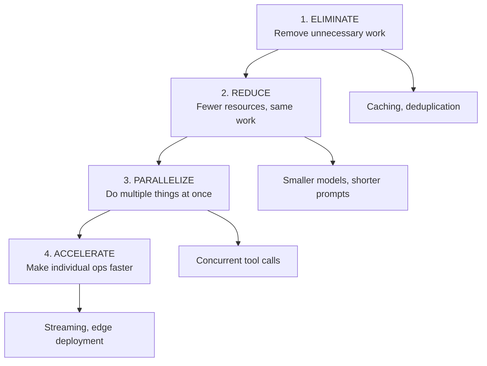
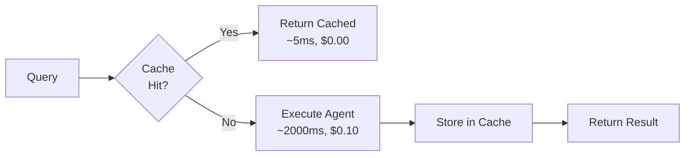
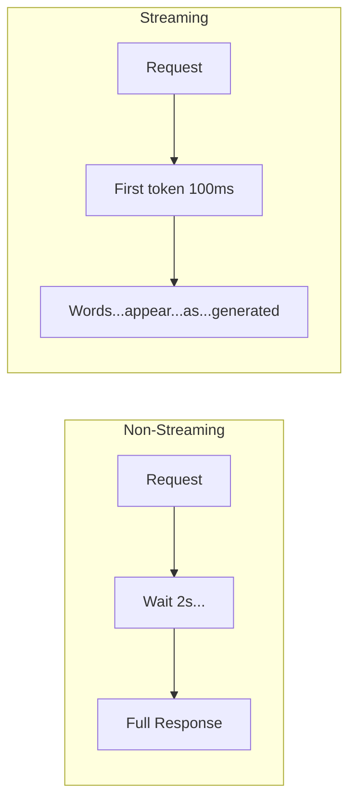
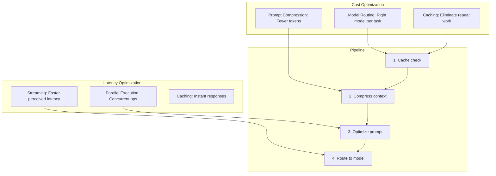

<!-- _class: lead -->

# Cost and Latency Optimization for AI Agents

**Module 07 — Production Deployment**

> The goal isn't free or instant — it's eliminating waste: unnecessary tokens, redundant calls, sequential operations that could be parallel, and expensive models for simple tasks.

<!--
Speaker notes: Key talking points for this slide
- Transition slide: we are now moving into Cost and Latency Optimization for AI Agents
- Pause briefly to let the audience absorb the previous section
- Preview what is coming next in this section
-->
---

# The Optimization Hierarchy



**Formal Definition:**
$$\text{Cost} = \sum(\text{llm\_calls} \times \text{tokens} \times \text{price\_per\_token} + \text{tool\_calls} \times \text{tool\_cost})$$
$$\text{Latency} = \sum(\text{llm\_latency} + \text{tool\_latency} + \text{network\_latency})$$

> 🔑 Always optimize in order: eliminate first, then reduce, then parallelize, then accelerate.

<!--
Speaker notes: Key talking points for this slide
- Walk through the diagram from left to right (or top to bottom)
- Explain each component and the connections between them
- Relate this architecture back to practical use cases
-->
---

<!-- _class: lead -->

# Cost Optimization

<!--
Speaker notes: Key talking points for this slide
- Transition slide: we are now moving into Cost Optimization
- Pause briefly to let the audience absorb the previous section
- Preview what is coming next in this section
-->
---

# Model Routing

```python
class ModelRouter:
    def __init__(self, client: Anthropic):
        self.client = client
        self.costs = {
            "claude-haiku-4-5":  {"input": 0.80,  "output": 4.00},
            "claude-sonnet-4-6": {"input": 3.00,  "output": 15.00},
            "claude-opus-4-6":   {"input": 15.00, "output": 75.00}
        }

    def estimate_complexity(self, task: str) -> Literal["simple", "medium", "complex"]:
        task_lower = task.lower()
        if len(task) < 100 and any(kw in task_lower
                for kw in ["what is", "define", "translate", "summarize this"]):
```

<!--
Speaker notes: Key talking points for this slide
- Walk through the code block line by line, emphasizing the key pattern
- The diagram below shows the architecture/flow visually
- Point out how the code maps to the diagram components
- Highlight any production considerations or gotchas
-->
---

# Model Routing (continued)

```python
return "simple"
        if len(task) > 500 or any(kw in task_lower
                for kw in ["analyze", "compare", "evaluate", "design"]):
            return "complex"
        return "medium"

    def select_model(self, task: str) -> str:
        model_map = {"simple": "claude-haiku-4-5",
                     "medium": "claude-sonnet-4-6",
                     "complex": "claude-opus-4-6"}
        return model_map[self.estimate_complexity(task)]
```

<!--
Speaker notes: Key talking points for this slide
- Continuation of the previous code block
- Walk through the remaining implementation details
- Highlight any key patterns or important lines
-->
---

# Prompt Compression

```python
class PromptOptimizer:
    def compress_context(self, long_context: str, max_tokens: int = 1000) -> str:
        """Use cheap model to compress long context."""
        compression_prompt = f"""Compress this text to {max_tokens} tokens
while preserving key information:\n\n{long_context}\n\nReturn only compressed version."""

        response = self.client.messages.create(
            model="claude-haiku-4-5",  # Cheap model for compression
            max_tokens=max_tokens,
            messages=[{"role": "user", "content": compression_prompt}])
        return response.content[0].text
```

> 🔑 10,000 token document compressed to 500 tokens = **95% token reduction**.

<!--
Speaker notes: Key talking points for this slide
- Walk through the code example, focusing on the key pattern being demonstrated
- Highlight the most important lines and explain why they matter
- Point out any edge cases or production considerations
- This code is copy-paste ready for learners to try
-->
---

# Prompt Compression (continued)

```python
def extract_relevant_context(self, query: str, full_context: str,
                                  max_context_tokens: int = 500) -> str:
        """Extract only relevant portions of context."""
        extraction_prompt = f"""Given this query: "{query}"
Extract most relevant information (max {max_context_tokens} tokens):
{full_context}"""

        response = self.client.messages.create(
            model="claude-haiku-4-5", max_tokens=max_context_tokens,
            messages=[{"role": "user", "content": extraction_prompt}])
        return response.content[0].text
```

<!--
Speaker notes: Key talking points for this slide
- Continuation of the previous code block
- Walk through the remaining implementation details
- Highlight any key patterns or important lines
-->
---

<!-- _class: lead -->

# Latency Optimization

<!--
Speaker notes: Key talking points for this slide
- Transition slide: we are now moving into Latency Optimization
- Pause briefly to let the audience absorb the previous section
- Preview what is coming next in this section
-->
---

# Caching

```python
class AgentCache:
    def __init__(self, redis_client: redis.Redis):
        self.redis = redis_client
        self.ttl_seconds = 3600  # 1 hour default

    def _make_key(self, input: str, context: dict) -> str:
        cache_input = {"input": input, "context": context}
        serialized = json.dumps(cache_input, sort_keys=True)
        return hashlib.sha256(serialized.encode()).hexdigest()

    def execute_with_cache(self, input: str, execute_fn, context=None) -> tuple[str, bool]:
        cached = self.get(input, context)
        if cached:
            return cached, True   # Cache hit

        response = execute_fn(input)
        self.set(input, response, context)
        return response, False    # Cache miss
```



> ✅ Cache hits are **50x faster** and **free** — measure your hit rate.

<!--
Speaker notes: Key talking points for this slide
- Walk through the code block line by line, emphasizing the key pattern
- The diagram below shows the architecture/flow visually
- Point out how the code maps to the diagram components
- Highlight any production considerations or gotchas
-->
---

# Parallel Execution

```python
class ParallelAgent:
    async def parallel_llm_calls(self, prompts: List[str]) -> List[str]:
        async def single_call(prompt: str) -> str:
            response = await self.client.messages.create(
                model="claude-sonnet-4-6", max_tokens=1024,
                messages=[{"role": "user", "content": prompt}])
            return response.content[0].text

        return await asyncio.gather(*[single_call(p) for p in prompts])

    async def parallel_tool_calls(self, tool_calls: List[tuple]) -> List[any]:
        async def execute_tool(tool_name, params):
            return await tools[tool_name](**params)

        return await asyncio.gather(
            *[execute_tool(name, params) for name, params in tool_calls])
```

<div class="columns">
<div>

**Sequential:** 6s total
```
Task 1: ████████ 2s
Task 2:         ████████ 2s
Task 3:                 ████████ 2s
```

</div>
<div>

**Parallel:** 2s total
```
Task 1: ████████ 2s
Task 2: ████████ 2s
Task 3: ████████ 2s
```

</div>
</div>

> ⚠️ Only parallelize **independent** operations — dependent steps must remain sequential.

<!--
Speaker notes: Key talking points for this slide
- Walk through the code example, focusing on the key pattern being demonstrated
- Highlight the most important lines and explain why they matter
- Point out any edge cases or production considerations
- This code is copy-paste ready for learners to try
-->
---

# Streaming

```python
class StreamingAgent:
    def execute_streaming(self, prompt: str):
        """Stream responses for faster time-to-first-token."""
        with self.client.messages.stream(
            model="claude-sonnet-4-6", max_tokens=1024,
            messages=[{"role": "user", "content": prompt}]
        ) as stream:
            for text in stream.text_stream:
                print(text, end="", flush=True)
                # In production: yield text to frontend
```



> 🔑 Streaming doesn't reduce total latency — it reduces **perceived** latency (time to first token: ~100ms).

<!--
Speaker notes: Key talking points for this slide
- Walk through the code block line by line, emphasizing the key pattern
- The diagram below shows the architecture/flow visually
- Point out how the code maps to the diagram components
- Highlight any production considerations or gotchas
-->
---

# Integrated Optimization Pipeline

```python
class OptimizedAgent:
    def __init__(self, client, redis_client):
        self.model_router = ModelRouter(client)
        self.prompt_optimizer = PromptOptimizer(client)
        self.cache = AgentCache(redis_client)

    def execute(self, prompt, context=None, use_cache=True) -> tuple[str, dict]:
        metrics = {"cache_hit": False, "model_used": None, "tokens_saved": 0, "cost": 0.0}
```

<!--
Speaker notes: Key talking points for this slide
- Walk through the code example, focusing on the key pattern being demonstrated
- Highlight the most important lines and explain why they matter
- Point out any edge cases or production considerations
- This code is copy-paste ready for learners to try
-->
---

# Integrated Optimization Pipeline (continued)

```python
# 1. Check cache
        if use_cache:
            cached = self.cache.get(prompt, {"context": context})
            if cached:
                metrics["cache_hit"] = True
                return cached, metrics

        # 2. Compress context
        if context and len(context) > 1000:
            original = len(context.split())
            context = self.prompt_optimizer.compress_context(context, max_tokens=500)
            metrics["tokens_saved"] = original - len(context.split())
```

<!--
Speaker notes: Key talking points for this slide
- Continuation of the previous code block
- Walk through the remaining implementation details
- Highlight any key patterns or important lines
-->
---

# Integrated Optimization Pipeline (continued)

```python
# 3. Optimize prompt
        optimized_prompt = self.prompt_optimizer.optimize_prompt(prompt)

        # 4. Route to appropriate model
        full_prompt = f"{context}\n\n{optimized_prompt}" if context else optimized_prompt
        response, cost = self.model_router.execute(full_prompt)

        metrics["model_used"] = self.model_router.select_model(full_prompt)
        metrics["cost"] = cost

        if use_cache:
            self.cache.set(prompt, response, {"context": context})

        return response, metrics
```

<!--
Speaker notes: Key talking points for this slide
- Continuation of the previous code block
- Walk through the remaining implementation details
- Highlight any key patterns or important lines
-->
---

# Common Pitfalls

| Pitfall | Problem | Solution |
|---------|---------|----------|
| **Premature optimization** | Optimizing before measuring | Measure first, optimize bottlenecks |
| **Over-caching** | Serving stale data | Appropriate TTLs per content type |
| **Quality degradation** | Always cheapest model | Balance quality vs. cost per task |
| **False parallelization** | Parallelizing dependent ops | Only parallelize independent work |

```python
# DON'T: Parallelize dependent steps
results = await asyncio.gather(
    get_data(),       # Step 2 needs this!
    analyze(data)     # Can't run until step 1 completes
)

# DO: Only parallelize independent operations
data = await get_data()  # Must be first
results = await asyncio.gather(
    analyze(data),    # Independent
    summarize(data),  # Independent
    visualize(data)   # Independent
)
```

<!--
Speaker notes: Key talking points for this slide
- Walk through the code example, focusing on the key pattern being demonstrated
- Highlight the most important lines and explain why they matter
- Point out any edge cases or production considerations
- This code is copy-paste ready for learners to try
-->
---

# Summary & Connections



**Key takeaways:**
- Follow the optimization hierarchy: eliminate, reduce, parallelize, accelerate
- Model routing saves 12x on simple queries (Haiku vs. Sonnet)
- Prompt compression reduces context by 95% with minimal quality loss
- Caching gives 50x speedup and zero cost on repeated queries
- Parallel execution provides Nx speedup for independent operations
- Streaming reduces perceived latency to ~100ms time-to-first-token
- Always measure before optimizing — find the bottleneck first

> *Optimization is about eliminating waste, not cutting corners.*

<!--
Speaker notes: Key talking points for this slide
- Walk through the diagram from left to right (or top to bottom)
- Explain each component and the connections between them
- Relate this architecture back to practical use cases
-->