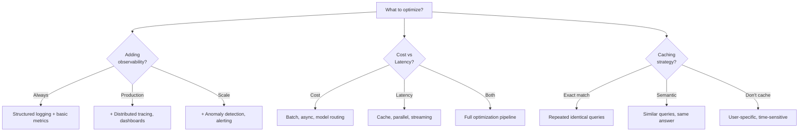
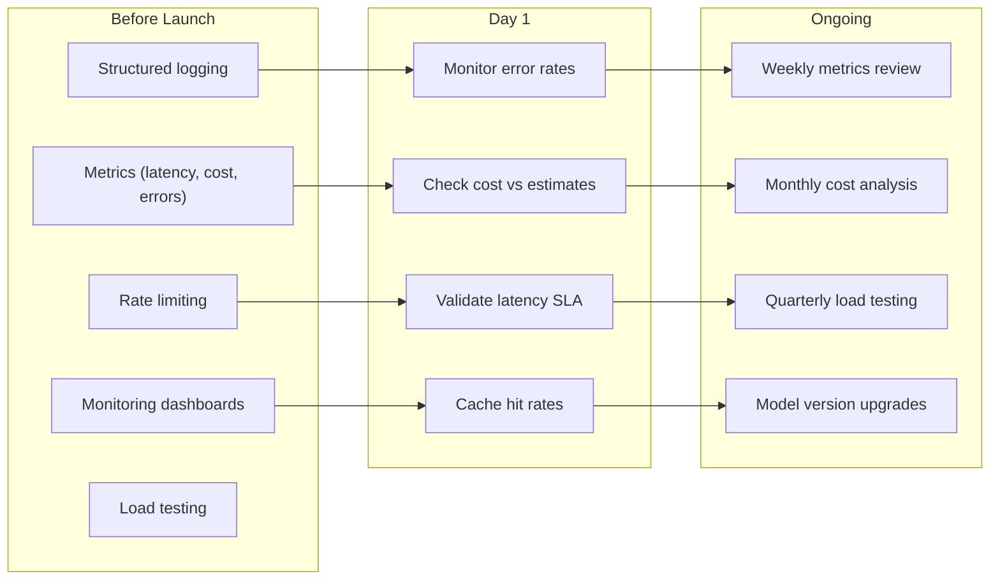

<!-- _class: lead -->

# Module 7: Production Deployment

**Cheatsheet — Quick Reference Card**

> Architecture, observability, optimization, and deployment patterns at a glance.

<!--
Speaker notes: Key talking points for this slide
- Transition slide: we are now moving into Module 7: Production Deployment
- Pause briefly to let the audience absorb the previous section
- Preview what is coming next in this section
-->
---

# Key Concepts

| Concept | Definition |
|---------|-----------|
| **Observability** | Understanding system behavior through logs, metrics, and traces |
| **Distributed Tracing** | Tracking requests across services to diagnose performance |
| **Circuit Breaker** | Prevents cascading failures by stopping requests to failing services |
| **Prompt Caching** | Reusing cached LLM responses for identical/similar prompts |
| **Model Routing** | Selecting models based on task complexity and requirements |
| **Semantic Caching** | Caching for semantically similar queries, not just exact matches |
| **Exponential Backoff** | Retry strategy with increasing delays between attempts |
| **Rate Limiting** | Controlling request frequency to prevent abuse and manage costs |
| **Canary Deployment** | Gradual rollout to subset of users to detect issues early |
| **Token Budget** | Maximum token limit per request/time period for cost control |

<!--
Speaker notes: Key talking points for this slide
- Explain the core concept on this slide clearly and concisely
- Relate it back to practical agent building scenarios
- Highlight any common pitfalls or misconceptions
- Connect to what was covered previously and what comes next
-->
---

# Structured Logging

```python
class ProductionAgent:
    def process(self, request):
        request_id = generate_request_id()
        log = self.logger.bind(request_id=request_id, user_id=request.user_id)

        log.info("request_started", query=request.query)

        try:
            start_time = time.time()
            result = self.execute(request)
            latency = time.time() - start_time
```

<!--
Speaker notes: Key talking points for this slide
- Walk through the code block line by line, emphasizing the key pattern
- The diagram below shows the architecture/flow visually
- Point out how the code maps to the diagram components
- Highlight any production considerations or gotchas
-->
---

# Structured Logging (continued)

```python
log.info("request_completed",
                     latency_ms=latency * 1000,
                     tokens_used=result.tokens,
                     cost_usd=result.cost)
            return result
        except Exception as e:
            log.error("request_failed",
                      error_type=type(e).__name__,
                      error_message=str(e),
                      traceback=traceback.format_exc())
            raise
```

<!--
Speaker notes: Key talking points for this slide
- Continuation of the previous code block
- Walk through the remaining implementation details
- Highlight any key patterns or important lines
-->
---

# Distributed Tracing

```python
class TracedAgent:
    def process(self, query):
        with tracer.start_as_current_span("agent.process") as span:
            span.set_attribute("query.length", len(query))

            with tracer.start_as_current_span("agent.plan") as plan_span:
                plan = self.create_plan(query)
                plan_span.set_attribute("plan.steps", len(plan))

            with tracer.start_as_current_span("agent.execute") as exec_span:
                for i, step in enumerate(plan):
                    with tracer.start_as_current_span(f"step.{i}") as step_span:
                        step_span.set_attribute("step.action", step.action)
```

> 🔑 Nested spans create a hierarchical view of every agent execution step.

<!--
Speaker notes: Key talking points for this slide
- Walk through the code example, focusing on the key pattern being demonstrated
- Highlight the most important lines and explain why they matter
- Point out any edge cases or production considerations
- This code is copy-paste ready for learners to try
-->
---

# Distributed Tracing (continued)

```python
with tracer.start_as_current_span("llm.call") as llm_span:
                            result = llm.generate(step.prompt)
                            llm_span.set_attribute("tokens.input", result.input_tokens)

                        if step.requires_tool:
                            with tracer.start_as_current_span("tool.call") as tool_span:
                                tool_span.set_attribute("tool.name", step.tool)
                                tool_result = self.call_tool(step.tool, step.input)
```

<!--
Speaker notes: Key talking points for this slide
- Continuation of the previous code block
- Walk through the remaining implementation details
- Highlight any key patterns or important lines
-->
---

# Circuit Breaker Pattern

```python
class CircuitBreaker:
    def __init__(self, failure_threshold=5, timeout=60):
        self.failures = 0
        self.threshold = failure_threshold
        self.timeout = timeout
        self.state = "CLOSED"  # CLOSED, OPEN, HALF_OPEN

    def call(self, func, *args, **kwargs):
        if self.state == "OPEN":
            if time.time() - self.last_failure > self.timeout:
                self.state = "HALF_OPEN"
            else:
                raise Exception("Circuit OPEN")
```

<!--
Speaker notes: Key talking points for this slide
- Circuit breaker prevents cascading failures by stopping calls to a failing service
- Three states: CLOSED (normal), OPEN (blocking calls), HALF_OPEN (testing recovery)
- After timeout, allows a test call through (HALF_OPEN state)
-->
---

# Exponential Backoff Retry

```python
def retry_with_backoff(func, max_retries=3,
                       base_delay=1, max_delay=30):
    for attempt in range(max_retries):
        try:
            return func()
        except Exception as e:
            if attempt == max_retries - 1:
                raise
            delay = min(base_delay * (2 ** attempt), max_delay)
            logger.warning("retry_attempt",
                           attempt=attempt + 1,
                           delay_seconds=delay)
            time.sleep(delay)
```

> 🔑 Combine circuit breaker + retry: retry handles transient failures, circuit breaker prevents cascading failures.

<!--
Speaker notes: Key talking points for this slide
- Exponential backoff increases delay between retries: 1s, 2s, 4s, 8s...
- max_delay caps the maximum wait time to prevent excessive delays
- Always re-raise on the last attempt so the caller knows it failed
- These two patterns complement each other in production agent systems
-->
---

# Semantic Caching

```python
class SemanticCache:
    def __init__(self, similarity_threshold=0.95):
        self.cache = {}
        self.embedder = SentenceTransformer('all-MiniLM-L6-v2')
        self.threshold = similarity_threshold

    def get(self, query):
        query_embedding = self.embedder.encode(query)
        for cached_hash, (cached_query, response, cached_embedding) in self.cache.items():
            similarity = np.dot(query_embedding, cached_embedding) / (
                np.linalg.norm(query_embedding) * np.linalg.norm(cached_embedding))
            if similarity >= self.threshold:
```

> ✅ Semantic caching matches "What's the weather in NYC?" with "NYC weather today?" — exact match cache would miss this.

<!--
Speaker notes: Key talking points for this slide
- Walk through the code example, focusing on the key pattern being demonstrated
- Highlight the most important lines and explain why they matter
- Point out any edge cases or production considerations
- This code is copy-paste ready for learners to try
-->
---

# Semantic Caching (continued)

```python
return response
        return None

    def set(self, query, response):
        embedding = self.embedder.encode(query)
        embedding_hash = hashlib.md5(embedding.tobytes()).hexdigest()
        self.cache[embedding_hash] = (query, response, embedding)
```

<!--
Speaker notes: Key talking points for this slide
- Continuation of the previous code block
- Walk through the remaining implementation details
- Highlight any key patterns or important lines
-->
---

# Model Routing + Monitoring

<div class="columns">
<div>

**Model Routing:**
```python
class ModelRouter:
    def select_model(self, query, context):
        complexity = self.assess_complexity(
            query, context)
        if complexity < 0.3:
            return "fast"      # Haiku
        elif complexity < 0.7:
            return "balanced"  # Sonnet
        else:
            return "powerful"  # Opus

    def assess_complexity(self, query, ctx):
        features = {
            "query_length": len(query)/1000,
            "requires_reasoning":
```

</div>
<div>

**Prometheus Metrics:**
```python
from prometheus_client import (
    Counter, Histogram, Gauge)

request_counter = Counter(
    'agent_requests_total',
    'Total requests',
    ['status', 'model'])

latency_histogram = Histogram(
    'agent_request_latency_seconds',
    'Latency distribution',
    ['model'])
```

</div>
</div>

<!--
Speaker notes: Key talking points for this slide
- Walk through the code example, focusing on the key pattern being demonstrated
- Highlight the most important lines and explain why they matter
- Point out any edge cases or production considerations
- This code is copy-paste ready for learners to try
-->
---

# Model Routing + Monitoring (continued)

```python
token_counter = Counter(
    'agent_tokens_total',
    'Total tokens',
    ['model', 'type'])

cost_counter = Counter(
    'agent_cost_usd_total',
    'Total cost USD',
    ['model'])

active_requests = Gauge(
    'agent_active_requests',
    'Requests in progress')
```

<!--
Speaker notes: Key talking points for this slide
- Continuation of the previous code block
- Walk through the remaining implementation details
- Highlight any key patterns or important lines
-->
---

# Model Routing + Monitoring (continued)

```python
self.needs_reasoning(query),
            "context_size": len(ctx)/10000,
            "requires_tools":
                self.needs_tools(query)
        }
        weights = {
            "query_length": 0.2,
            "requires_reasoning": 0.4,
            "context_size": 0.2,
            "requires_tools": 0.2
        }
        return min(sum(
            features[k] * weights[k]
            for k in features), 1.0)
```

<!--
Speaker notes: Key talking points for this slide
- Continuation of the previous code block
- Walk through the remaining implementation details
- Highlight any key patterns or important lines
-->
---

# Gotchas

| Gotcha | Solution |
|--------|----------|
| Logs overwhelm storage | Sample (1% normal, 100% errors), set retention policies |
| Tracing adds latency | Async exporters, batch spans, sample traces |
| Cache invalidation is hard | TTLs per content type, cache versioning, manual invalidation |
| Circuit breaker false positives | Sliding window, tune thresholds, different per error type |
| Alerts too noisy | Historical-based thresholds, anomaly detection, group alerts |
| Cost tracking inaccurate | Track retries + failures, include all API fees, reconcile daily |
| Canary deploys detect late | Start at 1-5% traffic, automated quality checks, instant rollback |

```python
# Bad: Log everything
logger.debug(f"Full prompt: {prompt}")  # Expensive!

# Good: Sample and summarize
if random.random() < 0.01 or error:  # 1% sampling
    logger.info("request_details", prompt_length=len(prompt), tokens=tokens)
```

<!--
Speaker notes: Key talking points for this slide
- Walk through the code example, focusing on the key pattern being demonstrated
- Highlight the most important lines and explain why they matter
- Point out any edge cases or production considerations
- This code is copy-paste ready for learners to try
-->
---

# Quick Decision Guide



| Pattern | When | When NOT |
|---------|------|----------|
| **Circuit Breaker** | External API calls, unstable deps | Stable internal services |
| **Model Routing** | Mixed workload, cost priority | All tasks same complexity |
| **Semantic Cache** | Similar queries, high repetition | Unique per-user queries |
| **Canary Deploy** | Any production change | Emergency hotfixes |

<!--
Speaker notes: Key talking points for this slide
- Walk through the diagram from left to right (or top to bottom)
- Explain each component and the connections between them
- Relate this architecture back to practical use cases
-->
---

# Production Checklist



**You should now be able to:**
- Design production architectures with reliability patterns (circuit breaker, fallback, bulkhead)
- Implement structured logging, metrics collection, and distributed tracing
- Optimize cost with model routing, prompt compression, and caching
- Optimize latency with parallel execution, streaming, and caching
- Deploy with FastAPI, Docker, and Kubernetes with health checks
- Monitor production systems with dashboards, alerts, and anomaly detection

<!--
Speaker notes: Key talking points for this slide
- Walk through the diagram from left to right (or top to bottom)
- Explain each component and the connections between them
- Relate this architecture back to practical use cases
-->