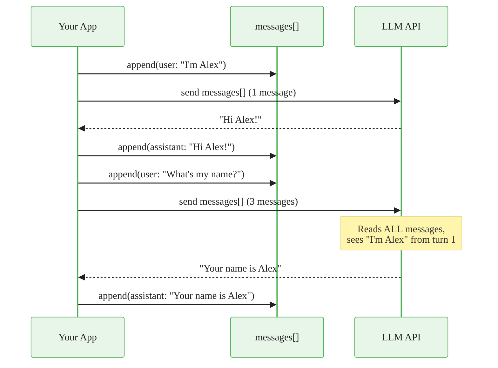

# Conversation Memory

> **Reading time:** ~6 min | **Topic:** Agent Memory | **Prerequisites:** Basic API calls

<div class="callout-key">

**Key Concept Summary:** LLMs are stateless -- they have no memory between API calls. "Memory" in an agent is an application-level concern: you maintain a list of messages and send the entire history with every request. The LLM reads all previous messages and *appears* to remember, but it is actually re-reading the full conversation each time. Understanding this distinction prevents confusion about context limits, cost scaling, and memory strategies.

</div>

## How Memory Works

The mechanism is simple: you keep a growing list of messages and pass the full list on every API call. The LLM processes all messages as if reading a transcript.



<div class="callout-insight">

**Insight:** Every API call sends the *entire* conversation history. This means cost and latency grow linearly with conversation length. A 50-turn conversation sends ~50 messages on every call. This is why memory management strategies (sliding window, summarization) exist -- they are not about making the LLM "remember better" but about controlling cost and staying within context limits.

</div>

## Memory Strategies

There is no single "best" strategy. Each trades off between completeness, cost, and complexity. Start with the simplest approach that meets your constraints and upgrade only when you hit a limit.

<div class="compare">
<div class="compare-card">
  <div class="header before">Simple: Keep Everything</div>
  <div class="body">

```python
messages.append({"role": "user", "content": input})
response = client.messages.create(messages=messages)
messages.append({"role": "assistant", "content": resp})
```

Works until you hit the context window limit. Best for short conversations (under 20 turns).

  </div>
</div>
<div class="compare-card">
  <div class="header after">Sliding Window: Keep Last N</div>
  <div class="body">

```python
messages = messages[-20:]  # Keep last 20 messages
```

Constant cost per call. Forgets early context. Best for task-focused agents where recent context matters most.

  </div>
</div>
</div>

### Advanced Strategies

| Strategy | How It Works | When to Use | Tradeoff |
|----------|-------------|-------------|----------|
| **Keep all** | Send every message | Short conversations (<20 turns) | Cost grows linearly |
| **Sliding window** | Keep last N messages | Task-focused agents | Forgets early context |
| **Summarize** | LLM summarizes old messages | Medium conversations | Loses details in summary |
| **RAG-backed** | Store messages in vector DB, retrieve relevant | Long-term memory across sessions | Most complex to implement |

<div class="callout-warning">

**Warning:** The "summarize" strategy requires an extra LLM call to create the summary. This adds latency and cost. Only use it when conversations regularly exceed 30+ turns and early context is important. For most use cases, a sliding window of 20 messages is sufficient.

</div>

## Implementation

<div class="code-window">
<div class="code-header">
<div class="dots"><span class="dot-red"></span><span class="dot-yellow"></span><span class="dot-green"></span></div>
<span class="filename">memory.py</span>
</div>

```python
class Memory:
    """Conversation memory with automatic window management."""

    def __init__(self, max_messages: int = 50):
        self.messages: list[dict] = []
        self.max = max_messages

    def add(self, role: str, content: str) -> None:
        self.messages.append({"role": role, "content": content})
        if len(self.messages) > self.max:
            # Keep system message (if any) + most recent messages
            self.messages = self.messages[-self.max:]

    def get(self) -> list[dict]:
        return self.messages

    def clear(self) -> None:
        self.messages = []
```

</div>

## Context Window Limits

The context window is the hard ceiling on how much text the LLM can process in a single call. Every message in your history consumes tokens from this budget.

| Model | Context Window | Approx. Messages | Cost Implication |
|-------|---------------|-------------------|-----------------|
| Claude Sonnet 4 | 200K tokens | ~500 turns | Input tokens billed per call |
| GPT-4o | 128K tokens | ~300 turns | Same billing model |
| GPT-4o-mini | 128K tokens | ~300 turns | Lower per-token cost |

<div class="callout-info">

**Info:** Token count is not the same as message count. A message with a long code block might consume 2000 tokens, while "Yes" consumes 1 token. Use `anthropic.count_tokens()` or tiktoken to measure actual usage if cost is a concern.

</div>

<div class="callout-danger">

**Danger:** When trimming messages, never remove the system message. A common bug: `messages = messages[-20:]` accidentally drops the system prompt if it was the first message. Always preserve it: `messages = [messages[0]] + messages[-19:]` (assuming index 0 is the system message).

</div>

## Practice Questions

1. **Why does cost increase with conversation length?** Think about what happens to the input token count on the 50th turn of a conversation.
2. **Design a memory strategy** for a customer support agent that needs to remember the customer's account details mentioned in turn 1 but also handle 100+ turn conversations. Which strategy (or combination) would you use?
3. **What happens if two user messages appear consecutively** in the messages list (without an assistant message between them)? Check the API documentation for message ordering requirements.

---

<a class="link-card" href="../../../quick-starts/00_your_first_agent.ipynb">
  <div class="link-card-title">Your First Agent</div>
  <div class="link-card-description">Quick-start notebook building a chatbot with memory in under 2 minutes.</div>
</a>

<a class="link-card" href="./tool_calling.md">
  <div class="link-card-title">Tool Calling Guide</div>
  <div class="link-card-description">Add tools to your memory-equipped agent for real-world interactions.</div>
</a>

<a class="link-card" href="./rag_pipeline.md">
  <div class="link-card-title">RAG Pipeline Guide</div>
  <div class="link-card-description">Use RAG as a long-term memory strategy -- store and retrieve from a vector database.</div>
</a>
