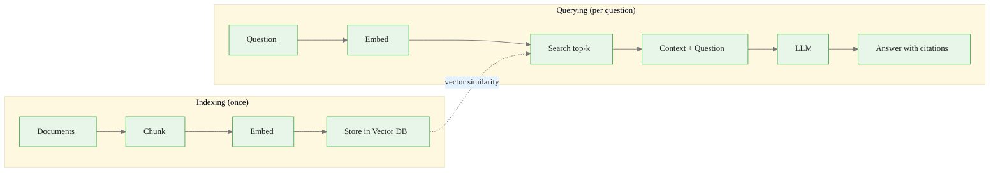

# RAG Pipeline

> **Reading time:** ~6 min | **Topic:** Retrieval-Augmented Generation | **Prerequisites:** Basic API calls

<div class="callout-key">

**Key Concept Summary:** RAG (Retrieval-Augmented Generation) gives an LLM access to external knowledge by searching your documents and injecting relevant chunks into the prompt. The core idea: instead of fine-tuning a model on your data, you *search* your data at query time and *stuff* the results into the context window. This means your knowledge base can change without retraining, and every answer can cite its source.

</div>

## The Two Phases

RAG has two distinct phases. **Indexing** happens once (or on a schedule). **Querying** happens every time a user asks a question. Separating these two phases in your mental model prevents a common mistake: trying to embed documents inside the query path.



<div class="flow">
<div class="flow-step mint">1. Chunk docs</div>
<div class="flow-arrow">&#8594;</div>
<div class="flow-step blue">2. Embed chunks</div>
<div class="flow-arrow">&#8594;</div>
<div class="flow-step amber">3. Store vectors</div>
<div class="flow-arrow">&#8594;</div>
<div class="flow-step lavender">4. Search on query</div>
<div class="flow-arrow">&#8594;</div>
<div class="flow-step mint">5. LLM answers</div>
</div>

## When to Use RAG

Understanding *when* RAG is the right approach prevents wasted effort. RAG excels when your knowledge base changes frequently or when you need citations. It struggles when the answer requires reasoning across many documents simultaneously (that is better handled with summarization chains or fine-tuning).

<div class="compare">
<div class="compare-card">
  <div class="header before">Use RAG When</div>
  <div class="body">

- Documents change frequently
- Need citations and source attribution
- Domain-specific content the model was not trained on
- Cannot or prefer not to fine-tune the model
- Need to comply with data governance (data stays in your infra)

  </div>
</div>
<div class="compare-card">
  <div class="header after">Skip RAG When</div>
  <div class="body">

- Static, small knowledge base (just put it in the system prompt)
- General knowledge questions the model already knows
- Creative generation tasks with no factual grounding
- You can fine-tune for your domain and do not need citations

  </div>
</div>
</div>

## Chunking: The Critical Design Decision

Chunk size controls the precision-recall tradeoff of your retrieval. Smaller chunks are more precise (each chunk is about one thing) but may lose surrounding context. Larger chunks preserve context but add irrelevant noise. Overlap ensures that sentences split across chunk boundaries still appear in at least one chunk.

<div class="callout-insight">

**Insight:** Most RAG failures trace back to chunking, not to the LLM or the embedding model. Before tuning any other parameter, experiment with chunk sizes between 500 and 1500 characters. Use 15-20% overlap. Evaluate by manually inspecting whether the retrieved chunks contain the answer to your test questions.

</div>

| Parameter | Recommended Range | Effect |
|-----------|------------------|--------|
| Chunk size | 500-1000 chars | Smaller = more precise, less context |
| Overlap | 15-20% of chunk size | Prevents split-sentence problems |
| Top-k results | 3-5 | More = more context but higher noise |
| Embedding model | text-embedding-3-small | Good balance of speed and quality |

## Quick Start Implementation

<div class="code-window">
<div class="code-header">
<div class="dots"><span class="dot-red"></span><span class="dot-yellow"></span><span class="dot-green"></span></div>
<span class="filename">rag_quick.py</span>
</div>

```python
import chromadb
import anthropic

# 1. Index your documents
client_db = chromadb.Client()
collection = client_db.create_collection("docs")
collection.add(
    documents=["Doc 1 content...", "Doc 2 content..."],
    ids=["doc1", "doc2"],
    metadatas=[{"source": "file1.md"}, {"source": "file2.md"}],
)

# 2. Query with RAG
results = collection.query(query_texts=["your question"], n_results=3)
context = "\n\n".join(results["documents"][0])

# 3. Ask the LLM with context
client_llm = anthropic.Anthropic()
response = client_llm.messages.create(
    model="claude-sonnet-4-20250514",
    max_tokens=1024,
    system="Answer based only on the provided context. Cite sources.",
    messages=[{"role": "user", "content": f"Context:\n{context}\n\nQuestion: your question"}],
)
print(response.content[0].text)
```

</div>

<div class="callout-warning">

**Warning:** ChromaDB's default embedding model changes between versions. Always specify the embedding function explicitly in production code (`collection = client.create_collection("docs", embedding_function=...)`) to avoid silent retrieval quality changes after a library update.

</div>

## Common Failure Modes

| Failure | Symptom | Fix |
|---------|---------|-----|
| Chunks too large | Irrelevant noise in answers | Reduce chunk size to 500-800 chars |
| Chunks too small | "I don't have enough info" | Increase chunk size or top-k |
| No overlap | Answers miss key sentences | Add 15-20% overlap |
| Wrong embedding model | Low retrieval accuracy | Use text-embedding-3-small or better |
| No metadata | Cannot cite sources | Always store source filename in metadata |

<div class="callout-danger">

**Danger:** Never build a RAG system without an evaluation set. Create 20-30 question-answer pairs from your documents. After every change to chunking, embedding, or retrieval parameters, re-run the evaluation. Without this, you are tuning blind.

</div>

## Practice Questions

1. **Why does chunk overlap matter?** Consider a sentence that falls exactly at a chunk boundary. What happens to retrieval quality if that sentence contains the answer?
2. **When would you use a larger top-k (e.g., 10)?** Think about questions that require synthesizing information from multiple sections of a document.
3. **Design a chunking strategy** for a codebase (Python files). Should you chunk by lines, by functions, or by files? What metadata would you store?

---

<a class="link-card" href="../../../templates/rag_template.py">
  <div class="link-card-title">RAG Template</div>
  <div class="link-card-description">Production-ready RAG pipeline scaffold with chunking, indexing, and query functions.</div>
</a>

<a class="link-card" href="../../../quick-starts/01_rag_in_5_minutes.ipynb">
  <div class="link-card-title">RAG in 5 Minutes</div>
  <div class="link-card-description">Hands-on quick-start notebook -- working RAG pipeline from scratch.</div>
</a>

<a class="link-card" href="./tool_calling.md">
  <div class="link-card-title">Tool Calling Guide</div>
  <div class="link-card-description">Combine RAG with tool calling to build agents that can both search documents and take actions.</div>
</a>
