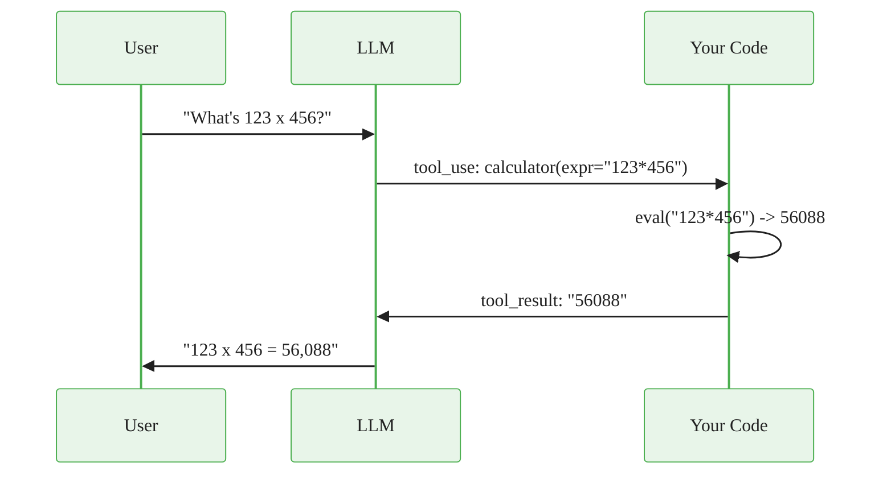

# Tool Calling

> **Reading time:** ~5 min | **Topic:** Tool Use | **Prerequisites:** Basic API calls

<div class="callout-key">

**Key Concept Summary:** Tool calling is the mechanism that lets an LLM interact with external systems. The LLM decides *what* tool to call and with *what* arguments; your code executes the tool and returns the result. This loop continues until the LLM has enough information to answer the user. Understanding this boundary -- LLM decides, your code executes -- is the foundation of every agentic system.

</div>

## How Tool Calling Works

The sequence below is the core mental model. Every agentic framework (LangChain, CrewAI, custom loops) implements this same pattern under the hood.



<div class="flow">
<div class="flow-step mint">1. User asks question</div>
<div class="flow-arrow">&#8594;</div>
<div class="flow-step blue">2. LLM decides tool</div>
<div class="flow-arrow">&#8594;</div>
<div class="flow-step amber">3. Your code executes</div>
<div class="flow-arrow">&#8594;</div>
<div class="flow-step lavender">4. Result back to LLM</div>
<div class="flow-arrow">&#8594;</div>
<div class="flow-step mint">5. LLM answers user</div>
</div>

<div class="callout-insight">

**Insight:** The LLM never executes code. It produces a structured JSON request describing *which* tool to call and *what* arguments to pass. Your application code is responsible for actually running the function. This separation means you control security, rate limiting, and error handling entirely on your side.

</div>

## Tool Definition Schema

Every tool needs three things: a unique name, a description the LLM reads to decide when to use it, and a JSON schema for the inputs.

<div class="code-window">
<div class="code-header">
<div class="dots"><span class="dot-red"></span><span class="dot-yellow"></span><span class="dot-green"></span></div>
<span class="filename">tool_definition.py</span>
</div>

```python
{
    "name": "get_weather",           # Unique identifier
    "description": "Get current weather for a city. Returns temperature "
                   "in Celsius, conditions, and humidity.",
    "input_schema": {
        "type": "object",
        "properties": {
            "city": {"type": "string", "description": "City name, e.g. 'London'"}
        },
        "required": ["city"]
    }
}
```

</div>

<div class="callout-warning">

**Warning:** Tool descriptions are the single biggest lever for tool-calling reliability. The LLM reads the description to decide *when* to use a tool. Vague descriptions like "Does math" cause the LLM to misuse or ignore the tool. Be specific: "Calculate arithmetic expressions like 2+2, sqrt(144), or 3**4. Returns the numeric result as a string."

</div>

## The Agent Loop

The core loop is simple: call the LLM, check if it wants to use a tool, execute the tool if so, feed the result back, and repeat until the LLM produces a final answer.

<div class="code-window">
<div class="code-header">
<div class="dots"><span class="dot-red"></span><span class="dot-yellow"></span><span class="dot-green"></span></div>
<span class="filename">agent_loop.py</span>
</div>

```python
tools = [{"name": "calc", "description": "...", "input_schema": {...}}]

response = client.messages.create(
    model="claude-sonnet-4-20250514",
    tools=tools,
    messages=messages,
)

# Loop until the LLM is done
while response.stop_reason == "tool_use":
    tool_block = next(b for b in response.content if b.type == "tool_use")
    result = run_tool(tool_block.name, tool_block.input)

    messages.append({"role": "assistant", "content": response.content})
    messages.append({"role": "user", "content": [
        {"type": "tool_result", "tool_use_id": tool_block.id, "content": result}
    ]})

    response = client.messages.create(
        model="claude-sonnet-4-20250514", tools=tools, messages=messages
    )
```

</div>

## Common Tools

| Tool | Use Case | Description Quality Tip |
|------|----------|------------------------|
| `calculator` | Math operations | Specify supported operations explicitly |
| `search` | Web/database search | State what kind of results are returned |
| `get_weather` | External API calls | Include units and format in description |
| `read_file` | Local file access | Specify allowed file types and size limits |
| `execute_code` | Run Python | Describe the sandbox constraints clearly |

<div class="callout-danger">

**Danger:** Never expose unrestricted `execute_code` or `eval` tools to an LLM. Always sandbox code execution, validate inputs, and restrict file system access. An LLM can be prompt-injected into calling tools with malicious arguments.

</div>

## Practice Questions

1. **Why does the LLM not execute tools directly?** Think about what would happen if the model itself ran arbitrary code -- who controls security, rate limits, and error handling?
2. **What happens if you give two tools with overlapping descriptions?** Consider how the LLM chooses between `search_web` ("search for information") and `search_docs` ("search for information in documents").
3. **Design a tool definition** for a tool that queries a SQL database. What properties would the input schema need? What safety constraints would you put in the description?

---

<a class="link-card" href="../../../templates/agent_template.py">
  <div class="link-card-title">Agent Template</div>
  <div class="link-card-description">Production-ready tool-using agent scaffold. Copy and customize for your use case.</div>
</a>

<a class="link-card" href="./conversation_memory.md">
  <div class="link-card-title">Conversation Memory Guide</div>
  <div class="link-card-description">How agents maintain context across turns -- from simple message lists to RAG-backed long-term memory.</div>
</a>

<a class="link-card" href="./rag_pipeline.md">
  <div class="link-card-title">RAG Pipeline Guide</div>
  <div class="link-card-description">Give your agent access to external knowledge with retrieval-augmented generation.</div>
</a>
