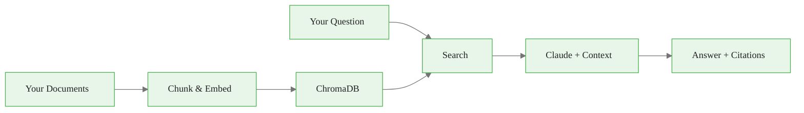

# Project 1: Personal Knowledge Assistant

> **Time:** 2-3 hours | **Difficulty:** Beginner | **Skills:** RAG, ChromaDB, CLI tools

<span class="badge mint">Beginner</span> <span class="badge amber">~2-3 hours</span> <span class="badge blue">Portfolio Project</span>

<div class="callout-key">

**Key Concept Summary:** This project puts the RAG pipeline into practice. You will build a CLI tool that indexes your own documents, answers questions about them, and cites which document each answer came from. Every component -- chunking, embedding, retrieval, and generation -- maps directly to the concepts in the RAG Pipeline visual guide.

</div>

## What You Will Build

A command-line tool that:
1. Indexes your documents (PDFs, markdown, text files)
2. Answers questions about them using RAG
3. Cites which document the answer came from



## Demo

<div class="code-window">
<div class="code-header">
<div class="dots"><span class="dot-red"></span><span class="dot-yellow"></span><span class="dot-green"></span></div>
<span class="filename">terminal</span>
</div>

```bash
$ python assistant.py --add ~/Documents/notes/
Added 47 documents to index.

$ python assistant.py -q "What did I write about Python decorators?"

Answer: In your notes from March 2024, you wrote that decorators are
"functions that wrap other functions to add behavior without modifying
the original function." You included examples of @property and @staticmethod.

Sources: python_notes.md, advanced_python.md
```

</div>

## What You Will Learn

<div class="flow">
<div class="flow-step mint">RAG pipeline</div>
<div class="flow-arrow">&#8594;</div>
<div class="flow-step blue">Document chunking</div>
<div class="flow-arrow">&#8594;</div>
<div class="flow-step amber">Vector database</div>
<div class="flow-arrow">&#8594;</div>
<div class="flow-step lavender">CLI tools</div>
</div>

## Getting Started

1. Copy the starter code below
2. Fill in the `# TODO` sections
3. Test with your own documents
4. Deploy it (optional)

<div class="callout-insight">

**Insight:** Start with the simplest possible chunking (split by character count with overlap) and the simplest possible retrieval (top-3 results). Get the full pipeline working end-to-end first. Only then optimize chunk size, overlap, top-k, and prompting. Premature optimization of individual components wastes time when the pipeline is not yet connected.

</div>

## Starter Code

<div class="code-window">
<div class="code-header">
<div class="dots"><span class="dot-red"></span><span class="dot-yellow"></span><span class="dot-green"></span></div>
<span class="filename">assistant.py</span>
</div>

```python
"""
Personal Knowledge Assistant
Your TODO items are marked below.
"""

import anthropic
import chromadb
import argparse
from pathlib import Path

# TODO 1: Initialize your clients
client = None  # anthropic.Anthropic()
chroma = None  # chromadb.PersistentClient(...)
collection = None  # chroma.get_or_create_collection(...)


def chunk_document(text: str, chunk_size: int = 800) -> list[str]:
    """Split document into chunks."""
    # TODO 2: Implement chunking with overlap
    # Hint: Use overlapping windows for better context
    pass


def add_document(filepath: str):
    """Add a document to the index."""
    # TODO 3: Read file, chunk it, add to ChromaDB
    # Hint: Store filepath in metadata for citations
    pass


def add_directory(dirpath: str):
    """Add all documents from a directory."""
    # TODO 4: Walk directory, filter by extension, add each file
    pass


def query(question: str, n_results: int = 3) -> dict:
    """Answer a question using RAG."""
    # TODO 5: Search ChromaDB, build context, call Claude
    # Return: {"answer": str, "sources": list[str]}
    pass


def main():
    parser = argparse.ArgumentParser(description="Personal Knowledge Assistant")
    parser.add_argument("--add", help="Add file or directory")
    parser.add_argument("-q", "--query", help="Ask a question")
    args = parser.parse_args()

    if args.add:
        path = Path(args.add)
        if path.is_dir():
            add_directory(str(path))
        else:
            add_document(str(path))
        print(f"Index now contains {collection.count()} chunks")

    elif args.query:
        result = query(args.query)
        print(f"\nAnswer: {result['answer']}")
        print(f"\nSources: {', '.join(result['sources'])}")


if __name__ == "__main__":
    main()
```

</div>

<div class="callout-warning">

**Warning:** The starter code uses `chromadb.PersistentClient(...)` which saves data to disk. Make sure you choose a directory that will persist between runs. If you use `chromadb.Client()` (in-memory), your index will vanish when the script exits.

</div>

## Solution

Once you have tried it yourself, check [solution.py](solution.py) for a reference implementation.

## Extend It (Optional)

| Extension | Difficulty | What You Learn |
|-----------|-----------|----------------|
| Add a Streamlit web interface | Medium | UI development |
| Support PDF parsing with PyPDF2 | Easy | Document processing |
| Add conversation memory | Medium | Agent memory patterns |
| Deploy to Hugging Face Spaces | Easy | Deployment |

## Share Your Work

Built something cool? Share it:
- Add to your GitHub portfolio
- Post on LinkedIn/Twitter
- Submit a PR to add your extension to this repo

---

<a class="link-card" href="../../concepts/visual_guides/rag_pipeline.md">
  <div class="link-card-title">RAG Pipeline Guide</div>
  <div class="link-card-description">Review the RAG concepts before starting -- chunking, embedding, retrieval, and generation.</div>
</a>

<a class="link-card" href="../../templates/rag_template.py">
  <div class="link-card-title">RAG Template</div>
  <div class="link-card-description">Production-ready scaffold if you want to skip the TODOs and start from working code.</div>
</a>
