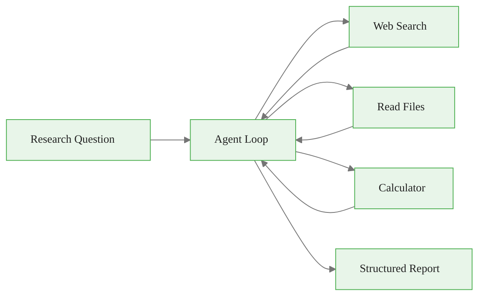

# Project 2: Multi-Tool Research Agent

> **Time:** 4-6 hours | **Difficulty:** Intermediate | **Skills:** Tool calling, agent loops, error handling

<span class="badge amber">Intermediate</span> <span class="badge amber">~4-6 hours</span> <span class="badge lavender">Portfolio Project</span>

<div class="callout-key">

**Key Concept Summary:** This project combines tool calling with the agent loop pattern. You will build an agent that takes a research question, autonomously decides which tools to use (web search, file reading, calculations), gathers information across multiple turns, and synthesizes findings into a structured report. This is the same architecture used by production research agents at companies like Perplexity and You.com.

</div>

## What You Will Build

An agent that:
1. Takes a research question
2. Uses tools to gather information (web search, file reading, calculations)
3. Synthesizes findings into a report
4. Cites all sources



## Demo

<div class="code-window">
<div class="code-header">
<div class="dots"><span class="dot-red"></span><span class="dot-yellow"></span><span class="dot-green"></span></div>
<span class="filename">terminal</span>
</div>

```bash
$ python researcher.py "Compare Python vs Rust for CLI tools"

Searching for "Python CLI frameworks 2024"...
Searching for "Rust CLI frameworks performance"...
Reading local notes: cli_comparison.md
Calculating benchmark differences...

Research Report
==================

## Summary
Both Python and Rust are excellent for CLI tools, with different tradeoffs...

## Key Findings
1. Development Speed: Python is 2-3x faster to prototype (Source: web search)
2. Runtime Performance: Rust is 10-50x faster (Source: benchmarks)
3. Distribution: Rust compiles to single binary (Source: cli_comparison.md)

## Recommendation
For internal tools: Python. For distributed tools: Rust.
```

</div>

## Tools to Implement

| Tool | Purpose | Implementation Hint |
|------|---------|-------------------|
| `web_search` | Search the web | Use `duckduckgo-search` package |
| `read_file` | Read local files | Standard file I/O with error handling |
| `calculator` | Perform calculations | Use `ast.literal_eval` (not raw `eval`) |
| `write_report` | Save report to file | Write markdown to disk |

<div class="callout-warning">

**Warning:** Never use `eval()` for the calculator tool. It allows arbitrary code execution. Use `ast.literal_eval()` for safe evaluation of mathematical expressions, or a dedicated library like `numexpr`. This is a real security concern in production agents.

</div>

## Getting Started

<div class="flow">
<div class="flow-step mint">1. Implement each tool</div>
<div class="flow-arrow">&#8594;</div>
<div class="flow-step blue">2. Wire up the agent loop</div>
<div class="flow-arrow">&#8594;</div>
<div class="flow-step amber">3. Test with questions</div>
<div class="flow-arrow">&#8594;</div>
<div class="flow-step lavender">4. Add error handling</div>
</div>

## Starter Code

<div class="code-window">
<div class="code-header">
<div class="dots"><span class="dot-red"></span><span class="dot-yellow"></span><span class="dot-green"></span></div>
<span class="filename">researcher.py</span>
</div>

```python
"""
Multi-Tool Research Agent
Fill in the TODO sections.
"""

import anthropic
import json

client = anthropic.Anthropic()

# Tool definitions
TOOLS = [
    {
        "name": "web_search",
        "description": "Search the web for information. Returns top 3 results.",
        "input_schema": {
            "type": "object",
            "properties": {
                "query": {"type": "string", "description": "Search query"}
            },
            "required": ["query"]
        }
    },
    {
        "name": "read_file",
        "description": "Read contents of a local file",
        "input_schema": {
            "type": "object",
            "properties": {
                "path": {"type": "string", "description": "File path"}
            },
            "required": ["path"]
        }
    },
    {
        "name": "calculator",
        "description": "Perform mathematical calculations",
        "input_schema": {
            "type": "object",
            "properties": {
                "expression": {"type": "string", "description": "Math expression"}
            },
            "required": ["expression"]
        }
    }
]


def web_search(query: str) -> str:
    """Search the web."""
    # TODO: Implement using DuckDuckGo or similar
    # Hint: pip install duckduckgo-search
    pass


def read_file(path: str) -> str:
    """Read a local file."""
    # TODO: Implement with error handling
    pass


def calculator(expression: str) -> str:
    """Calculate a math expression."""
    # TODO: Implement safely (don't use raw eval)
    pass


def run_tool(name: str, args: dict) -> str:
    """Execute a tool and return result."""
    handlers = {
        "web_search": web_search,
        "read_file": read_file,
        "calculator": calculator,
    }
    # TODO: Call the appropriate handler
    pass


def research(question: str) -> str:
    """Run the research agent."""
    messages = [{
        "role": "user",
        "content": f"""Research this question and provide a comprehensive answer:

{question}

Use the available tools to gather information. Search the web for current data,
read any relevant local files, and perform calculations if needed.

End with a structured report that includes:
1. Summary (2-3 sentences)
2. Key Findings (bulleted list with sources)
3. Recommendation (if applicable)
4. Sources (list all URLs and files used)"""
    }]

    # TODO: Implement the agent loop
    # 1. Call Claude with tools
    # 2. If tool_use, execute tool and continue
    # 3. If end_turn, return the response
    pass


def main():
    import sys
    if len(sys.argv) < 2:
        print("Usage: python researcher.py 'your research question'")
        return

    question = " ".join(sys.argv[1:])
    print(f"Researching: {question}\n")

    report = research(question)
    print("\n" + "=" * 50)
    print(report)


if __name__ == "__main__":
    main()
```

</div>

<div class="callout-insight">

**Insight:** The agent loop is the same pattern regardless of how many tools you have. The LLM decides which tool to call based on the tool descriptions. Your code just needs to dispatch to the right handler and feed the result back. Adding a new tool means: (1) add a definition to TOOLS, (2) write the handler function, (3) add it to the handlers dict. No changes to the loop itself.

</div>

## Solution

Check [solution.py](solution.py) after attempting it yourself.

## Extend It

| Extension | Difficulty | What You Learn |
|-----------|-----------|----------------|
| Add a `summarize_url` tool to read web pages | Easy | HTTP requests, HTML parsing |
| Implement response caching | Medium | Caching patterns, cost optimization |
| Add a `save_report` tool for markdown output | Easy | File I/O, structured output |
| Build a web UI with Gradio | Medium | UI development, async patterns |

<div class="callout-key">

**Key Point:** This project demonstrates agent architecture design, external API integration, error handling patterns, and report generation. These are the four capabilities employers look for when hiring AI engineers. Add this to your portfolio with a clear README showing the architecture diagram and sample output.

</div>

---

<a class="link-card" href="../../concepts/visual_guides/tool_calling.md">
  <div class="link-card-title">Tool Calling Guide</div>
  <div class="link-card-description">Review the tool-calling loop and schema design before starting.</div>
</a>

<a class="link-card" href="../../templates/agent_template.py">
  <div class="link-card-title">Agent Template</div>
  <div class="link-card-description">Production-ready agent scaffold if you want to skip the TODOs.</div>
</a>
