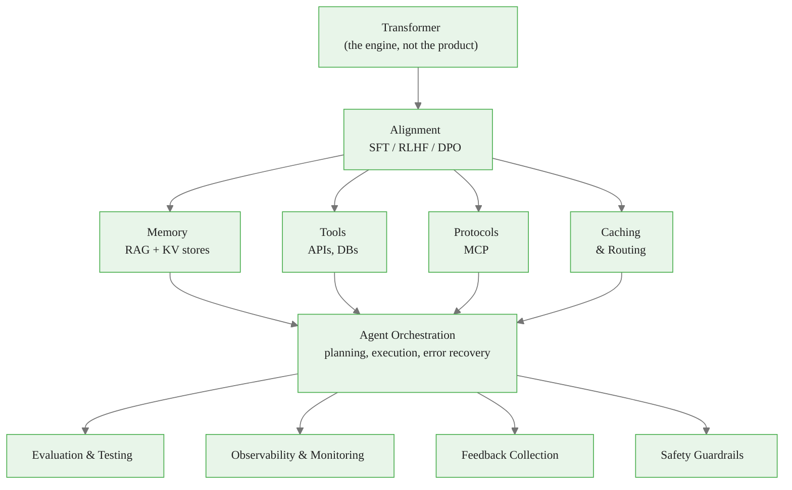

# From Transformer to System: Why the Model Is Just the Beginning

> **Reading time:** ~12 min | **Module:** 0 — AI Engineer Mindset | **Prerequisites:** Basic understanding of neural networks and APIs

<span class="badge mint">Beginner</span> <span class="badge amber">~12 min</span> <span class="badge blue">Module 0</span>

## Introduction

The Transformer architecture is a breakthrough in sequence modeling, but it's only the engine of a modern LLM system. Production applications require alignment, memory, tools, protocols, and evaluation — the model alone is insufficient.

<div class="callout-insight">

<strong>Key Insight:</strong> The Transformer gives you text generation. A system gives you reliable task completion.

</div>

When you fine-tune a model, ship a chatbot, connect it to a database, your "LLM project" becomes a messy systems problem:
- Hallucinations that look confident
- Knowledge that's stale the moment you deploy
- Tool failures that cascade
- Security boundaries that get crossed
- Latency budgets that get blown
- Memory that bloats
- Users who judge you by one bad answer

<div class="callout-key">

**Key Concept Summary:** A production LLM system is far more than a Transformer model. It requires retrieval for fresh knowledge, memory management for context, tool use for real-world actions, evaluation for reliability, and observability for continuous improvement. The AI engineer's job is to build and optimize the closed loop that ties all these components together.

</div>

## Visual Explanation



<div class="caption">Figure 1: The full LLM production system — the Transformer is one component among many.</div>

## Why the Transformer Alone Will Fail You: Three Structural Limits

Understanding these limitations is crucial for system design.

### 1. Knowledge in Weights Is Hard to Update

<div class="callout-warning">

<strong>Warning:</strong> The model "knows" things by storing patterns in weights. Updating those patterns requires expensive retraining. A model trained in 2024 doesn't know 2025 events.

</div>

**Solution:** RAG — retrieve current information at inference time. The model reads documents, not remembers them.

### 2. Context Windows Are Limited

Even "long context" models have finite windows. You cannot fit entire databases into a prompt.

| Model | Context Window | Equivalent Pages |
|-------|---------------|------------------|
| GPT-4 Turbo | 128k tokens | ~100 pages |
| Enterprise docs | N/A | 10,000+ pages |

**Solution:** Memory management — hierarchical storage, intelligent retrieval, summarization.

### 3. Generation Can Be Confidently Wrong

<div class="callout-danger">

<strong>Danger:</strong> Models output probability distributions over tokens. High confidence does not equal correctness. "The capital of Australia is Sydney" — confident, wrong.

</div>

**Solution:** Grounding — retrieve facts, verify with tools, evaluate outputs, maintain uncertainty.

## The System Properties You Actually Need

| Property | Model-Only | Full System |
|----------|------------|-------------|
| **Freshness** | Frozen at training | Updated via retrieval |
| **Traceability** | Black box | Cites sources |
| **Reliability** | Best guess | Verified outputs |
| **Efficiency** | Fixed cost | Cached, routed, optimized |
| **Safety** | Pre-trained guardrails | Multi-layer protection |
| **Improvement** | Requires retraining | Feedback flywheel |

## Code Example: Model vs System

### Model-Only Approach (Fragile)


<span class="filename">fragile_approach.py</span>
</div>
<div class="code-body">

<div class="code-window">
<div class="code-header">
<div class="dots"><span class="dot-red"></span><span class="dot-yellow"></span><span class="dot-green"></span></div>

```python
# This is what most tutorials show
response = client.messages.create(
    model="claude-sonnet-4-20250514",
    messages=[{"role": "user", "content": user_question}]
)
print(response.content[0].text)
# Hope it's correct!
```

</div>
</div>

### System Approach (Robust)


<span class="filename">robust_system.py</span>
</div>
<div class="code-body">

<div class="code-window">
<div class="code-header">
<div class="dots"><span class="dot-red"></span><span class="dot-yellow"></span><span class="dot-green"></span></div>

```python
# This is what production looks like
class LLMSystem:
    def __init__(self):
        self.retriever = VectorRetriever(documents)
        self.memory = ConversationMemory()
        self.tools = ToolRegistry()
        self.evaluator = ResponseEvaluator()

    def answer(self, goal: str) -> str:
        context = self.build_context(goal)
        response = self.generate(goal, context)

        if not self.evaluator.is_valid(response):
            response = self.retry_with_tools(goal)

        self.memory.store(goal, response)
        self.log_interaction(goal, response)
        return response
```

</div>
</div>

## The AI Engineer's Job Description

You're not building a model. You're building a system that:

<div class="flow">
  <div class="flow-step mint">1. Interpret Goals</div>
  <div class="flow-arrow">&#8594;</div>
  <div class="flow-step amber">2. Build Context</div>
  <div class="flow-arrow">&#8594;</div>
  <div class="flow-step blue">3. Plan & Generate</div>
  <div class="flow-arrow">&#8594;</div>
  <div class="flow-step lavender">4. Use Tools</div>
</div>

<div class="flow">
  <div class="flow-step rose">5. Observe Results</div>
  <div class="flow-arrow">&#8594;</div>
  <div class="flow-step mint">6. Update Memory</div>
  <div class="flow-arrow">&#8594;</div>
  <div class="flow-step amber">7. Evaluate Quality</div>
  <div class="flow-arrow">&#8594;</div>
  <div class="flow-step blue">8. Iterate</div>
</div>

<div class="callout-info">

<strong>Info:</strong> Whoever runs this loop faster and cleaner wins.

</div>

## Common Pitfalls

### Pitfall 1: Over-relying on Prompt Engineering

<div class="compare">
  <div class="compare-card">
    <div class="header before">The Belief</div>
    <div class="body">"If I just write a better prompt, everything will work."</div>
  </div>
  <div class="compare-card">
    <div class="header after">The Reality</div>
    <div class="body">Prompts can't fix missing knowledge, tool failures, or fundamental capability gaps. They're one lever, not magic.</div>
  </div>
</div>

### Pitfall 2: Ignoring Evaluation

<div class="callout-warning">

<strong>Warning:</strong> "It seems to work in my tests..." — Anecdotal testing misses edge cases, regressions, and distribution shift. You need systematic evaluation.

</div>

### Pitfall 3: Underestimating Memory

<div class="callout-warning">

<strong>Warning:</strong> "I'll just use a long context window..." — Long context is expensive and doesn't scale. You need hierarchical memory with intelligent retrieval.

</div>

## Practice Questions

1. **Conceptual:** List three ways a "model-only" chatbot would fail in a customer support scenario that a full system could handle.

2. **Implementation:** Take a simple prompt-response script and identify where you would add: (a) retrieval, (b) tool use, (c) evaluation.

3. **Design:** Sketch the components needed for an LLM system that helps users book restaurant reservations. What memory, tools, and evaluation would you need?

## Cross-References

<a class="link-card" href="./01_from_transformer_to_system_slides.md">
  <div class="link-card-title">Companion Slides — From Transformer to System</div>
  <div class="link-card-description">Slide deck covering the model-to-system gap with visual diagrams and speaker notes.</div>
</a>

<a class="link-card" href="./02_the_closed_loop.md">
  <div class="link-card-title">Next Guide — The Closed Loop</div>
  <div class="link-card-description">Deep dive into the core mental model for modern AI engineering: the goal-action-observation cycle.</div>
</a>

<a class="link-card" href="../../module_03_memory_systems/guides/01_memory_taxonomy_guide.md">
  <div class="link-card-title">Module 03 — Memory Taxonomy</div>
  <div class="link-card-description">Detailed exploration of memory types, forms, and functions for LLM systems.</div>
</a>

## Further Reading

- [Attention Is All You Need](https://arxiv.org/abs/1706.03762) — The Transformer paper
- Module 01 guides for deep dive into the architecture
- [resources/paper_summaries.md](../../resources/paper_summaries.md) for all foundational papers
