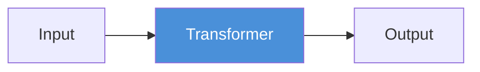
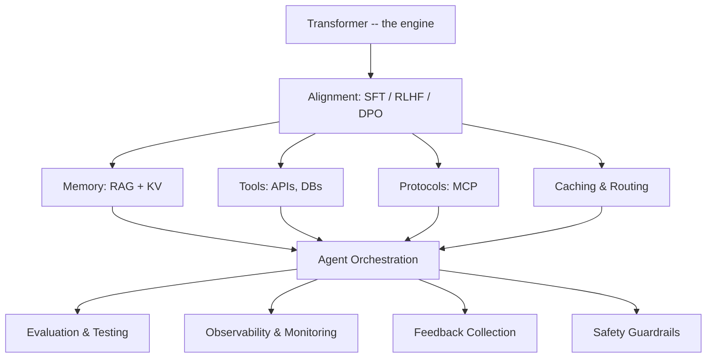
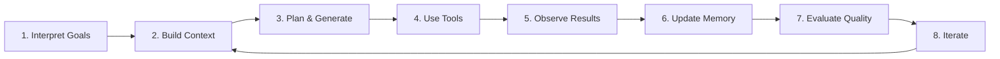
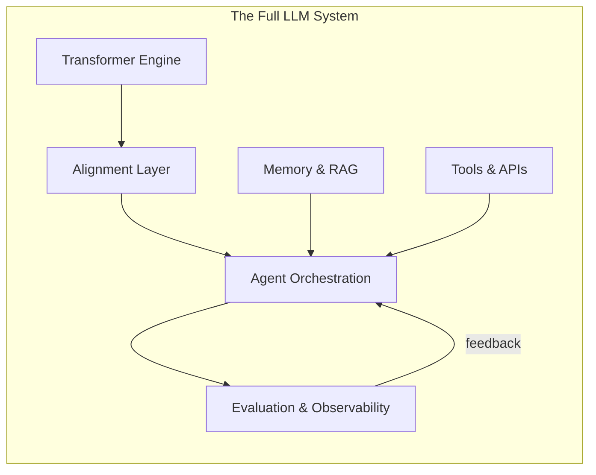

<!-- _class: lead -->

# From Transformer to System
## Why the Model Is Just the Beginning

**Module 00 -- AI Engineer Mindset**

<!-- Speaker notes: This is the opening deck of the entire course. The core argument: the Transformer is the engine, but production LLM applications require a full system around it. By the end of this deck, learners should understand the gap between a model and a system, and why the rest of the course exists. -->

---

## In Brief

The Transformer architecture is a breakthrough in sequence modeling, but it is only the **engine** of a modern LLM system.

Production applications require alignment, memory, tools, protocols, and evaluation -- the model alone is insufficient.

> **The Transformer gives you text generation. A system gives you reliable task completion.**

<!-- Speaker notes: This is the thesis of the entire course. Most tutorials teach you to call an API and print the response. This course teaches you to build systems that reliably complete tasks. The difference is the difference between a demo and a product. -->

---

## The Reality of Production LLMs

When you fine-tune a model, ship a chatbot, or connect it to a database, your "LLM project" becomes a messy systems problem:

- Hallucinations that look confident
- Knowledge that is stale the moment you deploy
- Tool failures that cascade
- Security boundaries that get crossed
- Latency budgets that get blown
- Memory that bloats
- Users who judge you by one bad answer

<!-- Speaker notes: Read these out loud for impact. Each bullet point is a module in this course. Hallucinations -> evaluation (Module 07). Stale knowledge -> RAG (Module 03). Tool failures -> tool use (Module 04). Security -> alignment (Module 02). Latency -> efficiency (Module 06). Memory -> memory systems (Module 03). User trust -> production engineering (Module 08). -->

---

## What Most People Think



> "If you scale it big enough, intelligence happens"

<!-- Speaker notes: This is the naive view. Input goes in, magic happens, output comes out. The "just scale it" mentality dominated 2022-2023 but has been replaced by systems thinking. The model is necessary but not sufficient. Even GPT-4 hallucinates, cannot access current data, and cannot take actions in the world without a system around it. -->

---

## What Actually Works



<!-- Speaker notes: This is the full system. The Transformer is one box at the top. Everything else is what makes it work in production. Alignment makes it behave correctly. Memory gives it knowledge. Tools let it act. Protocols standardize interfaces. The agent orchestrator coordinates everything. And then evaluation, observability, feedback, and safety ensure it stays reliable. This diagram is the roadmap for the entire course. -->

---

<!-- _class: lead -->

# The Three Structural Limitations

<!-- Speaker notes: Three fundamental limitations of the Transformer that no amount of scaling can fix. Each limitation motivates a major component of the system: RAG, memory management, and grounding. -->

---

## Limitation 1: Knowledge in Weights Is Hard to Update

| Aspect | Detail |
|--------|--------|
| **Problem** | The model "knows" things by storing patterns in weights. Updating requires expensive retraining. |
| **Example** | Model trained in 2024 does not know 2025 events. |
| **Solution** | **RAG** -- retrieve current information at inference time. The model reads documents, not remembers them. |

<!-- Speaker notes: This is the freshness problem. A model trained on data through March 2024 cannot answer questions about events after that date. Retraining costs millions of dollars and takes weeks. RAG solves this by retrieving current documents at query time -- the model reads fresh information rather than relying on stale weights. Module 03 covers RAG in depth. -->

---

## Limitation 2: Context Windows Are Limited

| Aspect | Detail |
|--------|--------|
| **Problem** | Even "long context" models have finite windows. Cannot fit entire databases into a prompt. |
| **Example** | GPT-4 Turbo: 128k tokens (~100 pages). Your enterprise docs: 10,000+ pages. |
| **Solution** | **Memory management** -- hierarchical storage, intelligent retrieval, summarization. |

<!-- Speaker notes: 128K tokens sounds like a lot, but enterprise knowledge bases are orders of magnitude larger. And even within the context window, attention quality degrades for information in the middle (the "lost in the middle" problem). Memory management -- retrieving only the relevant information and managing what fits in context -- is essential. Module 03 covers the memory taxonomy. -->

---

## Limitation 3: Generation Can Be Confidently Wrong

| Aspect | Detail |
|--------|--------|
| **Problem** | Models output probability distributions over tokens. High confidence does not equal correctness. |
| **Example** | "The capital of Australia is Sydney" (confident, wrong). |
| **Solution** | **Grounding** -- retrieve facts, verify with tools, evaluate outputs, maintain uncertainty. |

<!-- Speaker notes: This is the hallucination problem. The model generates the most probable next token, and sometimes the most probable token is wrong. There is no internal "I am not sure" signal. The solution is grounding: use RAG to provide factual context, use tools to verify claims, and use evaluation to catch errors before they reach the user. Modules 03, 04, and 07 address grounding from different angles. -->

---

## System Properties: Model-Only vs Full System

| Property | Model-Only | Full System |
|----------|------------|-------------|
| **Freshness** | Frozen at training | Updated via retrieval |
| **Traceability** | Black box | Cites sources |
| **Reliability** | Best guess | Verified outputs |
| **Efficiency** | Fixed cost | Cached, routed, optimized |
| **Safety** | Pre-trained guardrails | Multi-layer protection |
| **Improvement** | Requires retraining | Feedback flywheel |

<!-- Speaker notes: This table summarizes the argument. For each property, the full system is strictly better. Freshness: RAG vs frozen weights. Traceability: source citations vs black box. Reliability: evaluation vs hope. Efficiency: caching and routing vs brute force. Safety: multi-layer guardrails vs single-layer. Improvement: continuous feedback vs expensive retraining. This is why we build systems. -->

---

<!-- _class: lead -->

# Code: Model vs System

<!-- Speaker notes: Let's make the abstract concrete. Two code examples that show the difference between a model-only approach and a system approach. -->

---

## Model-Only Approach (Fragile)

```python
# This is what most tutorials show
response = client.messages.create(
    model="claude-sonnet-4-20250514",
    messages=[{"role": "user", "content": user_question}]
)
print(response.content[0].text)
# Hope it's correct!
```

No retrieval, no verification, no memory, no logging.

<!-- Speaker notes: Three lines of code. Looks clean. Works in demos. Fails in production. No retrieval means stale or wrong knowledge. No verification means hallucinations go uncaught. No memory means every conversation starts from scratch. No logging means you cannot debug when things go wrong. This is the "hello world" of LLM applications, not the production version. -->

---

## System Approach (Robust)

```python
class LLMSystem:
    def __init__(self):
        self.retriever = VectorRetriever(documents)
        self.memory = ConversationMemory()
        self.tools = ToolRegistry()
        self.evaluator = ResponseEvaluator()

    def answer(self, goal: str) -> str:
        context = self.build_context(goal)
        response = self.generate(goal, context)

        if not self.evaluator.is_valid(response):
            response = self.retry_with_tools(goal)

        self.memory.store(goal, response)
        self.log_interaction(goal, response)
        return response
```

<!-- Speaker notes: Same task, but now with retrieval (VectorRetriever), memory (ConversationMemory), tools (ToolRegistry), and evaluation (ResponseEvaluator). If the evaluator rejects the response, the system retries with tools for grounding. Every interaction is stored in memory and logged. This is what production looks like. It is more code, but each line prevents a class of failures. -->

---

## The AI Engineer's Job Description



> **Whoever runs this loop faster and cleaner wins.**

<!-- Speaker notes: This is the closed loop that the next deck covers in detail. The AI engineer's job is to build and optimize this loop. Each step is a module in this course. The quote is the course's competitive thesis: the engineers who build better loops -- faster retrieval, better tools, smarter evaluation -- will build better products. -->

---

<!-- _class: lead -->

# Common Pitfalls

<!-- Speaker notes: Three pitfalls that beginners fall into when they start building LLM applications. Each one comes from underestimating the gap between model and system. -->

---

## Pitfall 1: Over-relying on Prompt Engineering

> "If I just write a better prompt..."

**Reality:** Prompts cannot fix missing knowledge, tool failures, or fundamental capability gaps. They are one lever, not magic.

<!-- Speaker notes: Prompt engineering is important but overrated. If the model does not have the information it needs, no prompt will help. If the model needs to call an API, no prompt will make it do so without tool use infrastructure. Prompt engineering optimizes the last mile; systems engineering builds the road. -->

---

## Pitfall 2: Ignoring Evaluation

> "It seems to work in my tests..."

**Reality:** Anecdotal testing misses edge cases, regressions, and distribution shift. You need systematic evaluation.

<!-- Speaker notes: The most common failure mode in production LLM applications: it worked in the demo, so we shipped it. Then users found the edge cases. Systematic evaluation with diverse test sets catches issues before users do. Module 07 covers evaluation in depth. -->

---

## Pitfall 3: Underestimating Memory

> "I'll just use a long context window..."

**Reality:** Long context is expensive and does not scale. You need hierarchical memory with intelligent retrieval.

<!-- Speaker notes: Long context windows cost proportionally more in both latency and dollars. A 128K token prompt is 32x more expensive than a 4K prompt. And attention quality degrades with length. Hierarchical memory -- putting the right information in the right place (context, RAG, long-term store) -- is both cheaper and more effective. Module 03 covers the memory taxonomy. -->

---

## Connections & Practice

**Builds on:** Basic understanding of neural networks and APIs

**Leads to:** Every other module in this course -- each addresses a component of the system

### Practice Problems

1. List three ways a "model-only" chatbot would fail in customer support that a full system could handle.
2. Take a simple prompt-response script and identify where you would add: (a) retrieval, (b) tool use, (c) evaluation.
3. Sketch the components for an LLM system that helps users book restaurant reservations.

<!-- Speaker notes: Problem 1 tests understanding of the model-system gap: (a) stale product info without RAG, (b) cannot check order status without tools, (c) gives wrong policy info without evaluation. Problem 2 applies the framework to existing code. Problem 3 is a design exercise that previews the closed-loop architecture from the next deck. -->

---

## Visual Summary



> The model is the engine. The system is the car.

<!-- Speaker notes: The closing metaphor: the Transformer is the engine, but you cannot drive an engine. You need a chassis (alignment), fuel system (memory), steering (tools), dashboard (evaluation), and a driver (agent orchestration). This course teaches you to build the car. -->
