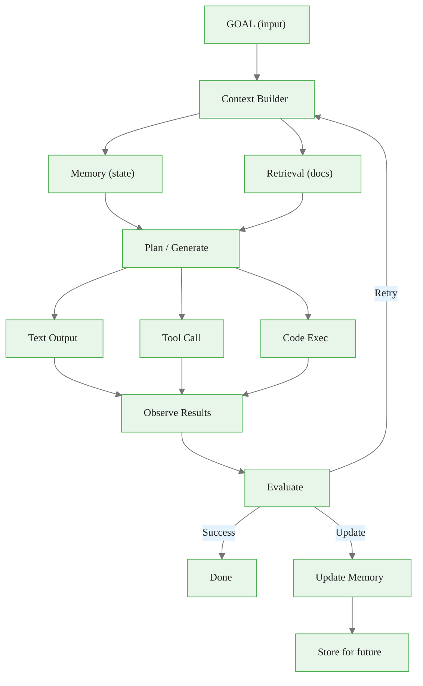

# The Closed Loop: The Mental Model for Modern AI Engineering

> **Reading time:** ~15 min | **Module:** 0 — AI Engineer Mindset | **Prerequisites:** 01 From Transformer to System

<span class="badge mint">Beginner</span> <span class="badge amber">~15 min</span> <span class="badge blue">Module 0</span>

## Introduction

The closed loop is the core mental model for building production LLM systems. It describes how an AI system receives goals, builds context, generates plans, takes actions, observes results, updates memory, and evaluates progress — repeatedly until the goal is achieved.

<div class="callout-insight">

<strong>Key Insight:</strong> A chatbot answers questions. A system achieves goals. The difference is the loop: generating, observing, learning, improving, generating again.

</div>

<div class="callout-key">

**Key Concept Summary:** The closed loop transforms stateless text generation into stateful goal achievement through seven stages: goal interpretation, context building, planning/generation, action execution, result observation, evaluation, and memory update. Loops can be nested, run in parallel, and must always be bounded. The loop pattern is the unifying architecture behind every production LLM system.

</div>

## Visual Explanation



<div class="caption">Figure 1: The seven-stage closed loop — the core pattern for all production LLM systems.</div>

## The Seven Stages

### Stage 1: Goal Interpretation


<span class="filename">goal_interpretation.txt</span>
</div>
<div class="code-body">

<div class="code-window">
<div class="code-header">
<div class="dots"><span class="dot-red"></span><span class="dot-yellow"></span><span class="dot-green"></span></div>

```
Input:  "Book me a table for 4 at an Italian restaurant tomorrow at 7pm"

What the system must understand:
- Task type: Reservation booking
- Constraints: 4 people, Italian cuisine, tomorrow, 7pm
- Success criteria: Confirmed reservation
- Implicit: User's location, preferences, budget
```

</div>
</div>

<div class="callout-info">

<strong>Info:</strong> Parse natural language into structured intent. The gap between what the user says and what the system needs to know is where goal interpretation happens.

</div>

### Stage 2: Context Building


<span class="filename">context_builder.py</span>
</div>
<div class="code-body">

<div class="code-window">
<div class="code-header">
<div class="dots"><span class="dot-red"></span><span class="dot-yellow"></span><span class="dot-green"></span></div>

```python
def build_context(goal, memory, retriever):
    """Assemble everything the model needs to know."""
    context = {
        # From memory
        "user_preferences": memory.get("user_preferences"),
        "past_bookings": memory.get("recent_restaurants"),
        "conversation_history": memory.get("current_session"),

        # From retrieval
        "relevant_restaurants": retriever.search(
            "Italian restaurants near user",
            filters={"rating": ">4", "accepts_reservations": True}
        ),

        # From tools
        "availability": check_availability(
            restaurants=relevant_restaurants,
            date="tomorrow",
            time="7pm",
            party_size=4
        )
    }
    return context
```

</div>
</div>

**Key capability:** Combine memory, retrieval, and real-time data.

### Stage 3: Plan / Generate

The model uses context to decide what to do:

<div class="flow">
  <div class="flow-step mint">Option A: Enough info — Respond</div>
  <div class="flow-step amber">Option B: Need more info — Ask</div>
  <div class="flow-step blue">Option C: Need data — Use tools</div>
  <div class="flow-step lavender">Option D: Complex — Subtask</div>
</div>

**ReAct Pattern Example:**


<span class="filename">react_trace.txt</span>
</div>
<div class="code-body">

<div class="code-window">
<div class="code-header">
<div class="dots"><span class="dot-red"></span><span class="dot-yellow"></span><span class="dot-green"></span></div>

```
Thought: I need to find Italian restaurants with availability tomorrow at 7pm.
Action: search_restaurants(cuisine="Italian", date="2024-12-21", time="19:00", party=4)
Observation: Found 3 restaurants: Bella Italia, Trattoria Roma, Casa Napoli
Thought: I should check the user's past preferences.
Action: get_user_preferences(category="restaurants")
Observation: User prefers quiet ambiance, visited Trattoria Roma before (rated 5 stars)
Thought: Trattoria Roma matches preferences and has availability.
Action: make_reservation(restaurant="Trattoria Roma", date="2024-12-21", time="19:00", party=4)
Observation: Reservation confirmed. Confirmation #TR-78234
Thought: Task complete. I'll summarize for the user.
```

</div>
</div>

### Stage 4: Act (Execute Tools)


<span class="filename">tool_executor.py</span>
</div>
<div class="code-body">

<div class="code-window">
<div class="code-header">
<div class="dots"><span class="dot-red"></span><span class="dot-yellow"></span><span class="dot-green"></span></div>

```python
class ToolExecutor:
    def execute(self, action: ToolCall) -> ToolResult:
        if not self.is_valid(action):
            return ToolResult(error="Invalid parameters")
        try:
            result = self.tools[action.name].run(
                **action.parameters, timeout=30
            )
            return ToolResult(success=True, data=result)
        except TimeoutError:
            return ToolResult(error="Tool timed out", retry=True)
        except ToolError as e:
            return ToolResult(error=str(e), retry=e.is_retryable)
```

</div>
</div>

<div class="callout-warning">

<strong>Warning:</strong> Always wrap tool execution in error handling. A single unhandled tool failure can crash the entire agent loop.

</div>

### Stage 5: Observe Results


<span class="filename">observer.py</span>
</div>
<div class="code-body">

<div class="code-window">
<div class="code-header">
<div class="dots"><span class="dot-red"></span><span class="dot-yellow"></span><span class="dot-green"></span></div>

```python
def observe(action_result, expected_outcome):
    """Process the result of an action."""
    observation = {
        "success": action_result.success,
        "data": action_result.data,
        "matches_expectation": validate(action_result, expected_outcome),
        "side_effects": detect_side_effects(action_result),
        "next_steps": infer_next_steps(action_result)
    }
    return observation
```

</div>
</div>

### Stage 6: Evaluate


<span class="filename">evaluator.py</span>
</div>
<div class="code-body">

<div class="code-window">
<div class="code-header">
<div class="dots"><span class="dot-red"></span><span class="dot-yellow"></span><span class="dot-green"></span></div>

```python
def evaluate(goal, observations, constraints):
    """Determine if we've succeeded and what to do next."""
    if goal_achieved(goal, observations):
        return Decision(status="complete", confidence=0.95)
    if unrecoverable_error(observations):
        return Decision(status="failed", reason=observations.error)
    if making_progress(observations):
        return Decision(status="continue", next_action=plan_next_step())
    return Decision(status="retry", strategy="alternative_approach")
```

</div>
</div>

### Stage 7: Update Memory


<span class="filename">memory_update.py</span>
</div>
<div class="code-body">

<div class="code-window">
<div class="code-header">
<div class="dots"><span class="dot-red"></span><span class="dot-yellow"></span><span class="dot-green"></span></div>

```python
def update_memory(memory, interaction):
    """Store useful information for future interactions."""
    # Short-term: Current conversation
    memory.conversation.append(interaction)

    # Working memory: Task-relevant state
    if interaction.has_useful_facts:
        memory.working.update(interaction.extracted_facts)

    # Long-term: Persistent knowledge
    if interaction.is_significant:
        memory.long_term.store(
            content=interaction.summary,
            embedding=embed(interaction),
            metadata={"timestamp": now(), "type": interaction.type}
        )

    # Decay: Remove stale information
    memory.decay_old_entries(threshold=0.3)
```

</div>
</div>

## Loop Characteristics

### Loops Can Be Nested

```
Outer loop: Complete user's project (hours/days)
  +-- Inner loop: Complete current task (minutes)
        +-- Micro loop: Execute tool call (seconds)
```

### Loops Can Run in Parallel

```
Main agent: Coordinate overall task
  +-- Research agent: Gather information
  +-- Execution agent: Take actions
  +-- Verification agent: Check results
```

### Loops Must Be Bounded


<span class="filename">bounded_loop.py</span>
</div>
<div class="code-body">

<div class="code-window">
<div class="code-header">
<div class="dots"><span class="dot-red"></span><span class="dot-yellow"></span><span class="dot-green"></span></div>

```python
MAX_ITERATIONS = 10
TIMEOUT_SECONDS = 300

for iteration in range(MAX_ITERATIONS):
    if time_elapsed > TIMEOUT_SECONDS:
        return graceful_failure("Timeout reached")

    result = run_one_iteration()

    if result.is_complete:
        return result

    if result.is_stuck:
        try_alternative_approach()

return graceful_failure("Max iterations reached")
```

</div>
</div>

<div class="callout-danger">

<strong>Danger:</strong> An unbounded loop is a production incident waiting to happen. Always set max_iterations, timeout, and cost limits.

</div>

## The Closed-Loop Advantage

<div class="compare">
  <div class="compare-card">
    <div class="header before">Open Loop (Chatbot)</div>
    <div class="body">
      One-shot generation. Hopes for correctness. Forgets immediately. Fails silently. Static behavior.
    </div>
  </div>
  <div class="compare-card">
    <div class="header after">Closed Loop (System)</div>
    <div class="body">
      Iterative refinement. Verifies results. Learns from interactions. Detects and recovers. Improves over time.
    </div>
  </div>
</div>

## Common Pitfalls

<div class="callout-danger">

<strong>Pitfall 1 — Infinite Loops:</strong> Agent keeps trying the same failing approach. Track attempted strategies and force alternatives after N failures.

</div>

<div class="callout-warning">

<strong>Pitfall 2 — Goal Drift:</strong> Agent solves a different problem than requested. Periodically re-check alignment with the original goal.

</div>

<div class="callout-warning">

<strong>Pitfall 3 — Memory Bloat:</strong> Storing everything fills context and slows retrieval. Use selective storage, summarization, and decay policies.

</div>

## Implementation Skeleton


<span class="filename">closed_loop_agent.py</span>
</div>
<div class="code-body">

<div class="code-window">
<div class="code-header">
<div class="dots"><span class="dot-red"></span><span class="dot-yellow"></span><span class="dot-green"></span></div>

```python
class ClosedLoopAgent:
    def __init__(self):
        self.model = LLM()
        self.memory = MemoryManager()
        self.tools = ToolRegistry()
        self.evaluator = Evaluator()

    def run(self, goal: str, max_iterations: int = 10) -> Result:
        for i in range(max_iterations):
            context = self.build_context(goal)
            action = self.model.generate(goal, context)

            if action.type == "tool_call":
                result = self.tools.execute(action)
            else:
                result = action.text

            observation = self.observe(result)
            evaluation = self.evaluator.evaluate(goal, observation)
            self.memory.update(goal, action, observation)

            if evaluation.is_complete:
                return Result(success=True, output=result)
            if evaluation.is_failed:
                return Result(success=False, error=evaluation.reason)

        return Result(success=False, error="Max iterations reached")
```

</div>
</div>

## Practice Questions

1. **Trace a loop:** Given the goal "Find the weather in Tokyo and send it to my email," trace through all 7 stages of the loop.

2. **Design evaluation:** What criteria would you use to evaluate if an agent successfully "summarized a research paper"?

3. **Handle failure:** An agent is trying to book a flight but the API keeps timing out. Design the retry and escalation logic.

## Cross-References

<a class="link-card" href="./02_the_closed_loop_slides.md">
  <div class="link-card-title">Companion Slides — The Closed Loop</div>
  <div class="link-card-description">Slide deck with diagrams and worked examples of the closed-loop pattern.</div>
</a>

<a class="link-card" href="./01_from_transformer_to_system.md">
  <div class="link-card-title">Previous Guide — From Transformer to System</div>
  <div class="link-card-description">Why the model is just the beginning and the full system stack overview.</div>
</a>

<a class="link-card" href="./03_three_tracks.md">
  <div class="link-card-title">Next Guide — Three Tracks of AI Engineering</div>
  <div class="link-card-description">The three complementary tracks: Model Core, Alignment, and Agent Systems.</div>
</a>

## Further Reading

- [ReAct: Synergizing Reasoning and Acting](https://arxiv.org/abs/2210.03629)
- [MemGPT: Towards LLMs as Operating Systems](https://arxiv.org/abs/2310.08560)
- Module 04 for detailed tool use patterns
