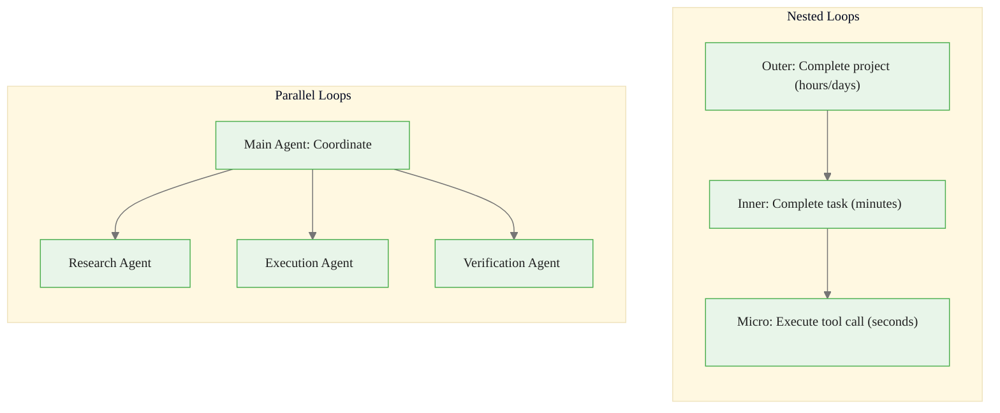
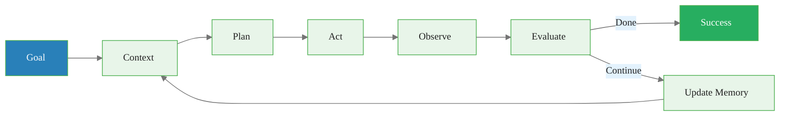

<!-- _class: lead -->

# The Closed Loop -- Part 2
## Implementation Patterns & Pitfalls

**Module 00 -- AI Engineer Mindset**

<!-- Speaker notes: This is Part 2 of the Closed Loop deck. Part 1 covered the seven stages with the restaurant booking example. Part 2 covers how loops operate in practice: nesting, parallelism, bounding, and common failure modes. -->

---

## Loop Characteristics



<!-- Speaker notes: Real systems use nested and parallel loops. The restaurant booking is a single inner loop. A travel planning agent might have an outer loop (plan trip) with inner loops (book flight, book hotel, book restaurant). Parallel loops let multiple agents work simultaneously -- one researches restaurants while another checks the user's calendar. -->

---

## Loops Must Be Bounded

```python
MAX_ITERATIONS = 10
TIMEOUT_SECONDS = 300

for iteration in range(MAX_ITERATIONS):
    if time_elapsed > TIMEOUT_SECONDS:
        return graceful_failure("Timeout reached")

    result = run_one_iteration()

    if result.is_complete:
        return result

    if result.is_stuck:
        try_alternative_approach()

return graceful_failure("Max iterations reached")
```

<!-- Speaker notes: Unbounded loops are the number one production failure for agents. Always set max iterations and timeouts. The "graceful failure" is important -- don't just crash, tell the user what happened and what they can do. For our restaurant example: after 10 failed booking attempts, say "I couldn't find availability. Would you like to try a different cuisine or date?" -->

---

## Open Loop vs Closed Loop

| Open Loop (Chatbot) | Closed Loop (System) |
|---------------------|----------------------|
| One-shot generation | Iterative refinement |
| Hopes for correctness | Verifies results |
| Forgets immediately | Learns from interactions |
| Fails silently | Detects and recovers |
| Static behavior | Improves over time |

<!-- Speaker notes: This table is the core argument of the entire course. Most tutorials teach you to build open-loop chatbots. This course teaches closed-loop systems. The difference in reliability and user experience is dramatic. A chatbot says "I booked your table" without checking. A system confirms the booking went through, stores the confirmation number, and follows up if there's an issue. -->

---

<!-- _class: lead -->

# Common Pitfalls

<!-- Speaker notes: Three classic failure modes that every agent developer encounters. Understanding these upfront saves weeks of debugging. -->

---

## Pitfall 1: Infinite Loops

**Problem:** Agent keeps trying the same failing approach.

**Solution:** Track attempted strategies, force alternatives after N failures.

## Pitfall 2: Goal Drift

**Problem:** Agent solves a different problem than requested.

**Solution:** Periodically re-check alignment with original goal.

## Pitfall 3: Memory Bloat

**Problem:** Storing everything fills context and slows retrieval.

**Solution:** Selective storage, summarization, decay policies.

<!-- Speaker notes: Infinite loops: if the restaurant API keeps timing out, the agent should try a different API or ask the user for help -- not retry the same call 100 times. Goal drift: while booking a restaurant, the agent starts researching Italian cuisine history. Memory bloat: storing every API response verbatim instead of extracting just the relevant fields. -->

---

## Implementation Skeleton

```python
class ClosedLoopAgent:
    def __init__(self):
        self.model = LLM()
        self.memory = MemoryManager()
        self.tools = ToolRegistry()
        self.evaluator = Evaluator()

    def run(self, goal: str, max_iterations: int = 10) -> Result:
        for i in range(max_iterations):
            context = self.build_context(goal)
            action = self.model.generate(goal, context)
            if action.type == "tool_call":
                result = self.tools.execute(action)
            else:
                result = action.text
            observation = self.observe(result)
            evaluation = self.evaluator.evaluate(goal, observation)
            self.memory.update(goal, action, observation)
            if evaluation.is_complete:
                return Result(success=True, output=result)
            if evaluation.is_failed:
                return Result(success=False, error=evaluation.reason)
        return Result(success=False, error="Max iterations reached")
```

<!-- Speaker notes: This is the minimal production agent skeleton. Note four components: model, memory, tools, evaluator. The run method implements all seven stages in a bounded loop. You can copy this and customize for your use case. The key additions for production: logging, token tracking, cost limits, and graceful degradation. -->

---

## Connections & Practice

**Builds on:** Understanding that LLMs are systems, not just models

**Leads to:** Memory systems (Module 03), Tool use (Module 04), Evaluation (Module 07)

### Practice Problems

1. Given "Find weather in Tokyo and email it to me," trace all 7 stages.
2. What criteria would evaluate if an agent successfully "summarized a research paper"?
3. An agent's flight-booking API keeps timing out. Design retry and escalation logic.

<!-- Speaker notes: Problem 1 tests understanding of all seven stages with a concrete example. Problem 2 tests evaluation design -- what does "success" mean for a subjective task? Problem 3 tests resilience engineering -- the agent must handle failures gracefully. -->

---

## Visual Summary



> The closed loop is the fundamental architecture of every AI agent.

<!-- Speaker notes: Recap of the full loop. The key message for this Part 2: loops must be bounded, nested loops handle complexity, parallel loops handle throughput, and the three classic pitfalls (infinite loops, goal drift, memory bloat) are preventable with good engineering. -->
