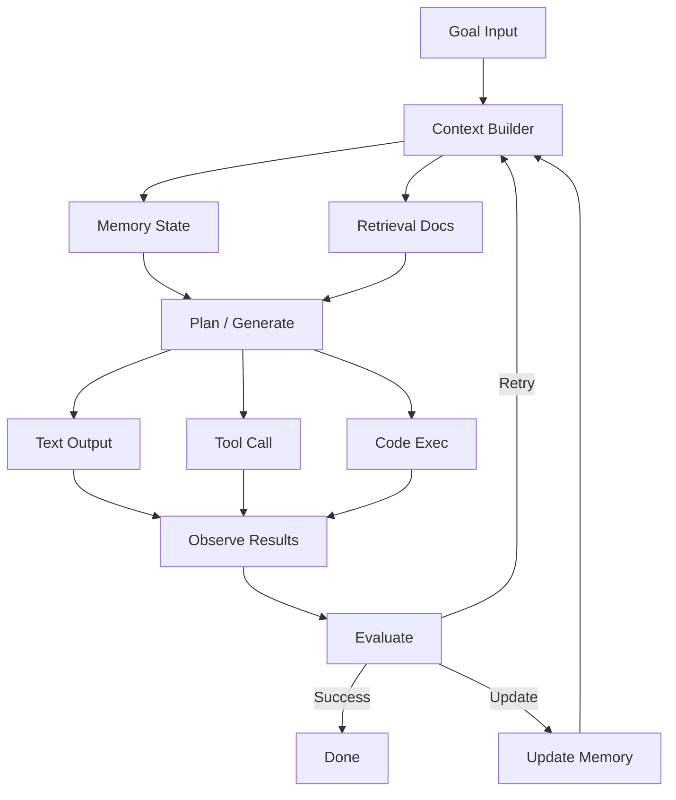
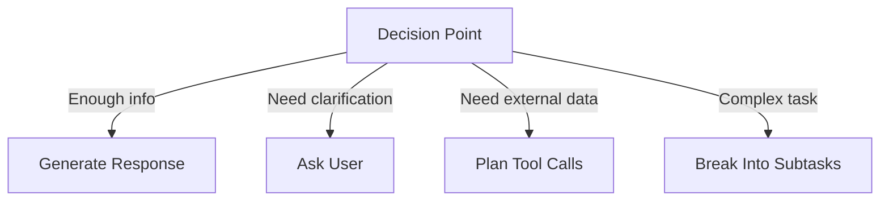
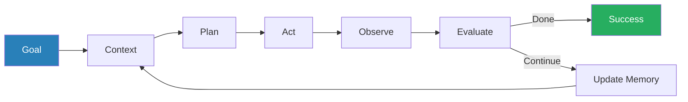

<!-- _class: lead -->

# The Closed Loop -- Part 1
## The Seven Stages of AI Systems

**Module 00 -- AI Engineer Mindset**

<!-- Speaker notes: This is Part 1 of the Closed Loop deck. It covers the core mental model and all seven stages using the restaurant booking example throughout. Part 2 covers implementation patterns and pitfalls. -->

---

## In Brief

The closed loop is the core mental model for building production LLM systems.

It describes how an AI system receives goals, builds context, generates plans, takes actions, observes results, updates memory, and evaluates progress -- **repeatedly until the goal is achieved**.

> **A chatbot answers questions. A system achieves goals.**

<!-- Speaker notes: This is the single most important concept in the course. Everything else -- memory, tools, evaluation -- is a component of this loop. The key distinction is between one-shot generation (chatbot) and iterative goal achievement (system). -->

---

## The Seven Stages



<!-- Speaker notes: Walk through each node. The key insight is that the loop feeds back -- observation leads to evaluation which can trigger another iteration. This is what makes it "closed." We will trace the restaurant booking example through all seven stages. -->

---

<!-- _class: lead -->

# Stage 1: Goal Interpretation

<!-- Speaker notes: Stage 1 is about parsing natural language into structured intent. The system must extract not just what the user said, but what they meant -- including implicit constraints. -->

---

## Parsing Natural Language Into Structured Intent

```
Input:  "Book me a table for 4 at an Italian restaurant
         tomorrow at 7pm"

What the system must understand:
- Task type:       Reservation booking
- Constraints:     4 people, Italian cuisine, tomorrow, 7pm
- Success criteria: Confirmed reservation
- Implicit:        User's location, preferences, budget
```

**Key capability:** Parse natural language into structured intent.

<!-- Speaker notes: Notice the implicit requirements -- the user did not say "near me" or "within my budget" but a good system infers these. This is where the system prompt and user profile come in. The structured intent becomes the goal that drives the rest of the loop. -->

---

<!-- _class: lead -->

# Stage 2: Context Building

<!-- Speaker notes: Stage 2 assembles everything the model needs to make a good decision. This is where memory and retrieval come together. -->

---

## Assembling Everything the Model Needs

```python
def build_context(goal, memory, retriever):
    """Assemble everything the model needs to know."""
    context = {
        # From memory
        "user_preferences": memory.get("user_preferences"),
        "past_bookings": memory.get("recent_restaurants"),
        "conversation_history": memory.get("current_session"),
        # From retrieval
        "relevant_restaurants": retriever.search(
            "Italian restaurants near user",
            filters={"rating": ">4", "accepts_reservations": True}
        ),
        # From tools
        "availability": check_availability(
            restaurants=relevant_restaurants,
            date="tomorrow", time="7pm", party_size=4
        )
    }
    return context
```

**Key capability:** Combine memory, retrieval, and real-time data.

<!-- Speaker notes: Three sources of context: (1) memory -- what we already know about the user, (2) retrieval -- external knowledge fetched by relevance, (3) tools -- real-time data from APIs. The quality of this context directly determines the quality of the plan. -->

---

<!-- _class: lead -->

# Stage 3: Plan / Generate

<!-- Speaker notes: Stage 3 is where the LLM decides what to do. It can respond, ask for clarification, call tools, or break the task into subtasks. The ReAct pattern is the most common implementation. -->

---

## The Model Decides What to Do



<!-- Speaker notes: This decision point is what makes agents different from simple chatbots. The model evaluates whether it has enough information to act, or whether it needs more context first. In our restaurant example, the model needs to search for restaurants and check availability before it can book. -->

---

## ReAct Pattern: Restaurant Booking Traced

```
Thought:  I need to find Italian restaurants with
          availability tomorrow at 7pm.
Action:   search_restaurants(cuisine="Italian",
          date="2024-12-21", time="19:00", party=4)
Observation: Found 3 restaurants with availability

Thought:  I should check the user's past preferences.
Action:   get_user_preferences(category="restaurants")
Observation: User prefers quiet ambiance,
             visited Trattoria Roma before (rated 5 stars)

Thought:  Trattoria Roma matches. I'll book it.
Action:   make_reservation(restaurant="Trattoria Roma", ...)
Observation: Confirmed. #TR-78234
```

<!-- Speaker notes: This is the ReAct pattern in action -- Thought, Action, Observation repeated. Notice how the agent uses multiple tool calls, combines information from different sources, and makes a decision based on user preferences. This trace shows 3 iterations of the inner loop. -->

---

<!-- _class: lead -->

# Stage 4: Act (Execute Tools)

<!-- Speaker notes: Stage 4 is about reliable tool execution. The key is error handling -- tools fail, time out, and return unexpected results. A production system must handle all of these gracefully. -->

---

## Reliable Tool Execution

```python
class ToolExecutor:
    def execute(self, action: ToolCall) -> ToolResult:
        if not self.is_valid(action):
            return ToolResult(error="Invalid parameters")

        try:
            result = self.tools[action.name].run(
                **action.parameters, timeout=30
            )
            return ToolResult(success=True, data=result)

        except TimeoutError:
            return ToolResult(error="Tool timed out", retry=True)

        except ToolError as e:
            return ToolResult(error=str(e), retry=e.is_retryable)
```

**Key capability:** Reliable tool execution with error handling.

<!-- Speaker notes: Three important patterns here: (1) parameter validation before execution, (2) timeout to prevent hanging, (3) retryable vs non-retryable error distinction. In our restaurant example, if the booking API times out, we retry. If the restaurant is full, we try the next option. -->

---

<!-- _class: lead -->

# Stage 5: Observe Results

<!-- Speaker notes: Stage 5 processes what happened after an action. The system must determine not just whether the action succeeded, but whether the result moves us closer to the goal. -->

---

## Processing Action Outcomes

```python
def observe(action_result, expected_outcome):
    """Process the result of an action."""
    observation = {
        "success": action_result.success,
        "data": action_result.data,
        "matches_expectation": validate(
            action_result, expected_outcome
        ),
        "side_effects": detect_side_effects(action_result),
        "next_steps": infer_next_steps(action_result)
    }
    return observation
```

**Key capability:** Interpret results and detect anomalies.

<!-- Speaker notes: The observation is richer than a simple success/failure. It checks whether the result matches what we expected, detects side effects (e.g., the restaurant sent a confirmation email), and infers what to do next. For our booking, the observation includes the confirmation number and any special instructions. -->

---

<!-- _class: lead -->

# Stage 6: Evaluate

<!-- Speaker notes: Stage 6 is the decision point -- are we done, should we continue, or have we failed? This is what closes the loop. Without evaluation, the agent just executes actions blindly. -->

---

## Determining Success and Next Move

```python
def evaluate(goal, observations, constraints):
    if goal_achieved(goal, observations):
        return Decision(status="complete", confidence=0.95)

    if unrecoverable_error(observations):
        return Decision(status="failed",
                       reason=observations.error)

    if making_progress(observations):
        return Decision(status="continue",
                       next_action=plan_next_step())

    # Stuck -- need different approach
    return Decision(status="retry",
                   strategy="alternative_approach")
```

<!-- Speaker notes: Four possible outcomes: complete, failed, continue, or retry with alternative. For the restaurant booking, "complete" means we have a confirmed reservation. "Failed" means all restaurants are full. "Continue" means we found restaurants but haven't booked yet. "Retry" means our preferred restaurant was full so we try the next one. -->

---

<!-- _class: lead -->

# Stage 7: Update Memory

<!-- Speaker notes: Stage 7 selectively stores information for future use. Not everything goes into memory -- the system must decide what is worth keeping. This is the bridge between individual interactions and long-term learning. -->

---

## Selective Storage for Future Interactions

```python
def update_memory(memory, interaction):
    # Short-term: Current conversation
    memory.conversation.append(interaction)

    # Working memory: Task-relevant state
    if interaction.has_useful_facts:
        memory.working.update(interaction.extracted_facts)

    # Long-term: Persistent knowledge
    if interaction.is_significant:
        memory.long_term.store(
            content=interaction.summary,
            embedding=embed(interaction),
            metadata={"timestamp": now(),
                      "type": interaction.type}
        )

    # Decay: Remove stale information
    memory.decay_old_entries(threshold=0.3)
```

<!-- Speaker notes: Three layers of memory: (1) short-term for current conversation, (2) working memory for task-relevant facts, (3) long-term for persistent knowledge. For our restaurant booking, we store: the user likes Trattoria Roma (long-term), the reservation details (working), and the full conversation (short-term). We also decay old restaurant memories that are no longer relevant. -->

---

## Visual Summary



> The closed loop is the fundamental architecture of every AI agent. Continue to Part 2 for implementation patterns.

<!-- Speaker notes: This visual summary shows the complete loop. The key takeaway is that the loop is closed -- evaluation feeds back into context building, and memory persists across iterations. Part 2 covers how to implement this in practice, including loop characteristics, bounding strategies, and common pitfalls. -->
