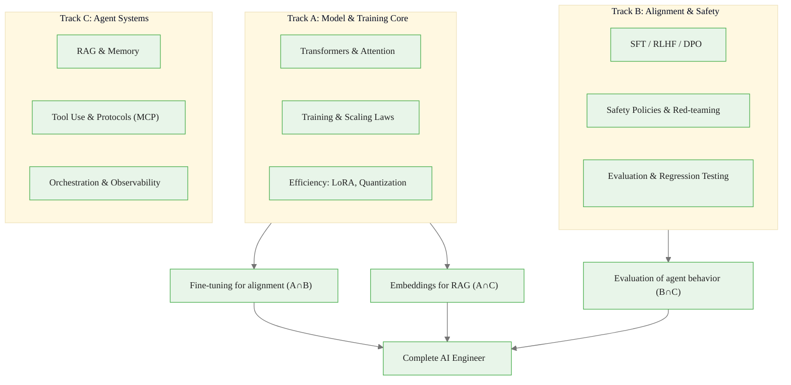

# Three Tracks of AI Engineering

> **Reading time:** ~15 min | **Module:** 0 — AI Engineer Mindset | **Prerequisites:** 02 The Closed Loop

<span class="badge mint">Beginner</span> <span class="badge amber">~15 min</span> <span class="badge blue">Module 0</span>

## Introduction

AI Engineering divides into three complementary tracks: Model & Training Core (understanding and modifying the engine), Alignment & Safety (shaping behavior), and Agent Systems (connecting to reality). Mastering all three makes you a complete AI Engineer.

<div class="callout-insight">
<strong>Key Insight:</strong> You don't need to be a researcher to be an AI Engineer, but you need to understand enough of each track to make good architectural decisions.
</div>

<div class="callout-key">

**Key Concept Summary:** The three tracks — Model Core, Alignment & Safety, and Agent Systems — cover the full scope of AI engineering. Each track has distinct skills, career paths, and modules in this course. The tracks overlap at critical junctures (fine-tuning for alignment, embeddings for RAG, evaluation of agent behavior), and production systems require knowledge from all three.

</div>

## Visual Explanation



<div class="caption">Figure 1: The three tracks of AI engineering and their overlaps.</div>

## Track A: Model & Training Core

*"Understand and modify the engine"*

### What It Covers

| Topic | Description | Depth Needed |
|-------|-------------|--------------|
| **Transformers** | Attention, FFN, normalization, architecture | Deep understanding |
| **Training** | Optimization, loss functions, stability | Working knowledge |
| **Scaling Laws** | Compute vs params vs data tradeoffs | Conceptual grasp |
| **Data Quality** | Filtering, dedup, balance, contamination | Practical skills |
| **Efficiency** | LoRA, quantization, FlashAttention, MoE | Implementation level |
| **Distributed** | ZeRO, FSDP, tensor parallelism | Awareness + some hands-on |

### Key Skills

<div class="code-window">
<div class="code-header">
<div class="dots"><span class="dot-red"></span><span class="dot-yellow"></span><span class="dot-green"></span></div>
<span class="filename">track_a_skills.py</span>
</div>
<div class="code-body">

```python
# Track A engineers can:

# 1. Load and inspect models
from transformers import AutoModel
model = AutoModel.from_pretrained("meta-llama/Llama-2-7b")
print(f"Parameters: {sum(p.numel() for p in model.parameters()):,}")

# 2. Fine-tune efficiently
from peft import LoraConfig, get_peft_model
lora_config = LoraConfig(r=8, lora_alpha=32, target_modules=["q_proj", "v_proj"])
model = get_peft_model(model, lora_config)

# 3. Quantize for deployment
from transformers import BitsAndBytesConfig
quantization_config = BitsAndBytesConfig(load_in_4bit=True)

# 4. Reason about compute budgets
tokens_needed = 20 * num_parameters  # Chinchilla optimal
```

</div>
</div>

<div class="callout-info">
<strong>When You Need Track A:</strong> Fine-tuning for specific domains, optimizing inference cost and latency, debugging unexpected model behavior, choosing between model sizes, understanding capability limits.
</div>

**Career Focus:** ML Engineers at AI labs, model optimization specialists, training infrastructure engineers, research engineers.

---

## Track B: Alignment & Safety

*"Make it behave the way you want"*

### What It Covers

| Topic | Description | Depth Needed |
|-------|-------------|--------------|
| **SFT** | Instruction tuning, format learning | Implementation level |
| **RLHF** | Reward models, PPO, preference learning | Conceptual + some hands-on |
| **DPO** | Direct preference optimization | Implementation level |
| **Constitutional AI** | Principle-based self-alignment | Awareness |
| **Safety Policies** | Refusal behavior, harm prevention | Deep practical knowledge |
| **Red-teaming** | Adversarial testing, jailbreaks | Practical skills |
| **Evaluation** | Metrics, benchmarks, regression testing | Deep practical knowledge |

### Key Skills

<div class="code-window">
<div class="code-header">
<div class="dots"><span class="dot-red"></span><span class="dot-yellow"></span><span class="dot-green"></span></div>
<span class="filename">track_b_skills.py</span>
</div>
<div class="code-body">

```python
# Track B engineers can:

# 1. Implement preference optimization
from trl import DPOTrainer
trainer = DPOTrainer(
    model=model,
    ref_model=ref_model,
    train_dataset=preference_pairs,  # (prompt, chosen, rejected)
    beta=0.1,  # KL penalty weight
)

# 2. Design safety evaluations
def test_harmful_request_handling(model):
    harmful_prompts = load_red_team_prompts()
    results = []
    for prompt in harmful_prompts:
        response = model.generate(prompt)
        results.append({
            "prompt": prompt,
            "response": response,
            "refused": detect_refusal(response),
            "harmful_content": detect_harm(response)
        })
    return calculate_safety_metrics(results)

# 3. Build regression test suites
def regression_test(model_v1, model_v2, test_cases):
    for case in test_cases:
        v1_result = model_v1.generate(case.input)
        v2_result = model_v2.generate(case.input)
        assert evaluate(v2_result) >= evaluate(v1_result), \
            f"Regression detected on: {case.name}"
```

</div>
</div>

<div class="callout-info">
<strong>When You Need Track B:</strong> Building customer-facing AI products, ensuring brand-safe responses, meeting compliance requirements, reducing support escalations, preventing harmful outputs.
</div>

**Career Focus:** AI Safety engineers, Product AI engineers, Trust & Safety teams, AI policy and governance.

---

## Track C: Agent Systems

*"Connect it to the real world"*

### What It Covers

| Topic | Description | Depth Needed |
|-------|-------------|--------------|
| **RAG** | Retrieval, embeddings, reranking | Deep implementation |
| **Memory** | Short/long-term, lifecycle management | Deep implementation |
| **Tool Use** | Function calling, API integration | Deep implementation |
| **Agent Loops** | ReAct, planning, execution | Deep implementation |
| **Protocols** | MCP, standardized interfaces | Implementation level |
| **Orchestration** | Multi-agent coordination | Working knowledge |
| **Observability** | Logging, tracing, debugging | Practical skills |

### Key Skills

<div class="code-window">
<div class="code-header">
<div class="dots"><span class="dot-red"></span><span class="dot-yellow"></span><span class="dot-green"></span></div>
<span class="filename">track_c_skills.py</span>
</div>
<div class="code-body">

```python
# Track C engineers can:

# 1. Build production RAG systems
class RAGSystem:
    def __init__(self):
        self.embedder = EmbeddingModel("text-embedding-3-small")
        self.vector_db = ChromaDB(collection="documents")
        self.reranker = CrossEncoderReranker()

    def query(self, question: str, k: int = 5) -> list[Document]:
        query_embedding = self.embedder.embed(question)
        candidates = self.vector_db.search(query_embedding, k=k*3)
        reranked = self.reranker.rerank(question, candidates, k=k)
        return reranked

# 2. Build with protocols (MCP)
from mcp import Server, Tool

server = Server("my-tools")

@server.tool()
def get_weather(city: str) -> dict:
    """Get current weather for a city."""
    return weather_api.get(city)

# 3. Add observability
@traced("agent.run")
def run_agent(goal: str):
    with span("context_building"):
        context = build_context(goal)
    with span("generation"):
        response = generate(goal, context)
    log_metrics({
        "goal": goal,
        "context_tokens": count_tokens(context),
        "response_tokens": count_tokens(response),
        "latency_ms": elapsed_ms()
    })
    return response
```

</div>
</div>

<div class="callout-info">
<strong>When You Need Track C:</strong> Building AI-powered applications, integrating LLMs with existing systems, creating autonomous agents, connecting to enterprise data, scaling to production.
</div>

**Career Focus:** AI Application engineers, Full-stack AI developers, Platform engineers, Startup founders.

---

## How the Tracks Combine

### Example: Building a Customer Support Bot

<div class="compare">
  <div class="compare-card">
    <div class="header before">Track A Knowledge</div>
    <div class="body">Choose model size based on latency/quality tradeoff. Quantize for inference efficiency. Understand why certain queries confuse the model.</div>
  </div>
  <div class="compare-card">
    <div class="header after">Track B Knowledge</div>
    <div class="body">Fine-tune on support conversations (SFT). Ensure brand-appropriate tone. Build refusal behavior for out-of-scope requests. Create regression tests.</div>
  </div>
</div>

<div class="callout-key">
<strong>Track C Knowledge:</strong> RAG for product documentation. Tool integration for order lookup and refunds. Memory for conversation continuity. Logging for debugging and improvement.
</div>

## Recommended Learning Paths

### Path 1: Application Developer (Track C -> B -> A)

<div class="flow">
  <div class="flow-step blue">Week 1-2: Memory + Tools</div>
  <div class="flow-arrow">&#8594;</div>
  <div class="flow-step lavender">Week 3: MCP + Production</div>
  <div class="flow-arrow">&#8594;</div>
  <div class="flow-step amber">Week 4: Alignment + Eval</div>
  <div class="flow-arrow">&#8594;</div>
  <div class="flow-step mint">Week 5-6: Transformer + Efficiency</div>
</div>

**Rationale:** Get building quickly, then understand why things work.

### Path 2: ML Engineer (Track A -> B -> C)

<div class="flow">
  <div class="flow-step mint">Week 1-2: Transformer + Efficiency</div>
  <div class="flow-arrow">&#8594;</div>
  <div class="flow-step amber">Week 3: Alignment + Eval</div>
  <div class="flow-arrow">&#8594;</div>
  <div class="flow-step blue">Week 4-5: Memory + Tools</div>
  <div class="flow-arrow">&#8594;</div>
  <div class="flow-step lavender">Week 6: MCP + Production</div>
</div>

**Rationale:** Understand the engine deeply, then apply to systems.

### Path 3: Product/Startup (All tracks parallel)

<div class="flow">
  <div class="flow-step mint">Week 1: Mindset</div>
  <div class="flow-arrow">&#8594;</div>
  <div class="flow-step amber">Week 2-3: RAG + Tools</div>
  <div class="flow-arrow">&#8594;</div>
  <div class="flow-step blue">Week 4: Alignment</div>
  <div class="flow-arrow">&#8594;</div>
  <div class="flow-step lavender">Week 5-6: Production</div>
</div>

**Rationale:** Get to production fast, fill gaps as needed.

## Self-Assessment

### Track A Skills Check
- [ ] Can explain attention mechanism intuitively and mathematically
- [ ] Can fine-tune a model using LoRA
- [ ] Can quantize a model for deployment
- [ ] Understand compute-optimal training (Chinchilla)
- [ ] Can debug training instabilities

### Track B Skills Check
- [ ] Can create and curate instruction-tuning datasets
- [ ] Can implement DPO training
- [ ] Can design safety evaluations
- [ ] Can build regression test suites
- [ ] Understand RLHF conceptually

### Track C Skills Check
- [ ] Can build production RAG with retrieval evaluation
- [ ] Can implement ReAct-style agent loops
- [ ] Can design reliable tool interfaces
- [ ] Can add observability to agent systems
- [ ] Can deploy and monitor in production

## Practice Questions

1. **Self-assessment:** Rate yourself 1-5 on each skill in the three checklists above. Where are your biggest gaps?

2. **System design:** Design a system for "AI-powered code review." Which track's knowledge is most critical? Which can you start with minimal depth?

3. **Career planning:** Based on your current role and goals, which learning path makes most sense for you?

## Cross-References

<a class="link-card" href="./03_three_tracks_slides.md">
  <div class="link-card-title">Companion Slides — Three Tracks</div>
  <div class="link-card-description">Slide deck covering the three tracks with overlap diagrams and career path recommendations.</div>
</a>

<a class="link-card" href="./02_the_closed_loop.md">
  <div class="link-card-title">Previous Guide — The Closed Loop</div>
  <div class="link-card-description">The core mental model for modern AI engineering.</div>
</a>

<a class="link-card" href="./cheatsheet.md">
  <div class="link-card-title">Cheatsheet — AI Engineer Quick Reference</div>
  <div class="link-card-description">Decision trees, formulas, patterns, and anti-patterns in one page.</div>
</a>
