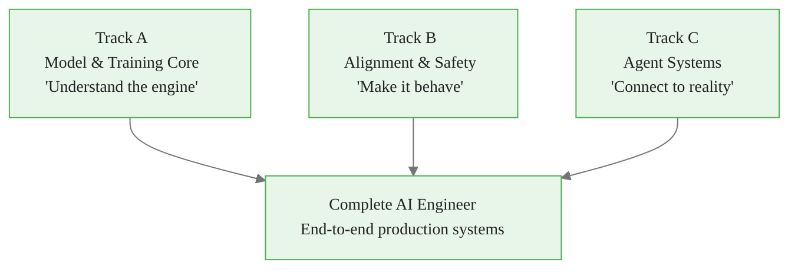
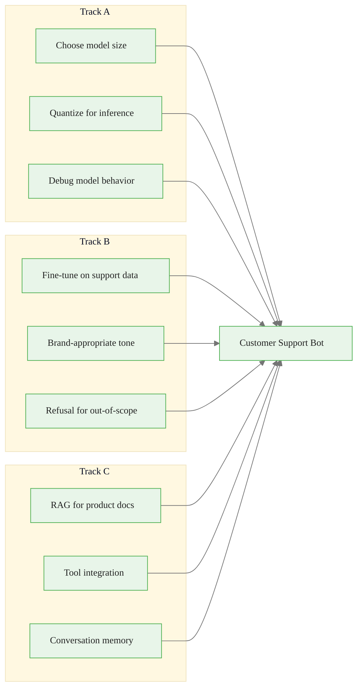
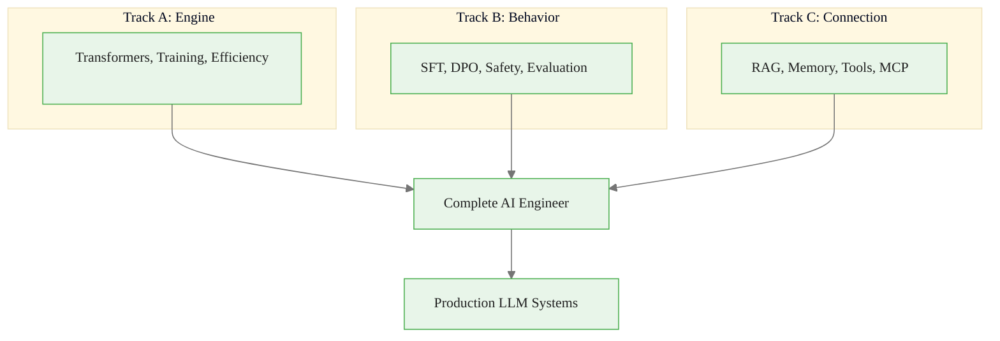

<!-- _class: lead -->

# Three Tracks of AI Engineering
## Model Core, Alignment, and Agent Systems

**Module 00 -- AI Engineer Mindset**

<!-- Speaker notes: This deck introduces the three complementary tracks of AI engineering. Understanding where each track applies helps you make architectural decisions and plan your learning path. You do not need to master all three equally -- but you need enough of each to design good systems. -->

---

## In Brief

AI Engineering divides into three complementary tracks:

1. **Track A: Model & Training Core** -- understanding and modifying the engine
2. **Track B: Alignment & Safety** -- shaping behavior
3. **Track C: Agent Systems** -- connecting to reality

> **You don't need to be a researcher to be an AI Engineer, but you need to understand enough of each track to make good architectural decisions.**

<!-- Speaker notes: The key insight is that these tracks are complementary, not competing. A production LLM system needs all three. The question is where YOU go deep vs where you have working knowledge. -->

---

## The Three Tracks Overview



<!-- Speaker notes: Think of Track A as the engine, Track B as the steering wheel, and Track C as the road. You need all three to get anywhere useful. Most application developers start with Track C and learn A and B as needed. Most ML engineers start with A. -->

---

## Track A: Model & Training Core

| Topic | Description | Depth Needed |
|-------|-------------|--------------|
| **Transformers** | Attention, FFN, normalization | Deep understanding |
| **Training** | Optimization, loss functions | Working knowledge |
| **Scaling Laws** | Compute vs params vs data | Conceptual grasp |
| **Data Quality** | Filtering, dedup, balance | Practical skills |
| **Efficiency** | LoRA, quantization, FlashAttention | Implementation level |
| **Distributed** | ZeRO, FSDP, tensor parallelism | Awareness |

<!-- Speaker notes: Track A is the most research-oriented track. For most AI engineers, "deep understanding" of transformers and "implementation level" on efficiency techniques is sufficient. You rarely need to train from scratch, but you absolutely need to understand what happens inside the model to debug issues effectively. -->

---

## Track A: Key Skills

```python
# 1. Load and inspect models
from transformers import AutoModel
model = AutoModel.from_pretrained("meta-llama/Llama-2-7b")
print(f"Parameters: {sum(p.numel() for p in model.parameters()):,}")

# 2. Fine-tune efficiently
from peft import LoraConfig, get_peft_model
lora_config = LoraConfig(
    r=8, lora_alpha=32,
    target_modules=["q_proj", "v_proj"]
)
model = get_peft_model(model, lora_config)

# 3. Quantize for deployment
from transformers import BitsAndBytesConfig
quantization_config = BitsAndBytesConfig(load_in_4bit=True)

# 4. Reason about compute budgets
tokens_needed = 20 * num_parameters  # Chinchilla optimal
```

<!-- Speaker notes: These four skills represent the practical minimum for Track A. You should be able to (1) load and inspect a model, (2) fine-tune with LoRA, (3) quantize for deployment, and (4) estimate compute requirements. This code is copy-paste ready. -->

---

## Track A: When You Need It

**Use cases:**
- Fine-tuning models for specific domains
- Optimizing inference cost and latency
- Debugging unexpected model behavior
- Choosing between model sizes
- Understanding capability limits

**Career focus:** ML Engineers, Model optimization specialists, Training infrastructure engineers, Research engineers

<!-- Speaker notes: If you are building applications on top of APIs (OpenAI, Anthropic), you need less Track A depth. If you are deploying open-source models or fine-tuning, Track A becomes critical. The key question: are you using the model as a black box or opening it up? -->

---

<!-- _class: lead -->

# Track B: Alignment & Safety

<!-- Speaker notes: Track B is about making the model behave the way you want. This goes beyond just "don't say bad things" -- it includes instruction following, style, format compliance, and reliability. -->

---

## Track B: What It Covers

| Topic | Description | Depth Needed |
|-------|-------------|--------------|
| **SFT** | Instruction tuning, format learning | Implementation level |
| **RLHF** | Reward models, PPO, preference learning | Conceptual + hands-on |
| **DPO** | Direct preference optimization | Implementation level |
| **Constitutional AI** | Principle-based self-alignment | Awareness |
| **Safety Policies** | Refusal behavior, harm prevention | Deep practical |
| **Red-teaming** | Adversarial testing, jailbreaks | Practical skills |
| **Evaluation** | Metrics, benchmarks, regression | Deep practical |

<!-- Speaker notes: Most AI engineers need SFT, DPO, and evaluation at implementation level. RLHF is important to understand conceptually but you rarely implement it from scratch. Safety and red-teaming are essential for any customer-facing product. -->

---

## Track B: Key Skills

<div class="columns">
<div>

**Instruction Tuning**
```python
training_data = [
    {
      "instruction": "Summarize",
      "input": article_text,
      "output": good_summary
    },
]
```

**Preference Optimization**
```python
from trl import DPOTrainer
trainer = DPOTrainer(
    model=model,
    ref_model=ref_model,
    train_dataset=preference_pairs,
    beta=0.1,
)
```

</div>
<div>

**Safety Evaluation**
```python
def test_harmful_requests(model):
    prompts = load_red_team_prompts()
    results = []
    for prompt in prompts:
        response = model.generate(prompt)
        results.append({
            "refused": detect_refusal(response),
            "harmful": detect_harm(response)
        })
    return calculate_safety_metrics(results)
```

</div>
</div>

<!-- Speaker notes: Three key skills: (1) creating training data for SFT, (2) DPO training for preference alignment, (3) automated safety testing. The DPO example uses the trl library which simplifies the process significantly compared to raw RLHF. -->

---

## Track B: When You Need It

**Use cases:**
- Building customer-facing AI products
- Ensuring brand-safe responses
- Meeting compliance requirements
- Reducing support escalations
- Preventing harmful outputs

**Career focus:** AI Safety engineers, Product AI engineers, Trust & Safety teams, AI policy and governance

<!-- Speaker notes: Track B is non-negotiable for customer-facing products. Even if you use a pre-aligned model like Claude, you still need evaluation and safety testing for your specific use case. The model is aligned in general, but your application has specific requirements. -->

---

<!-- _class: lead -->

# Track C: Agent Systems

<!-- Speaker notes: Track C is where most application developers spend their time. This is about connecting the model to the real world -- data, tools, users, and other systems. -->

---

## Track C: What It Covers

| Topic | Description | Depth Needed |
|-------|-------------|--------------|
| **RAG** | Retrieval, embeddings, reranking | Deep implementation |
| **Memory** | Short/long-term, lifecycle management | Deep implementation |
| **Tool Use** | Function calling, API integration | Deep implementation |
| **Agent Loops** | ReAct, planning, execution | Deep implementation |
| **Protocols** | MCP, standardized interfaces | Implementation level |
| **Orchestration** | Multi-agent coordination | Working knowledge |
| **Observability** | Logging, tracing, debugging | Practical skills |

<!-- Speaker notes: Track C is the most hands-on track and where most AI engineers spend 80% of their time. Everything here is "deep implementation" or "implementation level" because this is where rubber meets road. The rest of this course focuses heavily on Track C. -->

---

## Track C: Key Skills -- RAG & Agents

<div class="columns">
<div>

**RAG System**
```python
class RAGSystem:
    def __init__(self):
        self.embedder = EmbeddingModel(
            "text-embedding-3-small")
        self.vector_db = ChromaDB(
            collection="documents")
        self.reranker = CrossEncoderReranker()

    def query(self, question, k=5):
        query_emb = self.embedder.embed(question)
        candidates = self.vector_db.search(
            query_emb, k=k*3)
        return self.reranker.rerank(
            question, candidates, k=k)
```

</div>
<div>

**MCP Protocol**
```python
from mcp import Server, Tool

server = Server("my-tools")

@server.tool()
def get_weather(city: str) -> dict:
    """Get current weather."""
    return weather_api.get(city)
```

**Observability**
```python
@traced("agent.run")
def run_agent(goal: str):
    with span("context_building"):
        context = build_context(goal)
    with span("generation"):
        response = generate(goal, context)
    log_metrics({...})
```

</div>
</div>

<!-- Speaker notes: Track C combines three types of skills: (1) data retrieval (RAG), (2) tool integration (MCP, function calling), and (3) operational skills (observability, tracing). The RAG system on the left shows the retrieve-rerank pattern. The MCP example shows standardized tool interfaces. The tracing example shows production observability. -->

---

## Track C: When You Need It

**Use cases:**
- Building AI-powered applications
- Integrating LLMs with existing systems
- Creating autonomous agents
- Connecting to enterprise data
- Scaling to production

**Career focus:** AI Application engineers, Full-stack AI developers, Platform engineers, Startup founders

<!-- Speaker notes: Track C is where the application developers live. If you are building products, this is your primary track. Start here, learn enough of A and B to make good decisions, then go deeper as needed. -->

---

<!-- _class: lead -->

# How the Tracks Combine

<!-- Speaker notes: The real power comes from combining all three tracks. Let's look at a concrete example. -->

---

## Example: Customer Support Bot



<!-- Speaker notes: A real customer support bot needs all three tracks. Track A: choose between GPT-4 and a fine-tuned smaller model based on cost and latency. Track B: fine-tune on your support data for consistent tone, add refusal for topics outside your product. Track C: RAG over product docs, tool integration with ticketing system, conversation memory across sessions. This is what "complete AI engineer" means in practice. -->

---

## Track Overlap and Learning Paths

| Intersection | Focus Area |
|--------------|------------|
| **A and B** | Fine-tuning for alignment |
| **A and C** | Efficient inference, embedding models for RAG |
| **B and C** | Evaluation of agent behavior |
| **A and B and C** | Complete AI Engineer |

| Path | Order | Rationale |
|------|-------|-----------|
| **App Developer** | C -> B -> A | Get building quickly, then understand why |
| **ML Engineer** | A -> B -> C | Understand the engine deeply, then apply |
| **Product/Startup** | All parallel | Get to production fast, fill gaps as needed |

<!-- Speaker notes: The learning path depends on your background. App developers should start with Track C because it's the most immediately useful. ML engineers already have Track A, so they add B and C. Startup founders need a bit of everything fast, so they go parallel. The rest of this course follows a C-heavy path with A and B sprinkled in. -->

---

## Self-Assessment: All Tracks

<div class="columns">
<div>

**Track A: Model Core**
- [ ] Explain attention mechanism
- [ ] Fine-tune a model using LoRA
- [ ] Quantize a model for deployment
- [ ] Understand Chinchilla scaling
- [ ] Debug training instabilities

**Track B: Alignment**
- [ ] Create instruction-tuning datasets
- [ ] Implement DPO training
- [ ] Design safety evaluations
- [ ] Build regression test suites
- [ ] Understand RLHF conceptually

</div>
<div>

**Track C: Agent Systems**
- [ ] Build production RAG with eval
- [ ] Implement ReAct agent loops
- [ ] Design reliable tool interfaces
- [ ] Add observability to agents
- [ ] Deploy and monitor in production

</div>
</div>

<!-- Speaker notes: Use this as a personal checklist. Rate yourself 1-5 on each item. Where are your biggest gaps? That tells you which modules to prioritize. Most application developers are strong on C, moderate on A, and weak on B. The biggest blind spot is usually evaluation (Track B) -- people build without measuring. -->

---

## Connections & Practice

**Builds on:** The closed-loop mental model

**Leads to:** Detailed exploration of each track in subsequent modules

### Practice Problems

1. Rate yourself 1-5 on each skill in the three checklists. Where are your biggest gaps?
2. Design a system for "AI-powered code review." Which track is most critical?
3. Based on your current role and goals, which learning path makes most sense?

<!-- Speaker notes: Problem 1 is self-assessment. Problem 2 tests architectural thinking -- for code review, Track B (evaluation, safety) and Track C (tool integration with git, CI/CD) are most critical, with Track A needed only if you fine-tune the model. Problem 3 personalizes the learning path. -->

---

## Visual Summary



> Mastering all three tracks makes you a complete AI Engineer.

<!-- Speaker notes: The takeaway is that all three tracks converge on production LLM systems. You don't need to be an expert in all three, but you need enough understanding to make good architectural decisions. The customer support bot example showed how each track contributes. Use the self-assessment to identify your gaps and plan your learning. -->
