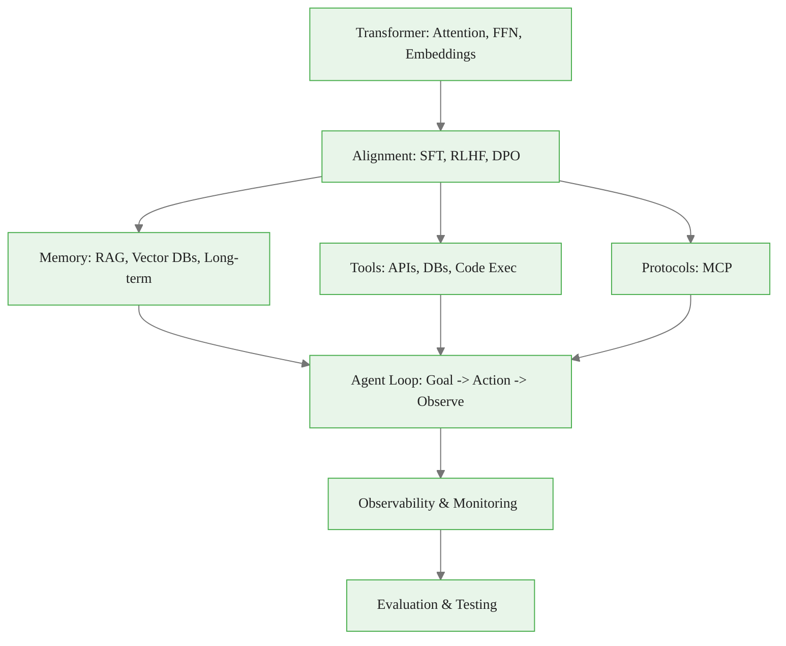
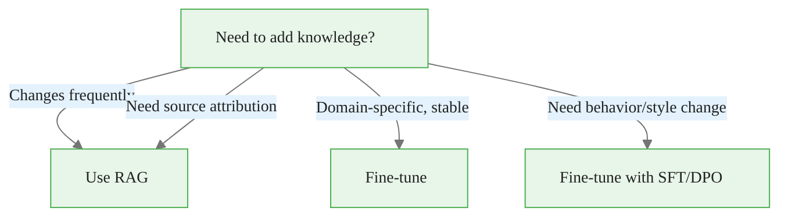
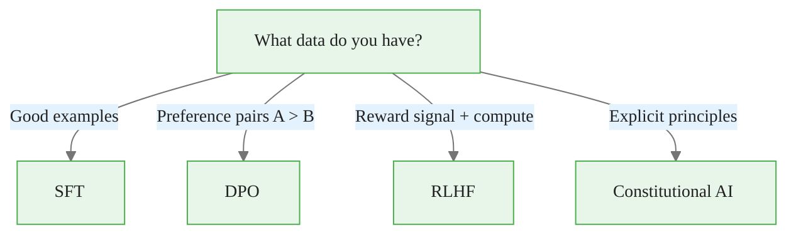
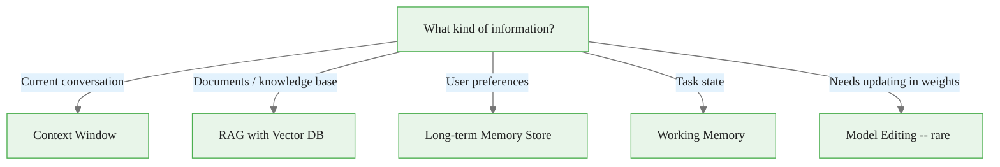
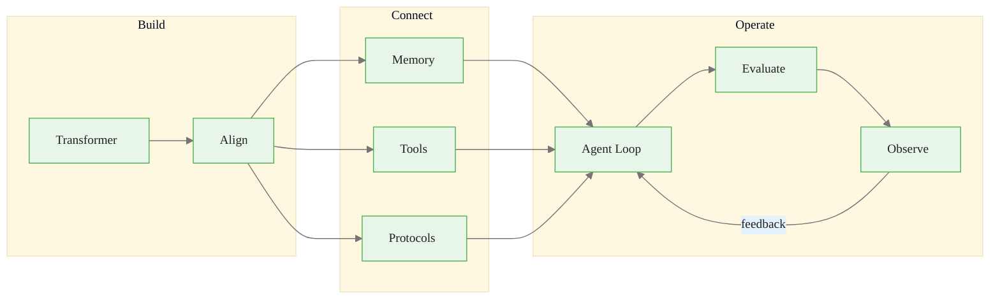

<!-- _class: lead -->

# AI Engineer Cheatsheet
## Quick Reference for the Complete Stack

**Module 00 -- AI Engineer Mindset**

<!-- Speaker notes: This is a reference deck, not a teaching deck. Use it as a quick lookup during development or review. It condenses all of Module 00 into scannable slides. Not intended for live presentation at normal pace -- use as a handout or self-study reference. -->

---

## The Core Mental Model

```
Goal -> Context -> Plan/Generate -> Act -> Observe
     -> Update Memory -> Evaluate -> Iterate
```

> **Whoever runs this loop faster and cleaner wins.**

<!-- Speaker notes: The closed loop in one line. Every production LLM system implements this loop. The rest of this cheatsheet provides the building blocks for each step. -->

---

## The Full Stack



<!-- Speaker notes: The complete AI engineering stack from bottom (Transformer) to top (Evaluation). Each layer adds capabilities that the model alone does not have. Reference this diagram when designing a new system to ensure you are not missing layers. -->

---

## Three Tracks at a Glance

| Track | Focus | Key Skills | Modules |
|-------|-------|------------|---------|
| **A: Model Core** | The engine | Attention, training, efficiency | 01, 06 |
| **B: Alignment** | Behavior shaping | SFT, DPO, evaluation | 02, 07 |
| **C: Agents** | World connection | RAG, tools, MCP | 03-05, 08 |

<!-- Speaker notes: Quick reference for the three tracks. Most application developers focus on Track C (modules 03-05, 08). ML engineers focus on Track A (01, 06). Everyone needs Track B evaluation skills (07). Use the self-assessment in the Three Tracks deck to identify your gaps. -->

---

## Key Formulas

**Attention:**

$$\text{Attention}(Q, K, V) = \text{softmax}\left(\frac{QK^T}{\sqrt{d_k}}\right) V$$

**Chinchilla Optimal Training:**

$$\text{Tokens} \approx 20 \times \text{Parameters}$$

**DPO Loss:**

$$\mathcal{L} = -\mathbb{E}\left[\log \sigma\left(\beta\left(\log \frac{\pi(y_w|x)}{\pi_{ref}(y_w|x)} - \log \frac{\pi(y_l|x)}{\pi_{ref}(y_l|x)}\right)\right)\right]$$

<!-- Speaker notes: Three formulas you should recognize. Attention: the core mechanism of Transformers, scaling by sqrt(d_k) for stable gradients. Chinchilla: the compute-optimal training rule -- 20 tokens per parameter. DPO: the direct preference optimization loss that replaces RLHF's reward model with a simple binary cross-entropy objective. You do not need to derive these, but you should understand what each term means. -->

---

## Decision Tree: RAG vs Fine-tuning



<!-- Speaker notes: The most common architectural decision in LLM engineering. RAG for knowledge that changes (product docs, news, prices). Fine-tuning for stable behavior changes (tone, format, domain language). If you need both (domain knowledge + specific style), use RAG for knowledge and fine-tuning for style. -->

---

## Decision Tree: Alignment Method



<!-- Speaker notes: Choose alignment method based on available data. SFT with good examples is the simplest and most common. DPO with preference pairs is nearly as effective as RLHF but much simpler. RLHF requires a reward model and significant compute. Constitutional AI is principle-based and used by Anthropic for Claude. Most practitioners use SFT or DPO. -->

---

## Decision Tree: Memory Architecture



<!-- Speaker notes: Match information type to memory form. Current conversation goes in context. Documents go in RAG. User preferences go in long-term memory (key-value or vector DB). Task state goes in working memory (context window or structured store). Model editing (ROME, MEMIT) is rarely needed in practice -- use RAG instead. -->

---

## Common Patterns

<div class="columns">
<div>

**ReAct Agent Loop**
```
Thought: [reasoning]
Action:  [tool_name(params)]
Observation: [result]
... repeat ...
Thought: [can now answer]
Action:  finish(answer)
```

**RAG Pipeline**
```
Query -> Embed -> Retrieve
     -> Rerank -> Generate
```

</div>
<div>

**Production Deployment**
```
Request -> Cache check
        -> Route to model
        -> Generate
        -> Guardrails
        -> Log -> Respond
```

</div>
</div>

<!-- Speaker notes: Three patterns you will use repeatedly. ReAct: the standard agent loop pattern -- interleave reasoning and action. RAG: the five-step retrieval pipeline. Production deployment: the request flow with caching, routing, guardrails, and logging. Memorize these three patterns. -->

---

## Efficiency Quick Reference

| Technique | Purpose | Memory | Speed |
|-----------|---------|--------|-------|
| **LoRA** | Fine-tuning | <1% params | ~Full |
| **QLoRA** | Fine-tune large | 4-bit base | ~Full |
| **Quantization (INT4)** | Inference | 4x smaller | 2-4x faster |
| **FlashAttention** | Train/infer | 5-20x less | 2-4x faster |
| **MoE** | Scaling | More total | Same compute |
| **KV Caching** | Inference | Trades mem | Significant |

<!-- Speaker notes: Quick lookup for efficiency techniques. LoRA and QLoRA for fine-tuning without full-parameter training. INT4 quantization for cheaper inference. FlashAttention for memory-efficient attention. MoE for scaling without proportional compute increase. KV caching for faster autoregressive generation. Module 06 covers these in detail. -->

---

## Evaluation Metrics

| Task Type | Metrics |
|-----------|---------|
| **General capability** | MMLU, HumanEval, MT-Bench |
| **RAG quality** | Retrieval precision/recall, faithfulness |
| **Agent tasks** | Success rate, cost per success, steps |
| **Safety** | Refusal rate on harmful, compliance on benign |
| **Production** | Latency p50/p95/p99, cost per query, error rate |

<!-- Speaker notes: Choose metrics based on what you are evaluating. General capability benchmarks tell you about the base model. RAG metrics tell you about retrieval quality. Agent metrics focus on task completion. Safety metrics measure alignment. Production metrics measure operational health. Always measure multiple dimensions -- a fast, cheap system that hallucinates is worse than a slower, accurate one. -->

---

## Canonical Papers

| Paper | One-Line Summary |
|-------|------------------|
| **Attention Is All You Need** | Self-attention replaces recurrence |
| **Chinchilla** | Train on 20 tokens per parameter |
| **InstructGPT** | RLHF turns base models into assistants |
| **DPO** | Simpler alternative to RLHF |
| **RAG** | Retrieve at inference, don't memorize |
| **MemGPT** | Memory like an OS with paging |
| **ReAct** | Interleave reasoning and action |
| **LoRA** | Fine-tune with low-rank adapters |
| **FlashAttention** | IO-aware attention |
| **MCP** | Standard protocol for tool integration |

<!-- Speaker notes: The ten papers every AI engineer should know. You do not need to read all of them in full, but you should understand the core contribution of each. Start with Attention Is All You Need and ReAct. Read DPO and LoRA if you are fine-tuning. Read RAG and MemGPT if you are building agents. -->

---

## Anti-Patterns

| Don't | Do Instead |
|-------|------------|
| "Just scale the model" | Design the full system |
| "Fine-tune for everything" | RAG for knowledge, fine-tune for behavior |
| "RLHF is always better" | DPO is simpler, often sufficient |
| "Long context solves memory" | Hierarchical memory + retrieval |
| "Benchmark = production quality" | Task-specific eval + monitoring |
| "One agent does everything" | Specialized agents, clear responsibilities |

<!-- Speaker notes: Six anti-patterns to avoid. Each one seems reasonable but leads to poor outcomes. The first ("just scale") was the dominant view in 2022 but has been replaced by systems thinking. The last ("one agent does everything") is the current trap -- multi-agent systems with clear responsibilities outperform monolithic agents. -->

---

## Quick Commands

```bash
# Fine-tune with LoRA
python -m trl.scripts.sft \
  --model_name meta-llama/Llama-2-7b-hf \
  --dataset_name your_dataset --peft_lora_r 8

# Quantize model
from transformers import AutoModelForCausalLM, BitsAndBytesConfig
model = AutoModelForCausalLM.from_pretrained(
    "model_name",
    quantization_config=BitsAndBytesConfig(load_in_4bit=True)
)

# Start MCP server
mcp run server.py

# Run evaluation
lm_eval --model hf \
  --model_args pretrained=your_model --tasks mmlu
```

<!-- Speaker notes: Copy-paste commands for common tasks. Fine-tune with trl (the simplest way to LoRA fine-tune). Quantize with BitsAndBytesConfig. Start an MCP server. Run evaluation benchmarks with lm_eval. These are starting points -- refer to Module 06 for fine-tuning details and Module 07 for evaluation. -->

---

## The AI Engineer's Checklist

Before shipping:

- [ ] Evaluation harness with regression tests
- [ ] Safety testing (red-teaming)
- [ ] Observability (logging, tracing, metrics)
- [ ] Cost estimation and optimization
- [ ] Fallback behavior for failures
- [ ] Feedback collection mechanism
- [ ] Documentation for maintenance

<!-- Speaker notes: Use this checklist before every production deployment. Each item prevents a class of failure. Evaluation prevents regressions. Safety testing prevents harmful outputs. Observability enables debugging. Cost estimation prevents surprise bills. Fallback behavior prevents user-facing errors. Feedback collection enables improvement. Documentation enables handoff. -->

---

## Visual Summary



> The future rewards the person who can build a system that keeps getting better after it ships.

<!-- Speaker notes: Three phases of AI engineering: Build (model + alignment), Connect (memory, tools, protocols), Operate (agent loop, evaluation, observability). The feedback arrow from Observe back to the Agent Loop is the key -- systems that learn from their operation improve continuously. This is the competitive advantage of good AI engineering. -->
