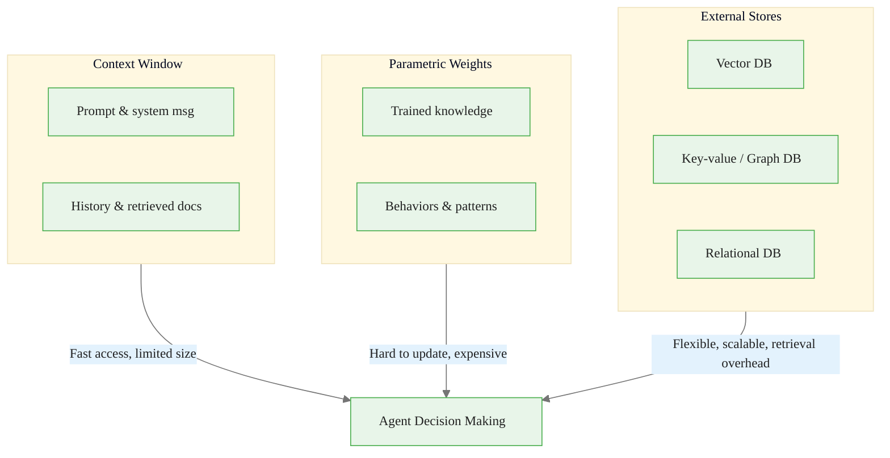

# Memory Taxonomy: Understanding LLM Memory Systems

> **Reading time:** ~12 min | **Module:** 3 — Memory Systems | **Prerequisites:** Module 0 (AI Engineer Mindset)

<span class="badge mint">Intermediate</span> <span class="badge amber">~12 min</span> <span class="badge blue">Module 3</span>

## Introduction

Memory in LLM systems is not a single thing -- it's a taxonomy of mechanisms that provide different types of information at different timescales. Understanding this taxonomy is the foundation for building effective agent systems.

<div class="callout-insight">

<strong>Key Insight:</strong> Memory is an evolving state the agent can read and write while making decisions. It's not just storage -- it has a lifecycle (formation, retrieval, evolution) and comes in different forms optimized for different functions.

</div>

<div class="callout-key">

**Key Concept Summary:** LLM memory spans three forms -- context window (fast, limited, ephemeral), external knowledge via RAG (scalable, updatable, with retrieval cost), and long-term persistent state (cross-session, selective, evolving). Effective memory design matches the memory form to the function (factual, experiential, working, procedural, episodic) and implements a lifecycle policy covering formation, retrieval, and evolution.

</div>

## Visual Explanation



<div class="caption">Figure 1: The three memory forms and their tradeoffs for agent decision making.</div>

## The Three Memory Types

### 1. Short-Term Memory: The Context Window

**What it is:** The tokens currently in the prompt that the model can attend to.

| Characteristic | Detail |
|---------------|--------|
| **Speed** | Instant -- direct attention access, no retrieval overhead |
| **Capacity** | Limited -- 4K to 128K tokens depending on model |
| **Persistence** | Ephemeral -- gone when the request ends |

**What goes here:** System prompts, conversation history, retrieved documents, current task context.

<div class="callout-warning">

<strong>Warning:</strong> When the context window is full, something must be dropped. This limitation drives the need for smart memory management.

</div>

<div class="code-window">
<div class="code-header">
<div class="dots"><span class="dot-red"></span><span class="dot-yellow"></span><span class="dot-green"></span></div>
<span class="filename">context_manager.py</span>
</div>
<div class="code-body">

```python
class ContextManager:
    def __init__(self, max_tokens: int = 8000):
        self.max_tokens = max_tokens
        self.system_prompt_tokens = 500  # Reserve for system
        self.buffer_tokens = 500  # Safety buffer
        self.available = max_tokens - self.system_prompt_tokens - self.buffer_tokens

    def fit_context(self, messages: list, retrieved_docs: list) -> tuple:
        """Prioritize what fits in context."""
        # Priority: recent messages > relevant docs > older messages
        pass
```

</div>
</div>

### 2. External Knowledge: RAG (Retrieval-Augmented Generation)

**What it is:** Documents stored externally, retrieved at inference time based on relevance.

| Characteristic | Detail |
|---------------|--------|
| **Scalability** | Can store millions of documents |
| **Updatability** | Change documents without retraining |
| **Traceability** | Can cite sources |
| **Cost** | Embedding + search adds latency |

<div class="callout-key">

<strong>Key Point:</strong> Don't memorize everything in weights. Retrieve what's relevant when needed.

</div>

<div class="code-window">
<div class="code-header">
<div class="dots"><span class="dot-red"></span><span class="dot-yellow"></span><span class="dot-green"></span></div>
<span class="filename">basic_rag.py</span>
</div>
<div class="code-body">

```python
from chromadb import Client
from sentence_transformers import SentenceTransformer

embedder = SentenceTransformer('all-MiniLM-L6-v2')
db = Client()
collection = db.create_collection("knowledge_base")

for doc in documents:
    embedding = embedder.encode(doc.content)
    collection.add(
        documents=[doc.content],
        embeddings=[embedding],
        ids=[doc.id],
        metadatas=[doc.metadata]
    )

def retrieve(query: str, k: int = 5) -> list:
    query_embedding = embedder.encode(query)
    results = collection.query(query_embeddings=[query_embedding], n_results=k)
    return results['documents'][0]
```

</div>
</div>

### 3. Long-Term Memory: Persistent Agent State

**What it is:** Information that persists across sessions, learned from experience.

| Characteristic | Detail |
|---------------|--------|
| **Persistence** | Survives across sessions |
| **Selectivity** | Not everything is stored |
| **Evolution** | Memories consolidate, decay, update |
| **Control** | Agent manages read/write operations |

<div class="callout-info">

<strong>Info:</strong> Long-term memory requires a lifecycle policy -- not just storage, but formation, retrieval, and evolution.

</div>

<div class="code-window">
<div class="code-header">
<div class="dots"><span class="dot-red"></span><span class="dot-yellow"></span><span class="dot-green"></span></div>
<span class="filename">long_term_memory.py</span>
</div>
<div class="code-body">

```python
class LongTermMemory:
    def __init__(self, db):
        self.db = db

    def remember(self, content: str, importance: float = 0.5):
        """Store a memory with importance score."""
        memory = {
            "content": content,
            "importance": importance,
            "created_at": datetime.now(),
            "access_count": 0,
            "last_accessed": None
        }
        self.db.insert(memory)

    def recall(self, query: str, k: int = 5) -> list:
        """Retrieve memories relevant to query."""
        memories = self.db.semantic_search(query, k=k*2)
        scored = self._score_memories(memories, query)
        return sorted(scored, key=lambda m: m['score'], reverse=True)[:k]

    def consolidate(self):
        """Periodically merge and prune memories."""
        pass
```

</div>
</div>

## Memory Form x Function x Dynamics

A useful framework for classifying memory along three axes:

### Forms (How it's stored)

| Form | Example | Access Pattern |
|------|---------|----------------|
| Token/context | Prompt text | Direct attention |
| Parametric | Model weights | Forward pass |
| Vector store | Embeddings in DB | Similarity search |
| Key-value | Redis, DynamoDB | Exact key lookup |
| Graph | Neo4j | Relationship traversal |
| Relational | PostgreSQL | SQL queries |

### Functions (What it stores)

| Function | Description | Example |
|----------|-------------|---------|
| Factual | World knowledge | "Paris is the capital of France" |
| Experiential | Past interactions | "User prefers concise answers" |
| Working | Current task state | "We're on step 3 of 5" |
| Procedural | How to do things | Tool usage patterns |
| Episodic | Specific events | "Last week we discussed X" |

### Dynamics (How it changes)

| Phase | Operations | Purpose |
|-------|------------|---------|
| Formation | Extract, summarize, deduplicate, store | Get memories into the system |
| Retrieval | Search, rank, inject | Get memories out when needed |
| Evolution | Consolidate, decay, merge, update | Keep memory healthy over time |

## The Memory Matrix

Use this to design your memory system:

| Information Type | Context | RAG | Long-term | Weights |
|-----------------|---------|-----|-----------|---------|
| Factual knowledge | Temp | **Primary** | Some | Strong |
| User preferences | Some | -- | **Primary** | -- |
| Current task state | **Primary** | -- | Some | -- |
| Domain expertise | -- | Strong | -- | **Primary** |
| Conversation history | Strong | -- | Strong | -- |
| Recent events | **Primary** | Some | Some | -- |

## Common Pitfalls

<div class="callout-danger">

<strong>Pitfall 1 — Treating all memory as context:</strong> Stuffing everything into the prompt until it overflows. Use hierarchical memory -- only retrieve what's relevant.

</div>

<div class="callout-warning">

<strong>Pitfall 2 — Storing everything:</strong> Memory bloats, retrieval quality degrades. Apply importance scoring and periodic pruning.

</div>

<div class="callout-warning">

<strong>Pitfall 3 — No memory evolution:</strong> Stale, redundant, or contradictory memories accumulate. Implement consolidation, decay, and conflict resolution.

</div>

<div class="callout-warning">

<strong>Pitfall 4 — Wrong form for the function:</strong> Using RAG for rapidly-changing task state, or context for static knowledge. Match memory form to function using the matrix above.

</div>

## Practice Questions

1. **Conceptual:** You're building a customer support agent. Map each of these to a memory type: (a) product documentation, (b) customer's name and account info, (c) current ticket being discussed, (d) past interactions with this customer.

2. **Implementation:** Design a memory system for a research assistant that needs to: track papers it has read, remember user's research interests, and maintain state across a multi-day research project.

3. **Decision:** A chatbot needs to remember that "the user's name is Alice" -- should this go in context, RAG, long-term memory, or model weights? What are the tradeoffs?

## Cross-References

<a class="link-card" href="./01_memory_taxonomy_guide_slides.md">
  <div class="link-card-title">Companion Slides — Memory Taxonomy</div>
  <div class="link-card-description">Visual slide deck covering the three memory forms and the memory matrix.</div>
</a>

<a class="link-card" href="./02_rag_architecture_guide.md">
  <div class="link-card-title">Next Guide — RAG Architecture</div>
  <div class="link-card-description">Production-ready retrieval: chunking, embedding, vector DBs, reranking, and generation.</div>
</a>

<a class="link-card" href="../../module_00_ai_engineer_mindset/guides/02_the_closed_loop.md">
  <div class="link-card-title">Module 00 — The Closed Loop</div>
  <div class="link-card-description">How memory fits into the broader goal-action-observation cycle.</div>
</a>
