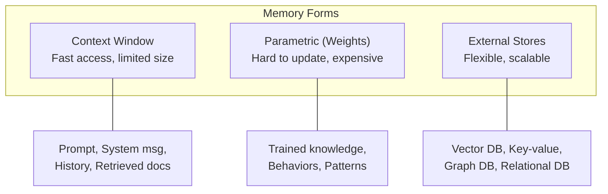
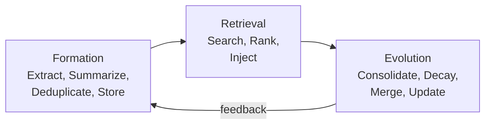
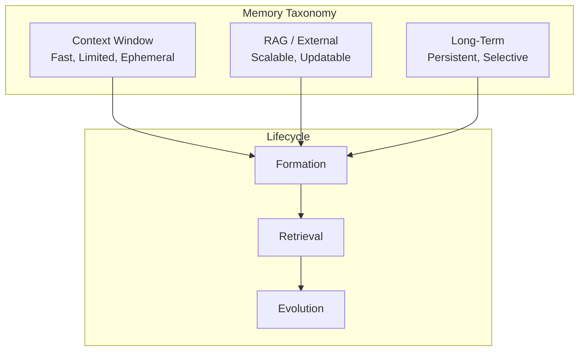

<!-- _class: lead -->

# Memory Taxonomy
## Understanding LLM Memory Systems

**Module 03 -- Memory Systems**

<!-- Speaker notes: This deck introduces the three forms of memory in LLM systems and the Form x Function x Dynamics framework. We use a customer support agent as a running example throughout to make concepts concrete. -->

---

## In Brief

Memory in LLM systems is not a single thing -- it is a **taxonomy** of mechanisms that provide different types of information at different timescales.

> **Memory is an evolving state the agent can read and write while making decisions.**

It is not just storage -- it has a lifecycle (formation -> retrieval -> evolution) and comes in different forms optimized for different functions.

<!-- Speaker notes: The key shift: stop thinking of memory as a database to dump things into. Think of it as a living system that decides what to remember, how to access it, and how to maintain it over time. By the end of this deck, you will be able to choose the right memory type for any use case. -->

---

## Memory Forms Overview



<!-- Speaker notes: Three forms of memory, each with different tradeoffs. Context window: fastest access, but limited size (4K-128K tokens) and ephemeral. Parametric: instant access to trained knowledge, but expensive to update (requires retraining). External stores: scalable and updatable, but adds retrieval latency. The art of memory engineering is choosing the right form for each type of information. -->

---

<!-- _class: lead -->

# The Three Memory Types

<!-- Speaker notes: We will walk through each type with a concrete example: building memory for a customer support agent at an e-commerce company. -->

---

## Type 1: Short-Term Memory (Context Window)

**What it is:** The tokens currently in the prompt that the model can attend to.

| Characteristic | Detail |
|----------------|--------|
| **Speed** | Direct attention access, no retrieval overhead |
| **Capacity** | Fixed size (4K, 8K, 32K, 128K tokens) |
| **Persistence** | Gone when the request ends (unless saved) |

**What goes here:** System prompts, conversation history, retrieved documents, current task context

> **Key limitation:** When full, something must be dropped. This drives the need for smart memory management.

<!-- Speaker notes: For our support agent, short-term memory holds: the system prompt ("You are a helpful support agent for Acme Corp"), the current conversation ("My order #12345 hasn't arrived"), and any retrieved product docs. When the conversation gets long, we need to summarize or drop older messages. This is the most common memory challenge in production. -->

---

## Worked Example: Support Agent Context Management

```python
class ContextManager:
    def __init__(self, max_tokens: int = 8000):
        self.max_tokens = max_tokens
        self.system_prompt_tokens = 500   # Reserve for system
        self.buffer_tokens = 500          # Safety buffer
        self.available = (
            max_tokens
            - self.system_prompt_tokens
            - self.buffer_tokens
        )

    def fit_context(self, messages: list, retrieved_docs: list):
        """Prioritize what fits in context."""
        budget = self.available
        # Priority 1: Most recent 3 messages (always keep)
        recent = messages[-3:]
        budget -= sum(count_tokens(m) for m in recent)
        # Priority 2: Retrieved docs (up to 2000 tokens)
        docs = truncate_to_budget(retrieved_docs, min(budget, 2000))
        budget -= count_tokens(docs)
        # Priority 3: Older messages (summarized if needed)
        older = summarize_if_needed(messages[:-3], budget)
        return {"recent": recent, "docs": docs, "history": older}
```

<!-- Speaker notes: This is a real context management pattern. For our support agent handling a long conversation about order #12345, we always keep the last 3 messages (the active exchange), then fit retrieved product docs (shipping policy, order status), then summarize older conversation history. The key insight: prioritize by usefulness, not recency. Retrieved docs about the specific product are more valuable than a greeting from 10 messages ago. -->

---

## Type 2: External Knowledge (RAG)

**What it is:** Documents stored externally, retrieved at inference time based on relevance.

| Characteristic | Detail |
|----------------|--------|
| **Scalability** | Can store millions of documents |
| **Updatability** | Change documents without retraining |
| **Traceability** | Can cite sources |
| **Cost** | Embedding + search adds latency |

> **Key insight:** Don't memorize everything in weights. Retrieve what is relevant when needed.

<!-- Speaker notes: For our support agent, RAG stores: product documentation (500 pages), shipping policies, return policies, FAQ articles, and known issues. When a customer asks "What's your return policy for electronics?", the agent retrieves the relevant policy document and generates an accurate, sourced answer. Without RAG, the agent would hallucinate policy details. -->

---

## Worked Example: Support Agent RAG

```python
from chromadb import Client
from sentence_transformers import SentenceTransformer

# Index documents
embedder = SentenceTransformer('all-MiniLM-L6-v2')
db = Client()
collection = db.create_collection("knowledge_base")

for doc in documents:
    embedding = embedder.encode(doc.content)
    collection.add(
        documents=[doc.content],
        embeddings=[embedding],
        ids=[doc.id],
        metadatas=[doc.metadata]
    )

# Retrieve at inference time
def retrieve(query: str, k: int = 5) -> list:
    query_embedding = embedder.encode(query)
    results = collection.query(
        query_embeddings=[query_embedding], n_results=k
    )
    return results['documents'][0]
```

<!-- Speaker notes: This indexes all support documentation. When the customer asks about returns, we embed their question, search the vector DB, and retrieve the top 5 most relevant chunks. The metadata includes document type (policy, FAQ, guide), last updated date, and product category -- all useful for filtering. For example, we can filter to only retrieve electronics-specific policies. -->

---

## Type 3: Long-Term Memory (Persistent Agent State)

**What it is:** Information that persists across sessions, learned from experience.

| Characteristic | Detail |
|----------------|--------|
| **Persistent** | Survives across sessions |
| **Selective** | Not everything is stored |
| **Evolving** | Memories consolidate, decay, update |
| **Agent-managed** | The agent controls read/write |

**What goes here:** User preferences, learned facts, past task outcomes, summarized experiences

> **Key insight:** Long-term memory requires a lifecycle policy -- not just storage, but formation, retrieval, and evolution.

<!-- Speaker notes: For our support agent, long-term memory stores: "This customer prefers email over phone," "Last interaction was about order #12344 which was resolved by refund," "Customer is a Premium member since 2022." This personalizes the experience across sessions. Without long-term memory, every conversation starts from scratch and the customer has to repeat context. -->

---

## Worked Example: Support Agent Long-Term Memory

```python
class LongTermMemory:
    def __init__(self, db):
        self.db = db

    # FORMATION: Extract and store
    def remember(self, content: str, importance: float = 0.5):
        memory = {
            "content": content,
            "importance": importance,
            "created_at": datetime.now(),
            "access_count": 0,
            "last_accessed": None
        }
        self.db.insert(memory)

    # RETRIEVAL: Get relevant memories
    def recall(self, query: str, k: int = 5) -> list:
        memories = self.db.semantic_search(query, k=k*2)
        scored = self._score_memories(memories, query)
        return sorted(scored, key=lambda m: m['score'],
                      reverse=True)[:k]

    # EVOLUTION: Maintain memory health
    def consolidate(self):
        # Merge similar, decay old, update importance
        pass
```

<!-- Speaker notes: Three operators visible here: formation (remember), retrieval (recall), and evolution (consolidate). For our support agent, after resolving a ticket about a broken laptop, it remembers: "Customer had issue with laptop screen, resolved via replacement." Next time the customer contacts us, the agent recalls this and can ask "Is this about the laptop replacement, or something new?" This dramatically improves customer experience. -->

---

<!-- _class: lead -->

# Memory Form x Function x Dynamics

<!-- Speaker notes: Now we abstract from the three specific types to a general framework. Any memory system can be analyzed along three dimensions: form (how it is stored), function (what it stores), and dynamics (how it changes). -->

---

## Forms: How It Is Stored

| Form | Example | Access Pattern |
|------|---------|----------------|
| Token/context | Prompt text | Direct attention |
| Parametric | Model weights | Forward pass |
| Vector store | Embeddings in DB | Similarity search |
| Key-value | Redis, DynamoDB | Exact key lookup |
| Graph | Neo4j | Relationship traversal |
| Relational | PostgreSQL | SQL queries |

<!-- Speaker notes: Each form has a different access pattern optimized for a different use case. Our support agent uses context (current conversation), vector store (product docs via RAG), and key-value (customer profile via exact lookup by customer ID). The form should match the access pattern: use key-value for exact lookups (customer ID), vector for semantic search (policy questions), graph for relationships (product compatibility). -->

---

## Functions: What It Stores

| Function | Description | Example |
|----------|-------------|---------|
| **Factual** | World knowledge | "Paris is the capital of France" |
| **Experiential** | Past interactions | "User prefers concise answers" |
| **Working** | Current task state | "We're on step 3 of 5" |
| **Procedural** | How to do things | Tool usage patterns |
| **Episodic** | Specific events | "Last week we discussed X" |

<!-- Speaker notes: For the support agent: factual = product specs and policies (RAG), experiential = customer preferences (long-term memory), working = current ticket state (context window), procedural = how to process refunds (system prompt), episodic = past support interactions (long-term memory). The memory matrix on the next slide maps functions to forms. -->

---

## Dynamics: How It Changes



<!-- Speaker notes: The lifecycle is a loop: form new memories from interactions, retrieve them when needed, evolve them over time (consolidate similar memories, decay unused ones, update stale information). For the support agent, a customer's address might be updated (evolution), old shipping preferences might decay, and multiple interactions about the same issue get consolidated into a single memory. -->

---

## The Memory Matrix

| Information Type | Context | RAG | Long-term | Weights |
|-----------------|---------|-----|-----------|---------|
| Factual knowledge | temp | **primary** | some | good |
| User preferences | some | -- | **primary** | -- |
| Current task state | **primary** | -- | some | -- |
| Domain expertise | -- | good | -- | **primary** |
| Conversation history | good | -- | good | -- |
| Recent events | **primary** | some | some | -- |

<!-- Speaker notes: This matrix is your decision tool. For any piece of information, find its type in the left column, then read across to find the best memory form. "Primary" means this is the best fit. For the support agent: product docs go in RAG, customer preferences in long-term memory, the current ticket in context, and general support skills in the model weights. -->

---

<!-- _class: lead -->

# Common Pitfalls

<!-- Speaker notes: Four pitfalls that account for most memory system failures. Each one comes from a misunderstanding of the memory taxonomy. -->

---

## Pitfall 1: Treating All Memory as Context

**Problem:** Stuffing everything into the prompt until it overflows.

**Solution:** Use hierarchical memory -- only retrieve what is relevant.

## Pitfall 2: Storing Everything

**Problem:** Memory bloats, retrieval quality degrades.

**Solution:** Selective storage with importance scoring and periodic pruning.

<!-- Speaker notes: Pitfall 1 is the most common beginner mistake. People put the entire conversation history, all product docs, and customer profile into every prompt. This hits token limits and degrades quality because the model cannot attend to everything equally. Pitfall 2 is the opposite extreme for long-term memory -- storing every utterance creates so much noise that retrieval becomes useless. -->

---

## Pitfall 3: No Memory Evolution

**Problem:** Stale, redundant, or contradictory memories accumulate.

**Solution:** Implement consolidation, decay, and conflict resolution.

## Pitfall 4: Wrong Memory Form for the Function

**Problem:** Using RAG for rapidly-changing task state, or context for static knowledge.

**Solution:** Match memory form to function using the memory matrix.

<!-- Speaker notes: Pitfall 3: without evolution, the support agent remembers "customer lives at 123 Main St" and "customer lives at 456 Oak Ave" (they moved). Contradictory memories confuse the agent. Pitfall 4: putting static product specs in the context window wastes tokens. Put them in RAG. Conversely, putting the current ticket state in RAG adds unnecessary retrieval latency. Keep it in context. -->

---

## Connections & Practice

**Builds on:** Transformer attention (how context is processed), Embeddings (semantic similarity)

**Leads to:** Module 04 (Tool Use), Module 08 (Production Systems)

### Practice Problems

1. Map these to memory types for a customer support agent: (a) product docs, (b) customer name, (c) current ticket, (d) past interactions.
2. Design a memory system for a research assistant tracking papers, user interests, and multi-day projects.
3. "The user's name is Alice" -- context, RAG, long-term, or weights? What are the tradeoffs?

<!-- Speaker notes: Problem 1 answer: (a) RAG, (b) long-term memory or key-value lookup, (c) context window, (d) long-term memory. Problem 2 tests system design -- papers go in RAG, user interests in long-term memory, project state in context + working memory. Problem 3 is a tradeoff discussion: context (ephemeral, gone next session), long-term (persists, needs lifecycle management), weights (absurd for one user's name). -->

---

## Visual Summary



> Memory is not just storage -- it is a living system with formation, retrieval, and evolution.

<!-- Speaker notes: The takeaway: memory is a taxonomy (three forms), a matrix (forms matched to functions), and a lifecycle (formation, retrieval, evolution). Use the memory matrix to choose the right form. Implement all three lifecycle operators. The support agent example showed how each type contributes to a complete memory system. -->
