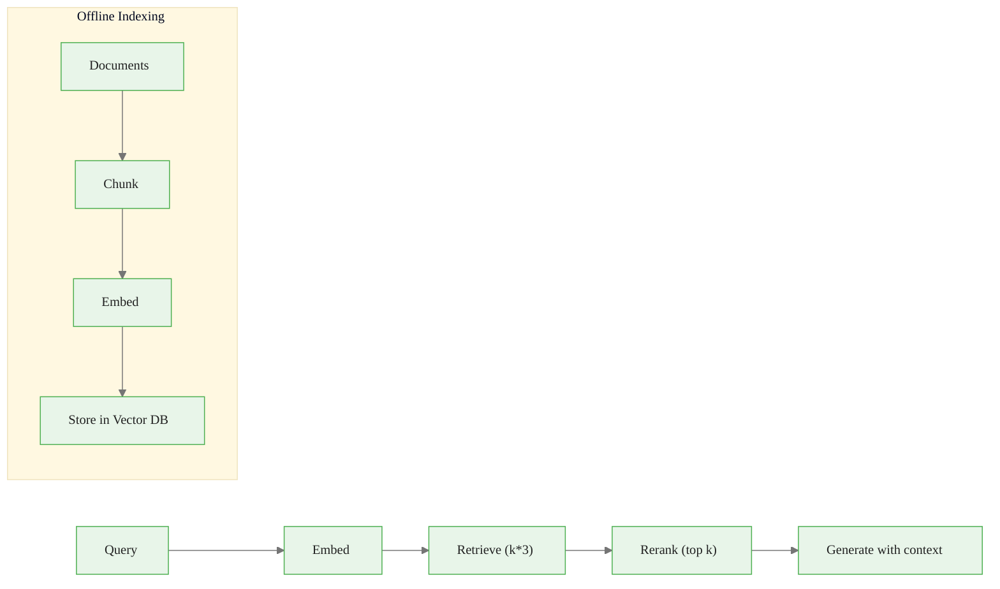

# RAG Architecture: Production-Ready Retrieval

> **Reading time:** ~15 min | **Module:** 3 — Memory Systems | **Prerequisites:** 01 Memory Taxonomy

<span class="badge mint">Intermediate</span> <span class="badge amber">~15 min</span> <span class="badge blue">Module 3</span>

## Introduction

RAG (Retrieval-Augmented Generation) combines the reasoning power of LLMs with the ability to access external knowledge at inference time. Instead of memorizing everything in weights, retrieve what's relevant when you need it.

<div class="callout-insight">

<strong>Key Insight:</strong> Separate "what to know" (retriever) from "how to express it" (generator). This makes knowledge updatable without retraining.

</div>

<div class="callout-key">

**Key Concept Summary:** A production RAG pipeline has five stages: document ingestion (chunk, embed, store), query embedding, retrieval (vector similarity), reranking (cross-encoder for precision), and generation (LLM with retrieved context). The critical design decisions are chunk size, embedding model, retrieval count, and reranking strategy. Measure quality with Recall@k, Precision@k, MRR, and answer faithfulness.

</div>

## Visual Explanation



<div class="caption">Figure 1: The two-phase RAG architecture — offline indexing and online query pipeline.</div>

## The RAG Pipeline

### Step 1: Document Ingestion (Offline)


<span class="filename">ingest.py</span>
</div>
<div class="code-body">

<div class="code-window">
<div class="code-header">
<div class="dots"><span class="dot-red"></span><span class="dot-yellow"></span><span class="dot-green"></span></div>

```python
from langchain.text_splitter import RecursiveCharacterTextSplitter
from sentence_transformers import SentenceTransformer
import chromadb

documents = load_documents("./docs/")

splitter = RecursiveCharacterTextSplitter(
    chunk_size=500,
    chunk_overlap=50,
    separators=["\n\n", "\n", ". ", " ", ""]
)
chunks = []
for doc in documents:
    doc_chunks = splitter.split_text(doc.content)
    for i, chunk in enumerate(doc_chunks):
        chunks.append({
            "id": f"{doc.id}_{i}",
            "content": chunk,
            "metadata": {"source": doc.source, "chunk_index": i}
        })

embedder = SentenceTransformer("BAAI/bge-small-en-v1.5")
embeddings = embedder.encode([c["content"] for c in chunks])

client = chromadb.PersistentClient(path="./chroma_db")
collection = client.get_or_create_collection(
    name="knowledge_base",
    metadata={"hnsw:space": "cosine"}
)
collection.add(
    ids=[c["id"] for c in chunks],
    documents=[c["content"] for c in chunks],
    embeddings=embeddings.tolist(),
    metadatas=[c["metadata"] for c in chunks]
)
```

</div>
</div>

### Step 2: Query Embedding

<div class="callout-warning">

<strong>Warning:</strong> Use the same embedding model for queries and documents. Mismatched models produce poor retrieval.

</div>

### Step 3: Retrieval


<span class="filename">retrieve.py</span>
</div>
<div class="code-body">

<div class="code-window">
<div class="code-header">
<div class="dots"><span class="dot-red"></span><span class="dot-yellow"></span><span class="dot-green"></span></div>

```python
def retrieve(query: str, k: int = 5) -> list:
    """Retrieve top-k relevant chunks."""
    query_embedding = embed_query(query)
    results = collection.query(
        query_embeddings=[query_embedding],
        n_results=k,
        include=["documents", "metadatas", "distances"]
    )
    return [
        {"content": doc, "metadata": meta, "score": 1 - dist}
        for doc, meta, dist in zip(
            results["documents"][0],
            results["metadatas"][0],
            results["distances"][0]
        )
    ]
```

</div>
</div>

### Step 4: Reranking (Optional but Recommended)


<span class="filename">rerank.py</span>
</div>
<div class="code-body">

<div class="code-window">
<div class="code-header">
<div class="dots"><span class="dot-red"></span><span class="dot-yellow"></span><span class="dot-green"></span></div>

```python
from sentence_transformers import CrossEncoder

reranker = CrossEncoder("cross-encoder/ms-marco-MiniLM-L-6-v2")

def rerank(query: str, documents: list, top_k: int = 3) -> list:
    """Rerank retrieved documents using cross-encoder."""
    pairs = [(query, doc["content"]) for doc in documents]
    scores = reranker.predict(pairs)
    for doc, score in zip(documents, scores):
        doc["rerank_score"] = float(score)
    return sorted(documents, key=lambda x: x["rerank_score"], reverse=True)[:top_k]
```

</div>
</div>

<div class="callout-info">

<strong>Why rerank?</strong> Bi-encoders (embedding models) are fast but less accurate. Cross-encoders see query and document together, giving more accurate relevance scores. Retrieve many (k=20), rerank to few (k=3).

</div>

### Step 5: Generation


<span class="filename">generate.py</span>
</div>
<div class="code-body">

<div class="code-window">
<div class="code-header">
<div class="dots"><span class="dot-red"></span><span class="dot-yellow"></span><span class="dot-green"></span></div>

```python
import anthropic

client = anthropic.Anthropic()

def generate_with_context(query: str, context_docs: list) -> str:
    context = "\n\n---\n\n".join([
        f"Source: {doc['metadata']['source']}\n{doc['content']}"
        for doc in context_docs
    ])
    prompt = f"""Use the following context to answer the question.
If the context doesn't contain relevant information, say so.

Context:
{context}

Question: {query}

Answer:"""

    response = client.messages.create(
        model="claude-sonnet-4-20250514",
        max_tokens=1024,
        messages=[{"role": "user", "content": prompt}]
    )
    return response.content[0].text
```

</div>
</div>

## Embedding Model Selection

| Model | Dimensions | Speed | Quality | Use Case |
|-------|------------|-------|---------|----------|
| `all-MiniLM-L6-v2` | 384 | Very fast | Good | Prototyping |
| `BAAI/bge-small-en-v1.5` | 384 | Fast | Very good | Production, balanced |
| `BAAI/bge-base-en-v1.5` | 768 | Medium | Excellent | Quality-critical |
| `text-embedding-3-small` | 1536 | API call | Excellent | OpenAI users |
| `voyage-2` | 1024 | API call | State-of-art | Best quality, higher cost |

## Vector Database Comparison

| Database | Type | Best For | Limitations |
|----------|------|----------|-------------|
| **Chroma** | Embedded | Local dev, small scale | Single machine |
| **Pinecone** | Managed | Production, serverless | Cost at scale |
| **Weaviate** | Self-hosted/Cloud | Hybrid search | Complexity |
| **Qdrant** | Self-hosted/Cloud | Performance | Operational overhead |
| **pgvector** | PostgreSQL ext | Existing Postgres users | Scale limits |

## Advanced Patterns

### Hybrid Search (Vector + Keyword)


<span class="filename">hybrid_search.py</span>
</div>
<div class="code-body">

<div class="code-window">
<div class="code-header">
<div class="dots"><span class="dot-red"></span><span class="dot-yellow"></span><span class="dot-green"></span></div>

```python
def hybrid_search(query: str, k: int = 5, alpha: float = 0.5) -> list:
    """Combine vector and keyword search."""
    vector_results = vector_search(query, k=k*2)
    keyword_results = bm25_search(query, k=k*2)

    scores = {}
    for rank, doc in enumerate(vector_results):
        scores[doc["id"]] = scores.get(doc["id"], 0) + alpha / (rank + 60)
    for rank, doc in enumerate(keyword_results):
        scores[doc["id"]] = scores.get(doc["id"], 0) + (1-alpha) / (rank + 60)

    return sorted(scores.items(), key=lambda x: x[1], reverse=True)[:k]
```

</div>
</div>

### Query Expansion

<div class="callout-info">

<strong>Info:</strong> Improve retrieval by using an LLM to generate alternative phrasings of the user's query before searching.

</div>

### Contextual Compression

Extract only query-relevant portions from retrieved chunks to reduce context window usage.

## Common Pitfalls

<div class="callout-danger">

<strong>Pitfall 1 — Wrong chunk size:</strong> Too large pollutes context with irrelevant content. Too small loses context. Start with 200-500 tokens and test with your data.

</div>

<div class="callout-warning">

<strong>Pitfall 2 — No overlap between chunks:</strong> Information at chunk boundaries gets lost. Use 10-20% overlap.

</div>

<div class="callout-warning">

<strong>Pitfall 3 — Ignoring metadata:</strong> Without metadata, you can't filter by source, date, or other attributes. Store rich metadata.

</div>

<div class="callout-warning">

<strong>Pitfall 4 — Retrieving too much:</strong> Context window pollution, slower generation, higher cost. Retrieve more, rerank to less. Quality over quantity.

</div>

## Evaluation Metrics

| Metric | What It Measures | Good Value |
|--------|------------------|------------|
| **Recall@k** | Coverage of relevant docs | >0.8 |
| **Precision@k** | Relevance of retrieved docs | >0.6 |
| **MRR** | Ranking quality | >0.5 |
| **NDCG** | Graded relevance | Higher is better |
| **Answer faithfulness** | Generated answer accuracy | Does answer match sources? |

## Practice Questions

1. **Implement:** Build a RAG system for a PDF collection. Compare results with and without reranking.

2. **Evaluate:** Measure retrieval quality on a test set. What chunk size gives the best recall@5?

3. **Optimize:** Your RAG system is too slow. What are three ways to reduce latency while maintaining quality?

## Cross-References

<a class="link-card" href="./02_rag_architecture_guide_slides.md">
  <div class="link-card-title">Companion Slides — RAG Architecture</div>
  <div class="link-card-description">Slide deck covering the full RAG pipeline with diagrams and code examples.</div>
</a>

<a class="link-card" href="./01_memory_taxonomy_guide.md">
  <div class="link-card-title">Previous Guide — Memory Taxonomy</div>
  <div class="link-card-description">The three memory forms, functions, and dynamics framework.</div>
</a>

<a class="link-card" href="./03_memory_operators_guide.md">
  <div class="link-card-title">Next Guide — Memory Operators</div>
  <div class="link-card-description">Formation, retrieval, and evolution operators for agent memory systems.</div>
</a>
