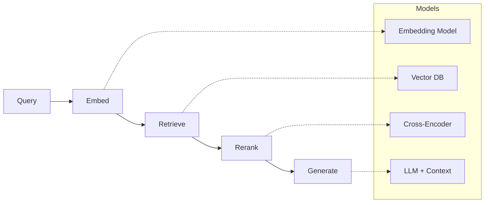
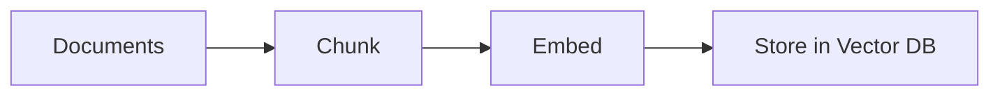
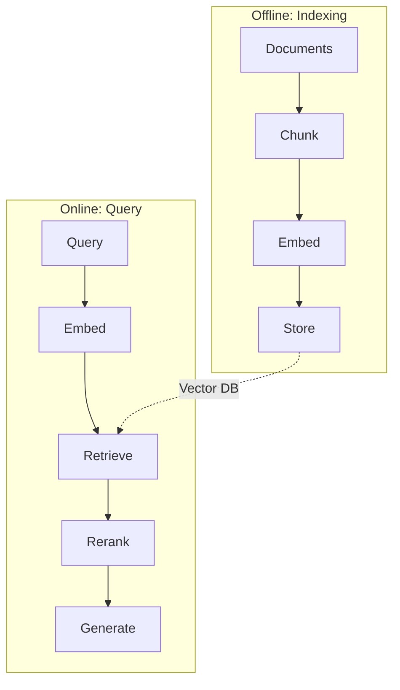

<!-- _class: lead -->

# RAG Architecture -- Part 1
## The Five-Step Pipeline

**Module 03 -- Memory Systems**

<!-- Speaker notes: This is Part 1 of the RAG Architecture deck, covering the core five-step pipeline and model/database selection. Part 2 covers advanced patterns (hybrid search, query expansion, compression) and evaluation. The TL;DR: Query -> Embed -> Retrieve -> Rerank -> Generate. -->

---

## In Brief

RAG (Retrieval-Augmented Generation) combines the reasoning power of LLMs with the ability to access external knowledge at inference time.

> **Separate "what to know" (retriever) from "how to express it" (generator). This makes knowledge updatable without retraining.**

<!-- Speaker notes: RAG is the most important technique in production LLM systems. Instead of fine-tuning the model on your data (expensive, slow, hard to update), you retrieve relevant documents at query time and inject them into the prompt. This means you can update your knowledge base instantly. -->

---

## RAG Pipeline Architecture



<!-- Speaker notes: Five steps: embed the query, retrieve candidate documents from a vector DB, rerank with a cross-encoder for precision, then generate the answer with the LLM using retrieved context. Each step has a specialized model. The embed and retrieve steps use a bi-encoder (fast, approximate). Reranking uses a cross-encoder (slow, precise). -->

---

## Indexing Pipeline (Offline)



This runs **before** any queries. It prepares your knowledge base for retrieval.

<!-- Speaker notes: This is the offline pipeline that you run once (or periodically) to index your documents. The three key decisions here are: (1) how to chunk your documents, (2) which embedding model to use, and (3) which vector database to store in. We will walk through a concrete example: indexing a company's product documentation. -->

---

## Worked Example: Product Docs RAG

Scenario: Build a RAG system for a SaaS company's 500-page product documentation.

```python
from langchain.text_splitter import RecursiveCharacterTextSplitter
from sentence_transformers import SentenceTransformer
import chromadb

# 1. Load documents
documents = load_documents("./docs/")

# 2. Chunk documents
splitter = RecursiveCharacterTextSplitter(
    chunk_size=500, chunk_overlap=50,
    separators=["\n\n", "\n", ". ", " ", ""]
)
chunks = []
for doc in documents:
    doc_chunks = splitter.split_text(doc.content)
    for i, chunk in enumerate(doc_chunks):
        chunks.append({
            "id": f"{doc.id}_{i}",
            "content": chunk,
            "metadata": {"source": doc.source, "chunk_index": i}
        })
```

<!-- Speaker notes: Concrete example: 500 pages of product docs. We use RecursiveCharacterTextSplitter which tries paragraph boundaries first, then sentence boundaries, then word boundaries. 500 tokens with 50 token overlap is a good starting point. The metadata preserves the source so we can cite it later. This produces roughly 5,000-10,000 chunks for 500 pages. -->

---

## Worked Example: Embed and Store

```python
# 3. Embed chunks
embedder = SentenceTransformer("BAAI/bge-small-en-v1.5")
embeddings = embedder.encode([c["content"] for c in chunks])

# 4. Store in vector DB
client = chromadb.PersistentClient(path="./chroma_db")
collection = client.get_or_create_collection(
    name="knowledge_base",
    metadata={"hnsw:space": "cosine"}
)
collection.add(
    ids=[c["id"] for c in chunks],
    documents=[c["content"] for c in chunks],
    embeddings=embeddings.tolist(),
    metadatas=[c["metadata"] for c in chunks]
)
```

<!-- Speaker notes: We use bge-small for a good balance of speed and quality. Encoding 10,000 chunks takes about 30 seconds on a laptop. ChromaDB with cosine similarity is the simplest production-ready setup. For our 500-page docs, this creates a ~50MB database. Note: we store both the embeddings and the original text so we can return readable results. -->

---

## Step 2: Query Embedding

Transform the user's query into the same embedding space as your documents.

```python
def embed_query(query: str) -> list:
    """Embed query using same model as documents."""
    return embedder.encode(query).tolist()
```

> **Best Practice:** Use the same embedding model for queries and documents. Mismatched models = poor retrieval.

<!-- Speaker notes: This is the simplest step but the most common source of bugs. If you embed documents with model A and queries with model B, the vectors are in different spaces and similarity search fails silently -- you get results, but they are wrong. Always verify your query and document embedding models match. -->

---

## Step 3: Retrieval

Find the most relevant chunks using vector similarity.

```python
def retrieve(query: str, k: int = 5) -> list:
    """Retrieve top-k relevant chunks."""
    query_embedding = embed_query(query)

    results = collection.query(
        query_embeddings=[query_embedding],
        n_results=k,
        include=["documents", "metadatas", "distances"]
    )

    return [
        {"content": doc, "metadata": meta,
         "score": 1 - dist}  # distance -> similarity
        for doc, meta, dist in zip(
            results["documents"][0],
            results["metadatas"][0],
            results["distances"][0]
        )
    ]
```

<!-- Speaker notes: We convert cosine distance to similarity score (1 - distance). Retrieve more than you need (k=10 or k=20) and let the reranker narrow down. In our product docs example, a query like "How do I reset my password?" retrieves the 5 most relevant chunks from across all 500 pages. Typical latency: 5-20ms for 10,000 chunks. -->

---

## Step 4: Reranking (Optional but Recommended)

<div class="columns">
<div>

Initial retrieval is fast but imprecise. Reranking uses a more powerful model to reorder.

**Why rerank?**
- Bi-encoders are fast but less accurate
- Cross-encoders see query+doc together
- Retrieve many (k=20), rerank to few (k=3)

</div>
<div>

```python
from sentence_transformers import CrossEncoder

reranker = CrossEncoder(
    "cross-encoder/ms-marco-MiniLM-L-6-v2"
)

def rerank(query, documents, top_k=3):
    pairs = [(query, doc["content"])
             for doc in documents]
    scores = reranker.predict(pairs)

    for doc, score in zip(documents, scores):
        doc["rerank_score"] = float(score)

    return sorted(
        documents,
        key=lambda x: x["rerank_score"],
        reverse=True
    )[:top_k]
```

</div>
</div>

<!-- Speaker notes: The bi-encoder (embedding model) encodes query and document separately, so it is fast but cannot see their interaction. The cross-encoder sees both together, so it is more accurate but slower. The strategy: retrieve 20 with the fast model, rerank to 3 with the accurate model. In our product docs example, this improves answer accuracy by 15-20% in practice. -->

---

## Step 5: Generation

```python
import anthropic

client = anthropic.Anthropic()

def generate_with_context(query: str, context_docs: list) -> str:
    context = "\n\n---\n\n".join([
        f"Source: {doc['metadata']['source']}\n{doc['content']}"
        for doc in context_docs
    ])

    prompt = f"""Use the following context to answer the question.
If the context doesn't contain relevant information, say so.

Context:
{context}

Question: {query}

Answer:"""

    response = client.messages.create(
        model="claude-sonnet-4-20250514",
        max_tokens=1024,
        messages=[{"role": "user", "content": prompt}]
    )
    return response.content[0].text
```

<!-- Speaker notes: The generation step formats the retrieved context and passes it to the LLM. Two important patterns: (1) include source metadata so the model can cite its sources, (2) explicitly instruct the model to say when it does not know, rather than hallucinating. In our product docs example, the answer includes "According to the Password Reset Guide..." with a link to the source document. -->

---

<!-- _class: lead -->

# Full RAG Pipeline Class

<!-- Speaker notes: Now we combine all five steps into a single reusable class. This is the "steal this code" artifact -- copy it into your project and customize. -->

---

## Complete Implementation

```python
class RAGPipeline:
    def __init__(self, collection, embedder, reranker=None):
        self.collection = collection
        self.embedder = embedder
        self.reranker = reranker
        self.client = anthropic.Anthropic()

    def query(self, question: str,
              retrieve_k: int = 10, final_k: int = 3) -> dict:
        # 1. Embed query
        query_embedding = self.embedder.encode(question).tolist()
        # 2. Retrieve
        results = self.collection.query(
            query_embeddings=[query_embedding], n_results=retrieve_k)
        docs = [{"content": doc, "metadata": meta}
                for doc, meta in zip(
                    results["documents"][0], results["metadatas"][0])]
        # 3. Rerank if available
        if self.reranker:
            pairs = [(question, d["content"]) for d in docs]
            scores = self.reranker.predict(pairs)
            for d, s in zip(docs, scores):
                d["score"] = float(s)
            docs = sorted(docs, key=lambda x: x["score"],
                         reverse=True)[:final_k]
        else:
            docs = docs[:final_k]
        # 4. Generate
        context = "\n\n".join([d["content"] for d in docs])
        response = self.client.messages.create(
            model="claude-sonnet-4-20250514",
            max_tokens=1024,
            messages=[{
                "role": "user",
                "content": f"Context:\n{context}\n\nQuestion: {question}\n\nAnswer:"
            }]
        )
        return {"answer": response.content[0].text, "sources": docs}
```

<!-- Speaker notes: This is the complete pipeline with no stubs. The query method does all five steps: embed, retrieve, rerank, generate. The reranker is optional -- pass None for a simpler pipeline. Returns both the answer and the source documents for citation. For production, you would add: caching, logging, token counting, and error handling. -->

---

## Embedding Model Selection

| Model | Dims | Speed | Quality | Use Case |
|-------|------|-------|---------|----------|
| `all-MiniLM-L6-v2` | 384 | Very fast | Good | Prototyping |
| `bge-small-en-v1.5` | 384 | Fast | Very good | Production, balanced |
| `bge-base-en-v1.5` | 768 | Medium | Excellent | Quality matters |
| `text-embedding-3-small` | 1536 | API | Excellent | OpenAI users |
| `voyage-2` | 1024 | API | State-of-art | Best quality |

**Criteria:** Prototyping -> small/fast. Production -> quality vs latency. Domain -> consider fine-tuned.

<!-- Speaker notes: Start with bge-small for most use cases. Move to bge-base if you need better quality. Use API models (OpenAI, Voyage) if you do not want to run models locally. For domain-specific content (medical, legal), fine-tuned embeddings can significantly improve retrieval quality. Higher dimensions means more storage and slower search but better quality. -->

---

## Vector Database Comparison

| Database | Type | Best For | Limitations |
|----------|------|----------|-------------|
| **Chroma** | Embedded | Local dev, small scale | Single machine |
| **Pinecone** | Managed | Production, serverless | Cost at scale |
| **Weaviate** | Self-hosted/Cloud | Hybrid search | Complexity |
| **Qdrant** | Self-hosted/Cloud | Performance | Operational overhead |
| **pgvector** | PostgreSQL ext | Existing Postgres | Scale limits |

<!-- Speaker notes: For prototyping and small scale (under 1M documents), Chroma is the simplest choice. For production, Pinecone is the easiest managed option. If you already have PostgreSQL, pgvector avoids adding another database. Qdrant and Weaviate offer the best performance for self-hosted but require more operational effort. Our product docs example uses Chroma because 10,000 chunks easily fits on a single machine. -->

---

## Visual Summary



> Part 1 covered the five-step pipeline. Continue to Part 2 for advanced patterns and evaluation.

<!-- Speaker notes: The key takeaway from Part 1: RAG has two phases -- offline indexing and online querying. The five online steps are embed, retrieve, rerank, generate. Use the RAGPipeline class as your starting point. Part 2 covers hybrid search, query expansion, contextual compression, pitfalls, and evaluation metrics. -->
