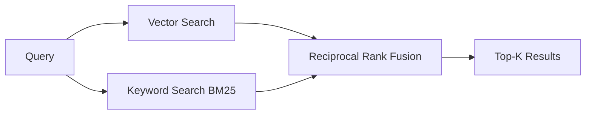
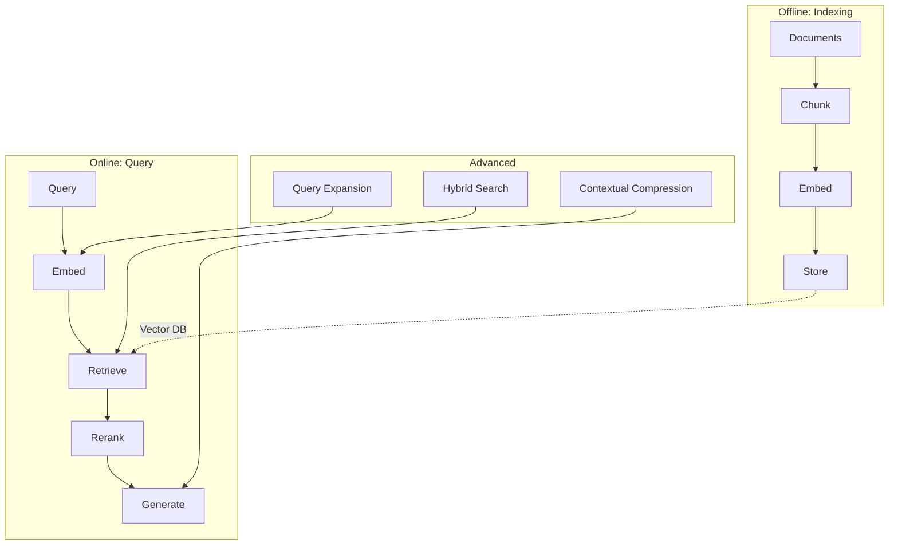

<!-- _class: lead -->

# RAG Architecture -- Part 2
## Advanced Patterns & Evaluation

**Module 03 -- Memory Systems**

<!-- Speaker notes: This is Part 2 of the RAG Architecture deck. Part 1 covered the core five-step pipeline. Part 2 covers three advanced patterns (hybrid search, query expansion, contextual compression), common pitfalls, and evaluation metrics. -->

---

## Hybrid Search (Vector + Keyword)



```python
def hybrid_search(query: str, k: int = 5, alpha: float = 0.5):
    vector_results = vector_search(query, k=k*2)
    keyword_results = bm25_search(query, k=k*2)

    scores = {}
    for rank, doc in enumerate(vector_results):
        scores[doc["id"]] = alpha / (rank + 60)
    for rank, doc in enumerate(keyword_results):
        scores[doc["id"]] = scores.get(doc["id"], 0) + (1-alpha) / (rank + 60)

    return sorted(scores.items(), key=lambda x: x[1], reverse=True)[:k]
```

<!-- Speaker notes: Hybrid search combines vector search (semantic similarity) with keyword search (BM25, exact matching). This catches cases where the query contains specific terms (product names, error codes) that semantic search might miss. The alpha parameter controls the balance: 0.5 means equal weight. Reciprocal Rank Fusion (RRF) merges ranked lists by assigning each result a score of 1/(rank + 60). The constant 60 is from the original RRF paper. -->

---

## Query Expansion

Improve retrieval by expanding the query with related terms.

```python
def expand_query(query: str) -> str:
    """Use LLM to generate query variations."""
    response = client.messages.create(
        model="claude-sonnet-4-20250514",
        max_tokens=200,
        messages=[{
            "role": "user",
            "content": f"Generate 3 alternative phrasings "
                       f"of this search query:\n{query}"
        }]
    )
    return query + " " + response.content[0].text
```

<!-- Speaker notes: Query expansion uses the LLM to rephrase the user's query, catching synonyms and related terms. For example, "How to fix login issues" might expand to include "authentication error," "sign-in problem," and "password reset." This increases recall by matching documents that use different vocabulary. The tradeoff: one extra LLM call per query, typically adding 200-500ms of latency. -->

---

## Contextual Compression

Reduce retrieved chunks to only the relevant portions.

```python
def compress_context(query: str, document: str) -> str:
    """Extract only query-relevant portions of document."""
    response = client.messages.create(
        model="claude-sonnet-4-20250514",
        max_tokens=500,
        messages=[{
            "role": "user",
            "content": f"""Extract only the parts of this document
relevant to the query.

Query: {query}
Document: {document}

Relevant excerpt:"""
        }]
    )
    return response.content[0].text
```

<!-- Speaker notes: Contextual compression reduces noise in retrieved chunks. A 500-token chunk might have only 100 tokens relevant to the query. Compression extracts just the relevant parts, giving the generator cleaner context. The tradeoff: one LLM call per chunk, so this works best with small final_k (3-5 chunks). For our product docs example, this improves answer quality when chunks contain a mix of relevant and irrelevant content. -->

---

## Worked Example: Advanced RAG in Action

Scenario: User asks "How do I set up SSO with Okta?"

```
1. Query Expansion:
   Original: "How do I set up SSO with Okta?"
   Expanded: + "SAML configuration" + "identity provider integration"
             + "single sign-on Okta setup guide"

2. Hybrid Search:
   Vector results: [SSO guide, Auth overview, Okta integration]
   BM25 results:   [Okta integration, SSO config file, SAML setup]
   Fused:          [Okta integration (both), SSO guide, SAML setup]

3. Rerank (top 3): [Okta integration, SSO guide, SAML setup]

4. Compress: Extract only Okta-specific setup steps from each chunk

5. Generate: Step-by-step SSO setup guide with Okta screenshots
```

<!-- Speaker notes: This traces a real query through all the advanced patterns. Query expansion catches "SAML" which the user did not mention. Hybrid search surfaces the Okta integration doc via both vector and keyword match, boosting its rank. Compression strips out the Azure AD and Google Workspace sections from the SSO guide, keeping only the Okta-relevant parts. The final answer is precise, sourced, and complete. -->

---

<!-- _class: lead -->

# Common Pitfalls

<!-- Speaker notes: Four pitfalls that account for 80% of RAG quality issues. If your RAG system is underperforming, check these first. -->

---

## Pitfall 1: Wrong Chunk Size

**Problem:** Too large = irrelevant content. Too small = lost context.

**Solution:** 200-500 tokens is a good start. Test with your data.

## Pitfall 2: No Overlap Between Chunks

**Problem:** Information at chunk boundaries gets lost.

**Solution:** Use 10-20% overlap.

<!-- Speaker notes: Chunk size is the single most impactful parameter in RAG. If your chunks are too large (1000+ tokens), they contain too much irrelevant content and pollute the context. If too small (50 tokens), they lose context and the answer is fragmented. Start at 500 tokens with 50 token overlap. Run your evaluation suite (next slide) to find the optimal size for your data. -->

---

## Pitfall 3: Ignoring Metadata

**Problem:** Cannot filter by source, date, or other attributes.

**Solution:** Store rich metadata, use it for filtering.

## Pitfall 4: Retrieving Too Much

**Problem:** Context window pollution, slower generation, higher cost.

**Solution:** Retrieve more, rerank to less. Quality over quantity.

<!-- Speaker notes: Metadata filtering is underused. If the user asks about "pricing in 2025," you can filter by date before vector search, dramatically reducing irrelevant results. Retrieving too much is the second most common issue -- people retrieve 20 chunks and pass all 20 to the LLM. Instead, retrieve 20, rerank to 3. The LLM generates better answers with 3 highly relevant chunks than 20 mixed-quality ones. -->

---

## Evaluation Metrics

| Metric | What It Measures | Good Value |
|--------|------------------|------------|
| **Recall@k** | Coverage of relevant docs | >0.8 |
| **Precision@k** | Relevance of retrieved docs | >0.6 |
| **MRR** | Ranking quality | >0.5 |
| **NDCG** | Graded relevance | -- |
| **Answer faithfulness** | Generated answer accuracy | High |

```python
def evaluate_retrieval(queries, ground_truth, k=5):
    recalls, precisions = [], []
    for query, relevant_ids in zip(queries, ground_truth):
        retrieved = retrieve(query, k=k)
        retrieved_ids = {doc["id"] for doc in retrieved}
        hits = len(retrieved_ids & set(relevant_ids))
        recalls.append(hits / len(relevant_ids))
        precisions.append(hits / k)
    return {"recall": sum(recalls)/len(recalls),
            "precision": sum(precisions)/len(precisions)}
```

<!-- Speaker notes: You must measure retrieval quality separately from generation quality. If retrieval is bad, no amount of prompt engineering will fix the answers. Create a test set of 50-100 queries with labeled relevant documents. Measure recall@5 (are relevant docs in the top 5?) and precision@5 (how many of the top 5 are actually relevant?). For answer quality, use LLM-as-judge to check faithfulness (does the answer match the sources?). -->

---

## Connections & Practice

**Builds on:** Embeddings, vector similarity search

**Leads to:** Module 04 (Tool Use -- RAG as a tool), Module 08 (Production -- scaling RAG)

### Practice Problems

1. Build a RAG system for a PDF collection. Compare with and without reranking.
2. Measure retrieval quality on a test set. What chunk size gives the best recall@5?
3. Your RAG system is too slow. What are three ways to reduce latency while maintaining quality?

<!-- Speaker notes: Problem 1 demonstrates the value of reranking. Problem 2 teaches systematic evaluation and hyperparameter tuning. Problem 3 tests production thinking: answers include caching, smaller embedding model, fewer retrieved chunks, async retrieval, and pre-computed common queries. -->

---

## Visual Summary



> Separate "what to know" from "how to express it." Update knowledge without retraining.

<!-- Speaker notes: The visual summary shows how the three advanced patterns plug into the core pipeline. Query expansion enhances the embedding step. Hybrid search enhances retrieval. Contextual compression enhances generation. Each is optional and additive -- start simple, add complexity as your evaluation metrics guide you. -->
