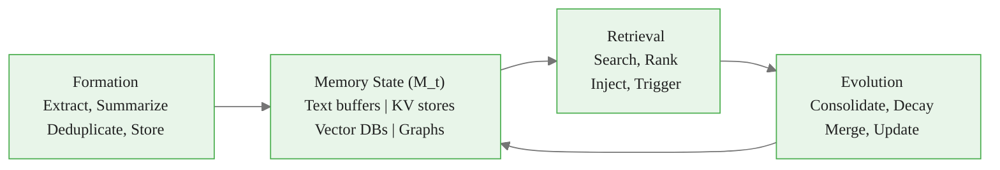

# Memory Operators: Formation, Retrieval, and Evolution

> **Reading time:** ~15 min | **Module:** 3 — Memory Systems | **Prerequisites:** 01 Memory Taxonomy, 02 RAG Architecture

<span class="badge lavender">Intermediate</span> <span class="badge amber">~15 min</span> <span class="badge blue">Module 3</span>

## Introduction

Memory isn't just storage -- it's a living system with three core operators: **Formation** (how memories enter), **Retrieval** (how memories are accessed), and **Evolution** (how memories change over time). Master these operators to build agents that truly learn.

<div class="callout-insight">

<strong>Key Insight:</strong> The practical product question is never "How do I add memory?" It's: "Which memory form + which memory function + which lifecycle policy actually improves decision quality for my agent?"

</div>

<div class="callout-key">

**Key Concept Summary:** Memory operators form a lifecycle: Formation (extract, summarize, deduplicate, score, store) brings information into the system; Retrieval (search, rank, inject, trigger) gets the right memories at the right time; Evolution (consolidate, decay, prune, reinforce, update) keeps the memory system healthy. Each operator has multiple strategies, and the right combination depends on your agent's domain and scale.

</div>

## Visual Explanation



<div class="caption">Figure 1: The memory lifecycle — formation, retrieval, and evolution operating on shared memory state.</div>

## Operator 1: Formation

**Purpose:** Transform raw experiences into stored memories.

### Formation Operations

| Operation | What It Does | Why It Matters |
|-----------|--------------|----------------|
| **Extract** | Identify memory candidates from artifacts | Not everything should be remembered |
| **Summarize** | Compress verbose content | Efficient storage and retrieval |
| **Normalize** | Standardize format | Consistent retrieval |
| **Deduplicate** | Remove redundant memories | Prevent bloat |
| **Score** | Assign importance/relevance | Prioritize valuable memories |
| **Store** | Write to appropriate memory form | Match form to function |

### Implementation Pattern


<div class="code-window">
<div class="code-header">
<div class="dots"><span class="dot-red"></span><span class="dot-yellow"></span><span class="dot-green"></span></div>
<span class="filename">memory_formation.py</span>
</div>

```python
import hashlib
from dataclasses import dataclass
from datetime import datetime
from typing import Optional

@dataclass
class Memory:
    id: str
    content: str
    summary: Optional[str]
    importance: float
    memory_type: str  # factual, experiential, procedural
    source: str
    created_at: datetime
    embedding: Optional[list] = None
    metadata: dict = None

class MemoryFormation:
    def __init__(self, embedder, summarizer, vector_db):
        self.embedder = embedder
        self.summarizer = summarizer
        self.vector_db = vector_db
        self.importance_threshold = 0.3

    def process(self, artifact: dict) -> Optional[Memory]:
        """Full formation pipeline for a single artifact."""
        if not self._is_memorable(artifact):
            return None

        content = artifact["content"]
        summary = self._summarize(content) if len(content) > 500 else None

        importance = self._score_importance(artifact)
        if importance < self.importance_threshold:
            return None

        if self._is_duplicate(content):
            return None

        memory = Memory(
            id=hashlib.sha256(content.encode()).hexdigest()[:16],
            content=content,
            summary=summary,
            importance=importance,
            memory_type=self._classify_type(artifact),
            source=artifact.get("source", "unknown"),
            created_at=datetime.now(),
        )
        memory.embedding = self.embedder.encode(summary or content).tolist()
        self._store(memory)
        return memory
```

</div>
</div>

## Operator 2: Retrieval

**Purpose:** Select and inject relevant memories into current context.

### Retrieval Strategies

| Strategy | Description | Best For |
|----------|-------------|----------|
| **Event-based** | Retrieve at specific triggers (task start) | Structured workflows |
| **Continuous** | Retrieve every turn | Conversational agents |
| **Uncertainty-triggered** | Retrieve when confidence is low | Efficiency-focused |
| **Explicit** | Agent calls retrieval tool | Maximum control |

### Implementation Pattern


<div class="code-window">
<div class="code-header">
<div class="dots"><span class="dot-red"></span><span class="dot-yellow"></span><span class="dot-green"></span></div>
<span class="filename">memory_retrieval.py</span>
</div>

```python
import math

class MemoryRetrieval:
    def __init__(self, vector_db, reranker=None):
        self.vector_db = vector_db
        self.reranker = reranker

    def retrieve(self, query: str, k: int = 5,
                 recency_weight: float = 0.1,
                 importance_weight: float = 0.2) -> list:
        """Retrieve with multi-factor ranking."""
        results = self.vector_db.query(query_texts=[query], n_results=k * 3)

        memories = []
        for doc, meta, dist in zip(
            results["documents"][0],
            results["metadatas"][0],
            results["distances"][0]
        ):
            semantic_score = 1 - dist
            created = datetime.fromisoformat(meta["created_at"])
            days_old = (datetime.now() - created).days
            recency_score = math.exp(-days_old / 30)
            importance_score = meta.get("importance", 0.5)

            final_score = (
                (1 - recency_weight - importance_weight) * semantic_score +
                recency_weight * recency_score +
                importance_weight * importance_score
            )
            memories.append({"content": doc, "metadata": meta, "score": final_score})

        memories.sort(key=lambda x: x["score"], reverse=True)
        return memories[:k]
```

</div>
</div>

## Operator 3: Evolution

**Purpose:** Maintain memory health over time through consolidation, decay, and updates.

### Evolution Operations

| Operation | What It Does | When To Apply |
|-----------|--------------|---------------|
| **Consolidate** | Merge related memories into summaries | Periodically (daily/weekly) |
| **Decay** | Reduce importance of unused memories | Continuous or periodic |
| **Prune** | Remove low-value memories | When storage limits approached |
| **Update** | Modify memories with new information | On contradiction detection |
| **Reinforce** | Boost importance of accessed memories | On each retrieval |


<div class="code-window">
<div class="code-header">
<div class="dots"><span class="dot-red"></span><span class="dot-yellow"></span><span class="dot-green"></span></div>
<span class="filename">memory_evolution.py</span>
</div>

```python
class MemoryEvolution:
    def __init__(self, vector_db, embedder, summarizer):
        self.vector_db = vector_db
        self.embedder = embedder
        self.summarizer = summarizer

    def evolve(self):
        """Run full evolution cycle."""
        self.decay_unused()
        self.consolidate_similar()
        self.prune_low_value()

    def decay_unused(self, decay_rate: float = 0.95):
        """Reduce importance of memories not accessed recently."""
        all_memories = self.vector_db.get()
        for id, meta in zip(all_memories["ids"], all_memories["metadatas"]):
            last_accessed = meta.get("last_accessed")
            if last_accessed:
                days_since = (datetime.now() -
                             datetime.fromisoformat(last_accessed)).days
                if days_since > 7:
                    new_importance = meta["importance"] * (decay_rate ** days_since)
                    self.vector_db.update(
                        ids=[id],
                        metadatas=[{**meta, "importance": new_importance}]
                    )

    def reinforce(self, memory_id: str, boost: float = 0.1):
        """Boost importance when memory is accessed."""
        memory = self.vector_db.get(ids=[memory_id])
        if memory["ids"]:
            meta = memory["metadatas"][0]
            new_importance = min(meta["importance"] + boost, 1.0)
            self.vector_db.update(
                ids=[memory_id],
                metadatas=[{
                    **meta,
                    "importance": new_importance,
                    "last_accessed": datetime.now().isoformat(),
                    "access_count": meta.get("access_count", 0) + 1
                }]
            )
```

</div>
</div>

## Putting It All Together


<div class="code-window">
<div class="code-header">
<div class="dots"><span class="dot-red"></span><span class="dot-yellow"></span><span class="dot-green"></span></div>
<span class="filename">agent_memory.py</span>
</div>

```python
class AgentMemory:
    """Complete memory system with all three operators."""

    def __init__(self, config):
        self.formation = MemoryFormation(...)
        self.retrieval = MemoryRetrieval(...)
        self.evolution = MemoryEvolution(...)
        self.policy = RetrievalPolicy(self.retrieval)

    def remember(self, artifact: dict) -> Optional[Memory]:
        return self.formation.process(artifact)

    def recall(self, query: str, context: dict) -> str:
        memories = self.policy.get_memories(query, context)
        for mem in memories:
            self.evolution.reinforce(mem.get("id"))
        return self.retrieval.format_for_context(memories)

    def maintain(self):
        """Run periodic maintenance (call daily/weekly)."""
        self.evolution.evolve()
```

</div>

## Common Pitfalls

<div class="callout-danger">

<strong>Pitfall 1 — No formation filtering:</strong> Everything becomes a memory, causing bloat. Apply importance scoring and deduplication.


<div class="callout-warning">

<strong>Pitfall 2 — Static retrieval:</strong> Always retrieving the same way regardless of context. Use adaptive retrieval with multiple strategies.


<div class="callout-warning">

<strong>Pitfall 3 — No evolution:</strong> Memories become stale and contradictory. Implement decay, consolidation, and pruning.


## Practice Questions

1. **Design:** Create a formation policy for a customer support agent. What should be remembered? What filtered out?

2. **Implement:** Build a retrieval system that weights recency, importance, and semantic similarity. Test different weight combinations.

3. **Analyze:** An agent's memory has grown to 100K entries and retrieval is slow. Design an evolution strategy to maintain quality while reducing size.

## Cross-References

<a class="link-card" href="./03_memory_operators_guide_slides.md">
  <div class="link-card-title">Companion Slides — Memory Operators</div>
  <div class="link-card-description">Slide deck covering formation, retrieval, and evolution with visual lifecycle diagrams.</div>
</a>

<a class="link-card" href="./02_rag_architecture_guide.md">
  <div class="link-card-title">Previous Guide — RAG Architecture</div>
  <div class="link-card-description">Production-ready retrieval pipeline: chunking, embedding, reranking, generation.</div>
</a>

<a class="link-card" href="../../module_04_tool_use/guides/01_agent_loop_guide.md">
  <div class="link-card-title">Module 04 — The Agent Loop</div>
  <div class="link-card-description">How memory integrates with tool use in the agent loop pattern.</div>
</a>
