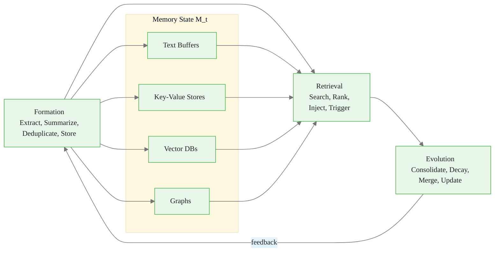
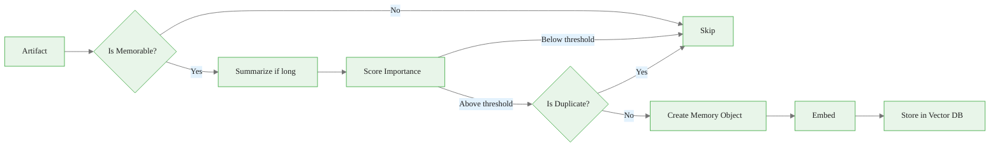
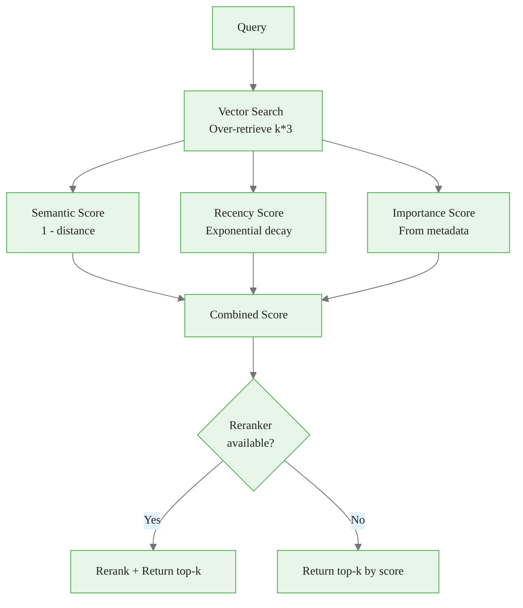
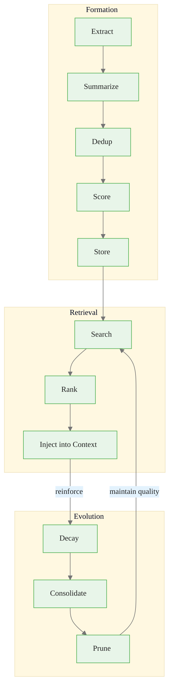

<!-- _class: lead -->

# Memory Operators
## Formation, Retrieval, and Evolution

**Module 03 -- Memory Systems**

<!-- Speaker notes: This deck covers the three core operators for managing agent memory. We use a personal assistant agent as a running example -- one that learns user preferences over weeks of interaction. By the end, you will understand how to build memory systems that form, retrieve, and evolve memories intelligently. -->

---

## In Brief

Memory is not just storage -- it is a living system with three core operators:

1. **Formation** -- how memories enter the system
2. **Retrieval** -- how memories are accessed
3. **Evolution** -- how memories change over time

> **The practical question is never "How do I add memory?" It is: "Which memory form + which function + which lifecycle policy actually improves decision quality for my agent?"**

<!-- Speaker notes: These three operators are the API of any memory system. Formation decides what to remember. Retrieval decides what to recall. Evolution decides what to keep, merge, or forget. A system without all three accumulates noise until it becomes useless. -->

---

## Memory Lifecycle



<!-- Speaker notes: The lifecycle is a feedback loop. Retrieval performance informs evolution (which memories are useful?), and evolution feeds back into formation (what should we remember next time?). The memory state at time t includes all storage forms. Our personal assistant uses a vector DB for semantic memories and a key-value store for structured preferences. -->

---

<!-- _class: lead -->

# Operator 1: Formation

<!-- Speaker notes: Formation is the gatekeeper -- not everything should become a memory. Without filtering, memory bloats and retrieval quality degrades. Think of formation as the agent's "attention" to what matters. -->

---

## Formation Operations

| Operation | What It Does | Why It Matters |
|-----------|--------------|----------------|
| **Extract** | Identify memory candidates | Not everything should be remembered |
| **Summarize** | Compress verbose content | Efficient storage and retrieval |
| **Normalize** | Standardize format | Consistent retrieval |
| **Deduplicate** | Remove redundant memories | Prevent bloat |
| **Score** | Assign importance/relevance | Prioritize valuable memories |
| **Store** | Write to appropriate form | Match form to function |

<!-- Speaker notes: Six operations in sequence. For our personal assistant, when the user says "I prefer morning meetings," the agent: extracts this as a preference (not just conversation filler), summarizes it ("morning meeting preference"), normalizes it (format as key-value), checks for duplicates (do we already know this?), scores it (high importance -- explicit preference statement), and stores it in the key-value store. -->

---

## Formation Pipeline -- Worked Example



**Trace:** User says "I have a meeting with Sarah every Tuesday at 10am, but next week it is moved to Wednesday."

- **Extract:** Two candidates -- recurring schedule + temporary override
- **Score:** Recurring = 0.9 (explicit schedule), Temporary = 0.7 (time-bound)
- **Deduplicate:** No existing "Sarah meeting" -> both pass
- **Store:** Recurring -> key-value (structured), Temporary -> vector DB with expiry

<!-- Speaker notes: This combines the pipeline diagram with a concrete trace. Three gates: (1) is it memorable? (2) is it important enough? (3) is it a duplicate? Notice two different memory types from one utterance: the recurring fact is stored permanently in key-value, the temporary override is stored with an expiry date. -->

---

## Formation: Importance Scoring

```python
def _score_importance(self, artifact: dict) -> float:
    """Score memory importance 0-1."""
    score = 0.5  # Base score

    # Boost for explicit user statements
    if artifact.get("source") == "user":
        score += 0.2

    # Boost for task outcomes
    if artifact.get("type") == "task_result":
        score += 0.2

    # Boost for preferences/corrections
    if any(w in artifact.get("content", "").lower()
           for w in ["prefer", "don't", "always", "never"]):
        score += 0.1

    return min(score, 1.0)
```

<!-- Speaker notes: Importance scoring is heuristic-based. The key signals: (1) user-stated information is more important than agent-inferred, (2) task outcomes are worth remembering, (3) preference language ("prefer," "always," "never") indicates high-value memories. For our personal assistant, "I never eat seafood" scores 0.8 (user source + preference keyword). "The weather today is sunny" scores 0.5 (no boost). -->

---

## Formation: Deduplication

```python
def _is_duplicate(self, content: str) -> bool:
    """Check if similar memory already exists."""
    embedding = self.embedder.encode(content).tolist()
    similar = self.vector_db.query(
        query_embeddings=[embedding],
        n_results=1
    )
    if similar["distances"][0]:
        # Cosine similarity > 0.95 = duplicate
        return (1 - similar["distances"][0][0]) > 0.95
    return False
```

<!-- Speaker notes: Deduplication uses semantic similarity. If a new memory is 95% similar to an existing one, it is a duplicate. The threshold of 0.95 is conservative -- "I prefer Italian food" and "I like Italian cuisine" have similarity around 0.92, so both get stored. "I prefer Italian food" and "I really prefer Italian food" have similarity around 0.97, so the second is skipped. Tune this threshold based on your use case. -->

---

<!-- _class: lead -->

# Operator 2: Retrieval

<!-- Speaker notes: Retrieval determines which memories the agent sees when making decisions. Poor retrieval means the agent ignores relevant memories and surfaces irrelevant ones. Multi-factor scoring is the key to good retrieval. -->

---

## Retrieval Strategies

| Strategy | Description | Best For |
|----------|-------------|----------|
| **Event-based** | Retrieve at specific triggers | Structured workflows |
| **Continuous** | Retrieve every turn | Conversational agents |
| **Uncertainty-triggered** | Retrieve when confidence low | Efficiency-focused |
| **Explicit** | Agent calls retrieval tool | Maximum control |

<!-- Speaker notes: For our personal assistant, we use continuous retrieval (every user message triggers a memory search) combined with event-based (calendar events trigger schedule memories). The choice depends on latency budget: continuous adds 10-50ms per turn, event-based only retrieves when triggered. Uncertainty-triggered is the most efficient but requires a confidence signal from the model. -->

---

## Multi-Factor Retrieval Ranking



<!-- Speaker notes: Three factors: semantic relevance (does the memory match the query?), recency (is it fresh?), and importance (was it important when stored?). Over-retrieve by 3x and rank to get the best results. For the personal assistant, when the user says "Set up my weekly meetings," the system retrieves: Sarah Tuesday meeting (high semantic + high importance), old project meeting (high semantic but decayed recency), coffee preference (low semantic, filtered out). -->

---

## Retrieval: Combined Scoring

```python
def retrieve(self, query, k=5,
             recency_weight=0.1, importance_weight=0.2):
    results = self.vector_db.query(query_texts=[query],
                                   n_results=k * 3)
    memories = []
    for doc, meta, dist in zip(...):
        semantic_score = 1 - dist

        # Recency: exponential decay, 30-day half-life
        days_old = (datetime.now() -
                    datetime.fromisoformat(
                        meta["created_at"])).days
        recency_score = math.exp(-days_old / 30)

        importance_score = meta.get("importance", 0.5)

        final_score = (
            (1 - recency_weight - importance_weight) * semantic_score
            + recency_weight * recency_score
            + importance_weight * importance_score
        )
        memories.append({"content": doc, "score": final_score, ...})

    memories.sort(key=lambda x: x["score"], reverse=True)
    return memories[:k]
```

<!-- Speaker notes: The weights control the balance. Default: 70% semantic, 10% recency, 20% importance. For our personal assistant, a memory from yesterday about Italian food preference (semantic: 0.8, recency: 0.97, importance: 0.8) scores higher than a memory from 3 months ago about the same topic (semantic: 0.8, recency: 0.05, importance: 0.8). Tune weights based on your domain. Retrieval triggers: task start, explicit user request, every N turns, or on model uncertainty. -->

---

<!-- _class: lead -->

# Operator 3: Evolution

<!-- Speaker notes: Evolution is the most underappreciated operator. Without it, memory accumulates endlessly, becomes stale, and contradicts itself. Evolution is what makes memory a living system rather than a dead archive. -->

---

## Evolution Operations

| Operation | What It Does | When To Apply |
|-----------|--------------|---------------|
| **Consolidate** | Merge related memories into summaries | Periodically (daily/weekly) |
| **Decay** | Reduce importance of unused memories | Continuous or periodic |
| **Prune** | Remove low-value memories | Storage limits approached |
| **Update** | Modify memories with new information | Contradiction detection |
| **Reinforce** | Boost importance of accessed memories | On each retrieval |

<!-- Speaker notes: Five evolution operations. For our personal assistant: consolidate (merge "likes Italian" + "likes pasta" + "likes pizza" into "prefers Italian cuisine"), decay (reduce importance of a restaurant recommendation from 6 months ago), prune (remove memories below 0.1 importance), update (change address when user moves), reinforce (boost importance of morning meeting preference every time it is retrieved). -->

---

## Evolution: Decay, Consolidation, Pruning, Reinforcement

<div class="columns">
<div>

**Pruning**
```python
def prune_low_value(self,
                    min_importance=0.1,
                    max_memories=10000):
    count = self.vector_db.count()
    if count <= max_memories:
        return
    all_mems = self.vector_db.get()
    sorted_by_imp = sorted(
        zip(all_mems["ids"],
            all_mems["metadatas"]),
        key=lambda x: x[1].get(
            "importance", 0)
    )
    to_remove = count - max_memories
    remove_ids = [
        id for id, meta
        in sorted_by_imp[:to_remove]
        if meta.get("importance", 0)
           < min_importance
    ]
    if remove_ids:
        self.vector_db.delete(ids=remove_ids)
```

</div>
<div>

**Reinforcement**
```python
def reinforce(self, memory_id: str,
              boost: float = 0.1):
    """Boost importance when accessed."""
    memory = self.vector_db.get(
        ids=[memory_id]
    )
    if memory["ids"]:
        meta = memory["metadatas"][0]
        new_imp = min(
            meta["importance"] + boost, 1.0
        )
        self.vector_db.update(
            ids=[memory_id],
            metadatas=[{
                **meta,
                "importance": new_imp,
                "last_accessed":
                    datetime.now().isoformat(),
                "access_count":
                    meta.get("access_count", 0) + 1
            }]
        )
```

</div>
</div>

<!-- Speaker notes: Four evolution operations: (1) Decay reduces importance exponentially -- 0.95^30 = 21% after 30 days without access. (2) Consolidation clusters similar memories and merges them into summaries. (3) Pruning removes lowest-value memories when storage limits are reached. (4) Reinforcement boosts importance every time a memory is retrieved. Together they create Darwinian selection: useful memories survive, unused ones fade. For the personal assistant, food preferences consolidate into one rich summary, morning meeting gets reinforced weekly, and a one-time weather query decays and gets pruned. -->

---

## Putting It All Together

```python
class AgentMemory:
    """Complete memory system with all three operators."""

    def __init__(self, config):
        self.formation = MemoryFormation(...)
        self.retrieval = MemoryRetrieval(...)
        self.evolution = MemoryEvolution(...)
        self.policy = RetrievalPolicy(self.retrieval)

    def remember(self, artifact: dict) -> Optional[Memory]:
        """Form a new memory from an artifact."""
        return self.formation.process(artifact)

    def recall(self, query: str, context: dict) -> str:
        """Retrieve relevant memories for current context."""
        memories = self.policy.get_memories(query, context)
        for mem in memories:
            self.evolution.reinforce(mem.get("id"))
        return self.retrieval.format_for_context(memories)

    def maintain(self):
        """Run periodic maintenance (call daily/weekly)."""
        self.evolution.evolve()
```

<!-- Speaker notes: This is the unified API. Three methods: remember (formation), recall (retrieval + reinforcement), maintain (evolution). The maintain method should be called on a schedule -- daily for active agents, weekly for less active ones. For the personal assistant, remember() is called after each conversation turn, recall() is called before generating each response, and maintain() runs nightly via a cron job. -->

---

<!-- _class: lead -->

# Common Pitfalls

<!-- Speaker notes: Three classic pitfalls that break memory systems. Each corresponds to a missing operator. -->

---

## Pitfall 1: No Formation Filtering

**Problem:** Everything becomes a memory, causing bloat.

**Solution:** Apply importance scoring and deduplication.

## Pitfall 2: Static Retrieval

**Problem:** Always retrieve the same way regardless of context.

**Solution:** Adaptive retrieval with multiple strategies.

## Pitfall 3: No Evolution

**Problem:** Memories become stale and contradictory.

**Solution:** Implement decay, consolidation, and pruning.

<!-- Speaker notes: Pitfall 1: the personal assistant stores "Sure, I can help" as a memory. After 1000 conversations, memory is 90% noise. Pitfall 2: the assistant always retrieves the same 5 memories regardless of whether the user is asking about food or meetings. Pitfall 3: the assistant remembers the user's old address and new address, giving conflicting information. Each pitfall is solved by implementing the corresponding operator properly. -->

---

## Connections & Practice

**Builds on:** Memory taxonomy (Guide 01), RAG architecture (Guide 02)

**Leads to:** Module 04 (memory-aware agents), Module 08 (memory at scale)

### Practice Problems

1. Create a formation policy for a customer support agent. What should be remembered? What filtered out?
2. Build a retrieval system weighting recency, importance, and semantic similarity. Test different weight combinations.
3. An agent's memory has 100K entries and retrieval is slow. Design an evolution strategy to reduce size while maintaining quality.

<!-- Speaker notes: Problem 1 tests formation design. Remember: customer preferences, issue resolutions, escalation patterns. Filter: greetings, acknowledgments, boilerplate. Problem 2 is hands-on implementation. Problem 3 tests evolution design: consolidate similar memories, prune below importance threshold, decay unused entries, then re-index the vector DB. -->

---

## Visual Summary



> Master these three operators to build agents that truly learn.

<!-- Speaker notes: The visual summary shows the three operators as pipelines connected by feedback loops. Retrieval reinforces memories that are used. Evolution prunes memories that are not. Formation gates what enters the system. Together, they create a memory system that improves over time rather than degrading. The personal assistant example showed how each operator works in practice across real user interactions. -->
