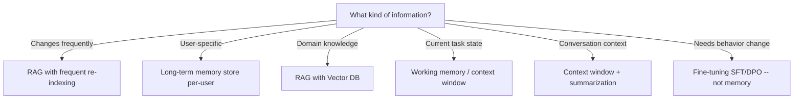
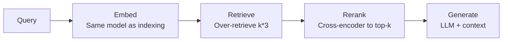
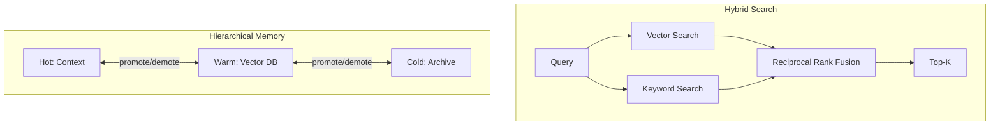
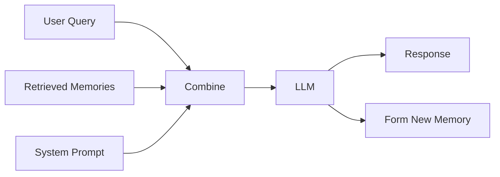
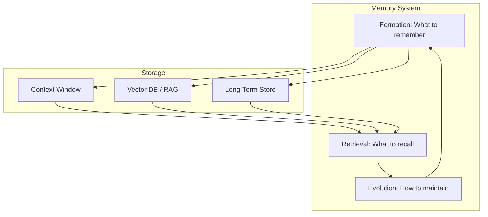

<!-- _class: lead -->

# Memory Systems Cheatsheet
## Quick Reference for LLM Memory

**Module 03 -- Memory Systems**

<!-- Speaker notes: This is a reference deck for Module 03. Use it as a quick lookup during development. Covers decision trees, comparison tables, code snippets, and debugging tips for memory systems. Not intended for linear presentation -- use as a handout or self-study reference. -->

---

## The Memory Decision Tree



<!-- Speaker notes: Start here when designing a memory system. Follow the decision tree based on the type of information you need to manage. Most systems need multiple branches: RAG for knowledge, long-term for user preferences, context for current task. The last branch is a common mistake: behavior changes (tone, style, format) are not a memory problem -- they require fine-tuning. -->

---

## Memory Forms Comparison

| Form | Access Speed | Capacity | Update Cost | Best For |
|------|-------------|----------|-------------|----------|
| **Context Window** | Instant | Limited (4K-128K) | Free | Current task |
| **Vector DB** | Fast (~10ms) | Unlimited | Index rebuild | Knowledge base |
| **Key-Value Store** | Very fast | Large | Instant | User prefs, state |
| **Graph DB** | Medium | Large | Medium | Relationships |
| **Model Weights** | Instant | Fixed | Very expensive | Core behaviors |

<!-- Speaker notes: Quick comparison of memory forms. Context window is free but limited. Vector DB scales but adds latency. Key-value is the fastest external store for structured data. Graph DB excels at relationship queries (e.g., "which products does this customer also own?"). Model weights are instant but essentially immutable in production. Choose based on your access pattern and scale requirements. -->

---

## RAG Pipeline Quick Reference



<!-- Speaker notes: The five-step RAG pipeline in one diagram. Key details: (1) use the same embedding model for queries and documents, (2) over-retrieve by 3x and let the reranker narrow down, (3) cross-encoder reranking improves quality by 15-20%. See the RAG Architecture deck (Part 1) for complete implementation. -->

---

## Chunking Strategies

| Strategy | Chunk Size | Overlap | Best For |
|----------|------------|---------|----------|
| **Fixed** | 500 tokens | 50 tokens | General purpose |
| **Sentence** | 3-5 sentences | 1 sentence | Natural boundaries |
| **Paragraph** | 1 paragraph | 0 | Well-structured docs |
| **Semantic** | Variable | Context-aware | Quality-critical |
| **Recursive** | Target size | 10-20% | Mixed content |

> **Rule of thumb:** Start with 500 tokens, 10% overlap. Adjust based on retrieval quality.

<!-- Speaker notes: Chunking strategy has the largest impact on retrieval quality. Fixed-size chunking is the simplest and works well for most use cases. Sentence chunking respects natural language boundaries. Paragraph chunking works for well-structured documents (like policies or manuals). Semantic chunking uses the embedding model to find natural topic boundaries -- highest quality but most complex. Start simple, measure, then optimize. -->

---

## Embedding Models

| Model | Dims | Speed | Quality | Cost |
|-------|------|-------|---------|------|
| `all-MiniLM-L6-v2` | 384 | Very fast | Good | Free |
| `bge-small-en-v1.5` | 384 | Fast | Very good | Free |
| `bge-base-en-v1.5` | 768 | Medium | Excellent | Free |
| `text-embedding-3-small` | 1536 | API | Excellent | $0.02/1M |
| `voyage-2` | 1024 | API | State-of-art | $0.10/1M |

<!-- Speaker notes: Start with bge-small for prototyping and production. Move to bge-base if you need better quality and can accept slower encoding. API models (OpenAI, Voyage) are highest quality but require network calls and incur per-token costs. For domain-specific applications (medical, legal, financial), consider fine-tuning bge-small on your domain data for the best quality-speed tradeoff. -->

---

## Vector Databases

| Database | Type | Scale | Complexity | Cost |
|----------|------|-------|------------|------|
| **Chroma** | Embedded | <1M | Low | Free |
| **Pinecone** | Managed | Unlimited | Low | Pay per use |
| **Qdrant** | Self-host/Cloud | Large | Medium | Free/Paid |
| **Weaviate** | Self-host/Cloud | Large | Medium | Free/Paid |
| **pgvector** | PostgreSQL ext | Medium | Low | Free |

<!-- Speaker notes: For prototyping: Chroma (zero config, runs locally). For production with managed infrastructure: Pinecone (simplest, but cost adds up at scale). For existing PostgreSQL users: pgvector (no new infrastructure). For high-performance self-hosted: Qdrant or Weaviate. The choice often depends more on operational constraints than technical features. -->

---

## Memory Operators at a Glance

<div class="columns">
<div>

**Formation**
```python
extract()      # Identify candidates
summarize()    # Compress content
deduplicate()  # Remove redundant
score()        # Assign importance
store()        # Write to store
```

**Retrieval**
```python
search()       # Vector similarity
filter()       # Metadata filters
rerank()       # Cross-encoder
inject()       # Format for prompt
```

</div>
<div>

**Evolution**
```python
decay()        # Reduce unused importance
consolidate()  # Merge similar memories
prune()        # Remove low-value
reinforce()    # Boost accessed memories
```

</div>
</div>

<!-- Speaker notes: The three operators as pseudocode. Formation gates what enters memory. Retrieval determines what the agent sees. Evolution maintains memory quality over time. Every memory system needs all three. Without formation filtering, memory bloats. Without multi-factor retrieval, irrelevant memories surface. Without evolution, memories become stale. See the Memory Operators deck for full implementations. -->

---

## Retrieval Metrics

| Metric | Formula | Good Value |
|--------|---------|------------|
| **Recall@5** | Relevant in top-5 / Total relevant | >0.8 |
| **Precision@5** | Relevant in top-5 / 5 | >0.6 |
| **MRR** | Mean(1/rank of first relevant) | >0.5 |
| **Latency p95** | 95th percentile response time | <100ms |

<!-- Speaker notes: Measure these four metrics for any RAG system. Recall@5 above 0.8 means you are finding most relevant documents. Precision@5 above 0.6 means most retrieved documents are relevant. MRR above 0.5 means the first relevant document is usually in the top 2. Latency p95 under 100ms keeps the user experience responsive. If any metric is below threshold, check chunk size, embedding model, and reranking. -->

---

## Quick RAG Setup

```python
import chromadb
from sentence_transformers import SentenceTransformer

# Setup
embedder = SentenceTransformer("BAAI/bge-small-en-v1.5")
db = chromadb.PersistentClient("./db")
collection = db.get_or_create_collection("docs")

# Index
collection.add(
    documents=["doc1", "doc2"],
    embeddings=embedder.encode(["doc1", "doc2"]).tolist(),
    ids=["1", "2"]
)

# Query
results = collection.query(
    query_embeddings=embedder.encode(["query"]).tolist(),
    n_results=5
)
```

<!-- Speaker notes: Minimal RAG setup in 15 lines. Copy-paste into any project. Uses bge-small for embeddings and Chroma for storage. The three operations: setup (create embedder + DB), index (add documents), query (retrieve by similarity). For production, add: metadata, error handling, and the reranking step from the RAG Architecture deck. -->

---

## Memory Formation & Decay Snippets

<div class="columns">
<div>

**Should We Remember?**
```python
def should_remember(content, source):
    if source == "user" and len(content) > 20:
        return True
    if any(w in content.lower()
           for w in ["prefer", "always",
                     "never"]):
        return True
    return False
```

</div>
<div>

**Decay Function**
```python
def decay_importance(importance,
                     days_unused):
    """Exponential decay,
       30-day half-life."""
    return importance * (
        0.95 ** days_unused
    )
```

</div>
</div>

<!-- Speaker notes: Two essential snippets. The formation filter checks if content is worth remembering: user statements longer than 20 characters and preference keywords pass through. The decay function reduces importance exponentially: after 30 days without access, importance drops to 21% of original. Tune the 0.95 rate based on your domain -- faster decay for volatile information, slower for stable preferences. -->

---

## Common Patterns



<!-- Speaker notes: Two patterns. Hybrid search combines vector search (semantic) with keyword search (BM25) using Reciprocal Rank Fusion. This catches queries where exact terms matter (product names, error codes). Hierarchical memory uses hot/warm/cold tiers like a cache: frequently accessed memories in context, medium-frequency in vector DB, rarely accessed in archive. Promotion and demotion happen based on access patterns. -->

---

## Memory-Augmented Generation



<!-- Speaker notes: The complete memory-augmented generation flow. Three inputs to the LLM: user query, retrieved memories, and system prompt. Two outputs: response to the user and new memory formation. The memory formation output is what makes the system learn -- every interaction potentially creates new memories that improve future responses. This creates a flywheel effect. -->

---

## Anti-Patterns

| Don't | Do Instead |
|-------|------------|
| Store everything | Filter by importance |
| Never update memories | Implement evolution |
| Single retrieval strategy | Adaptive retrieval |
| Ignore metadata | Use metadata for filtering |
| Same embedding for all | Domain-specific when beneficial |
| Retrieve once, use forever | Re-retrieve on context change |

<!-- Speaker notes: Six anti-patterns. The most common: storing everything without filtering leads to memory bloat and degraded retrieval quality within weeks. The most costly: using the same generic embedding model when a domain-specific one would significantly improve retrieval. The most subtle: retrieving once at the start of a conversation and reusing stale results as the conversation evolves. -->

---

## When to Use What

<div class="columns">
<div>

**RAG**
- External knowledge needed
- Information changes over time
- Need source attribution
- Large knowledge base

**Long-term Memory**
- User-specific information
- Cross-session persistence
- Learning from interactions

</div>
<div>

**Fine-tuning**
- Need behavior change
- Domain-specific language
- Consistent style/format

**Weight Editing (ROME/MEMIT)**
- Specific fact corrections
- Cannot use retrieval
- Small number of edits

</div>
</div>

<!-- Speaker notes: Quick decision guide. RAG is the default for adding knowledge. Long-term memory is for personalization across sessions. Fine-tuning is for behavior and style changes. Weight editing is a niche technique for when you need to correct specific facts in the model without retraining -- rarely used in practice because RAG is usually simpler and more flexible. -->

---

## Quick Debugging

| Problem | Likely Cause | Fix |
|---------|--------------|-----|
| Poor retrieval | Wrong chunk size | Try 200-1000 range |
| Missing context | No overlap | Add 10-20% overlap |
| Slow queries | Too many results | Reduce k, add filtering |
| Stale answers | Old documents | Re-index, add timestamps |
| Hallucination | Retrieved but not used | Check prompt formatting |
| Memory bloat | No deduplication | Add similarity threshold |

<!-- Speaker notes: When your memory system is not working, check this table first. The most common issue is chunk size -- if retrieval quality is poor, try different sizes from 200 to 1000 tokens. The most confusing issue is hallucination despite good retrieval -- this usually means the prompt formatting is wrong and the model is ignoring the retrieved context. Check that context appears prominently in the prompt and the instruction explicitly tells the model to use it. -->

---

## Visual Summary



> Match memory form to function. Implement all three lifecycle operators.

<!-- Speaker notes: The complete memory system in one diagram. Three operators (formation, retrieval, evolution) managing three storage forms (context, vector DB, long-term). The cycle flows from formation through retrieval through evolution and back. This is the mental model for all memory engineering. Keep this diagram handy while building. -->
