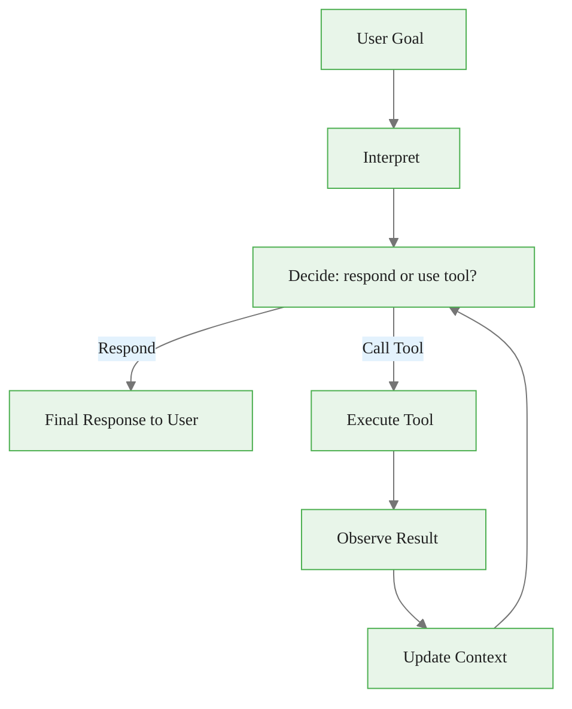

# The Agent Loop: From Text Generation to World Interaction

> **Reading time:** ~15 min | **Module:** 4 — Tool Use | **Prerequisites:** Module 3 (Memory Systems)

<span class="badge lavender">Intermediate</span> <span class="badge amber">~15 min</span> <span class="badge blue">Module 4</span>

## Introduction

An agent is an LLM that can take actions in the world, observe results, and iterate until a goal is achieved. The agent loop is the fundamental pattern that makes this possible.

<div class="callout-insight">
<strong>Key Insight:</strong> The agent loop transforms a "text predictor" into a "goal achiever" by closing the feedback loop between generation and world state.
</div>

<div class="callout-key">

**Key Concept Summary:** The agent loop has five stages: interpret goal, decide action (respond or call tool), execute tool, observe result, and update context to iterate. Tool descriptions drive the model's action selection. Termination conditions (max iterations, error thresholds, cost limits) prevent runaway loops. Error handling at the tool execution layer is essential for production reliability.

</div>

## Visual Explanation



<div class="caption">Figure 1: The agent loop — decide, execute, observe, iterate until goal is achieved or limits are reached.</div>

## The Loop Components

### 1. Interpret Goal

<div class="code-window">
<div class="code-header">
<div class="dots"><span class="dot-red"></span><span class="dot-yellow"></span><span class="dot-green"></span></div>
<span class="filename">interpret.py</span>
</div>
<div class="code-body">

```python
def interpret_goal(user_message: str, context: list) -> str:
    """Understand what the user wants to achieve."""
    system_prompt = """You are a helpful assistant with access to tools.

    When the user asks for something:
    1. Identify the core goal
    2. Determine what information or actions are needed
    3. Use tools when they can help achieve the goal
    4. Only respond when you have sufficient information
    """
    return system_prompt
```

</div>
</div>

### 2. Decide Action

The LLM chooses whether to call a tool, and if so, which one.

<div class="code-window">
<div class="code-header">
<div class="dots"><span class="dot-red"></span><span class="dot-yellow"></span><span class="dot-green"></span></div>
<span class="filename">decide.py</span>
</div>
<div class="code-body">

```python
import anthropic

client = anthropic.Anthropic()

def decide_action(messages: list, tools: list) -> dict:
    """Let the model decide next action."""
    response = client.messages.create(
        model="claude-sonnet-4-20250514",
        max_tokens=1024,
        tools=tools,
        messages=messages
    )
    return {
        "stop_reason": response.stop_reason,
        "content": response.content
    }
```

</div>
</div>

<div class="callout-info">
<strong>Info:</strong> The model evaluates available tools against the current goal, considers tool descriptions and parameter schemas, and chooses the most appropriate action -- or responds directly if no tool is needed.
</div>

### 3. Execute Tool

<div class="code-window">
<div class="code-header">
<div class="dots"><span class="dot-red"></span><span class="dot-yellow"></span><span class="dot-green"></span></div>
<span class="filename">execute.py</span>
</div>
<div class="code-body">

```python
import json

def execute_tool(tool_name: str, tool_input: dict, tool_registry: dict) -> str:
    """Execute a tool and return the result."""
    if tool_name not in tool_registry:
        return f"Error: Unknown tool '{tool_name}'"

    tool_function = tool_registry[tool_name]
    try:
        result = tool_function(**tool_input)
        return json.dumps(result) if isinstance(result, dict) else str(result)
    except Exception as e:
        return f"Error executing {tool_name}: {str(e)}"
```

</div>
</div>

<div class="callout-danger">
<strong>Danger:</strong> Always wrap tool execution in try/catch. A single unhandled exception crashes the agent loop and leaves the user with no response.
</div>

### 4. Observe Result

<div class="code-window">
<div class="code-header">
<div class="dots"><span class="dot-red"></span><span class="dot-yellow"></span><span class="dot-green"></span></div>
<span class="filename">observe.py</span>
</div>
<div class="code-body">

```python
def observe_result(tool_use_id: str, result: str) -> dict:
    """Format tool result for the model."""
    return {
        "role": "user",
        "content": [
            {
                "type": "tool_result",
                "tool_use_id": tool_use_id,
                "content": result
            }
        ]
    }
```

</div>
</div>

### 5. Complete Agent Loop

<div class="code-window">
<div class="code-header">
<div class="dots"><span class="dot-red"></span><span class="dot-yellow"></span><span class="dot-green"></span></div>
<span class="filename">agent.py</span>
</div>
<div class="code-body">

```python
import anthropic
import json

class Agent:
    def __init__(self, tools: list, tool_registry: dict):
        self.client = anthropic.Anthropic()
        self.tools = tools
        self.tool_registry = tool_registry
        self.system_prompt = """You are a helpful assistant with access to tools.
        Use tools when they help achieve the user's goal.
        Think step by step about what information you need."""

    def run(self, user_message: str, max_iterations: int = 10) -> str:
        messages = [{"role": "user", "content": user_message}]

        for _ in range(max_iterations):
            response = self.client.messages.create(
                model="claude-sonnet-4-20250514",
                max_tokens=4096,
                system=self.system_prompt,
                tools=self.tools,
                messages=messages
            )

            if response.stop_reason == "end_turn":
                return self._extract_text(response.content)

            tool_results = []
            for block in response.content:
                if block.type == "tool_use":
                    result = self._execute_tool(block.name, block.input)
                    tool_results.append({
                        "type": "tool_result",
                        "tool_use_id": block.id,
                        "content": result
                    })

            messages.append({"role": "assistant", "content": response.content})
            messages.append({"role": "user", "content": tool_results})

        return "Agent did not complete within iteration limit"

    def _execute_tool(self, name: str, input: dict) -> str:
        if name not in self.tool_registry:
            return json.dumps({"error": f"Unknown tool: {name}"})
        try:
            result = self.tool_registry[name](**input)
            return json.dumps(result) if isinstance(result, dict) else str(result)
        except Exception as e:
            return json.dumps({"error": str(e)})

    def _extract_text(self, content: list) -> str:
        for block in content:
            if hasattr(block, "text"):
                return block.text
        return ""
```

</div>
</div>

## Loop Termination

The agent loop should terminate when:

| Condition | What Happens |
|-----------|--------------|
| **Goal achieved** | Model responds with final answer |
| **Max iterations** | Force stop, return partial result |
| **Error threshold** | Too many consecutive errors |
| **User cancellation** | External interrupt signal |
| **Cost limit** | Token budget exhausted |

<div class="code-window">
<div class="code-header">
<div class="dots"><span class="dot-red"></span><span class="dot-yellow"></span><span class="dot-green"></span></div>
<span class="filename">loop_controller.py</span>
</div>
<div class="code-body">

```python
class LoopController:
    def __init__(self, max_iterations=10, max_errors=3, max_tokens=10000):
        self.max_iterations = max_iterations
        self.max_errors = max_errors
        self.max_tokens = max_tokens
        self.iteration = 0
        self.error_count = 0
        self.token_count = 0

    def should_continue(self, response) -> tuple[bool, str]:
        self.iteration += 1
        self.token_count += response.usage.total_tokens

        if self.iteration >= self.max_iterations:
            return False, "max_iterations"
        if self.error_count >= self.max_errors:
            return False, "max_errors"
        if self.token_count >= self.max_tokens:
            return False, "max_tokens"
        if response.stop_reason == "end_turn":
            return False, "completed"

        return True, "continue"
```

</div>
</div>

## Common Pitfalls

<div class="callout-danger">
<strong>Pitfall 1 — No termination condition:</strong> Agent loops forever. Always set max_iterations and implement explicit exit conditions.
</div>

<div class="callout-warning">
<strong>Pitfall 2 — Lost context:</strong> Model forgets earlier tool results. Maintain full message history; consider summarization for long conversations.
</div>

<div class="callout-warning">
<strong>Pitfall 3 — Tool description mismatch:</strong> Model calls tools incorrectly because descriptions are vague. Write clear, specific tool descriptions with examples.
</div>

<div class="callout-warning">
<strong>Pitfall 4 — No error handling:</strong> Single tool failure crashes the agent. Wrap tool execution in try/catch, provide error feedback to model.
</div>

## Practice Questions

1. **Implement:** Build an agent with a calculator tool. Have it solve multi-step math problems.

2. **Debug:** An agent is calling the same tool repeatedly with the same arguments. What's wrong?

3. **Design:** How would you modify the loop to support parallel tool execution?

## Cross-References

<a class="link-card" href="./01_agent_loop_guide_slides.md">
  <div class="link-card-title">Companion Slides — The Agent Loop</div>
  <div class="link-card-description">Slide deck with agent loop diagrams and tool call flow examples.</div>
</a>

<a class="link-card" href="../../module_03_memory_systems/guides/03_memory_operators_guide.md">
  <div class="link-card-title">Module 03 — Memory Operators</div>
  <div class="link-card-description">How memory formation, retrieval, and evolution integrate with agent loops.</div>
</a>

<a class="link-card" href="../../module_00_ai_engineer_mindset/guides/02_the_closed_loop.md">
  <div class="link-card-title">Module 00 — The Closed Loop</div>
  <div class="link-card-description">The high-level mental model that the agent loop implements.</div>
</a>
