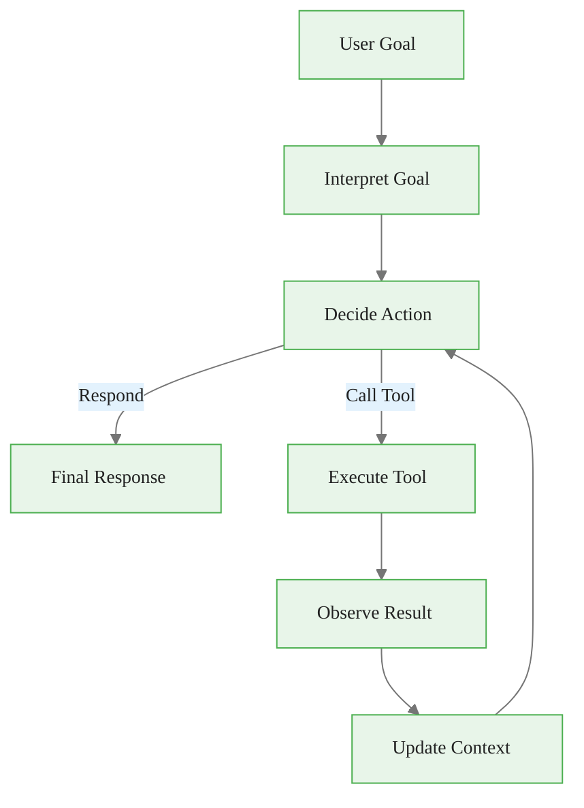
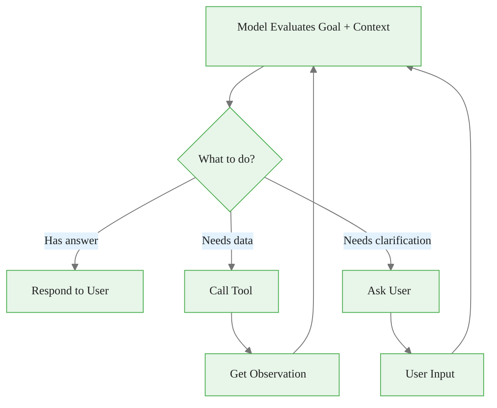
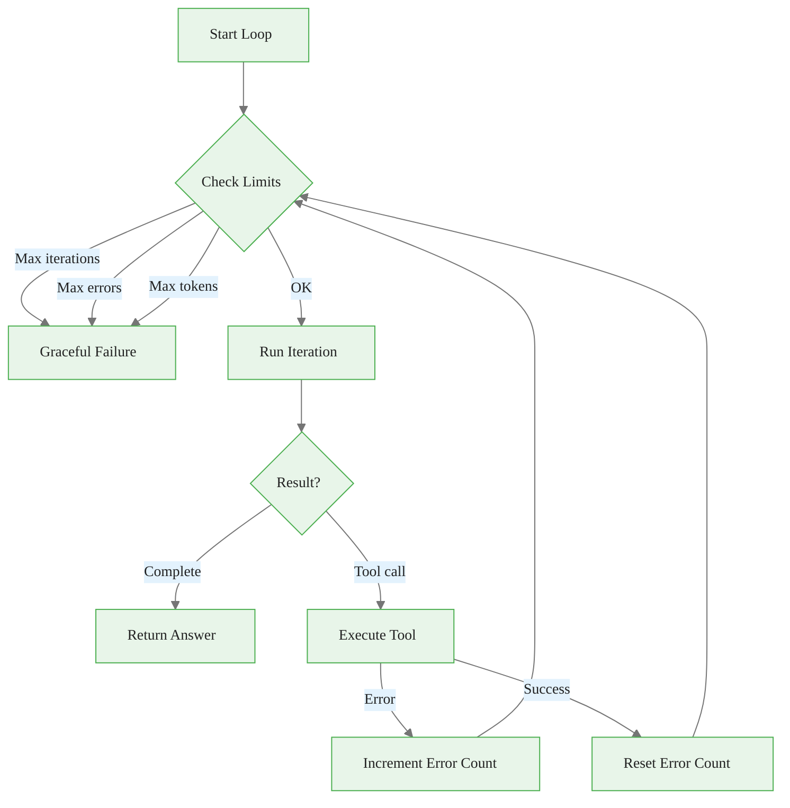
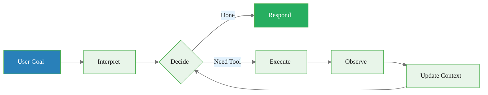

<!-- _class: lead -->

# The Agent Loop
## From Text Generation to World Interaction

**Module 04 -- Tool Use**

<!-- Speaker notes: This deck covers the five components of the agent loop and how they combine into a working agent. We trace a concrete example throughout: "What is the weather in Tokyo?" This simple question requires tool use and demonstrates every component of the loop. -->

---

## In Brief

An agent is an LLM that can **take actions** in the world, **observe results**, and **iterate** until a goal is achieved.

> **The agent loop transforms a "text predictor" into a "goal achiever" by closing the feedback loop between generation and world state.**

<!-- Speaker notes: The key distinction: a chatbot generates text. An agent takes actions. A chatbot would say "I think the weather in Tokyo is probably around 20C." An agent calls a weather API and says "It is currently 18C and cloudy in Tokyo." The difference is grounding in reality through tool use. -->

---

## The Agent Loop Architecture



**Trace:** "What's the weather in Tokyo? Should I bring an umbrella?"
- **Iteration 1:** Decide -> call `get_weather("Tokyo")` -> observe `{18C, light rain}` -> update context
- **Iteration 2:** Decide -> have enough info -> respond "18C with light rain. Yes, bring an umbrella."

<!-- Speaker notes: Five components in a loop: interpret, decide, execute, observe, update. The trace shows two iterations. Iteration 1 calls the weather API. Iteration 2 has the data and responds. The agent combined weather facts (from the tool) with reasoning (umbrella recommendation) -- tools for facts, LLM for reasoning. -->

---

## Component 1: Interpret Goal

```python
def interpret_goal(user_message: str, context: list) -> str:
    """
    Understand what the user wants to achieve.
    This happens implicitly through system prompt
    and conversation context.
    """
    system_prompt = """You are a helpful assistant
    with access to tools.

    When the user asks for something:
    1. Identify the core goal
    2. Determine what information or actions are needed
    3. Use tools when they can help achieve the goal
    4. Only respond when you have sufficient information
    """
    return system_prompt
```

<!-- Speaker notes: Goal interpretation is encoded in the system prompt. The four rules guide the model's decision-making: identify the goal (weather query), determine needs (API call required), use tools (call get_weather), and only respond when ready (after getting the data). For more complex goals, you might add structured output parsing to extract entities and constraints. -->

---

## Component 2: Decide Action

```python
import anthropic

client = anthropic.Anthropic()

def decide_action(messages: list, tools: list) -> dict:
    """Let the model decide next action."""
    response = client.messages.create(
        model="claude-sonnet-4-20250514",
        max_tokens=1024,
        tools=tools,
        messages=messages
    )
    return {
        "stop_reason": response.stop_reason,
        "content": response.content
    }
```

**The decision process:**
- Model evaluates available tools against current goal
- Considers tool descriptions and parameter schemas
- Chooses the most appropriate action (or responds if no tool needed)

<!-- Speaker notes: The Anthropic API makes this simple: pass the tools list and the model decides whether to call one. The stop_reason tells you what happened: "end_turn" means the model is responding, "tool_use" means it wants to call a tool. The model reads tool descriptions to decide which tool fits. Good tool descriptions are critical -- a vague description leads to wrong tool selection. -->

---

## Decision Flow



<!-- Speaker notes: Three possible decisions. For "What's the weather in Tokyo?": needs data -> call tool. For "What's the weather?": needs clarification -> ask "Which city?" For "What is 2+2?": has answer -> respond directly. The key insight: the model should NOT call tools when it already knows the answer. Tool calls add latency and cost. The model learns this from good tool descriptions that specify when each tool should be used. -->

---

## Component 3: Execute Tool

```python
import json

def execute_tool(tool_name: str, tool_input: dict,
                 tool_registry: dict) -> str:
    """Execute a tool and return the result."""
    if tool_name not in tool_registry:
        return f"Error: Unknown tool '{tool_name}'"

    tool_function = tool_registry[tool_name]

    try:
        result = tool_function(**tool_input)
        return json.dumps(result) if isinstance(result, dict) else str(result)
    except Exception as e:
        return f"Error executing {tool_name}: {str(e)}"
```

<!-- Speaker notes: Three important patterns: (1) validate the tool exists before calling, (2) serialize the result to JSON for the model to read, (3) catch all exceptions and return error strings instead of crashing. For our weather agent, if the weather API times out, the agent receives "Error executing get_weather: Connection timed out" and can decide to retry or tell the user about the issue. The model handles errors gracefully when it gets clear error messages. -->

---

## Component 4: Observe Result

```python
def observe_result(tool_use_id: str, result: str) -> dict:
    """Format tool result for the model."""
    return {
        "role": "user",
        "content": [
            {
                "type": "tool_result",
                "tool_use_id": tool_use_id,
                "content": result
            }
        ]
    }
```

The observation is appended to the message history, giving the model full context about what happened.

<!-- Speaker notes: The tool_use_id links the result back to the specific tool call. This is important when the model makes multiple tool calls in one turn -- each result must match its call. For the weather agent, the observation contains the JSON weather data. The model reads this and decides whether it has enough information to answer or needs another tool call. -->

---

## Component 5: The Complete Agent Loop

```python
def agent_loop(user_message, tools, tool_registry,
               max_iterations=10):
    messages = [{"role": "user", "content": user_message}]

    for iteration in range(max_iterations):
        response = decide_action(messages, tools)

        # Done: text response, no tool call
        if response["stop_reason"] == "end_turn":
            for block in response["content"]:
                if hasattr(block, "text"):
                    return block.text

        # Process tool calls
        tool_results = []
        for block in response["content"]:
            if block.type == "tool_use":
                result = execute_tool(
                    block.name, block.input, tool_registry)
                tool_results.append({
                    "type": "tool_result",
                    "tool_use_id": block.id,
                    "content": result
                })

        # Update messages
        messages.append({"role": "assistant",
                        "content": response["content"]})
        messages.append({"role": "user", "content": tool_results})

    return "Max iterations reached without completion"
```

<!-- Speaker notes: This is the complete loop in 25 lines. Walk through with the weather example: (1) user asks about Tokyo weather, (2) model returns tool_use for get_weather, (3) we execute get_weather and get JSON result, (4) we append both the assistant's tool call and the tool result to messages, (5) model sees the weather data and returns end_turn with the answer. Two iterations total. The max_iterations guard prevents infinite loops. -->

---

## Complete Agent Class

```python
class Agent:
    def __init__(self, tools: list, tool_registry: dict):
        self.client = anthropic.Anthropic()
        self.tools = tools
        self.tool_registry = tool_registry
        self.system_prompt = """You are a helpful assistant
        with access to tools. Use tools when they help
        achieve the user's goal."""

    def run(self, user_message: str,
            max_iterations: int = 10) -> str:
        messages = [{"role": "user", "content": user_message}]

        for _ in range(max_iterations):
            response = self.client.messages.create(
                model="claude-sonnet-4-20250514",
                max_tokens=4096,
                system=self.system_prompt,
                tools=self.tools,
                messages=messages
            )
            if response.stop_reason == "end_turn":
                return self._extract_text(response.content)
            # ... process tool calls, update messages ...

        return "Agent did not complete within limit"
```

<!-- Speaker notes: This is the minimal agent class. For production, add: logging (track every tool call), token counting (monitor cost), error handling per tool call, and conversation memory across runs. The system prompt is intentionally simple -- a good agent system prompt tells the model what tools are available and when to use them, not how to think. -->

---

## Defining Tools

```python
tools = [
    {
        "name": "get_weather",
        "description": "Get current weather for a location",
        "input_schema": {
            "type": "object",
            "properties": {
                "location": {
                    "type": "string",
                    "description": "City name"
                },
                "units": {
                    "type": "string",
                    "enum": ["celsius", "fahrenheit"]
                }
            },
            "required": ["location"]
        }
    }
]
```

<!-- Speaker notes: Tool definitions follow JSON Schema. The description is critical -- the model reads it to decide when to use the tool. "Get current weather for a location" is clear and specific. Avoid vague descriptions like "weather tool" or overly detailed ones. The input_schema tells the model what parameters to provide. The enum for units prevents invalid values. -->

---

## Tool Registry and Usage

```python
# Define tool implementations
def get_weather(location: str, units: str = "celsius") -> dict:
    return {"location": location, "temperature": 22,
            "units": units, "conditions": "sunny"}

def search_web(query: str) -> dict:
    return {"results": [{"title": "Result 1", "snippet": "..."}]}

# Registry maps names to functions
tool_registry = {
    "get_weather": get_weather,
    "search_web": search_web
}

# Run the agent
agent = Agent(tools, tool_registry)
result = agent.run("What's the weather in Tokyo?")
print(result)
```

<!-- Speaker notes: The tool registry maps tool names to Python functions. This separation lets you define tools once in JSON Schema (for the model) and implement them as regular Python functions. The agent.run() call starts the loop. For our example, the model calls get_weather, gets the result, and responds. In production, these functions would call real APIs. -->

---

## Loop Termination

| Condition | What Happens |
|-----------|--------------|
| **Goal achieved** | Model responds with final answer |
| **Max iterations** | Force stop, return partial result |
| **Error threshold** | Too many consecutive errors |
| **User cancellation** | External interrupt signal |
| **Cost limit** | Token budget exhausted |

<!-- Speaker notes: Goal achieved is the happy path -- the model decides it has the answer and responds. Max iterations prevents infinite loops. Error threshold catches cases where a tool keeps failing (API down). User cancellation handles timeouts from the frontend. Cost limit prevents a complex query from consuming too many tokens. For the weather agent, typical termination: 2 iterations (one tool call, one response). Max safety net: 10 iterations. -->

---

## Loop Controller

```python
class LoopController:
    def __init__(self, max_iterations=10,
                 max_errors=3, max_tokens=10000):
        self.max_iterations = max_iterations
        self.max_errors = max_errors
        self.max_tokens = max_tokens
        self.iteration = 0
        self.error_count = 0
        self.token_count = 0

    def should_continue(self, response) -> tuple[bool, str]:
        self.iteration += 1
        self.token_count += response.usage.total_tokens

        if self.iteration >= self.max_iterations:
            return False, "max_iterations"
        if self.error_count >= self.max_errors:
            return False, "max_errors"
        if self.token_count >= self.max_tokens:
            return False, "max_tokens"
        if response.stop_reason == "end_turn":
            return False, "completed"

        return True, "continue"
```

<!-- Speaker notes: The LoopController tracks three budgets: iterations, errors, and tokens. This is essential for production agents where cost control matters. For our weather agent, a single run uses roughly 500 tokens. The 10,000 token limit allows for about 20 iterations of complex reasoning -- more than enough for most tasks. The error counter resets on success but accumulates on consecutive failures. -->

---

## Loop Control Flow



<!-- Speaker notes: The control flow checks limits before each iteration, not after. This prevents starting an expensive iteration when we are already at the limit. The error count resets on success -- if the agent recovers from an error, the slate is clean. Graceful failure returns a partial result with an explanation rather than crashing. For the weather agent, if the API is down, after 3 errors the agent responds: "I was unable to get the weather data. The weather service appears to be temporarily unavailable." -->

---

## Common Pitfalls

| Pitfall | Problem | Solution |
|---------|---------|----------|
| **No termination** | Agent loops forever | Always set `max_iterations` + cost limits |
| **Lost context** | Model forgets earlier tool results | Keep full message history |
| **Bad tool descriptions** | Model calls tools incorrectly | Write specific descriptions with examples |
| **No error handling** | One failure crashes the agent | try/catch + feed error to model |

<!-- Speaker notes: Four pitfalls: (1) No termination -- unbounded agents run up API bills. Always set max_iterations. (2) Lost context -- if you drop tool results from history, the model calls the same tool again. (3) Tool description mismatch -- vague descriptions lead to wrong tool use. Be specific: "Get current weather for a city name (e.g., 'Tokyo')." (4) No error handling -- one failed API call should not crash the agent. Wrap in try/catch and feed error messages back to the model. -->

---

## Connections & Practice

**Builds on:** Module 03 (Memory Systems -- context management)

**Leads to:** Guide 02 (ReAct Pattern), Guide 03 (Tool Design), Module 05 (MCP Protocols)

### Practice Problems

1. Build an agent with a calculator tool. Have it solve multi-step math problems.
2. An agent is calling the same tool repeatedly with the same arguments. What is wrong?
3. How would you modify the loop to support parallel tool execution?

<!-- Speaker notes: Problem 1 is hands-on implementation -- copy the Agent class, add a calculator tool, test with "What is (234 * 567) + 890?". Problem 2 diagnosis: likely the tool result is not being appended to the message history, so the model does not know the call already happened. Problem 3 tests advanced architecture: check for multiple tool_use blocks in one response, execute them concurrently with asyncio, then combine results. -->

---

## Visual Summary



> The agent loop closes the gap between text prediction and real-world goal achievement.

<!-- Speaker notes: The visual summary shows the complete loop. The key takeaway: an agent is just an LLM in a loop with tool access. The five components (interpret, decide, execute, observe, update) are simple individually -- the engineering challenge is making them reliable in production. Use the Agent class as your starting point, add the LoopController for safety, and always test with the four pitfalls in mind. -->
