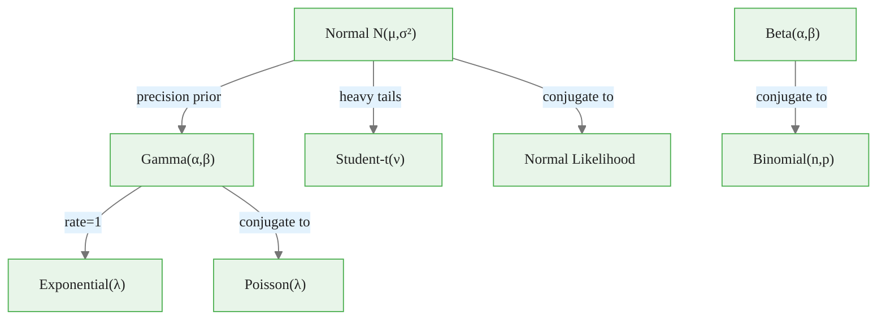
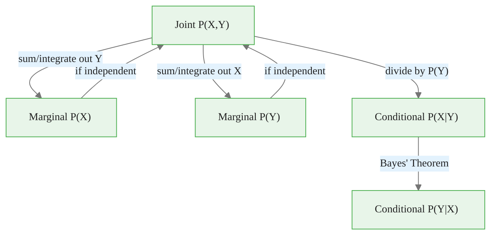
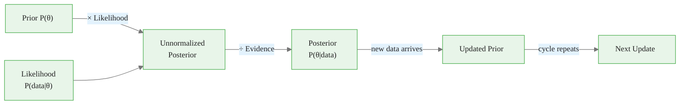
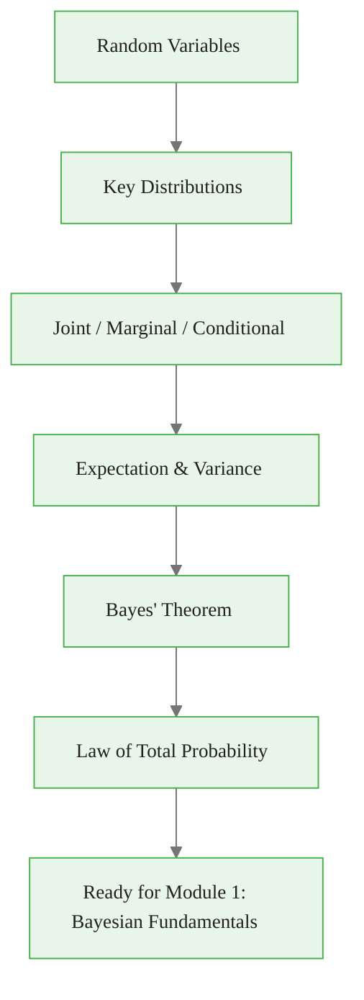

<!-- _class: lead -->

# Probability Review for Bayesian Time Series

**Module 0 — Foundations**

Essential probability concepts for Bayesian inference in commodity markets

<!-- Speaker notes: Welcome to Probability Review for Bayesian Time Series. This deck covers the key concepts you'll need. Estimated time: 62 minutes. -->
---

## Roadmap

<!-- Speaker notes: Walk through the roadmap so learners know what to expect. Emphasize that each section builds on the previous one. -->

This is a foundational concept for the rest of the module.

---

<!-- _class: lead -->

# 1. Probability Fundamentals

<!-- Speaker notes: Transition slide. We're now moving into 1. Probability Fundamentals. Pause briefly to let learners absorb the previous section before continuing. -->
---

## Random Variables

A **random variable** $X$ maps outcomes of a random experiment to real numbers.

### Discrete
Takes countable values (e.g., number of trades)

$$P(X = x) = p(x)$$

### Continuous
Takes any value in an interval (e.g., commodity price)

$$P(a \leq X \leq b) = \int_a^b f(x)\, dx$$

<!-- Speaker notes: Walk through the mathematical notation carefully. Explain each symbol and relate it back to the intuitive explanation. Don't rush through formulas. -->

This is the key takeaway from this section.

---

## Probability Mass / Density Functions

| Type | Definition | Constraint |
|------|-----------|------------|
| **PMF** (discrete) | $p(x) = P(X = x)$ | $\sum_x p(x) = 1$ |
| **PDF** (continuous) | $f(x)$ is the density | $\int_{-\infty}^{\infty} f(x)\, dx = 1$ |

> **Key insight:** For continuous variables, $P(X = x) = 0$ for any specific $x$. We work with densities and intervals.

<!-- Speaker notes: Emphasize the key insight here -- this is a concept learners should remember. Relate it to practical commodity trading scenarios. -->

Common misconception — read carefully.

---

<!-- _class: lead -->

# 2. Key Distributions

<!-- Speaker notes: Transition slide. We're now moving into 2. Key Distributions. Pause briefly to let learners absorb the previous section before continuing. -->
---

## Normal (Gaussian) Distribution

$$X \sim \mathcal{N}(\mu, \sigma^2)$$

$$f(x) = \frac{1}{\sqrt{2\pi\sigma^2}} \exp\left(-\frac{(x-\mu)^2}{2\sigma^2}\right)$$

**Properties:**
- Mean: $\mathbb{E}[X] = \mu$, Variance: $\text{Var}(X) = \sigma^2$
- Linear combinations remain Normal
- Central Limit Theorem: sums converge to Normal

> **In commodities:** Log returns often approximately Normal; used as likelihood in many models.

<!-- Speaker notes: Walk through the mathematical notation carefully. Explain each symbol and relate it back to the intuitive explanation. Don't rush through formulas. -->

This insight connects theory to practice.

---

## Gamma Distribution

$$X \sim \text{Gamma}(\alpha, \beta)$$

$$f(x) = \frac{\beta^\alpha}{\Gamma(\alpha)} x^{\alpha-1} e^{-\beta x}, \quad x > 0$$

| Property | Value |
|----------|-------|
| Mean | $\alpha / \beta$ |
| Variance | $\alpha / \beta^2$ |
| Conjugate prior for | Poisson rate, Normal precision |

> **In commodities:** Models positive quantities like volatility, rates, durations.

<!-- Speaker notes: Walk through the mathematical notation carefully. Explain each symbol and relate it back to the intuitive explanation. Don't rush through formulas. -->
---

## Beta Distribution

$$X \sim \text{Beta}(\alpha, \beta)$$

$$f(x) = \frac{x^{\alpha-1}(1-x)^{\beta-1}}{B(\alpha, \beta)}, \quad x \in [0,1]$$

- Mean: $\mathbb{E}[X] = \alpha / (\alpha + \beta)$
- Conjugate prior for Binomial probability
- Flexible shapes depending on parameters

> **In commodities:** Models proportions, probabilities, regime weights.

<!-- Speaker notes: Walk through the mathematical notation carefully. Explain each symbol and relate it back to the intuitive explanation. Don't rush through formulas. -->
---

## Student-t Distribution

$$X \sim t_\nu(\mu, \sigma^2)$$

- Heavier tails than Normal
- Approaches Normal as $\nu \to \infty$
- Robust to outliers in regression

> **In commodities:** Better fits for returns with fat tails; robust inference.

<!-- Speaker notes: Walk through the mathematical notation carefully. Explain each symbol and relate it back to the intuitive explanation. Don't rush through formulas. -->
---

## Distribution Family Map

<!-- Speaker notes: Use the diagram to illustrate the relationships visually. Point to each node as you explain the flow. Give learners time to study the diagram. -->
---

<!-- _class: lead -->

# 3. Joint, Marginal, and Conditional Probability

<!-- Speaker notes: Transition slide. We're now moving into 3. Joint, Marginal, and Conditional Probability. Pause briefly to let learners absorb the previous section before continuing. -->
---

## Joint Probability

For two random variables $X$ and $Y$:

$$P(X, Y) = P(X \cap Y)$$

For continuous variables: $f(x, y)$ is the joint density.

<!-- Speaker notes: Walk through the mathematical notation carefully. Explain each symbol and relate it back to the intuitive explanation. Don't rush through formulas. -->
---

## Marginal Probability

Obtained by summing / integrating out the other variable:

### Discrete
$$p(x) = \sum_y p(x, y)$$

### Continuous
$$f(x) = \int f(x, y)\, dy$$

<!-- Speaker notes: Walk through the mathematical notation carefully. Explain each symbol and relate it back to the intuitive explanation. Don't rush through formulas. -->
---

## Conditional Probability

$$P(X \mid Y) = \frac{P(X, Y)}{P(Y)}$$

> **This is the foundation of Bayesian inference.**

### Independence

$X$ and $Y$ are independent if:

$$P(X, Y) = P(X)\, P(Y)$$

Equivalently: $P(X \mid Y) = P(X)$

<!-- Speaker notes: Walk through the mathematical notation carefully. Explain each symbol and relate it back to the intuitive explanation. Don't rush through formulas. -->
---

## Joint / Marginal / Conditional Flow

<!-- Speaker notes: Use the diagram to illustrate the relationships visually. Point to each node as you explain the flow. Give learners time to study the diagram. -->
---

<!-- _class: lead -->

# 4. Expectation and Variance

<!-- Speaker notes: Transition slide. We're now moving into 4. Expectation and Variance. Pause briefly to let learners absorb the previous section before continuing. -->
---

## Expectation

### Discrete
$$\mathbb{E}[X] = \sum_x x \cdot p(x)$$

### Continuous
$$\mathbb{E}[X] = \int x \cdot f(x)\, dx$$

**Properties:**
- Linearity: $\mathbb{E}[aX + bY] = a\mathbb{E}[X] + b\mathbb{E}[Y]$
- $\mathbb{E}[g(X)] = \int g(x)\, f(x)\, dx$

<!-- Speaker notes: Walk through the mathematical notation carefully. Explain each symbol and relate it back to the intuitive explanation. Don't rush through formulas. -->
---

## Variance and Covariance

$$\text{Var}(X) = \mathbb{E}[(X - \mu)^2] = \mathbb{E}[X^2] - (\mathbb{E}[X])^2$$

**Properties:**
- $\text{Var}(aX + b) = a^2\, \text{Var}(X)$
- $\text{Var}(X + Y) = \text{Var}(X) + \text{Var}(Y) + 2\,\text{Cov}(X,Y)$

### Covariance and Correlation

$$\text{Cov}(X, Y) = \mathbb{E}[(X - \mu_X)(Y - \mu_Y)]$$

$$\rho_{XY} = \frac{\text{Cov}(X,Y)}{\sigma_X \sigma_Y} \in [-1, 1]$$

<!-- Speaker notes: Walk through the mathematical notation carefully. Explain each symbol and relate it back to the intuitive explanation. Don't rush through formulas. -->
---

<!-- _class: lead -->

# 5. Bayes' Theorem (Preview)

<!-- Speaker notes: Transition slide. We're now moving into 5. Bayes' Theorem (Preview). Pause briefly to let learners absorb the previous section before continuing. -->
---

## The Foundation of This Course

$$P(\theta \mid \text{data}) = \frac{P(\text{data} \mid \theta) \cdot P(\theta)}{P(\text{data})}$$

| Component | Symbol | Meaning |
|-----------|--------|---------|
| **Posterior** | $P(\theta \mid \text{data})$ | What we learn after seeing data |
| **Likelihood** | $P(\text{data} \mid \theta)$ | Probability of data given parameters |
| **Prior** | $P(\theta)$ | What we believed before data |
| **Evidence** | $P(\text{data})$ | Normalizing constant |

> **Key insight:** Bayesian inference updates beliefs (prior to posterior) using data (likelihood).

<!-- Speaker notes: Walk through the mathematical notation carefully. Explain each symbol and relate it back to the intuitive explanation. Don't rush through formulas. -->
---

## Bayesian Update Flow

<!-- Speaker notes: Use the diagram to illustrate the relationships visually. Point to each node as you explain the flow. Give learners time to study the diagram. -->
---

<!-- _class: lead -->

# 6. Law of Total Probability

<!-- Speaker notes: Transition slide. We're now moving into 6. Law of Total Probability. Pause briefly to let learners absorb the previous section before continuing. -->
---

## Law of Total Probability

$$P(A) = \sum_i P(A \mid B_i)\, P(B_i)$$

For continuous variables:

$$f(x) = \int f(x \mid \theta)\, f(\theta)\, d\theta$$

> **In Bayesian inference:** This is how we compute the evidence (marginal likelihood).

<!-- Speaker notes: Walk through the mathematical notation carefully. Explain each symbol and relate it back to the intuitive explanation. Don't rush through formulas. -->
---

<!-- _class: lead -->

# 7. Common Pitfalls

<!-- Speaker notes: Transition slide. We're now moving into 7. Common Pitfalls. Pause briefly to let learners absorb the previous section before continuing. -->
---

## Pitfall: Confusing PDF Value with Probability

- $f(x) = 2$ does **NOT** mean $P(X = x) = 2$
- PDF values can exceed 1
- Only integrals give probabilities

## Pitfall: Forgetting Conditioning Context

- $P(A \mid B) \neq P(B \mid A)$ in general
- Always be clear what you are conditioning on

<!-- Speaker notes: These are common mistakes that even experienced practitioners make. Share a real-world example if possible to make the warning concrete. -->
---

## Pitfall: Independence Assumptions

- Assuming independence when variables are dependent leads to wrong conclusions
- Time series are typically **NOT** independent across time

## Pitfall: Ignoring the Normalizing Constant

- In Bayesian inference, we often compute unnormalized posteriors
- For MCMC, this is fine; for other purposes, normalization matters

<!-- Speaker notes: These are common mistakes that even experienced practitioners make. Share a real-world example if possible to make the warning concrete. -->
---

## Quick Reference Table

| Distribution | Notation | Mean | Variance |
|-------------|----------|------|----------|
| Normal | $\mathcal{N}(\mu, \sigma^2)$ | $\mu$ | $\sigma^2$ |
| Gamma | $\text{Gamma}(\alpha, \beta)$ | $\alpha/\beta$ | $\alpha/\beta^2$ |
| Beta | $\text{Beta}(\alpha, \beta)$ | $\frac{\alpha}{\alpha+\beta}$ | $\frac{\alpha\beta}{(\alpha+\beta)^2(\alpha+\beta+1)}$ |
| Student-t | $t_\nu$ | $0$ (if $\nu > 1$) | $\frac{\nu}{\nu-2}$ (if $\nu > 2$) |
| Exponential | $\text{Exp}(\lambda)$ | $1/\lambda$ | $1/\lambda^2$ |
| Poisson | $\text{Pois}(\lambda)$ | $\lambda$ | $\lambda$ |

<!-- Speaker notes: Walk through each row of the table. This is reference material learners will come back to, so highlight the most important entries. -->
---

## Practice Problems

1. If $X \sim \mathcal{N}(0, 1)$, what is $P(-1.96 < X < 1.96)$?

2. If $X \sim \text{Beta}(2, 2)$, compute $\mathbb{E}[X]$ and sketch the PDF.

3. Given $P(A) = 0.3$, $P(B \mid A) = 0.8$, $P(B \mid A^c) = 0.2$, find $P(A \mid B)$.

4. If $X$ and $Y$ are independent with $\text{Var}(X)=4$, $\text{Var}(Y)=9$, what is $\text{Var}(2X - 3Y)$?

5. For a Gamma prior $\tau \sim \text{Gamma}(1,1)$ and Normal likelihood $x \mid \tau \sim \mathcal{N}(0, 1/\tau)$, write out the posterior kernel $p(\tau \mid x)$.

<!-- Speaker notes: Give learners 5-10 minutes to attempt these problems. Circulate and offer hints. Review solutions together afterward. -->
---

## Visual Summary

*Answers and detailed solutions in the notebook exercises.*

<!-- Speaker notes: Use the diagram to illustrate the relationships visually. Point to each node as you explain the flow. Give learners time to study the diagram. -->
---

<!-- _class: lead -->

# References

<!-- Speaker notes: These references provide deeper coverage of the topics discussed. Recommend the first 1-2 as starting points for learners who want to go deeper. -->

- **Gelman et al.** *Bayesian Data Analysis* (3rd ed.) - Probability review chapters
- **McElreath** *Statistical Rethinking* - Chapters 1-2 for probability foundations
- **Blitzstein & Hwang** *Introduction to Probability* - Comprehensive probability text
