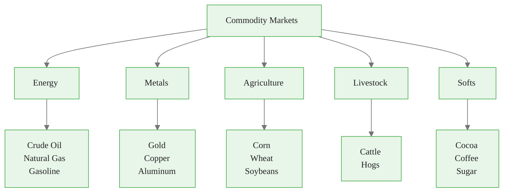
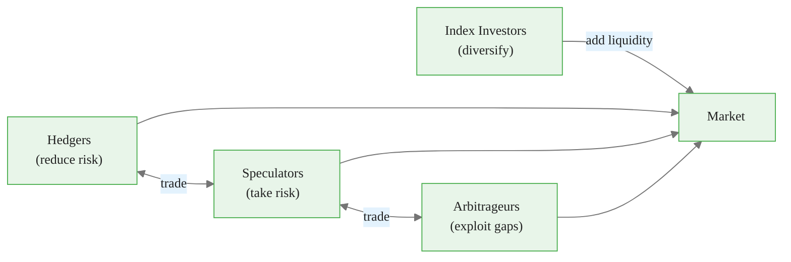
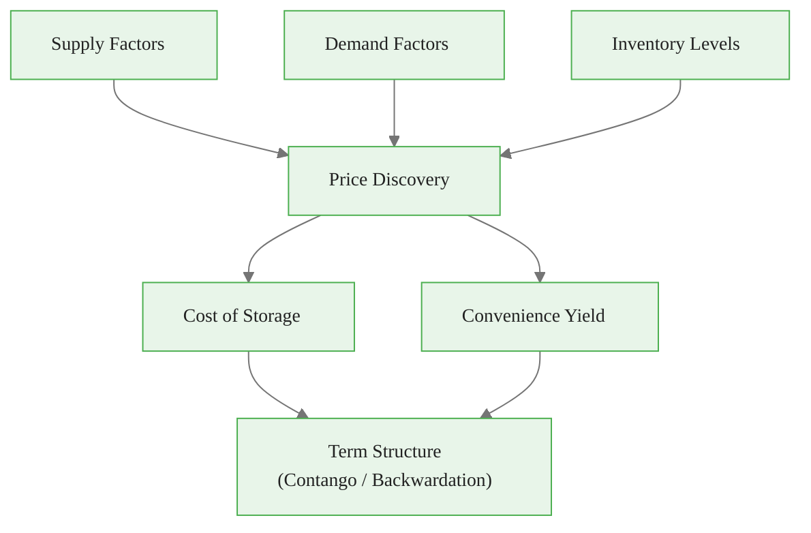
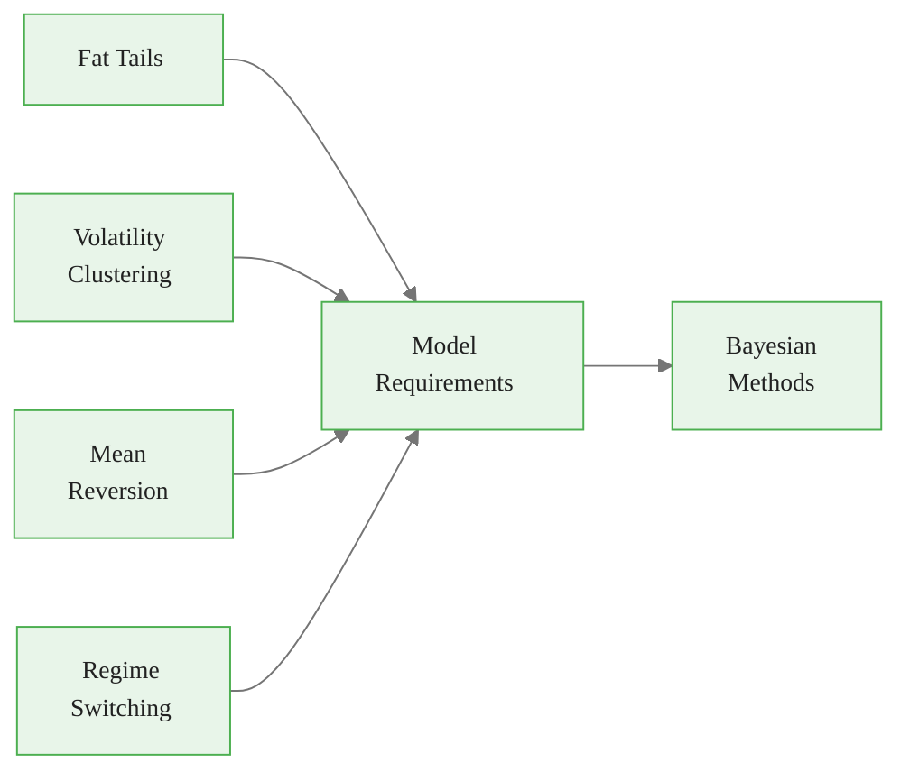
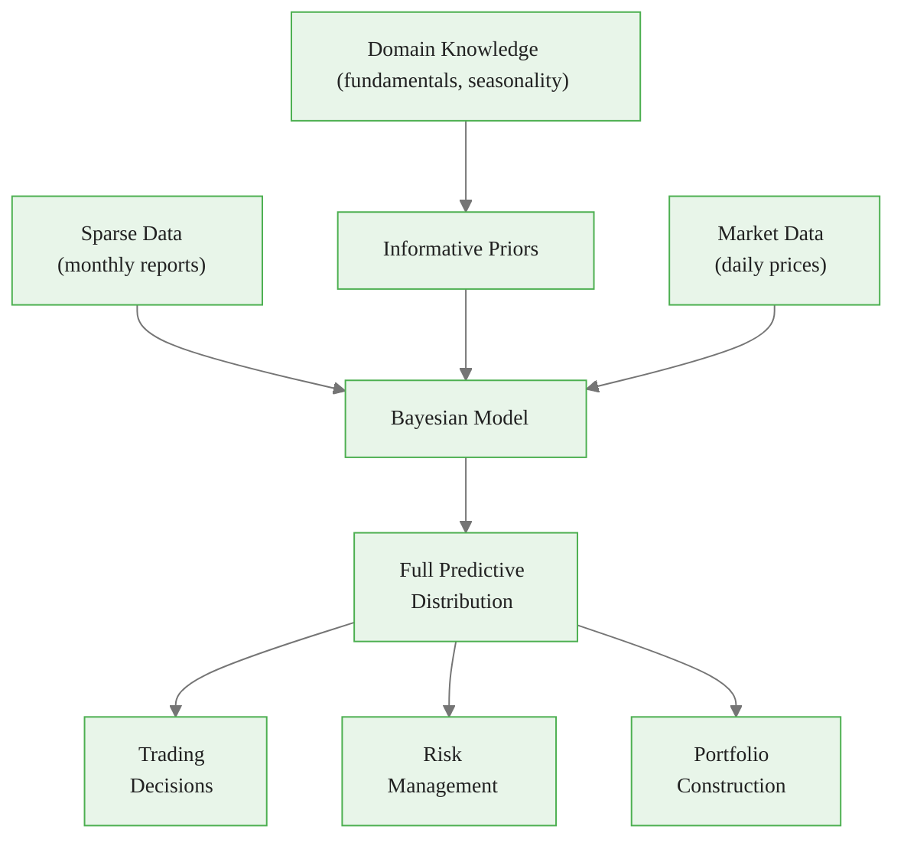
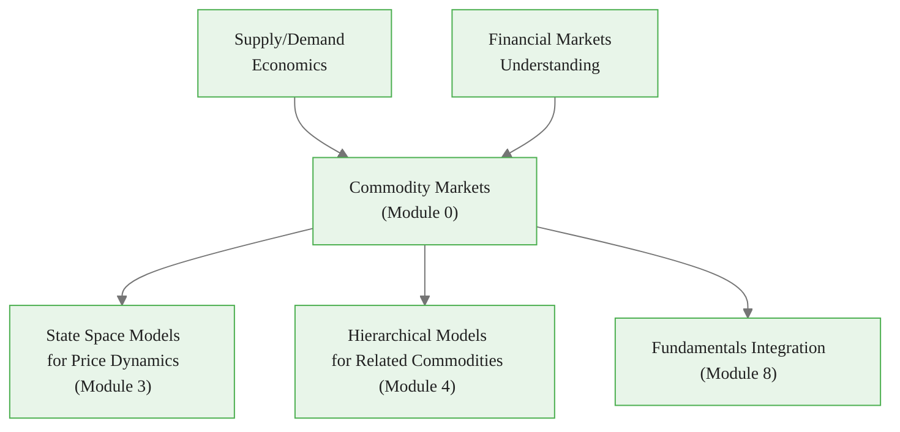

<!-- _class: lead -->

# Introduction to Commodity Markets

**Module 0 — Foundations**

Physical goods, financial dynamics, and why Bayesian methods fit

<!-- Speaker notes: Welcome to Introduction to Commodity Markets. This deck covers the key concepts you'll need. Estimated time: 62 minutes. -->
---

## Key Insight

> Commodity prices are driven by **physical fundamentals** (supply, demand, storage) overlaid with **financial dynamics** (speculation, hedging, risk premia). Effective forecasting models must capture both.

<!-- Speaker notes: Explain Key Insight. Connect this concept to the practical applications in commodity markets. Check for understanding before moving on. -->

This is a foundational concept for the rest of the module.

---

## Commodity Market Landscape

<!-- Speaker notes: Use the diagram to illustrate the relationships visually. Point to each node as you explain the flow. Give learners time to study the diagram. -->

This is the key takeaway from this section.

---

<!-- _class: lead -->

# 1. What Are Commodities?

<!-- Speaker notes: Transition slide. We're now moving into 1. What Are Commodities?. Pause briefly to let learners absorb the previous section before continuing. -->
---

## Commodity Categories

| Category | Examples | Key Drivers |
|----------|----------|-------------|
| **Energy** | Crude oil (WTI, Brent), Natural gas, Gasoline | OPEC policy, inventories, weather, growth |
| **Metals** | Gold, Silver, Copper, Aluminum | Industrial demand, monetary policy, mining |
| **Agriculture** | Corn, Wheat, Soybeans, Coffee, Sugar | Weather, planting/harvest, trade policy |
| **Livestock** | Cattle, Hogs | Feed costs, disease, consumer demand |
| **Softs** | Cocoa, Coffee, Sugar, Orange juice | Weather in producing regions, disease |

<!-- Speaker notes: Walk through each row of the table. This is reference material learners will come back to, so highlight the most important entries. -->

Common misconception — read carefully.

---

## Why Trade Commodities?

1. **Hedgers:** Producers and consumers lock in prices (airline hedging fuel costs)
2. **Speculators:** Profit from price movements
3. **Arbitrageurs:** Exploit pricing inefficiencies
4. **Index investors:** Diversification and inflation protection

<!-- Speaker notes: Use the diagram to illustrate the relationships visually. Point to each node as you explain the flow. Give learners time to study the diagram. -->

This insight connects theory to practice.

---

<!-- _class: lead -->

# 2. Market Structure

<!-- Speaker notes: Transition slide. We're now moving into 2. Market Structure. Pause briefly to let learners absorb the previous section before continuing. -->
---

## Spot vs. Futures Markets

### Spot Market
- Immediate delivery at current price
- Physical transaction
- Location-specific pricing

### Futures Market
- Agreement to buy/sell at future date
- Standardized contracts (size, quality, delivery)
- Margin-based (leverage)
- Most positions closed before delivery

<!-- Speaker notes: Compare the two sides. Ask learners which approach they would use in their own work and why. -->
---

## Key Exchanges

| Exchange | Location | Commodities |
|----------|----------|-------------|
| CME Group (NYMEX, COMEX, CBOT) | Chicago | Energy, Metals, Grains |
| ICE | Atlanta / London | Energy, Softs |
| LME | London | Base Metals |

### Example: WTI Crude Oil (NYMEX CL)

- **Size:** 1,000 barrels
- **Quote:** USD per barrel
- **Tick size:** \$0.01 = \$10 per contract
- **Delivery:** Cushing, Oklahoma

<!-- Speaker notes: Walk through each row of the table. This is reference material learners will come back to, so highlight the most important entries. -->
---

<!-- _class: lead -->

# 3. Fundamentals That Drive Prices

<!-- Speaker notes: Transition slide. We're now moving into 3. Fundamentals That Drive Prices. Pause briefly to let learners absorb the previous section before continuing. -->
---

## Supply Factors

**Production:**
- OPEC decisions (oil)
- Mine output and disruptions (metals)
- Planting decisions and acreage (agriculture)
- Weather during growing season

**Inventories:**
- Storage levels relative to historical norms
- Days of supply coverage
- Strategic reserves (SPR for oil)

<!-- Speaker notes: Explain Supply Factors. Connect this concept to the practical applications in commodity markets. Check for understanding before moving on. -->
---

## Demand Factors

**Consumption:**
- Economic growth (GDP, industrial production)
- Seasonal patterns (heating oil in winter, gasoline in summer)
- Substitution effects (natural gas vs. coal)

**Emerging market growth:**
- China's infrastructure and manufacturing
- India's energy consumption

<!-- Speaker notes: Explain Demand Factors. Connect this concept to the practical applications in commodity markets. Check for understanding before moving on. -->
---

## Supply-Demand-Price Interaction

<!-- Speaker notes: Use the diagram to illustrate the relationships visually. Point to each node as you explain the flow. Give learners time to study the diagram. -->
---

## Storage Economics — Cost of Carry

$$F = S \cdot e^{(r + u - y)T}$$

| Variable | Meaning |
|----------|---------|
| $F$ | Futures price |
| $S$ | Spot price |
| $r$ | Risk-free rate |
| $u$ | Storage costs |
| $y$ | Convenience yield (benefit of holding physical) |
| $T$ | Time to expiration |

<!-- Speaker notes: Walk through the mathematical notation carefully. Explain each symbol and relate it back to the intuitive explanation. Don't rush through formulas. -->
---

## Contango vs. Backwardation

### Contango ($F > S$)
- Futures above spot
- Normal when storage is cheap and inventory is high
- Incentivizes storage

### Backwardation ($F < S$)
- Futures below spot
- Occurs when supply is tight
- High convenience yield (need physical now)

<!-- Speaker notes: Compare the two sides. Ask learners which approach they would use in their own work and why. -->
---

<!-- _class: lead -->

# 4. Seasonality in Commodities

<!-- Speaker notes: Transition slide. We're now moving into 4. Seasonality in Commodities. Pause briefly to let learners absorb the previous section before continuing. -->
---

## Agricultural Seasonality

**Corn (Northern Hemisphere):**
- April-May: Planting
- June-July: Pollination (critical weather period)
- September-October: Harvest

> Price pattern: Uncertainty peaks in summer, harvest pressure in fall.

**Wheat:**
- Winter wheat: Planted fall, harvested early summer
- Spring wheat: Planted spring, harvested late summer

<!-- Speaker notes: Explain Agricultural Seasonality. Connect this concept to the practical applications in commodity markets. Check for understanding before moving on. -->
---

## Energy Seasonality

**Natural Gas:**
- Summer: Cooling demand (electricity for AC)
- Winter: Heating demand (direct consumption)
- Shoulder seasons: Lower demand, injection season

**Gasoline:**
- Summer: Driving season demand
- Spring: Refinery maintenance, summer blend transition

**Metals:**
- Generally less seasonal
- Construction metals (copper): Spring pickup
- Jewelry demand (gold): Q4 holiday season

<!-- Speaker notes: Explain Energy Seasonality. Connect this concept to the practical applications in commodity markets. Check for understanding before moving on. -->
---

<!-- _class: lead -->

# 5. Key Data Sources

<!-- Speaker notes: Transition slide. We're now moving into 5. Key Data Sources. Pause briefly to let learners absorb the previous section before continuing. -->
---

## Energy Data (EIA)

**Weekly Petroleum Status Report:**
- Crude oil inventories
- Refinery utilization
- Product supplied (demand proxy)
- Import/export data

**Natural Gas Weekly Update:**
- Storage levels
- Injection/withdrawal
- Henry Hub prices

<!-- Speaker notes: Explain Energy Data (EIA). Connect this concept to the practical applications in commodity markets. Check for understanding before moving on. -->
---

## Agriculture & Metals Data

**USDA — WASDE Report:**
- Monthly; production, consumption, ending stocks
- Global balance sheets

**USDA — Crop Progress Reports:**
- Weekly during growing season
- Planting/harvest progress, crop condition ratings

**LME / COMEX:**
- LME warehouse stocks (daily)
- COMEX registered vs. eligible gold/silver

**CFTC — Commitments of Traders:**
- Weekly report (Tuesday data, Friday release)
- Commercial (hedgers) vs. Non-commercial (speculators)

<!-- Speaker notes: Explain Agriculture & Metals Data. Connect this concept to the practical applications in commodity markets. Check for understanding before moving on. -->
---

<!-- _class: lead -->

# 6. Price Dynamics and Stylized Facts

<!-- Speaker notes: Transition slide. We're now moving into 6. Price Dynamics and Stylized Facts. Pause briefly to let learners absorb the previous section before continuing. -->
---

## Returns Characteristics

| Stylized Fact | Description | Modeling Implication |
|--------------|-------------|---------------------|
| **Fat Tails** | Heavier tails than Normal | Use t-distributions |
| **Volatility Clustering** | High vol follows high vol | Stochastic volatility models |
| **Mean Reversion** | Spreads revert to cost of carry | State space models |
| **Regime Switching** | Super-cycles, structural breaks | Hidden Markov Models |

<!-- Speaker notes: Walk through each row of the table. This is reference material learners will come back to, so highlight the most important entries. -->
---

## Term Structure Dynamics

- **Parallel shifts:** Entire curve moves up/down
- **Slope changes:** Front vs. back spread widens/narrows
- **Curvature:** Roll dynamics, expiration effects

<!-- Speaker notes: Use the diagram to illustrate the relationships visually. Point to each node as you explain the flow. Give learners time to study the diagram. -->
---

<!-- _class: lead -->

# 7. Why Bayesian Methods for Commodities?

<!-- Speaker notes: Transition slide. We're now moving into 7. Why Bayesian Methods for Commodities?. Pause briefly to let learners absorb the previous section before continuing. -->
---

## Four Reasons Bayesian Methods Fit

### Handling Uncertainty
- Trading decisions need confidence intervals
- Risk management requires tail risk estimates
- Full predictive distributions

### Incorporating Prior Knowledge
- Storage costs bound spreads
- Known seasonality patterns
- Established fundamental relationships

### Sparse Data Challenges
- Monthly WASDE reports
- Weekly inventory data
- Small samples handled gracefully

### Hierarchical Structure
- Crude oil prices affect product cracks
- Grain prices are interconnected
- Learn across markets

<!-- Speaker notes: Compare the two sides. Ask learners which approach they would use in their own work and why. -->
---

## Bayesian Advantage for Commodities

<!-- Speaker notes: Use the diagram to illustrate the relationships visually. Point to each node as you explain the flow. Give learners time to study the diagram. -->
---

## Course Data Focus

**Energy:**
- WTI Crude Oil (front month and term structure)
- Natural Gas (Henry Hub)
- EIA inventory and production data

**Agriculture:**
- Corn, Soybeans, Wheat
- USDA balance sheet data, crop progress indicators

**Metals:**
- Copper (industrial bellwether), Gold (safe haven)
- LME inventory data

<!-- Speaker notes: Explain Course Data Focus. Connect this concept to the practical applications in commodity markets. Check for understanding before moving on. -->
---

## Common Misconceptions

| Misconception | Reality |
|--------------|---------|
| "Commodity prices are random walks" | Fundamentals drive long-term levels; mean reversion in spreads |
| "More data is always better" | Structural changes mean old data may not be relevant |
| "Fundamentals are everything" | Financial flows and positioning matter too |

<!-- Speaker notes: Walk through each row of the table. This is reference material learners will come back to, so highlight the most important entries. -->
---

## Visual Summary and Connections

*The commodity markets are where physical reality meets financial abstraction. Good models respect both.*

<!-- Speaker notes: Use the diagram to illustrate the relationships visually. Point to each node as you explain the flow. Give learners time to study the diagram. -->
---

<!-- _class: lead -->

# References

<!-- Speaker notes: These references provide deeper coverage of the topics discussed. Recommend the first 1-2 as starting points for learners who want to go deeper. -->

- **Geman, H.** *Commodities and Commodity Derivatives* - Comprehensive reference
- **Pirrong, C.** *Commodity Price Dynamics: A Structural Approach* - Economic foundations
- **EIA.gov** - Official US energy data and analysis
- **USDA.gov/oce/commodity/** - Agricultural market reports
