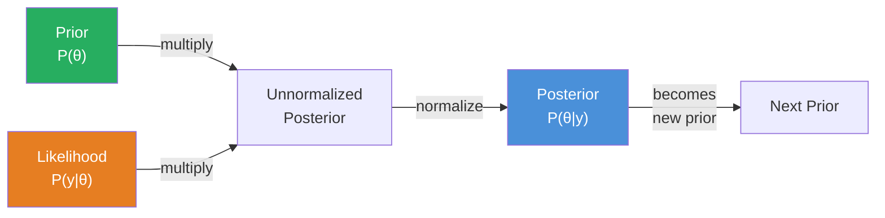
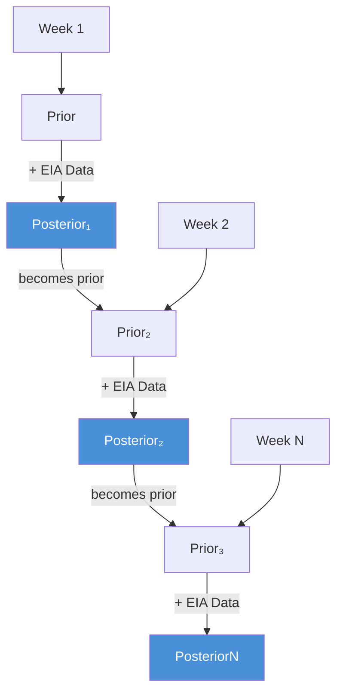
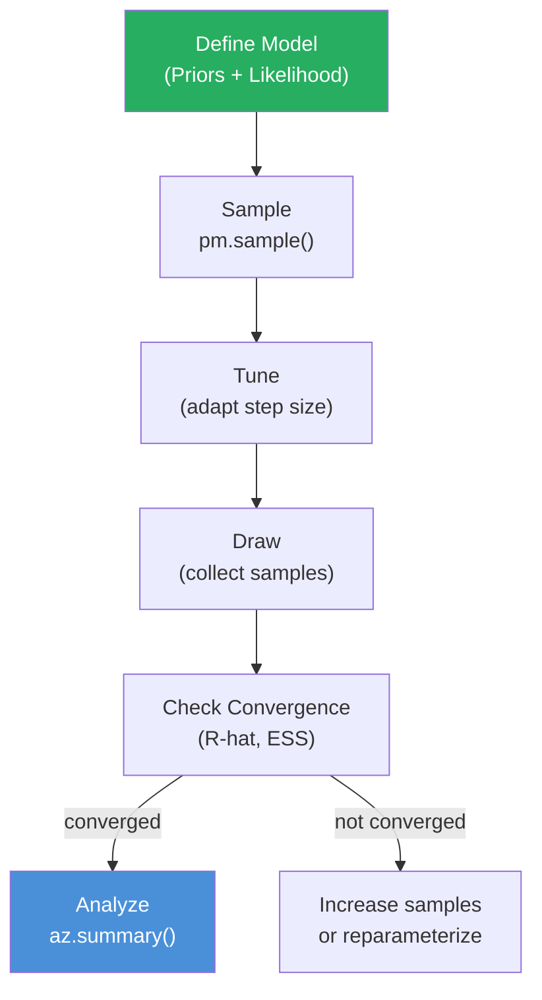
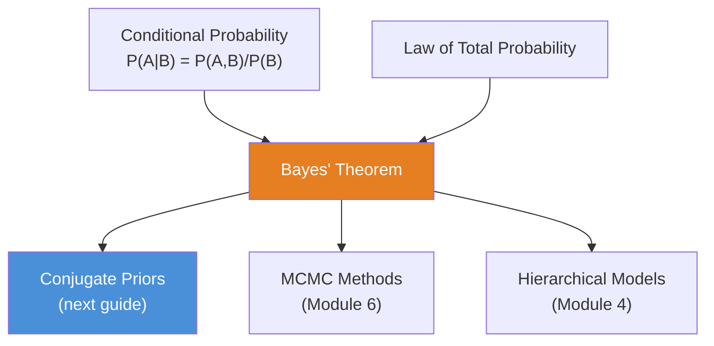

<!-- _class: lead -->

# Bayes' Theorem
## The Foundation of Bayesian Inference

**Module 1 — Bayesian Fundamentals**

<!-- Speaker notes: Welcome to Bayes' Theorem. This deck covers the key concepts you'll need. Estimated time: 48 minutes. -->
---

## Key Insight

> **Bayesian inference inverts the usual probability question.** Instead of asking "What's the probability of seeing this data given a parameter?" we ask "What's the probability of a parameter given this data?"

This inversion is exactly what we need for forecasting.

<!-- Speaker notes: Explain Key Insight. Connect this concept to the practical applications in commodity markets. Check for understanding before moving on. -->
---

## Bayes' Theorem — Formal Definition

$$P(\theta \mid y) = \frac{P(y \mid \theta) \cdot P(\theta)}{P(y)}$$

| Component | Symbol | Role |
|-----------|--------|------|
| **Posterior** | $P(\theta \mid y)$ | Updated belief after seeing data |
| **Likelihood** | $P(y \mid \theta)$ | How probable is the data given $\theta$ |
| **Prior** | $P(\theta)$ | Belief before seeing data |
| **Evidence** | $P(y)$ | Normalizing constant |

<!-- Speaker notes: Walk through the mathematical notation carefully. Explain each symbol and relate it back to the intuitive explanation. Don't rush through formulas. -->
---

## Proportional Form (Most Useful)

Since $P(y)$ does not depend on $\theta$:

$$P(\theta \mid y) \propto P(y \mid \theta) \cdot P(\theta)$$

$$\boxed{\text{Posterior} \propto \text{Likelihood} \times \text{Prior}}$$

> The normalizing constant $P(y)$ is often intractable but unnecessary for inference.

<!-- Speaker notes: Walk through the mathematical notation carefully. Explain each symbol and relate it back to the intuitive explanation. Don't rush through formulas. -->
---

## Bayesian Update Flow



<!-- Speaker notes: Use the diagram to illustrate the relationships visually. Point to each node as you explain the flow. Give learners time to study the diagram. -->
---

<!-- _class: lead -->

# The Updating Metaphor

<!-- Speaker notes: Transition slide. We're now moving into The Updating Metaphor. Pause briefly to let learners absorb the previous section before continuing. -->
---

## Commodity Trader Example

Forming beliefs about next month's crude oil inventory change:

1. **Prior $P(\theta)$:** Historical patterns, seasonal expectations, production trends, market intuition

2. **Likelihood $P(y \mid \theta)$:** Weekly EIA reports arrive — "If the true change is $\theta$, how probable is the data I observed?"

3. **Posterior $P(\theta \mid y)$:** Updated beliefs after processing new data

> This posterior becomes tomorrow's prior when new data arrives.

<!-- Speaker notes: Explain Commodity Trader Example. Connect this concept to the practical applications in commodity markets. Check for understanding before moving on. -->
---

## Sequential Updating



**Today's posterior becomes tomorrow's prior.**

<!-- Speaker notes: Use the diagram to illustrate the relationships visually. Point to each node as you explain the flow. Give learners time to study the diagram. -->
---

<!-- _class: lead -->

# Mathematical Formulation

<!-- Speaker notes: Transition slide. We're now moving into Mathematical Formulation. Pause briefly to let learners absorb the previous section before continuing. -->
---

## Continuous Case

For continuous parameters with densities:

$$p(\theta \mid y) = \frac{p(y \mid \theta) \cdot p(\theta)}{\int p(y \mid \theta')\, p(\theta')\, d\theta'}$$

The denominator is the **marginal likelihood** (evidence):

$$p(y) = \int p(y \mid \theta)\, p(\theta)\, d\theta$$

<!-- Speaker notes: Walk through the mathematical notation carefully. Explain each symbol and relate it back to the intuitive explanation. Don't rush through formulas. -->
---

## Multiple Observations

For independent observations $y_1, \ldots, y_n$:

$$p(\theta \mid y_{1:n}) \propto p(\theta) \prod_{i=1}^{n} p(y_i \mid \theta)$$

### Sequential Updating

$$p(\theta \mid y_1, y_2) = \frac{p(y_2 \mid \theta) \cdot p(\theta \mid y_1)}{p(y_2 \mid y_1)}$$

> This is crucial for time series: we update beliefs as each new observation arrives.

<!-- Speaker notes: Walk through the mathematical notation carefully. Explain each symbol and relate it back to the intuitive explanation. Don't rush through formulas. -->
---

<!-- _class: lead -->

# Code Implementation

<!-- Speaker notes: Transition slide. We're now moving into Code Implementation. Pause briefly to let learners absorb the previous section before continuing. -->
---

## Beta-Binomial Example: Setup

```python
import numpy as np
import matplotlib.pyplot as plt
from scipy import stats

# Prior: Beta(2, 2) - slight belief that probability is around 0.5
alpha_prior, beta_prior = 2, 2

# Data: 7 successes out of 10 trials
successes, trials = 7, 10
failures = trials - successes

# Posterior: Beta(alpha + successes, beta + failures)
alpha_post = alpha_prior + successes
beta_post = beta_prior + failures
```

<!-- Speaker notes: Walk through the code step by step. Highlight the key lines and explain the purpose of each section. Encourage learners to run this in their own notebooks. -->
---

## Beta-Binomial Example: Visualization

```python
theta = np.linspace(0, 1, 1000)

fig, ax = plt.subplots(figsize=(10, 6))
ax.plot(theta, stats.beta.pdf(theta, alpha_prior, beta_prior),
        'b-', label=f'Prior: Beta({alpha_prior}, {beta_prior})', lw=2)
ax.plot(theta, stats.beta.pdf(theta, alpha_post, beta_post),
        'r-', label=f'Posterior: Beta({alpha_post}, {beta_post})', lw=2)
ax.axvline(successes/trials, color='green', linestyle='--',
           label=f'MLE: {successes/trials:.2f}')
ax.set_xlabel('θ (probability)')
ax.set_ylabel('Density')
ax.legend()
plt.show()
```

<!-- Speaker notes: Walk through the code step by step. Highlight the key lines and explain the purpose of each section. Encourage learners to run this in their own notebooks. -->
---

## Beta-Binomial Example: Summaries

```python
post_dist = stats.beta(alpha_post, beta_post)
print(f"Posterior mean: {post_dist.mean():.3f}")
print(f"Posterior std: {post_dist.std():.3f}")
print(f"95% credible interval: "
      f"[{post_dist.ppf(0.025):.3f}, {post_dist.ppf(0.975):.3f}]")
```

<!-- Speaker notes: Walk through the code step by step. Highlight the key lines and explain the purpose of each section. Encourage learners to run this in their own notebooks. -->
---

## PyMC Implementation

```python
import pymc as pm
import arviz as az

with pm.Model() as coin_model:
    # Prior
    theta = pm.Beta('theta', alpha=2, beta=2)

    # Likelihood
    y = pm.Binomial('y', n=10, p=theta, observed=7)

    # Sample from posterior
    trace = pm.sample(2000, tune=1000, random_seed=42)

# Posterior summary
az.summary(trace, var_names=['theta'])
```

<!-- Speaker notes: Walk through the code step by step. Highlight the key lines and explain the purpose of each section. Encourage learners to run this in their own notebooks. -->
---

## MCMC Sampling Pipeline



<!-- Speaker notes: Use the diagram to illustrate the relationships visually. Point to each node as you explain the flow. Give learners time to study the diagram. -->
---

<!-- _class: lead -->

# Common Pitfalls

<!-- Speaker notes: Transition slide. We're now moving into Common Pitfalls. Pause briefly to let learners absorb the previous section before continuing. -->
---

## Pitfall 1: Confusing Prior and Posterior

**Wrong:** "The prior is $P(\theta \mid y)$"
**Right:** "The prior is $P(\theta)$ — our belief BEFORE seeing data"

## Pitfall 2: Ignoring Prior Sensitivity

Different priors can lead to different posteriors, especially with limited data. Always perform sensitivity analysis.

<!-- Speaker notes: These are common mistakes that even experienced practitioners make. Share a real-world example if possible to make the warning concrete. -->
---

## Pitfall 3: Treating Posterior as Truth

The posterior is our best belief given the model and data. **The model may be wrong!**

## Pitfall 4: Computing the Evidence

The evidence $P(y)$ is often intractable. For most inference tasks (MCMC, MAP), we only need the unnormalized posterior.

<!-- Speaker notes: These are common mistakes that even experienced practitioners make. Share a real-world example if possible to make the warning concrete. -->
---

## Connections



<!-- Speaker notes: Use the diagram to illustrate the relationships visually. Point to each node as you explain the flow. Give learners time to study the diagram. -->
---

## Practice Problems

1. **Medical Testing:** Sensitivity = 0.95, Specificity = 0.90, Prevalence = 0.01. Find $P(\text{disease} \mid \text{positive})$.

2. **Inventory Surprise:** Prior $\mathcal{N}(0, 10)$, EIA reports $-3$ million barrels, likelihood $\mathcal{N}(\theta, 2)$. What is the posterior?

3. **Sequential Updates:** Start with $\text{Beta}(1,1)$, observe: success, success, failure, success. Plot the posterior after each observation.

<!-- Speaker notes: Give learners 5-10 minutes to attempt these problems. Circulate and offer hints. Review solutions together afterward. -->
---

## Key Takeaways

1. **Bayes' theorem inverts probability** — from $P(\text{data} \mid \text{parameter})$ to $P(\text{parameter} \mid \text{data})$
2. **Posterior $\propto$ Likelihood $\times$ Prior** — the core update equation
3. **Sequential updating** — today's posterior becomes tomorrow's prior
4. **Uncertainty quantification** — full distributions, not just point estimates
5. **Prior sensitivity** — always check how prior choice affects conclusions

> *"The posterior distribution represents everything we know about the parameter after seeing the data."* — Andrew Gelman

<!-- Speaker notes: Explain Key Takeaways. Connect this concept to the practical applications in commodity markets. Check for understanding before moving on. -->
---


<!-- _class: lead -->

# References

<!-- Speaker notes: These references provide deeper coverage of the topics discussed. Recommend the first 1-2 as starting points for learners who want to go deeper. -->

- **McElreath, Ch. 2** - "Small Worlds and Large Worlds" - Intuitive introduction
- **Gelman et al., Ch. 1** - "Probability and inference" - Formal treatment
- **Jaynes, E.T.** - *Probability Theory: The Logic of Science* - Foundational philosophy
