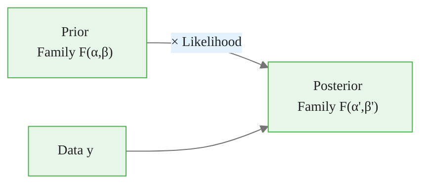
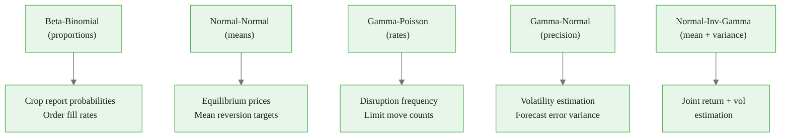
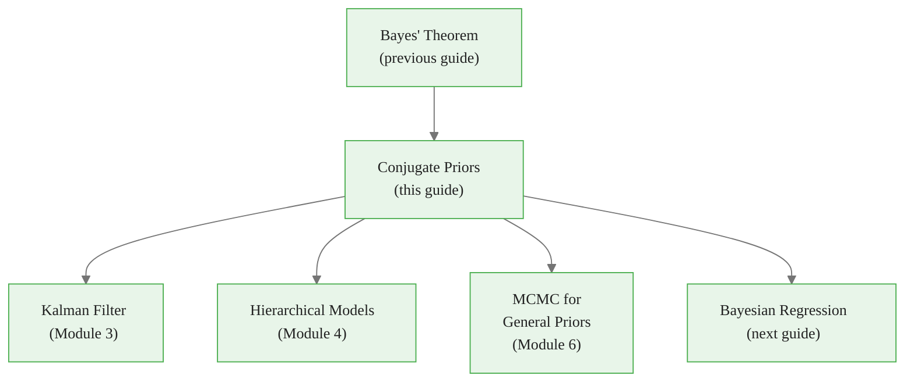

<!-- _class: lead -->

# Conjugate Priors
## Analytical Bayesian Updates

**Module 1 — Bayesian Fundamentals**

<!-- Speaker notes: Welcome to Conjugate Priors. This deck covers the key concepts you'll need. Estimated time: 54 minutes. -->
---

## In Brief

A **conjugate prior** is a prior distribution that, when combined with a particular likelihood, yields a posterior in the **same family** as the prior.

> Conjugate priors exist for mathematical convenience, not physical reality.

<!-- Speaker notes: Explain In Brief. Connect this concept to the practical applications in commodity markets. Check for understanding before moving on. -->

<div class="callout-info">
This is a foundational concept for the rest of the module.
</div>
---

## Why Conjugate Priors?

1. Build intuition about Bayesian updating
2. Fast computation when applicable
3. Components within larger models
4. Initialization of MCMC samplers

<!-- Speaker notes: Explain Why Conjugate Priors?. Connect this concept to the practical applications in commodity markets. Check for understanding before moving on. -->

<div class="callout-key">
This is the key takeaway from this section.
</div>
---

## Formal Definition

A prior $p(\theta)$ is **conjugate** to a likelihood $p(y \mid \theta)$ if:

$$p(\theta \mid y) \propto p(y \mid \theta) \cdot p(\theta)$$

yields a posterior $p(\theta \mid y)$ in the **same distributional family** as $p(\theta)$.



<!-- Speaker notes: Use the diagram to illustrate the relationships visually. Point to each node as you explain the flow. Give learners time to study the diagram. -->

<div class="callout-warning">
Common misconception — read carefully.
</div>
---

<!-- _class: lead -->

# Major Conjugate Families

<!-- Speaker notes: Transition slide. We're now moving into Major Conjugate Families. Pause briefly to let learners absorb the previous section before continuing. -->
---

## 1. Beta-Binomial (Proportions)

**Use case:** Estimating probabilities, success rates, fill rates

$$\text{Prior: } \theta \sim \text{Beta}(\alpha, \beta)$$
$$\text{Likelihood: } y \mid \theta \sim \text{Binomial}(n, \theta)$$
$$\text{Posterior: } \theta \mid y \sim \text{Beta}(\alpha + y,\; \beta + n - y)$$

> **Commodity application:** Probability that a crop report exceeds expectations; fill rate on limit orders.

<!-- Speaker notes: Walk through the mathematical notation carefully. Explain each symbol and relate it back to the intuitive explanation. Don't rush through formulas. -->

<div class="callout-insight">
This insight connects theory to practice.
</div>
---

## Beta-Binomial: Code Example

```python
# Example: Estimating probability of inventory draw
alpha_prior, beta_prior = 2, 2  # Weak prior centered at 0.5

# Data: 8 draws out of 12 weeks
draws, weeks = 8, 12

# Posterior
alpha_post = alpha_prior + draws       # = 10
beta_post = beta_prior + (weeks - draws)  # = 6

print(f"Prior: Beta({alpha_prior}, {beta_prior})")
print(f"Posterior: Beta({alpha_post}, {beta_post})")
print(f"Posterior mean: {alpha_post / (alpha_post + beta_post):.3f}")
```

<!-- Speaker notes: Walk through the code step by step. Highlight the key lines and explain the purpose of each section. Encourage learners to run this in their own notebooks. -->
---

## 2. Normal-Normal (Means)

**Use case:** Estimating mean levels with known variance

$$\text{Prior: } \mu \sim \mathcal{N}(\mu_0, \sigma_0^2)$$
$$\text{Likelihood: } y_i \mid \mu \sim \mathcal{N}(\mu, \sigma^2) \text{ (}\sigma^2 \text{ known)}$$

**Posterior (precision form):**

$$\tau_{\text{post}} = \tau_0 + n\tau, \qquad \mu_{\text{post}} = \frac{\tau_0 \mu_0 + n\tau \bar{y}}{\tau_{\text{post}}}$$

where $\tau = 1/\sigma^2$ is precision.

> The posterior mean is a **precision-weighted average** of prior mean and data mean.

<!-- Speaker notes: Walk through the mathematical notation carefully. Explain each symbol and relate it back to the intuitive explanation. Don't rush through formulas. -->
---

## Normal-Normal: Code Example

```python
import numpy as np

# Prior: Mean price level around $80 with uncertainty
mu_0, sigma_0 = 80, 10
tau_0 = 1 / sigma_0**2

# Data: 20 observations with sample mean $75
n = 20
y_bar = 75
sigma = 5  # Known observation std
tau = 1 / sigma**2

# Posterior  # ... continued on next slide
```

<!-- Speaker notes: Walk through the code step by step. Highlight the key lines and explain the purpose of each section. Encourage learners to run this in their own notebooks. -->
---

## Code (continued)

<!-- Speaker notes: Continue walking through the code. This is a continuation of the previous slide's code block. -->

```python
tau_post = tau_0 + n * tau
mu_post = (tau_0 * mu_0 + n * tau * y_bar) / tau_post
sigma_post = np.sqrt(1 / tau_post)

print(f"Prior: N({mu_0}, {sigma_0}²)")
print(f"Posterior: N({mu_post:.2f}, {sigma_post:.2f}²)")
```

> **Commodity application:** Estimating equilibrium price level; long-term mean reversion target.

---

## 3. Gamma-Poisson (Rates)

**Use case:** Estimating rates, counts per unit time

$$\text{Prior: } \lambda \sim \text{Gamma}(\alpha, \beta)$$
$$\text{Likelihood: } y_i \mid \lambda \sim \text{Poisson}(\lambda)$$
$$\text{Posterior: } \lambda \mid y \sim \text{Gamma}(\alpha + \textstyle\sum y_i,\; \beta + n)$$

> **Commodity application:** Number of supply disruptions per quarter; frequency of limit moves.

<!-- Speaker notes: Walk through the mathematical notation carefully. Explain each symbol and relate it back to the intuitive explanation. Don't rush through formulas. -->
---

## Gamma-Poisson: Code Example

```python
from scipy import stats

# Prior: Expect about 2 disruptions per year (α/β = 2)
alpha_prior, beta_prior = 2, 1

# Data: Observed 5 disruptions over 2 years
total_events = 5
time_periods = 2

# Posterior
alpha_post = alpha_prior + total_events   # = 7
beta_post = beta_prior + time_periods     # = 3
  # ... continued on next slide
```

<!-- Speaker notes: Walk through the code step by step. Highlight the key lines and explain the purpose of each section. Encourage learners to run this in their own notebooks. -->
---

## Code (continued)

<!-- Speaker notes: Continue walking through the code. This is a continuation of the previous slide's code block. -->

```python
post_dist = stats.gamma(alpha_post, scale=1/beta_post)
print(f"Posterior mean rate: {post_dist.mean():.2f} per year")
print(f"95% CI: [{post_dist.ppf(0.025):.2f}, {post_dist.ppf(0.975):.2f}]")
```

---

## 4. Gamma-Normal (Precision)

**Use case:** Estimating variance or precision

$$\text{Prior: } \tau \sim \text{Gamma}(\alpha, \beta), \quad \tau = 1/\sigma^2$$
$$\text{Likelihood: } y_i \mid \mu, \tau \sim \mathcal{N}(\mu, 1/\tau) \text{ (}\mu \text{ known)}$$
$$\text{Posterior: } \tau \mid y \sim \text{Gamma}\!\left(\alpha + \tfrac{n}{2},\; \beta + \tfrac{\sum(y_i - \mu)^2}{2}\right)$$

> **Commodity application:** Estimating volatility; variance of forecast errors.

<!-- Speaker notes: Walk through the mathematical notation carefully. Explain each symbol and relate it back to the intuitive explanation. Don't rush through formulas. -->
---

## 5. Normal-Inverse-Gamma (Mean + Variance)

**Use case:** Jointly estimating mean and variance

$$\sigma^2 \sim \text{Inv-Gamma}(\alpha_0, \beta_0)$$
$$\mu \mid \sigma^2 \sim \mathcal{N}(\mu_0, \sigma^2 / \kappa_0)$$

Conjugate for the Normal likelihood with **both** $\mu$ and $\sigma^2$ unknown.

> **Commodity application:** Jointly estimating expected return and volatility.

<!-- Speaker notes: Walk through the mathematical notation carefully. Explain each symbol and relate it back to the intuitive explanation. Don't rush through formulas. -->
---

## Conjugate Family Map



<!-- Speaker notes: Use the diagram to illustrate the relationships visually. Point to each node as you explain the flow. Give learners time to study the diagram. -->
---

## Conjugate Prior Reference Table

| Likelihood | Parameter | Conjugate Prior | Posterior Update |
|-----------|-----------|-----------------|-----------------|
| Bernoulli/Binomial | $p$ | Beta($\alpha$, $\beta$) | Beta($\alpha + \sum y$, $\beta + n - \sum y$) |
| Poisson | $\lambda$ | Gamma($\alpha$, $\beta$) | Gamma($\alpha + \sum y$, $\beta + n$) |
| Normal (known $\sigma^2$) | $\mu$ | Normal($\mu_0$, $\sigma_0^2$) | Normal($\mu_n$, $\sigma_n^2$) |
| Normal (known $\mu$) | $\sigma^2$ | Inv-Gamma($\alpha$, $\beta$) | Inv-Gamma($\alpha+n/2$, $\beta+SS/2$) |
| Exponential | $\lambda$ | Gamma($\alpha$, $\beta$) | Gamma($\alpha+n$, $\beta+\sum y$) |
| Multinomial | $\mathbf{p}$ | Dirichlet($\boldsymbol\alpha$) | Dirichlet($\boldsymbol\alpha + \text{counts}$) |

<!-- Speaker notes: Walk through each row of the table. This is reference material learners will come back to, so highlight the most important entries. -->
---

<!-- _class: lead -->

# Sequential Updating with Conjugate Priors

<!-- Speaker notes: Transition slide. We're now moving into Sequential Updating with Conjugate Priors. Pause briefly to let learners absorb the previous section before continuing. -->
---

## Online Bayesian Estimation

```python
class BayesianMeanEstimator:
    """Online Bayesian estimation of mean with known variance."""
    def __init__(self, prior_mean, prior_precision, obs_precision):
        self.mu = prior_mean
        self.tau = prior_precision
        self.obs_tau = obs_precision

    def update(self, y):
        new_tau = self.tau + self.obs_tau
        new_mu = (self.tau * self.mu + self.obs_tau * y) / new_tau
        self.tau = new_tau
        self.mu = new_mu
        return self.mu, 1/np.sqrt(self.tau)
```

<!-- Speaker notes: Walk through the code step by step. Highlight the key lines and explain the purpose of each section. Encourage learners to run this in their own notebooks. -->
---

## Online Estimation: Example

```python
estimator = BayesianMeanEstimator(
    prior_mean=80,
    prior_precision=0.01,  # 1/100 = weak prior
    obs_precision=0.04     # 1/25 = σ=5 observations
)

prices = [75, 78, 72, 80, 76]
for p in prices:
    mu, std = estimator.update(p)
    print(f"After observing {p}: μ = {mu:.2f} ± {1.96*std:.2f}")
```

> **Kalman Filter Connection:** The Kalman filter (Module 3) is essentially conjugate Normal-Normal updating in state space form.

<!-- Speaker notes: Walk through the code step by step. Highlight the key lines and explain the purpose of each section. Encourage learners to run this in their own notebooks. -->
---

<!-- _class: lead -->

# Choosing Prior Hyperparameters

<!-- Speaker notes: Transition slide. We're now moving into Choosing Prior Hyperparameters. Pause briefly to let learners absorb the previous section before continuing. -->
---

## Weakly Informative Priors

When you have little prior knowledge:

| Prior | Use Case |
|-------|----------|
| Beta(1, 1) | Uniform on [0, 1] |
| Beta(0.5, 0.5) | Jeffrey's prior (less mass at 0 and 1) |
| Normal(0, 100) | Vague prior on real line |
| Gamma(0.001, 0.001) | Nearly non-informative for precision |

<!-- Speaker notes: Walk through each row of the table. This is reference material learners will come back to, so highlight the most important entries. -->
---

## Encoding Domain Knowledge

**Example:** Seasonal inventory typically ranges from $-5$ to $+10$ million barrels

```python
# Prior mean: (10 + (-5)) / 2 = 2.5
# Prior std: Range/4 ≈ 3.75 (covers ~95% of expected range)
mu_0, sigma_0 = 2.5, 3.75
```

### Prior Predictive Checks

```python
prior_samples = np.random.normal(0, 5, 10000)
print(f"Prior 95% interval: [{np.percentile(prior_samples, 2.5):.1f}, "
      f"{np.percentile(prior_samples, 97.5):.1f}] million barrels")
```

> If this range does not match domain knowledge, adjust the prior.

<!-- Speaker notes: Walk through the code step by step. Highlight the key lines and explain the purpose of each section. Encourage learners to run this in their own notebooks. -->
---

## Limitations of Conjugate Priors

1. **Restrictive:** Real-world priors may not fit conjugate forms
2. **Unrealistic:** Conjugacy may force inappropriate assumptions
3. **Multivariate:** Fewer conjugate families exist for complex models

> **Solution:** Use MCMC (Module 6) for general priors. Conjugacy is a stepping stone, not a destination.

<!-- Speaker notes: Explain Limitations of Conjugate Priors. Connect this concept to the practical applications in commodity markets. Check for understanding before moving on. -->
---

<!-- _class: lead -->

# Common Pitfalls

<!-- Speaker notes: Transition slide. We're now moving into Common Pitfalls. Pause briefly to let learners absorb the previous section before continuing. -->
---

## Pitfalls to Avoid

**Forcing Conjugacy When Inappropriate:**
- "I'll use a Normal prior because it's conjugate" — **wrong**
- "Does a Normal prior represent my actual beliefs?" — **right**

**Ignoring Parameterization:**
- Different sources use rate vs. scale convention for Gamma
- Always check the parameterization!

**Zero Counts with Uniform Prior:**
- Beta(1,1) + 0 successes in 0 trials = Beta(1,1)
- The data did not help because there was no data

<!-- Speaker notes: These are common mistakes that even experienced practitioners make. Share a real-world example if possible to make the warning concrete. -->
---

## Practice Problems

1. Express WTI volatility belief (20-40% annualized) as a Gamma prior on variance $\sigma^2 \in [0.04, 0.16]$.

2. Starting with $\text{Beta}(5, 5)$, update sequentially with: success, success, failure, success, success. Plot after each update.

3. Derive the posterior for the Normal-Normal case from scratch using Bayes' theorem.

<!-- Speaker notes: Give learners 5-10 minutes to attempt these problems. Circulate and offer hints. Review solutions together afterward. -->
---

## Visual Summary



> *Conjugate priors are training wheels. They help you learn to ride, but eventually you will want the full bicycle of MCMC.*

<!-- Speaker notes: Use the diagram to illustrate the relationships visually. Point to each node as you explain the flow. Give learners time to study the diagram. -->
---


<!-- _class: lead -->

# References

<!-- Speaker notes: These references provide deeper coverage of the topics discussed. Recommend the first 1-2 as starting points for learners who want to go deeper. -->

- **Murphy, K.** *Machine Learning: A Probabilistic Perspective* - Ch. 3 conjugate families
- **Gelman et al.** *BDA* - Appendix A for comprehensive conjugate table
- **Bishop, C.** *Pattern Recognition and Machine Learning* - Chapter 2
