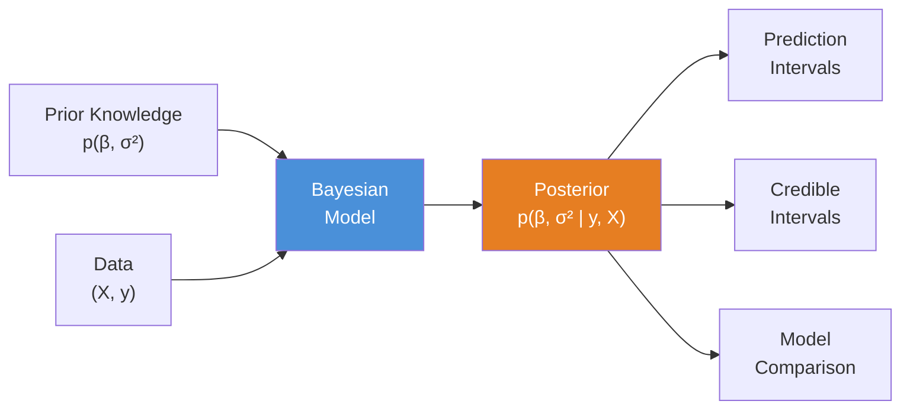
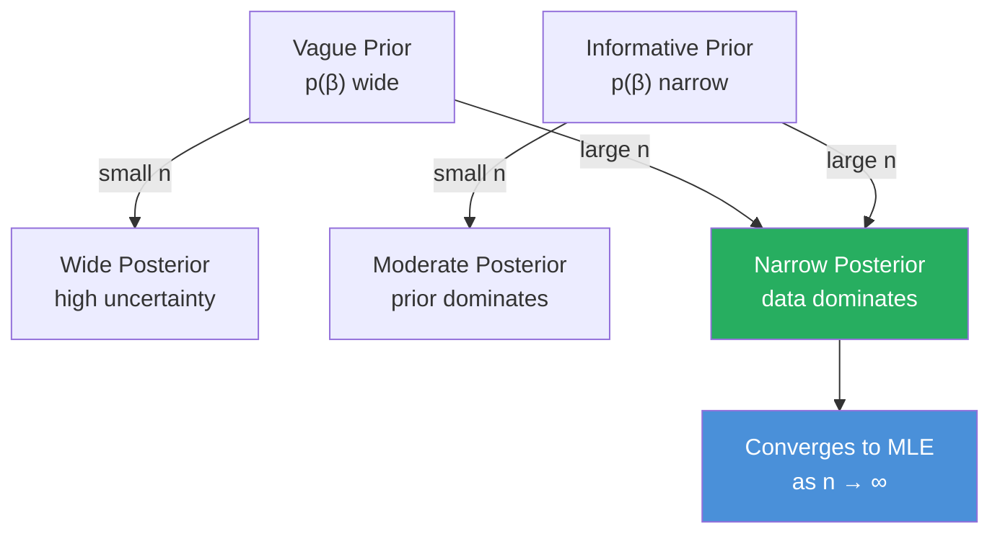
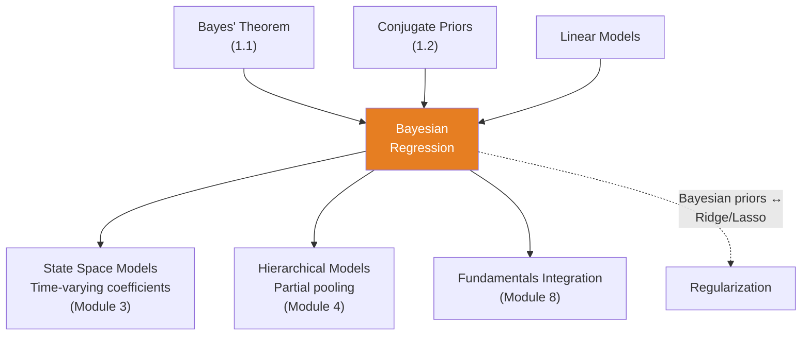

<!-- _class: lead -->

# Bayesian Regression

**Module 1 — Bayesian Fundamentals**

Full uncertainty quantification for predictions

<!-- Speaker notes: Welcome to Bayesian Regression. This deck covers the key concepts you'll need. Estimated time: 42 minutes. -->
---

## Key Insight

<div class="columns">
<div>

### Frequentist
Point estimate: $\hat{\beta} = 2.5$

"My model predicts \$75.00"

</div>
<div>

### Bayesian
Distribution: $\beta \sim \mathcal{N}(2.5, 0.3)$

"My model predicts \$75.00 $\pm$ \$3.50 (95% CI)"

</div>
</div>

> The Bayesian answer helps you assess risk: Should I hedge? How big is my exposure?

<!-- Speaker notes: Compare the two sides. Ask learners which approach they would use in their own work and why. -->
---

## Formal Definition

**Model:**

$$y_i = \beta_0 + \beta_1 x_{i1} + \ldots + \beta_p x_{ip} + \epsilon_i, \quad \epsilon_i \sim \mathcal{N}(0, \sigma^2)$$

**Bayesian Specification:**

| Component | Formula |
|-----------|---------|
| Prior | $p(\beta, \sigma^2)$ |
| Likelihood | $p(y \mid X, \beta, \sigma^2)$ |
| Posterior | $p(\beta, \sigma^2 \mid y, X) \propto p(y \mid X, \beta, \sigma^2)\, p(\beta, \sigma^2)$ |

<!-- Speaker notes: Walk through the mathematical notation carefully. Explain each symbol and relate it back to the intuitive explanation. Don't rush through formulas. -->
---

## Bayesian Regression Pipeline



<!-- Speaker notes: Use the diagram to illustrate the relationships visually. Point to each node as you explain the flow. Give learners time to study the diagram. -->
---

<!-- _class: lead -->

# Mathematical Formulation

<!-- Speaker notes: Transition slide. We're now moving into Mathematical Formulation. Pause briefly to let learners absorb the previous section before continuing. -->
---

## Likelihood

With Normal errors:

$$p(y \mid X, \beta, \sigma^2) = \prod_{i=1}^n \mathcal{N}(y_i \mid X_i\beta, \sigma^2)$$

In matrix form:

$$p(y \mid X, \beta, \sigma^2) = \mathcal{N}(y \mid X\beta, \sigma^2 I)$$

<!-- Speaker notes: Walk through the mathematical notation carefully. Explain each symbol and relate it back to the intuitive explanation. Don't rush through formulas. -->
---

## Conjugate Prior (Normal-Inverse-Gamma)

$$\beta \mid \sigma^2 \sim \mathcal{N}(\mu_0, \sigma^2 \Sigma_0)$$
$$\sigma^2 \sim \text{InverseGamma}(a_0, b_0)$$

**Posterior (analytical):**

$$\beta \mid \sigma^2, y \sim \mathcal{N}(\mu_n, \sigma^2 \Sigma_n)$$

Where:

$$\Sigma_n = (\Sigma_0^{-1} + X^T X)^{-1}$$
$$\mu_n = \Sigma_n (\Sigma_0^{-1} \mu_0 + X^T y)$$

<!-- Speaker notes: Walk through the mathematical notation carefully. Explain each symbol and relate it back to the intuitive explanation. Don't rush through formulas. -->
---

## Posterior Interpretation

$$\underbrace{\Sigma_n^{-1}}_{\text{posterior precision}} = \underbrace{\Sigma_0^{-1}}_{\text{prior precision}} + \underbrace{X^T X}_{\text{data precision}}$$

$$\mu_n = \Sigma_n \left(\underbrace{\Sigma_0^{-1} \mu_0}_{\text{prior info}} + \underbrace{X^T y}_{\text{data info}}\right)$$

> The posterior mean is a **precision-weighted average** of prior and data information.

<!-- Speaker notes: Walk through the mathematical notation carefully. Explain each symbol and relate it back to the intuitive explanation. Don't rush through formulas. -->
---

## Predictive Distribution

For new data $x_{\text{new}}$:

$$p(y_{\text{new}} \mid x_{\text{new}}, y, X) = \int p(y_{\text{new}} \mid x_{\text{new}}, \beta, \sigma^2)\, p(\beta, \sigma^2 \mid y, X)\, d\beta\, d\sigma^2$$

Result: a **Student's t-distribution** with interpretable parameters.

> This gives natural prediction intervals that account for both parameter uncertainty and observation noise.

<!-- Speaker notes: Walk through the mathematical notation carefully. Explain each symbol and relate it back to the intuitive explanation. Don't rush through formulas. -->
---

## Prior to Posterior Flow



<!-- Speaker notes: Use the diagram to illustrate the relationships visually. Point to each node as you explain the flow. Give learners time to study the diagram. -->
---

<!-- _class: lead -->

# Code Implementation

<!-- Speaker notes: Transition slide. We're now moving into Code Implementation. Pause briefly to let learners absorb the previous section before continuing. -->
---

## PyMC Bayesian Regression

```python
import pymc as pm
import numpy as np
import arviz as az

# Simulated commodity data
np.random.seed(42)
n = 100
inventory = np.random.randn(n)
price = 50 + (-2.5 * inventory) + np.random.randn(n) * 3

with pm.Model() as model:
    # Priors
    intercept = pm.Normal('intercept', mu=50, sigma=10)  # ... continued on next slide
```

<!-- Speaker notes: Walk through the code step by step. Highlight the key lines and explain the purpose of each section. Encourage learners to run this in their own notebooks. -->
---

## Code (continued)

<!-- Speaker notes: Continue walking through the code. This is a continuation of the previous slide's code block. -->

```python
    beta_inventory = pm.Normal('beta_inventory', mu=0, sigma=5)
    sigma = pm.HalfNormal('sigma', sigma=10)

    # Linear model
    mu = intercept + beta_inventory * inventory

    # Likelihood
    y_obs = pm.Normal('y_obs', mu=mu, sigma=sigma, observed=price)

    # Inference
    trace = pm.sample(2000, return_inferencedata=True)
```

---

## Posterior Summary

```python
print(az.summary(trace,
      var_names=['intercept', 'beta_inventory', 'sigma']))

# 95% credible intervals
print(az.hdi(trace, hdi_prob=0.95))
```

<!-- Speaker notes: Walk through the code step by step. Highlight the key lines and explain the purpose of each section. Encourage learners to run this in their own notebooks. -->
---

## Prediction with Uncertainty

```python
new_inventory = np.array([-1.0])  # Low inventory

# Extract posterior samples
intercept_samples = trace.posterior['intercept'].values.flatten()
beta_samples = trace.posterior['beta_inventory'].values.flatten()
sigma_samples = trace.posterior['sigma'].values.flatten()

# Posterior predictive samples
predictions = (intercept_samples
               + beta_samples * new_inventory[0]
               + np.random.normal(0, sigma_samples))

print(f"Predicted price for inventory={new_inventory[0]}:")  # ... continued on next slide
```

<!-- Speaker notes: Walk through the code step by step. Highlight the key lines and explain the purpose of each section. Encourage learners to run this in their own notebooks. -->
---

## Code (continued)

<!-- Speaker notes: Continue walking through the code. This is a continuation of the previous slide's code block. -->

```python
print(f"  Median: ${np.median(predictions):.2f}")
print(f"  95% CI: [${np.percentile(predictions, 2.5):.2f}, "
      f"${np.percentile(predictions, 97.5):.2f}]")
```

---

<!-- _class: lead -->

# Common Pitfalls

<!-- Speaker notes: Transition slide. We're now moving into Common Pitfalls. Pause briefly to let learners absorb the previous section before continuing. -->
---

## Pitfall 1: Overly Informative Priors

```python
# BAD: Very tight prior with only 10 data points
beta = pm.Normal('beta', mu=0, sigma=0.1)  # too tight!
```

```python
# GOOD: Regularizing but not dominating
beta = pm.Normal('beta', mu=0, sigma=10)   # let data speak
```

## Pitfall 2: Forgetting Uncertainty

Always report credible intervals, not just posterior means.

<!-- Speaker notes: Walk through the code step by step. Highlight the key lines and explain the purpose of each section. Encourage learners to run this in their own notebooks. -->
---

## Pitfall 3: Prior-Data Conflict

When data strongly contradicts prior:
- Check if prior is too restrictive
- Consider alternative models
- Investigate data quality

## Pitfall 4: Credible vs. Confidence Intervals

| Type | Interpretation |
|------|---------------|
| **Bayesian (Credible)** | "95% probability $\beta \in [2.0, 3.0]$" |
| **Frequentist (Confidence)** | "If repeated, 95% of intervals contain $\beta$" |

> Credible intervals are simpler to interpret!

<!-- Speaker notes: Walk through each row of the table. This is reference material learners will come back to, so highlight the most important entries. -->
---

## Connections



<!-- Speaker notes: Use the diagram to illustrate the relationships visually. Point to each node as you explain the flow. Give learners time to study the diagram. -->
---

## Practice Problems

1. **Prior Choice:** Modeling inventory-price relationship. Which prior for $\beta$?
   - a) $\mathcal{N}(0, 100000)$ — very vague
   - b) $\mathcal{N}(-5, 2)$ — negative, moderate uncertainty
   - c) $\mathcal{N}(+5, 2)$ — positive, moderate uncertainty

2. **Implementation:** Fit Price ~ HDD for natural gas. Report 95% CI. Predict for HDD = 500.

3. **Comparison:** Compare Price ~ Inventory vs. Price ~ Inventory + Production using `az.compare()`.

<!-- Speaker notes: Give learners 5-10 minutes to attempt these problems. Circulate and offer hints. Review solutions together afterward. -->
---

## Visual Summary

<div class="columns">
<div>

**What We Learned:**
- Full posterior over $\beta$ and $\sigma^2$
- Precision-weighted averaging
- Predictive distributions (Student-t)
- Credible intervals for decisions

</div>
<div>

**Next Steps:**
- Module 3: Dynamic regression (time-varying coefficients)
- Module 4: Multi-level regression (partial pooling)
- Module 8: Commodity fundamentals as regressors

</div>
</div>

> **Next:** Apply these concepts in `03_bayesian_regression_pymc.ipynb`

<!-- Speaker notes: This diagram shows how the current topic connects to the rest of the course. Use it to reinforce the big picture and preview what comes next. -->
---


<!-- _class: lead -->

# References

<!-- Speaker notes: These references provide deeper coverage of the topics discussed. Recommend the first 1-2 as starting points for learners who want to go deeper. -->

- **Gelman et al. (2013):** *Bayesian Data Analysis* (3rd ed.) - Ch. 14-16 on regression
- **McElreath (2020):** *Statistical Rethinking* - Intuitive Bayesian regression
- **Baumeister & Kilian (2015):** "Forecasting the real price of oil" - Bayesian VAR for oil
- **Park & Casella (2008):** "The Bayesian Lasso" - Priors as regularization
