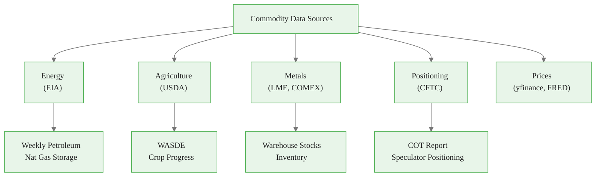
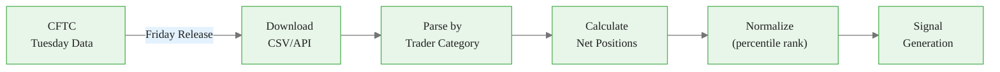
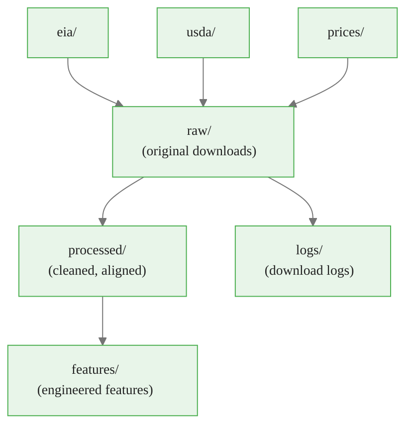
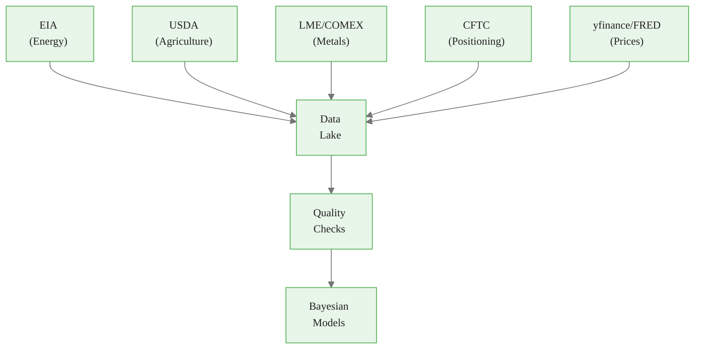

<!-- _class: lead -->

# Commodity Data Sources Guide

**Module 2 — Commodity Data**

Reliable data on prices, fundamentals, and positioning

<!-- Speaker notes: Welcome to Commodity Data Sources Guide. This deck covers the key concepts you'll need. Estimated time: 46 minutes. -->
---

## Key Insight

> **Free, official data often beats expensive commercial feeds for fundamentals.** EIA, USDA, and CFTC provide authoritative data that moves markets. Commercial data adds value primarily for higher frequency or alternative datasets.

<!-- Speaker notes: Explain Key Insight. Connect this concept to the practical applications in commodity markets. Check for understanding before moving on. -->

<div class="callout-info">
This is a foundational concept for the rest of the module.
</div>
---

## Data Source Landscape



<!-- Speaker notes: Use the diagram to illustrate the relationships visually. Point to each node as you explain the flow. Give learners time to study the diagram. -->

<div class="callout-key">
This is the key takeaway from this section.
</div>
---

<!-- _class: lead -->

# 1. Energy Data (EIA)

<!-- Speaker notes: Transition slide. We're now moving into 1. Energy Data (EIA). Pause briefly to let learners absorb the previous section before continuing. -->
---

## Weekly Petroleum Status Report

The most market-moving energy report in the world.

**Release:** Wednesday 10:30 AM ET (Thursday if Monday holiday)

| Series | EIA Code | Description |
|--------|----------|-------------|
| Crude Stocks | WCESTUS1 | Total US crude oil inventories |
| Cushing Stocks | WCRSTUS1 | Cushing, OK crude stocks |
| Gasoline Stocks | WGTSTUS1 | Total motor gasoline inventories |
| Distillate Stocks | WDISTUS1 | Heating oil + diesel inventories |
| Refinery Utilization | WPULEUS3 | Percent capacity in use |
| Crude Production | WCRFPUS2 | Weekly crude oil production |

<!-- Speaker notes: Walk through each row of the table. This is reference material learners will come back to, so highlight the most important entries. -->

<div class="callout-warning">
Common misconception — read carefully.
</div>
---

## EIA Python Retrieval

```python
import pandas as pd

def get_eia_petroleum(series_id, api_key):
    """Retrieve EIA petroleum data."""
    url = f"https://api.eia.gov/v2/seriesid/{series_id}"
    params = {"api_key": api_key, "frequency": "weekly"}

    response = requests.get(url, params=params)
    data = response.json()

    df = pd.DataFrame(data['response']['data'])
    df['date'] = pd.to_datetime(df['period'])
    df = df.set_index('date').sort_index()

    return df[['value']].rename(columns={'value': series_id})
```

<!-- Speaker notes: Walk through the code step by step. Highlight the key lines and explain the purpose of each section. Encourage learners to run this in their own notebooks. -->

<div class="callout-insight">
This insight connects theory to practice.
</div>
---

## Natural Gas Weekly Update

**Release:** Thursday 10:30 AM ET

| Series | Description |
|--------|-------------|
| Working Gas in Storage | Total lower-48 storage |
| Net Change | Weekly injection/withdrawal |
| Henry Hub Spot | Daily spot price |

**Short-Term Energy Outlook (STEO):** Monthly 18-month forecasts for supply, demand, prices.

<!-- Speaker notes: Walk through each row of the table. This is reference material learners will come back to, so highlight the most important entries. -->
---

<!-- _class: lead -->

# 2. Agricultural Data (USDA)

<!-- Speaker notes: Transition slide. We're now moving into 2. Agricultural Data (USDA). Pause briefly to let learners absorb the previous section before continuing. -->
---

## WASDE Report

World Agricultural Supply and Demand Estimates — the most important agricultural report.

**Release:** Monthly, around 12th

**Key Tables:**
- US Supply and Use (production, consumption, ending stocks)
- World Supply and Use
- Price forecasts

<!-- Speaker notes: Explain WASDE Report. Connect this concept to the practical applications in commodity markets. Check for understanding before moving on. -->
---

## USDA NASS API

```python
import requests

def get_usda_nass(commodity, year, api_key):
    """Retrieve USDA production/stocks data."""
    base_url = "https://quickstats.nass.usda.gov/api/api_GET/"
    params = {
        "key": api_key,
        "commodity_desc": commodity,
        "year": year,
        "format": "JSON"
    }

    response = requests.get(base_url, params=params)
    return pd.DataFrame(response.json()['data'])
```

**Crop Progress Report:** Weekly during growing season (Apr-Nov); planting progress, condition ratings (Excellent/Good/Fair/Poor/Very Poor).

<!-- Speaker notes: Walk through the code step by step. Highlight the key lines and explain the purpose of each section. Encourage learners to run this in their own notebooks. -->
---

<!-- _class: lead -->

# 3. Metals & Positioning Data

<!-- Speaker notes: Transition slide. We're now moving into 3. Metals & Positioning Data. Pause briefly to let learners absorb the previous section before continuing. -->
---

## Metals Data

<div class="columns">
<div>

### LME Warehouse Stocks
- **Release:** Daily
- **Metals:** Cu, Al, Zn, Pb, Ni, Sn
- Total stocks, cancelled warrants, in/out flows

</div>
<div>

### COMEX Inventory
- **Release:** Daily
- **Metals:** Gold, Silver, Copper
- Registered vs. Eligible categories

</div>
</div>

<!-- Speaker notes: Compare the two sides. Ask learners which approach they would use in their own work and why. -->
---

## CFTC Commitments of Traders (COT)

**Release:** Friday 3:30 PM ET (Tuesday data)

| Category | Description |
|----------|-------------|
| **Commercial** | Hedgers (producers, consumers) |
| **Non-Commercial** | Speculators (hedge funds, CTAs) |
| **Non-Reportable** | Small traders |

**Key Metrics:** Net position = Long - Short, Open interest, Weekly changes

> Extreme speculator positioning often precedes reversals. Commercial hedgers are often "smart money."

<!-- Speaker notes: Walk through each row of the table. This is reference material learners will come back to, so highlight the most important entries. -->
---

## COT Data Pipeline



<!-- Speaker notes: Use the diagram to illustrate the relationships visually. Point to each node as you explain the flow. Give learners time to study the diagram. -->
---

<!-- _class: lead -->

# 4. Price Data (Free Sources)

<!-- Speaker notes: Transition slide. We're now moving into 4. Price Data (Free Sources). Pause briefly to let learners absorb the previous section before continuing. -->
---

## Yahoo Finance (yfinance)

```python
import yfinance as yf

# Futures contracts
cl = yf.download('CL=F', start='2020-01-01')  # WTI Crude
ng = yf.download('NG=F', start='2020-01-01')  # Natural Gas
gc = yf.download('GC=F', start='2020-01-01')  # Gold
zc = yf.download('ZC=F', start='2020-01-01')  # Corn
zs = yf.download('ZS=F', start='2020-01-01')  # Soybeans
```

## FRED (Federal Reserve)

```python
from fredapi import Fred
fred = Fred(api_key='your_key')

wti = fred.get_series('DCOILWTICO')    # WTI spot
brent = fred.get_series('DCOILBRENTEU')  # Brent spot
dxy = fred.get_series('DTWEXBGS')        # Dollar index
```

<!-- Speaker notes: Walk through the code step by step. Highlight the key lines and explain the purpose of each section. Encourage learners to run this in their own notebooks. -->
---

<!-- _class: lead -->

# 5. Data Quality Considerations

<!-- Speaker notes: Transition slide. We're now moving into 5. Data Quality Considerations. Pause briefly to let learners absorb the previous section before continuing. -->
---

## Missing Data & Revisions

| Source | Common Gaps | Handling |
|--------|-------------|----------|
| EIA Weekly | Holidays | Forward fill or interpolate |
| USDA WASDE | Not released monthly Jan | Use prior month |
| yfinance | Weekends, exchange holidays | Business day index |
| LME | Exchange holidays | Forward fill |

**Revisions:** EIA revises monthly; USDA revisions are rare but significant.

> **Strategy:** Always re-download recent history before modeling.

<!-- Speaker notes: Walk through each row of the table. This is reference material learners will come back to, so highlight the most important entries. -->
---

## Look-Ahead Bias

> **Critical:** When backtesting, only use data available at the time.

```python
def get_available_data(date, release_schedule):
    """Return only data that would have been
    available on given date.

    Example: EIA reports Wednesday with data
    through Friday. On Monday, latest available
    data is from prior week.
    """
    pass
```

<!-- Speaker notes: Walk through the code step by step. Highlight the key lines and explain the purpose of each section. Encourage learners to run this in their own notebooks. -->
---

## Recommended Data Pipeline Architecture



**Principles:** Idempotent, Logged, Versioned, Tested

<!-- Speaker notes: Use the diagram to illustrate the relationships visually. Point to each node as you explain the flow. Give learners time to study the diagram. -->
---

## Practice Problems

1. Write a function to retrieve 52 weeks of EIA crude inventory data and calculate year-over-year change.

2. Why is WASDE "Ending Stocks" important for price forecasting?

3. Design a data pipeline that updates weekly with latest EIA, USDA (growing season), and price data.

<!-- Speaker notes: Give learners 5-10 minutes to attempt these problems. Circulate and offer hints. Review solutions together afterward. -->
---

## Visual Summary



> *"Know your data sources better than you know your models. The data is the foundation."*

<!-- Speaker notes: Use the diagram to illustrate the relationships visually. Point to each node as you explain the flow. Give learners time to study the diagram. -->
---


<!-- _class: lead -->

# References

<!-- Speaker notes: These references provide deeper coverage of the topics discussed. Recommend the first 1-2 as starting points for learners who want to go deeper. -->

- **EIA API Documentation:** https://www.eia.gov/opendata/
- **USDA NASS Quick Stats:** https://quickstats.nass.usda.gov/
- **CFTC COT Explanatory Notes:** https://www.cftc.gov/MarketReports/CommitmentsofTraders/
