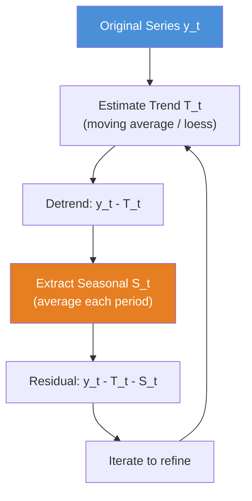
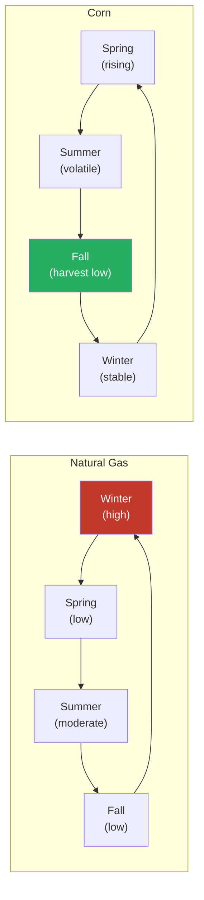
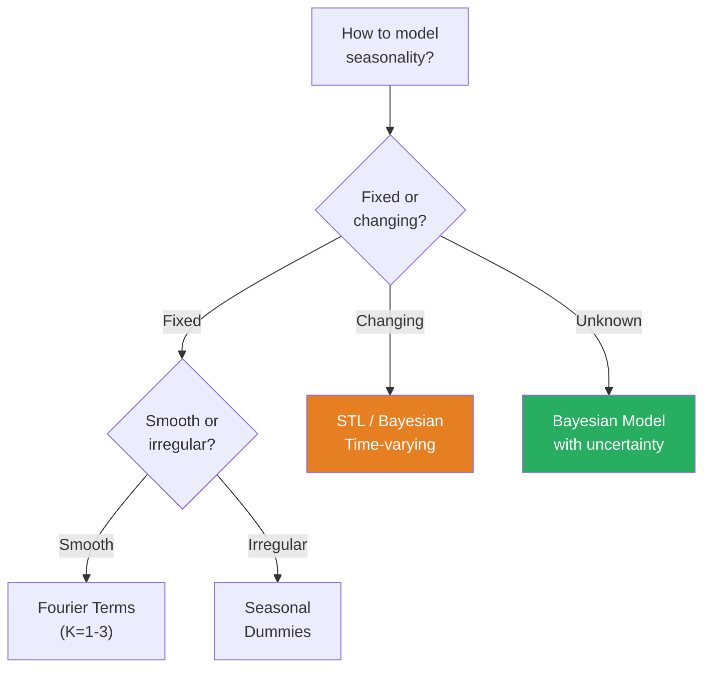
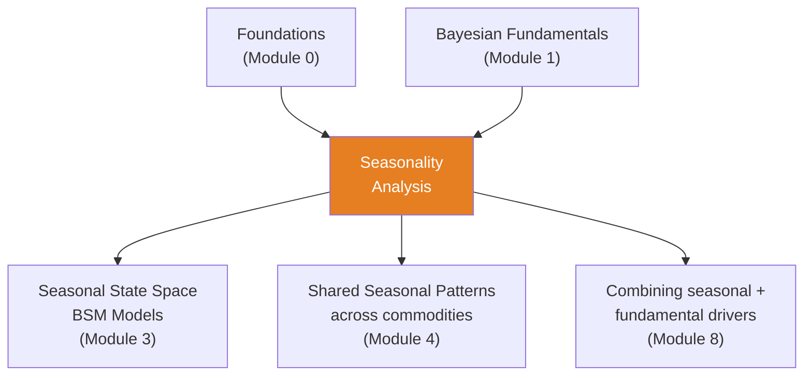

<!-- _class: lead -->

# Seasonality Analysis in Commodity Markets

**Module 2 — Commodity Data**

Predictable, recurring patterns tied to calendar periods

<!-- Speaker notes: Welcome to Seasonality Analysis in Commodity Markets. This deck covers the key concepts you'll need. Estimated time: 50 minutes. -->
---

## Key Insight

> Many commodities exhibit strong seasonal patterns driven by predictable demand cycles (heating oil in winter, gasoline in summer) or supply cycles (agricultural harvest). Failing to account for seasonality leads to systematic forecast errors.

<!-- Speaker notes: Explain Key Insight. Connect this concept to the practical applications in commodity markets. Check for understanding before moving on. -->
---

## Formal Definition

A time series $y_t$ decomposes into:

$$y_t = T_t + S_t + C_t + I_t$$

| Component | Meaning |
|-----------|---------|
| $T_t$ | Trend (long-term movement) |
| $S_t$ | Seasonal (periodic pattern) |
| $C_t$ | Cyclical (non-fixed period) |
| $I_t$ | Irregular / noise |

A series is seasonal with period $m$ if: $\mathbb{E}[S_t] = \mathbb{E}[S_{t+m}] \;\forall\, t$

<!-- Speaker notes: Walk through the mathematical notation carefully. Explain each symbol and relate it back to the intuitive explanation. Don't rush through formulas. -->
---

## Decomposition Pipeline



<!-- Speaker notes: Use the diagram to illustrate the relationships visually. Point to each node as you explain the flow. Give learners time to study the diagram. -->
---

<!-- _class: lead -->

# Commodity Seasonality Examples

<!-- Speaker notes: Transition slide. We're now moving into Commodity Seasonality Examples. Pause briefly to let learners absorb the previous section before continuing. -->
---

## Natural Gas Seasonality

<div class="columns">
<div>

**Winter (Dec-Feb):** Heating demand spikes — high prices

**Summer (Jun-Aug):** Moderate cooling demand — moderate prices

**Spring/Fall:** Low demand — low prices

</div>
<div>

| Month | Effect | Reason |
|-------|--------|--------|
| Jan | +\$2.50 | Peak heating |
| Apr | -\$1.20 | Low demand |
| Jul | +\$0.30 | Moderate cooling |
| Oct | -\$1.40 | Low demand |
| Dec | +\$2.00 | Heating rises |

</div>
</div>

<!-- Speaker notes: Walk through each row of the table. This is reference material learners will come back to, so highlight the most important entries. -->
---

## Agricultural Example: Corn Prices

- **Spring (Mar-May):** Planting season, old crop depleting — prices rise
- **Summer (Jun-Aug):** Growing season, weather uncertainty — volatility spikes
- **Fall (Sep-Nov):** Harvest, new supply — prices fall
- **Winter (Dec-Feb):** Post-harvest, inventory draw — prices stabilize

> A trader buying corn in July (pre-harvest) should expect lower prices in October (harvest) — this is NOT a forecasting error, it is seasonality!

<!-- Speaker notes: Explain Agricultural Example: Corn Prices. Connect this concept to the practical applications in commodity markets. Check for understanding before moving on. -->
---

## Seasonal Pattern Comparison



<!-- Speaker notes: Use the diagram to illustrate the relationships visually. Point to each node as you explain the flow. Give learners time to study the diagram. -->
---

<!-- _class: lead -->

# Mathematical Formulations

<!-- Speaker notes: Transition slide. We're now moving into Mathematical Formulations. Pause briefly to let learners absorb the previous section before continuing. -->
---

## Additive vs. Multiplicative

<div class="columns">
<div>

### Additive
$$y_t = T_t + S_t + e_t$$

Use when seasonal variation is roughly constant over time.

</div>
<div>

### Multiplicative
$$y_t = T_t \times S_t \times e_t$$

Use when seasonal variation scales with the level (common in commodities).

</div>
</div>

**Log transform converts multiplicative to additive:**
$$\log(y_t) = \log(T_t) + \log(S_t) + \log(e_t)$$

<!-- Speaker notes: Walk through the mathematical notation carefully. Explain each symbol and relate it back to the intuitive explanation. Don't rush through formulas. -->
---

## Seasonal Dummy Variables

For monthly data, define 11 dummies (omit reference month):

$$y_t = \alpha + \sum_{j=1}^{11} \beta_j D_{jt} + \epsilon_t$$

where $D_{jt} = 1$ if observation $t$ is in month $j$.

**Interpretation:** $\beta_j$ is the average deviation of month $j$ from the reference month.

<!-- Speaker notes: Walk through the mathematical notation carefully. Explain each symbol and relate it back to the intuitive explanation. Don't rush through formulas. -->
---

## Fourier Representation

Represent seasonality as sum of sine/cosine waves:

$$S_t = \sum_{k=1}^K \left[ a_k \sin\!\left(\frac{2\pi k t}{m}\right) + b_k \cos\!\left(\frac{2\pi k t}{m}\right) \right]$$

**Advantages:**
- Smooth seasonal pattern
- Fewer parameters than dummies ($K \ll m$)
- Natural for continuous-time modeling

<!-- Speaker notes: Walk through the mathematical notation carefully. Explain each symbol and relate it back to the intuitive explanation. Don't rush through formulas. -->
---

<!-- _class: lead -->

# Code Implementations

<!-- Speaker notes: Transition slide. We're now moving into Code Implementations. Pause briefly to let learners absorb the previous section before continuing. -->
---

## 1. Visual Inspection — Seasonal Boxplot

```python
import pandas as pd
import matplotlib.pyplot as plt
import seaborn as sns

df['month'] = df['date'].dt.month

plt.figure(figsize=(12, 6))
sns.boxplot(data=df, x='month', y='price')
plt.xlabel('Month')
plt.ylabel('Price')
plt.title('Natural Gas Price Seasonality')
plt.xticks(range(12),
    ['Jan','Feb','Mar','Apr','May','Jun',
     'Jul','Aug','Sep','Oct','Nov','Dec'])
plt.show()
```

<!-- Speaker notes: Walk through the code step by step. Highlight the key lines and explain the purpose of each section. Encourage learners to run this in their own notebooks. -->
---

## 2. Classical Decomposition

```python
from statsmodels.tsa.seasonal import seasonal_decompose

ts = df.set_index('date')['price']

decomposition = seasonal_decompose(
    ts, model='multiplicative', period=12
)

fig, axes = plt.subplots(4, 1, figsize=(12, 10))
decomposition.observed.plot(ax=axes[0], title='Observed')
decomposition.trend.plot(ax=axes[1], title='Trend')
decomposition.seasonal.plot(ax=axes[2], title='Seasonal')
decomposition.resid.plot(ax=axes[3], title='Residual')
plt.tight_layout()
plt.show()
```

<!-- Speaker notes: Walk through the code step by step. Highlight the key lines and explain the purpose of each section. Encourage learners to run this in their own notebooks. -->
---

## 3. Fourier Seasonal Model

```python
import numpy as np
import statsmodels.api as sm

def fourier_terms(t, period, K):
    """Generate Fourier terms for seasonal modeling."""
    terms = {}
    for k in range(1, K+1):
        terms[f'sin_{k}'] = np.sin(2 * np.pi * k * t / period)
        terms[f'cos_{k}'] = np.cos(2 * np.pi * k * t / period)
    return pd.DataFrame(terms)

df['time_index'] = range(len(df))
fourier_features = fourier_terms(df['time_index'], period=12, K=3)  # ... continued on next slide
```

<!-- Speaker notes: Walk through the code step by step. Highlight the key lines and explain the purpose of each section. Encourage learners to run this in their own notebooks. -->
---

## Code (continued)

<!-- Speaker notes: Continue walking through the code. This is a continuation of the previous slide's code block. -->

```python

X = sm.add_constant(fourier_features)
fourier_model = sm.OLS(df['price'], X).fit()
```

---

## 4. Bayesian Seasonal Model (PyMC)

```python
import pymc as pm
import arviz as az

y_obs = df['price'].values
months = df['month'].values - 1  # 0-indexed

with pm.Model() as seasonal_model:
    mu = pm.Normal('mu', mu=50, sigma=20)

    # Seasonal effects (sum-to-zero constraint)
    seasonal_raw = pm.Normal('seasonal_raw',
                              mu=0, sigma=10, shape=12)
    seasonal = pm.Deterministic(  # ... continued on next slide
```

<!-- Speaker notes: Walk through the code step by step. Highlight the key lines and explain the purpose of each section. Encourage learners to run this in their own notebooks. -->
---

## Code (continued)

<!-- Speaker notes: Continue walking through the code. This is a continuation of the previous slide's code block. -->

```python
        'seasonal', seasonal_raw - seasonal_raw.mean())

    sigma = pm.HalfNormal('sigma', sigma=10)
    y_pred = mu + seasonal[months]
    y_lik = pm.Normal('y_obs', mu=y_pred,
                       sigma=sigma, observed=y_obs)

    trace = pm.sample(2000, return_inferencedata=True)
```

---

## Choosing the Method



<!-- Speaker notes: Use the diagram to illustrate the relationships visually. Point to each node as you explain the flow. Give learners time to study the diagram. -->
---

<!-- _class: lead -->

# Common Pitfalls

<!-- Speaker notes: Transition slide. We're now moving into Common Pitfalls. Pause briefly to let learners absorb the previous section before continuing. -->
---

## Pitfall 1: Ignoring Changing Seasonality

Seasonality can evolve (e.g., climate change affects heating demand).

```python
# BAD: Assume fixed seasonal pattern
seasonal_avg = df.groupby('month')['price'].mean()

# BETTER: Time-varying model or STL
```

## Pitfall 2: Confusing Seasonality with Trend

- **Trend:** Sustained directional movement
- **Seasonality:** Returns to same level after period $m$

<!-- Speaker notes: Walk through the code step by step. Highlight the key lines and explain the purpose of each section. Encourage learners to run this in their own notebooks. -->
---

## Pitfall 3: Overfitting Fourier Terms

Using $K$ too large captures noise, not true seasonality.

> Typically $K = 1$ or $2$ is sufficient for annual seasonality. Use AIC/BIC to select $K$.

## Pitfall 4: Wrong Decomposition Type

- Seasonal swings grow with level $\rightarrow$ **Multiplicative**
- Seasonal swings constant $\rightarrow$ **Additive**

## Pitfall 5: Not Accounting for Trading Days

Different months have different numbers of trading days. Adjust accordingly.

<!-- Speaker notes: These are common mistakes that even experienced practitioners make. Share a real-world example if possible to make the warning concrete. -->
---

## Connections



<!-- Speaker notes: Use the diagram to illustrate the relationships visually. Point to each node as you explain the flow. Give learners time to study the diagram. -->
---

## Practice Problems

1. **Identify Seasonality:** 5 years of daily copper prices — test for annual, day-of-week, and holiday effects.

2. **Decompose:** Apply STL to monthly corn prices (2000-2023). Does the pattern match the USDA planting/harvest calendar?

3. **Forecast:** Build a model for gasoline prices incorporating driving season, holiday travel, and refinery maintenance.

4. **Bayesian:** Implement a hierarchical model where each year has its own seasonal pattern drawn from a common distribution.

<!-- Speaker notes: Give learners 5-10 minutes to attempt these problems. Circulate and offer hints. Review solutions together afterward. -->
---

## Visual Summary

<div class="columns">
<div>

**Methods Covered:**
- Visual inspection (boxplots)
- Classical decomposition
- Seasonal dummies
- Fourier representation
- STL decomposition
- Bayesian seasonal model

</div>
<div>

**Key Takeaways:**
- Energy: demand-driven (winter/summer)
- Agriculture: supply-driven (harvest)
- Choose additive vs. multiplicative
- Watch for evolving seasonality
- Bayesian gives uncertainty on seasonal effects

</div>
</div>

> **Next:** Apply these methods in `03_seasonality_decomposition.ipynb`

<!-- Speaker notes: This diagram shows how the current topic connects to the rest of the course. Use it to reinforce the big picture and preview what comes next. -->
---


<!-- _class: lead -->

# References

<!-- Speaker notes: These references provide deeper coverage of the topics discussed. Recommend the first 1-2 as starting points for learners who want to go deeper. -->

- **Hyndman & Athanasopoulos (2021):** *Forecasting: Principles and Practice* - Ch. 3
- **Hamilton (1994):** *Time Series Analysis* - Ch. 8 on seasonal models
- **Cleveland et al. (1990):** "STL: A Seasonal-Trend Decomposition Procedure Based on Loess"
- **Borovkova & Geman (2006):** "Seasonal and stochastic effects in commodity forward curves"
