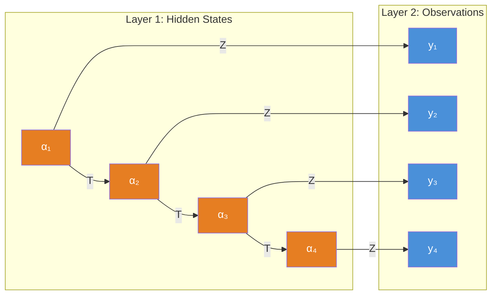
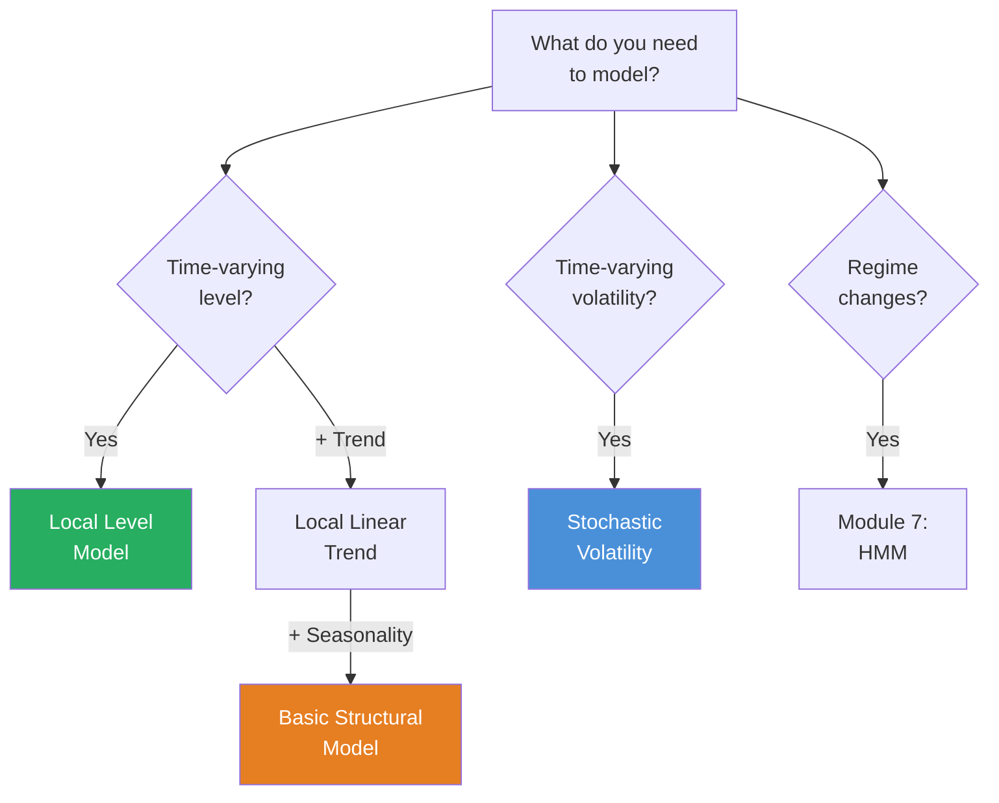
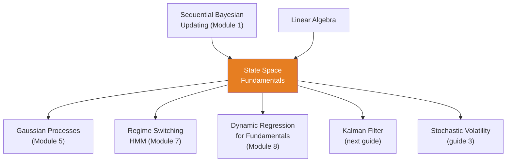

<!-- _class: lead -->

# State Space Fundamentals

**Module 3 — State Space Models**

Decomposing observed series into hidden latent components

<!-- Speaker notes: Welcome to State Space Fundamentals. This deck covers the key concepts you'll need. Estimated time: 44 minutes. -->
---

## Key Insight

> **Think of state space as a hidden story.** We observe the outcome (prices) but not the underlying drivers (trend, momentum, sentiment). State space models infer these hidden states from observable data.

<!-- Speaker notes: Explain Key Insight. Connect this concept to the practical applications in commodity markets. Check for understanding before moving on. -->
---

## General Linear Gaussian State Space Model

**Observation Equation:**
$$y_t = Z_t \alpha_t + d_t + \epsilon_t, \quad \epsilon_t \sim \mathcal{N}(0, H_t)$$

**State Transition Equation:**
$$\alpha_{t+1} = T_t \alpha_t + c_t + R_t \eta_t, \quad \eta_t \sim \mathcal{N}(0, Q_t)$$

**Initial State:**
$$\alpha_1 \sim \mathcal{N}(a_1, P_1)$$

<!-- Speaker notes: Walk through the mathematical notation carefully. Explain each symbol and relate it back to the intuitive explanation. Don't rush through formulas. -->
---

## Component Definitions

| Symbol | Dimension | Description |
|--------|-----------|-------------|
| $y_t$ | $p \times 1$ | Observations at time $t$ |
| $\alpha_t$ | $m \times 1$ | State vector at time $t$ |
| $Z_t$ | $p \times m$ | Observation matrix (links state to obs) |
| $T_t$ | $m \times m$ | Transition matrix (state dynamics) |
| $H_t$ | $p \times p$ | Observation noise covariance |
| $Q_t$ | $r \times r$ | State noise covariance |
| $R_t$ | $m \times r$ | State noise selection matrix |

<!-- Speaker notes: Walk through each row of the table. This is reference material learners will come back to, so highlight the most important entries. -->
---

## The Two-Layer Model



**Layer 1:** True underlying process (equilibrium price, volatility regime, trend)
**Layer 2:** Noisy observations (market prices with bid-ask noise, microstructure)

<!-- Speaker notes: Use the diagram to illustrate the relationships visually. Point to each node as you explain the flow. Give learners time to study the diagram. -->
---

<!-- _class: lead -->

# Common State Space Models

<!-- Speaker notes: Transition slide. We're now moving into Common State Space Models. Pause briefly to let learners absorb the previous section before continuing. -->
---

## 1. Local Level Model (Random Walk + Noise)

$$y_t = \mu_t + \epsilon_t, \quad \epsilon_t \sim \mathcal{N}(0, \sigma_\epsilon^2)$$
$$\mu_{t+1} = \mu_t + \eta_t, \quad \eta_t \sim \mathcal{N}(0, \sigma_\eta^2)$$

**State space form:** $\alpha_t = \mu_t$, $Z = 1$, $T = 1$

**Signal-to-noise ratio:** $q = \sigma_\eta^2 / \sigma_\epsilon^2$
- $q \to 0$: Observations are mostly noise (smooth the level)
- $q \to \infty$: Level changes rapidly (track observations closely)

> **Use case:** Filtering noise from commodity prices.

<!-- Speaker notes: Walk through the mathematical notation carefully. Explain each symbol and relate it back to the intuitive explanation. Don't rush through formulas. -->
---

## 2. Local Linear Trend Model

$$y_t = \mu_t + \epsilon_t$$
$$\mu_{t+1} = \mu_t + \nu_t + \eta_t$$
$$\nu_{t+1} = \nu_t + \zeta_t$$

**State space form:**
$$\alpha_t = \begin{bmatrix} \mu_t \\ \nu_t \end{bmatrix}, \quad T = \begin{bmatrix} 1 & 1 \\ 0 & 1 \end{bmatrix}, \quad Z = \begin{bmatrix} 1 & 0 \end{bmatrix}$$

> **Use case:** Extracting trend direction from volatile commodity prices.

<!-- Speaker notes: Walk through the mathematical notation carefully. Explain each symbol and relate it back to the intuitive explanation. Don't rush through formulas. -->
---

## 3. Basic Structural Model (BSM)

Adds seasonality to the local linear trend.

**State:** $[\mu_t, \nu_t, \gamma_{1,t}, \ldots, \gamma_{s-1,t}]'$

Seasonal component with period $s$:
$$\gamma_t = -\sum_{j=1}^{s-1} \gamma_{t-j} + \omega_t$$

> **Use case:** Agricultural commodities with harvest cycles, natural gas with heating/cooling seasons.

<!-- Speaker notes: Walk through the mathematical notation carefully. Explain each symbol and relate it back to the intuitive explanation. Don't rush through formulas. -->
---

## 4. Stochastic Volatility Model

$$y_t = \exp(h_t / 2)\, \epsilon_t, \quad \epsilon_t \sim \mathcal{N}(0, 1)$$
$$h_{t+1} = \mu + \phi(h_t - \mu) + \sigma_\eta \eta_t$$

Where $h_t = \log(\sigma_t^2)$ is log-volatility.

> **Use case:** Capturing volatility clustering in commodity returns.

<!-- Speaker notes: Walk through the mathematical notation carefully. Explain each symbol and relate it back to the intuitive explanation. Don't rush through formulas. -->
---

## Model Selection Guide



<!-- Speaker notes: Use the diagram to illustrate the relationships visually. Point to each node as you explain the flow. Give learners time to study the diagram. -->
---

<!-- _class: lead -->

# The Filtering Problem

<!-- Speaker notes: Transition slide. We're now moving into The Filtering Problem. Pause briefly to let learners absorb the previous section before continuing. -->
---

## Three Inference Tasks

Given observations $y_1, \ldots, y_t$:

| Task | Formula | Use |
|------|---------|-----|
| **Filtering** | $p(\alpha_t \mid y_1, \ldots, y_t)$ | Real-time forecasting |
| **Smoothing** | $p(\alpha_t \mid y_1, \ldots, y_T)$ | Retrospective analysis |
| **Prediction** | $p(\alpha_{t+h} \mid y_1, \ldots, y_t)$ | Future state forecasting |

> For linear-Gaussian models, all three are Gaussian with closed-form solutions (Kalman filter).

<!-- Speaker notes: Walk through each row of the table. This is reference material learners will come back to, so highlight the most important entries. -->
---

## Connection to ARIMA

| ARIMA Model | State Space Equivalent |
|-------------|----------------------|
| ARIMA(0,1,0) | Local Level with $\sigma_\epsilon^2 = 0$ |
| ARIMA(0,1,1) | Local Level |
| ARIMA(0,2,2) | Local Linear Trend |
| ARIMA(p,d,q) | General SSM, $m = \max(p, q+1) + d$ |

> **Advantage of state space:** More flexible, handles missing data, time-varying parameters.

<!-- Speaker notes: Walk through each row of the table. This is reference material learners will come back to, so highlight the most important entries. -->
---

<!-- _class: lead -->

# Code Implementation

<!-- Speaker notes: Transition slide. We're now moving into Code Implementation. Pause briefly to let learners absorb the previous section before continuing. -->
---

## PyMC Local Level Model

```python
import pymc as pm
import numpy as np

n_obs = 100
true_level = np.cumsum(np.random.normal(0, 0.5, n_obs)) + 80
y = true_level + np.random.normal(0, 2, n_obs)

with pm.Model() as local_level:
    sigma_level = pm.HalfNormal('sigma_level', sigma=1)
    sigma_obs = pm.HalfNormal('sigma_obs', sigma=5)

    level_init = pm.Normal('level_init', mu=80, sigma=10)
    level_innovations = pm.Normal('level_innov', mu=0,  # ... continued on next slide
```

<!-- Speaker notes: Walk through the code step by step. Highlight the key lines and explain the purpose of each section. Encourage learners to run this in their own notebooks. -->
---

## Code (continued)

<!-- Speaker notes: Continue walking through the code. This is a continuation of the previous slide's code block. -->

```python
                                   sigma=1, shape=n_obs-1)
    level = pm.Deterministic('level',
        pm.math.concatenate([[level_init],
            level_init + pm.math.cumsum(
                sigma_level * level_innovations)]))

    y_obs = pm.Normal('y_obs', mu=level,
                       sigma=sigma_obs, observed=y)
    trace = pm.sample(1000, tune=1000)
```

---

## Why Bayesian State Space?

<div class="columns">
<div>

**1. Parameter Uncertainty**
Classical Kalman filter treats variances as known. Bayesian approach estimates them with uncertainty.

**2. Prior Information**
Encode domain knowledge about level persistence, volatility ranges, seasonal patterns.

</div>
<div>

**3. Missing Data**
Natural handling of gaps (skip the update step).

**4. Model Comparison**
Compare specifications using WAIC, LOO-CV.

</div>
</div>

<!-- Speaker notes: Compare the two sides. Ask learners which approach they would use in their own work and why. -->
---

<!-- _class: lead -->

# Common Pitfalls

<!-- Speaker notes: Transition slide. We're now moving into Common Pitfalls. Pause briefly to let learners absorb the previous section before continuing. -->
---

## Pitfalls to Avoid

**Non-stationarity Confusion:** Random walk states are non-stationary by design. This is a feature, not a bug.

**Initialization Sensitivity:** Poor initial state distorts early inference. Use diffuse initialization or informative priors.

**Overparameterization:** With limited data, simpler models (local level) often outperform complex ones (BSM).

**Confusing Filter and Smoother:**
- Filter: Uses data up to time $t$ (real-time)
- Smoother: Uses all data (retrospective)

<!-- Speaker notes: These are common mistakes that even experienced practitioners make. Share a real-world example if possible to make the warning concrete. -->
---

## Connections



<!-- Speaker notes: Use the diagram to illustrate the relationships visually. Point to each node as you explain the flow. Give learners time to study the diagram. -->
---

## Practice Problems

1. Write out state space matrices $(Z, T, H, Q)$ for an AR(1) process: $y_t = \phi y_{t-1} + \epsilon_t$

2. A trader claims the oil market has a "hidden equilibrium price" that market price oscillates around. Which state space model captures this?

3. Weekly natural gas prices with missing values (holidays). How does the Kalman filter handle missing observations?

> *State space models are like X-ray machines for time series: they reveal the hidden structure beneath the noisy surface.*

<!-- Speaker notes: Give learners 5-10 minutes to attempt these problems. Circulate and offer hints. Review solutions together afterward. -->
---


<!-- _class: lead -->

# References

<!-- Speaker notes: These references provide deeper coverage of the topics discussed. Recommend the first 1-2 as starting points for learners who want to go deeper. -->

- **Durbin & Koopman** *Time Series Analysis by State Space Methods* - Definitive reference
- **Harvey, A.C.** *Forecasting, Structural Time Series Models* - Classic treatment
- **Commandeur & Koopman** *Introduction to State Space Time Series Analysis* - Accessible intro
