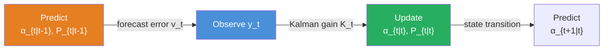
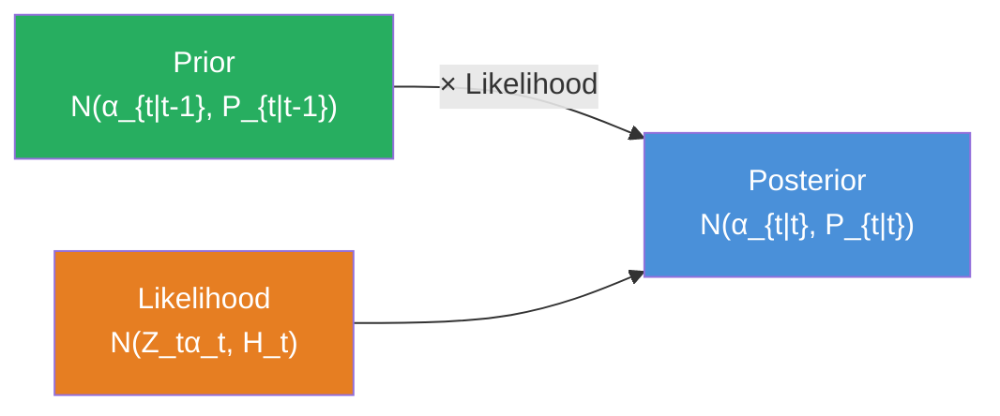
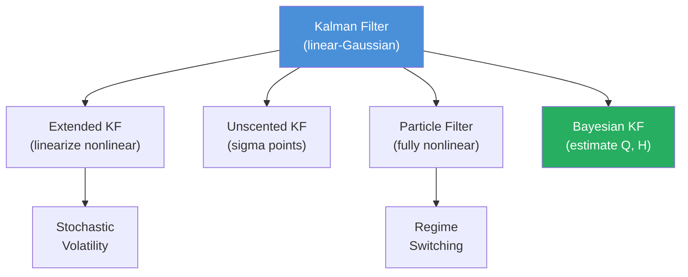

<!-- _class: lead -->

# The Kalman Filter
## Optimal Bayesian Updating for Linear-Gaussian Systems

**Module 3 — State Space Models**

<!-- Speaker notes: Welcome to The Kalman Filter. This deck covers the key concepts you'll need. Estimated time: 40 minutes. -->
---

## Key Insight

> The Kalman filter answers: "Given all observations up to now, what is my best estimate of the current hidden state, and how confident am I?" It alternates between **prediction** (system dynamics) and **update** (new observations).

Think of GPS: speedometer predicts position, GPS measurements correct it. The Kalman filter optimally combines both.

<!-- Speaker notes: Explain Key Insight. Connect this concept to the practical applications in commodity markets. Check for understanding before moving on. -->
---

## State Space Model

**Observation Equation:**
$$y_t = Z_t \alpha_t + \epsilon_t, \quad \epsilon_t \sim \mathcal{N}(0, H_t)$$

**State Transition Equation:**
$$\alpha_{t+1} = T_t \alpha_t + R_t \eta_t, \quad \eta_t \sim \mathcal{N}(0, Q_t)$$

<!-- Speaker notes: Walk through the mathematical notation carefully. Explain each symbol and relate it back to the intuitive explanation. Don't rush through formulas. -->
---

## Kalman Filter Recursions

<div class="columns">
<div>

### Prediction Step
$$\alpha_{t|t-1} = T_t \alpha_{t-1|t-1}$$
$$P_{t|t-1} = T_t P_{t-1|t-1} T_t^T + R_t Q_t R_t^T$$

</div>
<div>

### Update Step
$$v_t = y_t - Z_t \alpha_{t|t-1}$$
$$F_t = Z_t P_{t|t-1} Z_t^T + H_t$$
$$K_t = P_{t|t-1} Z_t^T F_t^{-1}$$
$$\alpha_{t|t} = \alpha_{t|t-1} + K_t v_t$$
$$P_{t|t} = P_{t|t-1} - K_t Z_t P_{t|t-1}$$

</div>
</div>

<!-- Speaker notes: Walk through the mathematical notation carefully. Explain each symbol and relate it back to the intuitive explanation. Don't rush through formulas. -->
---

## Kalman Filter Cycle



**Uncertainty Evolution:**
- **Predict:** $P$ increases (add system noise $Q$)
- **Update:** $P$ decreases (Kalman gain reduces uncertainty)

<!-- Speaker notes: Use the diagram to illustrate the relationships visually. Point to each node as you explain the flow. Give learners time to study the diagram. -->
---

## The Kalman Gain

$$K_t = \frac{P_{t|t-1} Z_t^T}{Z_t P_{t|t-1} Z_t^T + H_t}$$

| Scenario | $K_t$ | Behavior |
|----------|--------|----------|
| State very uncertain ($P$ large) | Large | Trust new data more |
| Observation very noisy ($H$ large) | Small | Trust prediction more |
| Perfect observations ($H \to 0$) | $\to Z_t^{-1}$ | Fully trust data |
| Certain state ($P \to 0$) | $\to 0$ | Ignore new data |

<!-- Speaker notes: Walk through the mathematical notation carefully. Explain each symbol and relate it back to the intuitive explanation. Don't rush through formulas. -->
---

## Bayesian Interpretation

The Kalman filter is **Normal-Normal conjugate updating**:

**Prior:** $\alpha_{t|t-1} \sim \mathcal{N}(\hat{\alpha}_{t|t-1}, P_{t|t-1})$

**Likelihood:** $y_t \mid \alpha_t \sim \mathcal{N}(Z_t \alpha_t, H_t)$

**Posterior:** $\alpha_t \mid y_t \sim \mathcal{N}(\hat{\alpha}_{t|t}, P_{t|t})$



<!-- Speaker notes: Use the diagram to illustrate the relationships visually. Point to each node as you explain the flow. Give learners time to study the diagram. -->
---

## Why the Kalman Filter is Optimal

Under linear-Gaussian assumptions:

1. **Minimum variance** unbiased estimates
2. **Exact Bayesian posterior:** $p(\alpha_t \mid y_{1:t})$
3. **Sufficient statistics:** $(\alpha_{t|t}, P_{t|t})$ summarize all information

> The posterior is Gaussian (conjugacy), and the Kalman filter recursively computes its mean and covariance.

<!-- Speaker notes: Explain Why the Kalman Filter is Optimal. Connect this concept to the practical applications in commodity markets. Check for understanding before moving on. -->
---

<!-- _class: lead -->

# Code Implementation

<!-- Speaker notes: Transition slide. We're now moving into Code Implementation. Pause briefly to let learners absorb the previous section before continuing. -->
---

## Kalman Filter Class

```python
import numpy as np

class KalmanFilter:
    """Local level model: y_t = α_t + ε_t, α_t = α_{t-1} + η_t"""
    def __init__(self, H, Q, alpha_0, P_0):
        self.H = H  # Observation noise variance
        self.Q = Q  # State noise variance
        self.alpha = alpha_0
        self.P = P_0
        self.filtered_states = []
        self.filtered_vars = []

    def predict(self):  # ... continued on next slide
```

<!-- Speaker notes: Walk through the code step by step. Highlight the key lines and explain the purpose of each section. Encourage learners to run this in their own notebooks. -->
---

## Code (Part 2/3)

<!-- Speaker notes: Continue walking through the code. This is a continuation of the previous slide's code block. -->

```python
        alpha_pred = self.alpha
        P_pred = self.P + self.Q
        return alpha_pred, P_pred

    def update(self, y):
        alpha_pred, P_pred = self.predict()
        v = y - alpha_pred            # forecast error
        F = P_pred + self.H           # forecast variance
        K = P_pred / F                # Kalman gain
        self.alpha = alpha_pred + K * v
        self.P = P_pred - K * P_pred
        self.filtered_states.append(self.alpha)
        self.filtered_vars.append(self.P)
```

---

## Code (Part 3/3)

<!-- Speaker notes: Continue walking through the code. This is a continuation of the previous slide's code block. -->

```python
        return self.alpha, self.P
```

---

## Simulate and Filter

```python
np.random.seed(42)
T = 100
Q_true, H_true = 1.0, 4.0

# True states (random walk)
alpha_true = np.cumsum(np.random.randn(T) * np.sqrt(Q_true))
# Observations
y = alpha_true + np.random.randn(T) * np.sqrt(H_true)

# Run Kalman filter
kf = KalmanFilter(H=H_true, Q=Q_true, alpha_0=0, P_0=10)
for yt in y:
    kf.update(yt)

print(f"MSE: {np.mean((np.array(kf.filtered_states) - alpha_true)**2):.3f}")
```

<!-- Speaker notes: Walk through the code step by step. Highlight the key lines and explain the purpose of each section. Encourage learners to run this in their own notebooks. -->
---

## Commodity Application: Filtering Oil Prices

```python
def filter_commodity_prices(prices, Q=0.5, H=2.0):
    """
    Apply Kalman filter to commodity prices.
    Q: state variance (how much true level varies)
    H: observation variance (market noise)
    """
    kf = KalmanFilter(H=H, Q=Q,
                       alpha_0=prices[0], P_0=10)
    filtered = []
    for p in prices:
        alpha, _ = kf.update(p)
        filtered.append(alpha)
    return np.array(filtered)
```

<!-- Speaker notes: Walk through the code step by step. Highlight the key lines and explain the purpose of each section. Encourage learners to run this in their own notebooks. -->
---

<!-- _class: lead -->

# Common Pitfalls

<!-- Speaker notes: Transition slide. We're now moving into Common Pitfalls. Pause briefly to let learners absorb the previous section before continuing. -->
---

## Pitfall 1: Wrong Noise Variances

```python
# Too small Q, too large H → Filter stuck, doesn't adapt
kf = KalmanFilter(H=100, Q=0.01, ...)

# Too large Q, too small H → Filter chases noise
kf = KalmanFilter(H=0.01, Q=100, ...)
```

**Solution:** Estimate $Q$, $H$ from data (MLE) or use Bayesian estimation. Monitor innovation sequence $v_t$ for white noise.

<!-- Speaker notes: Walk through the code step by step. Highlight the key lines and explain the purpose of each section. Encourage learners to run this in their own notebooks. -->
---

## Pitfall 2: Non-Gaussian Errors

Commodity returns have **fat tails**. Kalman filter assumes Gaussian.

**Solutions:**
- Robust Kalman filter (Huber loss)
- Particle filter for non-Gaussian cases
- Student-t error modeling

## Pitfall 3: Initialization Issues

Poor $\alpha_0$, $P_0$ biases early estimates.

**Fix:** Diffuse initialization ($P_0 \to \infty$), discard burn-in, or use sample mean.

<!-- Speaker notes: These are common mistakes that even experienced practitioners make. Share a real-world example if possible to make the warning concrete. -->
---

## Pitfall 4: Not Checking Innovations

If $v_t$ (forecast errors) are not white noise, the model is wrong!

```python
innovations = y - predictions
from statsmodels.graphics.tsaplots import plot_acf
plot_acf(innovations)  # Should show no significant lags
```

## Pitfall 5: Model Misspecification

Nonlinear systems need: **EKF** (linearize), **UKF** (better approximation), or **Particle filter** (fully nonlinear).

<!-- Speaker notes: Walk through the code step by step. Highlight the key lines and explain the purpose of each section. Encourage learners to run this in their own notebooks. -->
---

## Kalman Filter Variants



<!-- Speaker notes: Use the diagram to illustrate the relationships visually. Point to each node as you explain the flow. Give learners time to study the diagram. -->
---

## Connections

**Builds on:**
- Bayes' Theorem (KF = Bayesian updating)
- Conjugate Priors (Normal-Normal conjugacy)

**Leads to:**
- Stochastic Volatility (time-varying $H_t$)
- Regime Switching (multiple KFs per regime)
- Dynamic Regression (time-varying $\beta$)

**Related:**
- ARIMA = state space + Kalman filter
- Exponential smoothing = special case of KF

<!-- Speaker notes: This diagram shows how the current topic connects to the rest of the course. Use it to reinforce the big picture and preview what comes next. -->
---

## Practice Problems

1. **Derive** the Kalman gain $K_t$ that minimizes $P_{t|t}$.

2. **Implement** the Kalman smoother (backward recursions) and compare filtered vs. smoothed estimates.

3. **Estimate** optimal $Q$, $H$ from commodity data via grid search or maximum likelihood.

4. **Apply** Kalman filter to WTI crude oil (2020-2024); identify periods of high innovation variance.

> **Next:** Stochastic volatility models using the Kalman filter framework.

<!-- Speaker notes: Give learners 5-10 minutes to attempt these problems. Circulate and offer hints. Review solutions together afterward. -->
---


<!-- _class: lead -->

# References

<!-- Speaker notes: These references provide deeper coverage of the topics discussed. Recommend the first 1-2 as starting points for learners who want to go deeper. -->

- **Kalman (1960):** "A New Approach to Linear Filtering and Prediction Problems"
- **Durbin & Koopman (2012):** *Time Series Analysis by State Space Methods*
- **Schwartz & Smith (2000):** "Short-term variations and long-term dynamics in commodity prices"
- **Hamilton (1994):** *Time Series Analysis* - Ch. 13 on state space models
