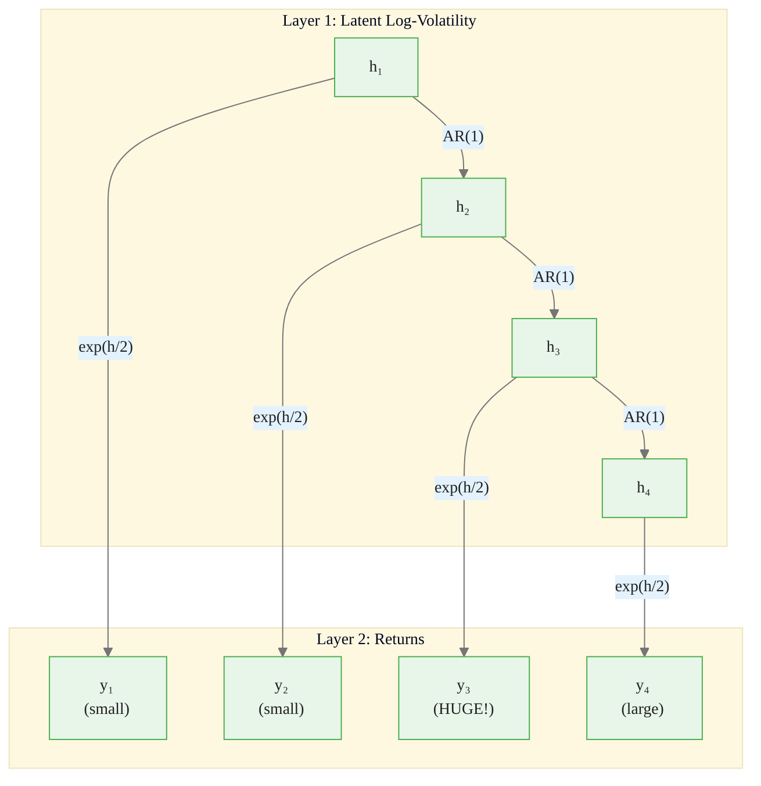
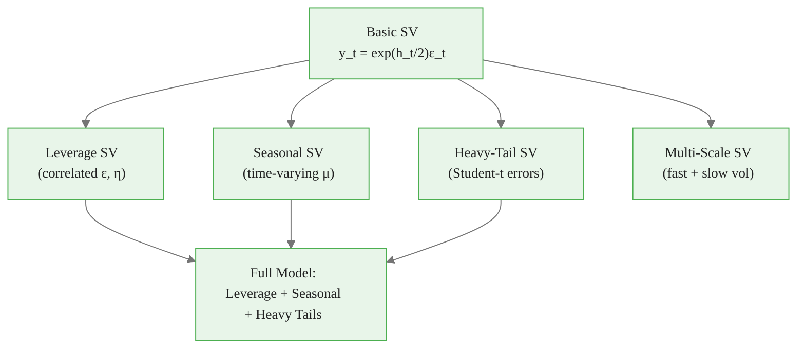
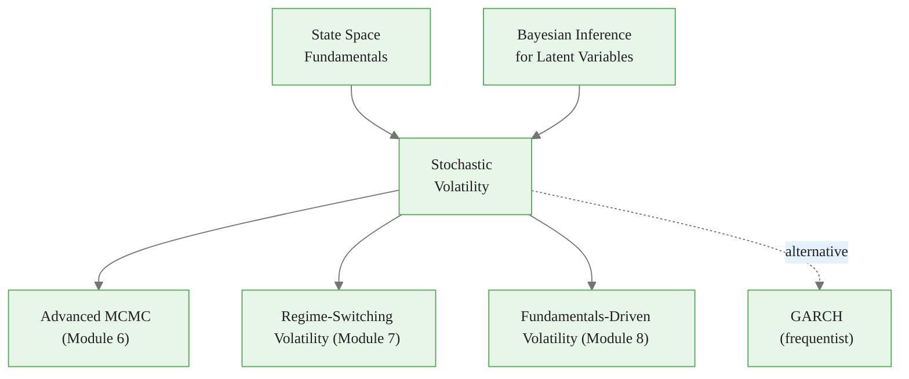

<!-- _class: lead -->

# Stochastic Volatility Models for Commodities

**Module 3 — State Space Models**

Volatility as a latent time-varying process

<!-- Speaker notes: Welcome to Stochastic Volatility Models for Commodities. This deck covers the key concepts you'll need. Estimated time: 52 minutes. -->
---

## Key Insight

> **Volatility has memory.** High volatility periods cluster together. Stochastic volatility models this persistence through a latent AR(1) process on log-variance, enabling both backward inference and forward prediction.

<!-- Speaker notes: Explain Key Insight. Connect this concept to the practical applications in commodity markets. Check for understanding before moving on. -->

<div class="callout-info">
This is a foundational concept for the rest of the module.
</div>
---

## Standard SV Model

**Observation Equation:**
$$y_t = \exp(h_t / 2)\, \epsilon_t, \quad \epsilon_t \sim \mathcal{N}(0, 1)$$

**Volatility Process (log-variance):**
$$h_{t+1} = \mu + \phi(h_t - \mu) + \sigma_\eta \eta_t, \quad \eta_t \sim \mathcal{N}(0, 1)$$

**Initial State:**
$$h_1 \sim \mathcal{N}\!\left(\mu, \frac{\sigma_\eta^2}{1 - \phi^2}\right)$$

<!-- Speaker notes: Walk through the mathematical notation carefully. Explain each symbol and relate it back to the intuitive explanation. Don't rush through formulas. -->

<div class="callout-key">
This is the key takeaway from this section.
</div>
---

## Parameter Interpretation

| Parameter | Range | Meaning |
|-----------|-------|---------|
| $\mu$ | $\mathbb{R}$ | Long-run log-variance level |
| $\phi$ | $(-1, 1)$ | Persistence (AR coefficient) |
| $\sigma_\eta$ | $\mathbb{R}^+$ | Volatility of volatility |
| $h_t$ | $\mathbb{R}$ | Log-variance at time $t$ |
| $\sigma_t = \exp(h_t/2)$ | $\mathbb{R}^+$ | Volatility at time $t$ |

**Stationary variance:** $\mathbb{E}[\sigma_t^2] = \exp\!\left(\mu + \frac{\sigma_\eta^2}{2(1-\phi^2)}\right)$

<!-- Speaker notes: Walk through each row of the table. This is reference material learners will come back to, so highlight the most important entries. -->

<div class="callout-warning">
Common misconception — read carefully.
</div>
---

## SV as Two-Layer State Space



<!-- Speaker notes: Use the diagram to illustrate the relationships visually. Point to each node as you explain the flow. Give learners time to study the diagram. -->

<div class="callout-insight">
This insight connects theory to practice.
</div>
---

## Why Log-Variance?

Variance must be positive. Working with $h_t = \log(\sigma_t^2)$:

1. $\sigma_t^2 = \exp(h_t) > 0$ automatically
2. AR(1) dynamics on $h_t$ can range over $\mathbb{R}$
3. Multiplicative shocks become additive in log-space

<!-- Speaker notes: Explain Why Log-Variance?. Connect this concept to the practical applications in commodity markets. Check for understanding before moving on. -->
---

<!-- _class: lead -->

# Why SV for Commodities?

<!-- Speaker notes: Transition slide. We're now moving into Why SV for Commodities?. Pause briefly to let learners absorb the previous section before continuing. -->
---

## Four Commodity-Specific Reasons

<div class="columns">
<div>

### 1. Inventory Shocks
Low inventory = higher volatility. SV captures this without inventory data.

### 2. Weather Events
Agricultural vol clusters around planting/harvest: quiet winters, volatile summers.

</div>
<div>

### 3. Regime Changes
Structural breaks (shale revolution) appear as shifts in $\mu$.

### 4. Risk Management
Options pricing, VaR, position sizing require vol forecasts **with uncertainty**.

</div>
</div>

<!-- Speaker notes: Compare the two sides. Ask learners which approach they would use in their own work and why. -->
---

## SV vs. GARCH

| Feature | GARCH | Stochastic Volatility |
|---------|-------|----------------------|
| Volatility process | Deterministic given past | Stochastic (latent) |
| Inference | Maximum likelihood | Bayesian (full posterior) |
| Forecasts | Point estimates | Full predictive distribution |
| Flexibility | Limited functional forms | Arbitrary prior/dynamics |
| Computation | Fast | Requires MCMC/VI |

> **Use GARCH** for speed. **Use SV** for uncertainty quantification and informative priors.

<!-- Speaker notes: Walk through each row of the table. This is reference material learners will come back to, so highlight the most important entries. -->
---

<!-- _class: lead -->

# Code Implementation

<!-- Speaker notes: Transition slide. We're now moving into Code Implementation. Pause briefly to let learners absorb the previous section before continuing. -->
---

## Basic SV Model in PyMC (Setup)

```python
import pymc as pm
import numpy as np
import arviz as az

# Simulate SV data
np.random.seed(42)
n_obs = 300
mu_true, phi_true, sigma_eta_true = -1.0, 0.95, 0.25

h = np.zeros(n_obs)
h[0] = np.random.normal(mu_true, sigma_eta_true / np.sqrt(1 - phi_true**2))
for t in range(1, n_obs):
    h[t] = mu_true + phi_true * (h[t-1] - mu_true) + sigma_eta_true * np.random.normal()  # ... continued on next slide
```

<!-- Speaker notes: Walk through the code step by step. Highlight the key lines and explain the purpose of each section. Encourage learners to run this in their own notebooks. -->
---

## Code (continued)

<!-- Speaker notes: Continue walking through the code. This is a continuation of the previous slide's code block. -->

```python

y = np.exp(h / 2) * np.random.normal(size=n_obs)
y = y - y.mean()
```

---

## Basic SV Model in PyMC (Model)

```python
with pm.Model() as sv_model:
    mu = pm.Normal('mu', mu=0, sigma=5)
    phi_raw = pm.Beta('phi_raw', alpha=20, beta=1.5)
    phi = pm.Deterministic('phi', 2 * phi_raw - 1)
    sigma_eta = pm.HalfNormal('sigma_eta', sigma=1)

    h_init = pm.Normal('h_init', mu=mu,
        sigma=sigma_eta / pm.math.sqrt(1 - phi**2))

    eta = pm.Normal('eta', mu=0, sigma=1, shape=n_obs-1)

    # Build log-volatility path
    h = pm.Deterministic('h',  # ... continued on next slide
```

<!-- Speaker notes: Walk through the code step by step. Highlight the key lines and explain the purpose of each section. Encourage learners to run this in their own notebooks. -->
---

## Code (continued)

<!-- Speaker notes: Continue walking through the code. This is a continuation of the previous slide's code block. -->

```python
        pm.math.concatenate([[h_init],
            h_init + pm.math.cumsum(
                mu * (1 - phi) + phi * pm.math.concatenate(
                    [[0], eta[:-1]]) + sigma_eta * eta)]))

    y_obs = pm.Normal('y_obs', mu=0,
                       sigma=pm.math.exp(h / 2), observed=y)

    trace = pm.sample(1000, tune=2000, target_accept=0.95,
                       return_inferencedata=True)
```

---

## Diagnostics

```python
print(az.summary(trace, var_names=['mu', 'phi', 'sigma_eta']))

# Posterior mean of volatility path
h_post = trace.posterior['h'].mean(dim=['chain', 'draw']).values
h_hdi = az.hdi(trace, var_names=['h'])['h']

# Plot inferred vs true volatility
plt.plot(np.exp(h / 2), 'k-', alpha=0.3, label='True')
plt.plot(np.exp(h_post / 2), 'r-', label='Posterior Mean')
plt.fill_between(range(n_obs),
    np.exp(h_hdi[:, 0] / 2), np.exp(h_hdi[:, 1] / 2),
    alpha=0.3, color='r', label='94% HDI')
plt.legend()
```

<!-- Speaker notes: Walk through the code step by step. Highlight the key lines and explain the purpose of each section. Encourage learners to run this in their own notebooks. -->
---

<!-- _class: lead -->

# Commodity-Specific Extensions

<!-- Speaker notes: Transition slide. We're now moving into Commodity-Specific Extensions. Pause briefly to let learners absorb the previous section before continuing. -->
---

## 1. Leverage Effect

Negative returns increase volatility more than positive returns (especially energy).

```python
with pm.Model() as sv_leverage:
    # ... standard SV parameters ...
    rho = pm.Uniform('rho', lower=-1, upper=0)  # Negative
    # Correlated innovations between returns and vol
```

## 2. Seasonal Volatility

Natural gas volatility peaks in summer and winter.

```python
with pm.Model() as sv_seasonal:
    months = np.arange(n_obs) % 12
    seasonal_mu = pm.Normal('seasonal_mu', mu=0,
                             sigma=1, shape=12)
    mu_t = seasonal_mu[months]  # Time-varying mean
```

<!-- Speaker notes: Walk through the code step by step. Highlight the key lines and explain the purpose of each section. Encourage learners to run this in their own notebooks. -->
---

## 3. Heavy Tails (Student-t Returns)

Commodity returns have fatter tails than Normal.

```python
with pm.Model() as sv_student:
    nu = pm.Gamma('nu', alpha=2, beta=0.1)
    y_obs = pm.StudentT('y_obs', nu=nu, mu=0,
                          sigma=pm.math.exp(h/2), observed=y)
```

<!-- Speaker notes: Walk through the code step by step. Highlight the key lines and explain the purpose of each section. Encourage learners to run this in their own notebooks. -->
---

## SV Extensions Map



<!-- Speaker notes: Use the diagram to illustrate the relationships visually. Point to each node as you explain the flow. Give learners time to study the diagram. -->
---

<!-- _class: lead -->

# Forecasting Volatility

<!-- Speaker notes: Transition slide. We're now moving into Forecasting Volatility. Pause briefly to let learners absorb the previous section before continuing. -->
---

## One-Step-Ahead Forecast

Given $h_t$:

$$h_{t+1} \mid h_t \sim \mathcal{N}(\mu + \phi(h_t - \mu),\; \sigma_\eta^2)$$

$$\sigma_{t+1}^2 \mid h_t \sim \text{LogNormal}(\mu + \phi(h_t - \mu),\; \sigma_\eta^2)$$

## Multi-Step Forecast

$$h_{t+k} \mid h_t \sim \mathcal{N}\!\left(\mu + \phi^k(h_t - \mu),\; \frac{\sigma_\eta^2(1 - \phi^{2k})}{1 - \phi^2}\right)$$

> As $k \to \infty$, converges to the stationary distribution.

<!-- Speaker notes: Walk through the mathematical notation carefully. Explain each symbol and relate it back to the intuitive explanation. Don't rush through formulas. -->
---

## Volatility Forecast Code

```python
def forecast_volatility(trace, last_h, periods=20):
    mu_s = trace.posterior['mu'].values.flatten()
    phi_s = trace.posterior['phi'].values.flatten()
    se_s = trace.posterior['sigma_eta'].values.flatten()

    n = len(mu_s)
    h_fc = np.zeros((n, periods))
    for i in range(n):
        h_t = last_h
        for t in range(periods):
            h_t = (mu_s[i] + phi_s[i] * (h_t - mu_s[i])
                   + se_s[i] * np.random.normal())
            h_fc[i, t] = h_t  # ... continued on next slide
```

<!-- Speaker notes: Walk through the code step by step. Highlight the key lines and explain the purpose of each section. Encourage learners to run this in their own notebooks. -->
---

## Code (continued)

<!-- Speaker notes: Continue walking through the code. This is a continuation of the previous slide's code block. -->

```python

    vol = np.exp(h_fc / 2)
    return pd.DataFrame({
        'mean': vol.mean(axis=0),
        'lower': np.percentile(vol, 2.5, axis=0),
        'upper': np.percentile(vol, 97.5, axis=0)
    })
```

---

<!-- _class: lead -->

# Common Pitfalls

<!-- Speaker notes: Transition slide. We're now moving into Common Pitfalls. Pause briefly to let learners absorb the previous section before continuing. -->
---

## Pitfall 1: Non-Centered Parameterization

Standard SV models can have poor MCMC geometry.

```python
# Bad: Centered
h[t] = mu + phi * (h[t-1] - mu) + sigma_eta * eta[t]

# Better: Non-centered
h_raw[t] = phi * h_raw[t-1] + eta[t]
h[t] = mu + sigma_eta / sqrt(1 - phi**2) * h_raw[t]
```

## Pitfall 2: Confusing $h_t$ and $\sigma_t^2$

$h_t$ is **log-variance**: $h_t = \log(\sigma_t^2)$, so $\sigma_t = \exp(h_t/2)$.

<!-- Speaker notes: Walk through the code step by step. Highlight the key lines and explain the purpose of each section. Encourage learners to run this in their own notebooks. -->
---

## Pitfall 3: Overlooking Persistence

Commodity volatility is highly persistent ($\phi > 0.9$ typical).

> Use a strong prior: `Beta(20, 1.5)` mapped to $(-1, 1)$.

## Pitfall 4: Initialization

Use the stationary distribution:
$$h_1 \sim \mathcal{N}\!\left(\mu,\; \frac{\sigma_\eta^2}{1 - \phi^2}\right)$$

<!-- Speaker notes: Walk through the mathematical notation carefully. Explain each symbol and relate it back to the intuitive explanation. Don't rush through formulas. -->
---

## Connections



<!-- Speaker notes: Use the diagram to illustrate the relationships visually. Point to each node as you explain the flow. Give learners time to study the diagram. -->
---

## Practice Problems

1. If $\phi = 0.96$, $\sigma_\eta = 0.15$, $h_t = 0.5$: what is expected log-vol in 1 week? 10 weeks? What is the uncertainty?

2. Why log-variance rather than log-standard-deviation as the latent state?

3. Oil volatility spikes after large negative price moves. Which SV extension captures this? Write the model equations.

4. Implement SV with seasonal volatility for natural gas (high Jan/Jul, low Apr/Oct).

5. Compare 1-week-ahead vol forecasts: historical std, EWMA, and SV model.

> *"In commodity markets, predicting volatility is often more valuable than predicting prices -- because volatility is more predictable."*

<!-- Speaker notes: Give learners 5-10 minutes to attempt these problems. Circulate and offer hints. Review solutions together afterward. -->
---


<!-- _class: lead -->

# References

<!-- Speaker notes: These references provide deeper coverage of the topics discussed. Recommend the first 1-2 as starting points for learners who want to go deeper. -->

- **Kim, Shephard & Chib (1998):** "Stochastic Volatility: Likelihood Inference" - Classic SV reference
- **Kastner & Fruhwirth-Schnatter (2014):** ASIS for boosting SV MCMC
- **Shephard (2005):** *Stochastic Volatility: Selected Readings* - Comprehensive collection
- **Prado & West (2010):** *Time Series: Modeling, Computation, and Inference*
