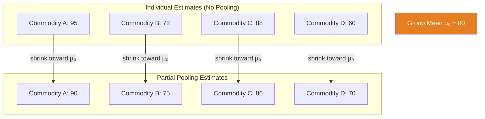
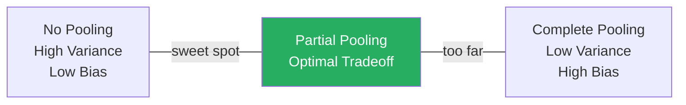
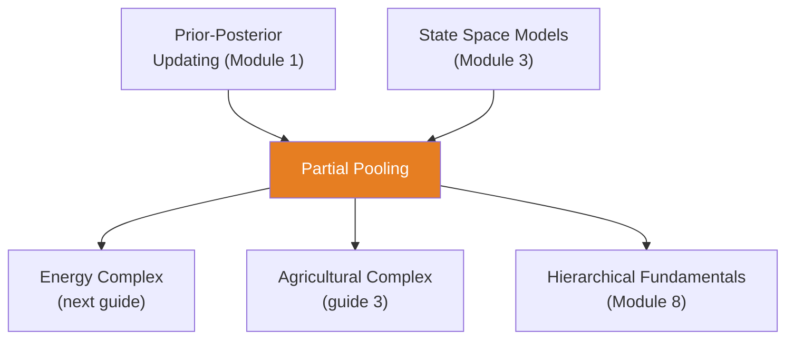

<!-- _class: lead -->

# Partial Pooling
## The Logic of Hierarchical Models

**Module 4 — Hierarchical Models**

<!-- Speaker notes: Welcome to Partial Pooling. This deck covers the key concepts you'll need. Estimated time: 34 minutes. -->
---

## Key Insight

> **Shrinkage is intelligent borrowing.** When a commodity has limited data, its estimates are "shrunk" toward the group mean. When it has abundant data, it stands on its own. The model automatically determines how much to shrink.

<!-- Speaker notes: Explain Key Insight. Connect this concept to the practical applications in commodity markets. Check for understanding before moving on. -->
---

## Hierarchical Model Structure

**Level 1 (Observation):** $y_{ij} \sim \mathcal{N}(\mu_j, \sigma^2)$

**Level 2 (Group):** $\mu_j \sim \mathcal{N}(\mu_0, \tau^2)$

**Level 3 (Hyperprior):** $\mu_0 \sim \mathcal{N}(m, s^2)$, $\tau \sim \text{HalfNormal}(\sigma_\tau)$

| Symbol | Meaning |
|--------|---------|
| $y_{ij}$ | Observation $i$ for commodity $j$ |
| $\mu_j$ | Mean for commodity $j$ |
| $\mu_0$ | Group mean (shared) |
| $\tau$ | Group std (controls pooling) |

<!-- Speaker notes: Walk through each row of the table. This is reference material learners will come back to, so highlight the most important entries. -->
---

## The Three Pooling Regimes


| Regime | Pros | Cons | When |
|--------|------|------|------|
| **No Pooling** | Captures individual traits | High variance | Truly unrelated commodities |
| **Complete Pooling** | Low variance, stable | Ignores differences | Nearly identical commodities |
| **Partial Pooling** | Best of both worlds | More complex | Related commodities |

<!-- Speaker notes: Use the diagram to illustrate the relationships visually. Point to each node as you explain the flow. Give learners time to study the diagram. -->
---

## Shrinkage Formula

Posterior mean for commodity $j$:

$$\hat{\mu}_j = \lambda_j \bar{y}_j + (1 - \lambda_j)\, \mu_0$$

Where:

$$\lambda_j = \frac{n_j \tau^2}{n_j \tau^2 + \sigma^2}$$

| Condition | $\lambda_j$ | Behavior |
|-----------|-------------|----------|
| Large $n_j$ | $\to 1$ | Trust data (less shrinkage) |
| Small $n_j$ | $\to 0$ | Trust group (more shrinkage) |
| Large $\tau^2$ | $\to 1$ | Groups very different |
| Small $\tau^2$ | $\to 0$ | Groups very similar |

<!-- Speaker notes: Walk through the mathematical notation carefully. Explain each symbol and relate it back to the intuitive explanation. Don't rush through formulas. -->
---

## Shrinkage Visualized



> Extreme estimates and small-sample commodities are pulled more toward the group mean.

<!-- Speaker notes: Use the diagram to illustrate the relationships visually. Point to each node as you explain the flow. Give learners time to study the diagram. -->
---

<!-- _class: lead -->

# Code Implementation

<!-- Speaker notes: Transition slide. We're now moving into Code Implementation. Pause briefly to let learners absorb the previous section before continuing. -->
---

## Hierarchical Model in PyMC

```python
import pymc as pm
import numpy as np
import arviz as az

np.random.seed(42)
n_commodities = 5
true_group_mean, true_group_std, true_obs_std = 80, 10, 5
true_means = np.random.normal(true_group_mean, true_group_std, n_commodities)

sample_sizes = [10, 20, 50, 100, 200]
observations, commodity_idx = [], []
for j, (mu, n) in enumerate(zip(true_means, sample_sizes)):
    obs = np.random.normal(mu, true_obs_std, n)  # ... continued on next slide
```

<!-- Speaker notes: Walk through the code step by step. Highlight the key lines and explain the purpose of each section. Encourage learners to run this in their own notebooks. -->
---

## Code (continued)

<!-- Speaker notes: Continue walking through the code. This is a continuation of the previous slide's code block. -->

```python
    observations.extend(obs)
    commodity_idx.extend([j] * n)

y = np.array(observations)
idx = np.array(commodity_idx)
```

---

## Model Definition and Sampling

```python
with pm.Model() as hierarchical_model:
    # Hyperpriors
    mu_group = pm.Normal('mu_group', mu=80, sigma=20)
    sigma_group = pm.HalfNormal('sigma_group', sigma=15)

    # Group-level priors (one per commodity)
    mu_commodity = pm.Normal('mu_commodity',
        mu=mu_group, sigma=sigma_group, shape=n_commodities)

    # Observation noise
    sigma_obs = pm.HalfNormal('sigma_obs', sigma=10)

    # Likelihood  # ... continued on next slide
```

<!-- Speaker notes: Walk through the code step by step. Highlight the key lines and explain the purpose of each section. Encourage learners to run this in their own notebooks. -->
---

## Code (continued)

<!-- Speaker notes: Continue walking through the code. This is a continuation of the previous slide's code block. -->

```python
    y_obs = pm.Normal('y_obs',
        mu=mu_commodity[idx], sigma=sigma_obs, observed=y)

    trace = pm.sample(2000, tune=1000, random_seed=42)
```

---

## Compare Estimates

```python
print(f"{'Commodity':<12} {'True':<10} {'Sample Mean':<14} {'Hierarchical':<14}")
for j in range(n_commodities):
    sample_mean = y[idx == j].mean()
    hier_mean = trace.posterior['mu_commodity'] \
                     .values[:, :, j].mean()
    print(f"{j:<12} {true_means[j]:<10.2f} "
          f"{sample_mean:<14.2f} {hier_mean:<14.2f}")
```

> Small-sample commodities (n=10, 20) show the most shrinkage toward the group mean.

<!-- Speaker notes: Walk through the code step by step. Highlight the key lines and explain the purpose of each section. Encourage learners to run this in their own notebooks. -->
---

## When Hierarchical Models Excel

<div class="columns">
<div>

**1. Small Sample Problems**
New commodity contracts with limited history benefit from established ones.

**2. Heterogeneous Data Quality**
Reliable + unreliable data mixed. Model adapts automatically.

</div>
<div>

**3. Related Group Structure**
Energy products, grain complex, precious metals -- natural groupings exist.

**4. Automatic Regularization**
Hierarchical priors reduce overfitting.

</div>
</div>

<!-- Speaker notes: Compare the two sides. Ask learners which approach they would use in their own work and why. -->
---

<!-- _class: lead -->

# Common Pitfalls

<!-- Speaker notes: Transition slide. We're now moving into Common Pitfalls. Pause briefly to let learners absorb the previous section before continuing. -->
---

## Pitfalls to Avoid

**Ignoring Group Structure:** Not using hierarchical models when natural groupings exist wastes information.

**Wrong Grouping:** Grouping unrelated commodities (gold with corn) adds noise.

**Overparameterization:** Too many hierarchy levels with limited data causes non-identifiability.

**Forgetting to Check Shrinkage:** Extreme shrinkage may indicate model misspecification.

<!-- Speaker notes: These are common mistakes that even experienced practitioners make. Share a real-world example if possible to make the warning concrete. -->
---

## Bias-Variance Tradeoff



> Partial pooling minimizes total prediction error by optimally balancing bias and variance.

<!-- Speaker notes: Use the diagram to illustrate the relationships visually. Point to each node as you explain the flow. Give learners time to study the diagram. -->
---

## Connections



<!-- Speaker notes: Use the diagram to illustrate the relationships visually. Point to each node as you explain the flow. Give learners time to study the diagram. -->
---

## Practice Problems

1. A new biofuels contract has 20 observations. Existing ethanol contracts have 500+. How does hierarchical modeling help?

2. Modeling the grain complex (corn, wheat, soybeans). What should share parameters (partial pooling) vs. remain commodity-specific?

3. Derive $\lambda_j$ for $n_j = 50$, $\sigma^2 = 25$, $\tau^2 = 100$.

> *"Hierarchical models are not about assuming commodities are the same -- they are about learning how different they actually are."*

<!-- Speaker notes: Give learners 5-10 minutes to attempt these problems. Circulate and offer hints. Review solutions together afterward. -->
---


<!-- _class: lead -->

# References

<!-- Speaker notes: These references provide deeper coverage of the topics discussed. Recommend the first 1-2 as starting points for learners who want to go deeper. -->

- **Gelman & Hill** *Data Analysis Using Regression and Multilevel/Hierarchical Models*
- **McElreath** *Statistical Rethinking* Ch. 13 - Excellent intuitive treatment
- **Kruschke** *Doing Bayesian Data Analysis* Ch. 9 - Worked examples
