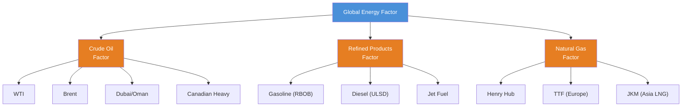
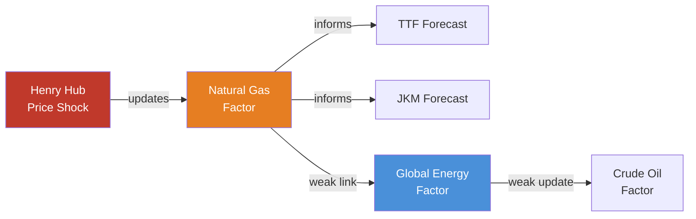
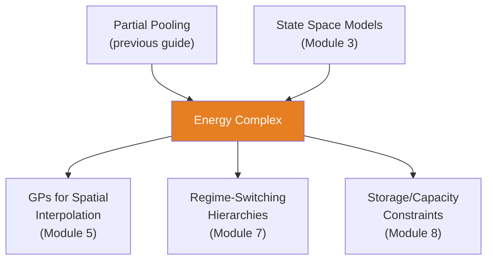

<!-- _class: lead -->

# Hierarchical Models for Energy Commodities

**Module 4 — Hierarchical Models**

Pooling information across crude grades, products, and regions

<!-- Speaker notes: Welcome to Hierarchical Models for Energy Commodities. This deck covers the key concepts you'll need. Estimated time: 32 minutes. -->
---

## Key Insight

> **Borrow strength across related markets.** WTI and Brent are highly correlated but not identical. A hierarchical model learns common "oil market" dynamics while preserving spread relationships, preventing overfitting on individual series.

<!-- Speaker notes: Explain Key Insight. Connect this concept to the practical applications in commodity markets. Check for understanding before moving on. -->
---

## Energy Market Hierarchy



<!-- Speaker notes: Use the diagram to illustrate the relationships visually. Point to each node as you explain the flow. Give learners time to study the diagram. -->
---

## Three-Level Formal Definition

**Level 1 (Hyperprior):** $\mu_{\text{global}} \sim \mathcal{N}(m_0, s_0^2)$, $\sigma_{\text{global}} \sim \text{HalfNormal}(\tau_0)$

**Level 2 (Product):** $\mu_{\text{product}} \sim \mathcal{N}(\mu_{\text{global}}, \sigma_{\text{global}}^2)$

**Level 3 (Market):**
$$y_{i,t} \sim \mathcal{N}(\alpha_i + \beta_i \cdot \mu_{\text{product}} + f(X_{i,t}),\; \sigma_{\text{product}})$$

| Symbol | Meaning |
|--------|---------|
| $\alpha_i$ | Market-specific intercept (location premium) |
| $\beta_i$ | Loading on product factor (correlation strength) |
| $f(X_{i,t})$ | Observable fundamentals (inventories, capacity) |

<!-- Speaker notes: Walk through the mathematical notation carefully. Explain each symbol and relate it back to the intuitive explanation. Don't rush through formulas. -->
---

## Why Hierarchical for Energy?

<div class="columns">
<div>

### Data Sparsity
- Short history (new venues)
- Illiquid trading
- Missing data (shutdowns)

**Solution:** Borrow from liquid markets.

### Structural Relationships
- Crack Spreads: Gasoline $\approx$ Crude + Margin
- Arbitrage: $|\text{WTI} - \text{Brent}| <$ Transport cost
- Substitution: High gas $\to$ more coal/oil

</div>
<div>

### Risk Management
- Time-varying correlations
- Uncertainty in correlation estimates
- Conditional dependence

### Information Flow
1. Henry Hub shock $\to$ nat gas factor updates
2. Nat gas factor $\to$ regional hub forecasts
3. Global energy factor $\to$ weakly influences all

</div>
</div>

<!-- Speaker notes: Compare the two sides. Ask learners which approach they would use in their own work and why. -->
---

<!-- _class: lead -->

# Code: Basic Crude Oil Hierarchy

<!-- Speaker notes: Transition slide. We're now moving into Code: Basic Crude Oil Hierarchy. Pause briefly to let learners absorb the previous section before continuing. -->
---

## Model Setup

```python
import pymc as pm
import numpy as np
import arviz as az

np.random.seed(42)
n_weeks, n_grades = 200, 3
grade_names = ['WTI', 'Brent', 'Dubai']

# True global factor
global_factor = np.cumsum(np.random.normal(0, 2, n_weeks)) + 80

# Grade-specific parameters
grade_intercepts = np.array([0, 2, -3])   # Brent premium, Dubai discount  # ... continued on next slide
```

<!-- Speaker notes: Walk through the code step by step. Highlight the key lines and explain the purpose of each section. Encourage learners to run this in their own notebooks. -->
---

## Code (continued)

<!-- Speaker notes: Continue walking through the code. This is a continuation of the previous slide's code block. -->

```python
grade_loadings = np.array([1.0, 0.98, 0.95])
grade_noise = np.array([1.5, 1.2, 2.0])

prices = np.zeros((n_weeks, n_grades))
for g in range(n_grades):
    prices[:, g] = (grade_intercepts[g]
                    + grade_loadings[g] * global_factor
                    + np.random.normal(0, grade_noise[g], n_weeks))
```

---

## Model Definition

```python
with pm.Model() as crude_hierarchy:
    mu_global = pm.Normal('mu_global', mu=80, sigma=20)
    sigma_global = pm.HalfNormal('sigma_global', sigma=10)

    grade_intercept = pm.Normal('grade_intercept',
                                 mu=0, sigma=5, shape=n_grades)
    grade_loading = pm.Normal('grade_loading',
                               mu=1, sigma=0.2, shape=n_grades)
    grade_sigma = pm.HalfNormal('grade_sigma',
                                 sigma=sigma_global, shape=n_grades)

    factor_innov = pm.Normal('factor_innov', 0, 1, shape=n_weeks-1)
    factor = pm.Deterministic('factor',  # ... continued on next slide
```

<!-- Speaker notes: Walk through the code step by step. Highlight the key lines and explain the purpose of each section. Encourage learners to run this in their own notebooks. -->
---

## Code (continued)

<!-- Speaker notes: Continue walking through the code. This is a continuation of the previous slide's code block. -->

```python
        pm.math.concatenate([[mu_global],
            mu_global + pm.math.cumsum(sigma_global * factor_innov)]))

    for g in range(n_grades):
        pm.Normal(f'price_{grade_names[g]}',
                  mu=grade_intercept[g] + grade_loading[g] * factor,
                  sigma=grade_sigma[g], observed=prices[:, g])

    trace = pm.sample(1000, tune=2000, target_accept=0.9,
                       return_inferencedata=True)
```

---

## Crack Spread Model

Refining adds value to crude. Model the spread hierarchically.

```python
with pm.Model() as crack_spread_model:
    # Crude oil process (Level 1)
    crude_mu = pm.Normal('crude_mu', mu=70, sigma=10)
    crude_sigma = pm.HalfNormal('crude_sigma', sigma=5)
    crude_price = pm.Deterministic('crude_price',
        crude_mu + pm.math.cumsum(crude_sigma * crude_innov))

    # Crack spread (Level 2) - mean-reverting refining margin
    crack_mu = pm.Normal('crack_mu', mu=15, sigma=5)
    crack_phi = pm.Beta('crack_phi', alpha=10, beta=1) * 2 - 1

    # Gasoline = Crude + Crack Spread
    gasoline_price = pm.Deterministic('gasoline_price',
                                       crude_price + crack_spread)
```

> Ensures gasoline and crude forecasts are consistent.

<!-- Speaker notes: Walk through the code step by step. Highlight the key lines and explain the purpose of each section. Encourage learners to run this in their own notebooks. -->
---

## Information Flow in the Hierarchy



<!-- Speaker notes: Use the diagram to illustrate the relationships visually. Point to each node as you explain the flow. Give learners time to study the diagram. -->
---

## Geographic Hierarchy: Regional Natural Gas

```python
with pm.Model() as gas_regional:
    # Level 1: National market
    national_price = pm.Deterministic('national_price',
        national_mu + pm.math.cumsum(national_sigma * national_innov))

    # Level 2: Regional basis differentials
    basis_mu = pm.Normal('basis_mu', mu=0, sigma=1, shape=n_hubs)
    seasonal_basis = pm.Normal('seasonal_basis',
                                mu=0, sigma=0.3, shape=(n_hubs, 12))

    # Regional prices = National + Basis + Seasonal
    for i, hub in enumerate(hubs):
        regional_price = national_price + basis_mu[i] + seasonal_basis[i, months]
        pm.Normal(f'price_{hub}', mu=regional_price,
                  sigma=0.2, observed=gas_data[hub])
```

<!-- Speaker notes: Walk through the code step by step. Highlight the key lines and explain the purpose of each section. Encourage learners to run this in their own notebooks. -->
---

<!-- _class: lead -->

# Common Pitfalls

<!-- Speaker notes: Transition slide. We're now moving into Common Pitfalls. Pause briefly to let learners absorb the previous section before continuing. -->
---

## Pitfalls to Avoid

**Over-Pooling:** If markets are truly independent, hierarchy hurts. Check posterior shrinkage.

**Ignoring Transportation Constraints:** WTI-Brent spread bounded by tanker cost (~\$5/bbl).

```python
pm.Potential('arbitrage_bound',
    pm.math.switch(spread > 7, -np.inf, 0))
```

**Static Loadings During Regime Shifts:** Shale revolution changed WTI-Brent relationship.

**Circular Dependencies:** Do not make crude depend on gasoline AND gasoline depend on crude.

<!-- Speaker notes: Walk through the code step by step. Highlight the key lines and explain the purpose of each section. Encourage learners to run this in their own notebooks. -->
---

## Connections



<!-- Speaker notes: Use the diagram to illustrate the relationships visually. Point to each node as you explain the flow. Give learners time to study the diagram. -->
---

## Practice Problems

1. Design a hierarchical model for Mars (US Gulf crude) with only 1 year of data, borrowing from 5 years of WTI.

2. WTI-Brent spread at \$8/bbl, model predicts \$12. What constraint is violated? How to fix?

3. During COVID-19, crude correlations spiked. Implement time-varying correlations.

4. California gas prices \$10 above Henry Hub (pipeline outage). How does hierarchical model handle this vs. independent model?

> *"In energy markets, no crude grade is an island. Hierarchical models respect the interconnected reality."*

<!-- Speaker notes: Give learners 5-10 minutes to attempt these problems. Circulate and offer hints. Review solutions together afterward. -->
---


<!-- _class: lead -->

# References

<!-- Speaker notes: These references provide deeper coverage of the topics discussed. Recommend the first 1-2 as starting points for learners who want to go deeper. -->

- **Gelman & Hill (2006):** *Data Analysis Using Regression and Multilevel Models*
- **Fattouh (2010):** "The Dynamics of Crude Oil Price Differentials" - Crude grade relationships
- **Pindyck & Rotemberg (1990):** "The Excess Co-Movement of Commodity Prices"
- **Buyuksahin & Rober (2014):** "Speculators, Commodities and Cross-Market Linkages"
