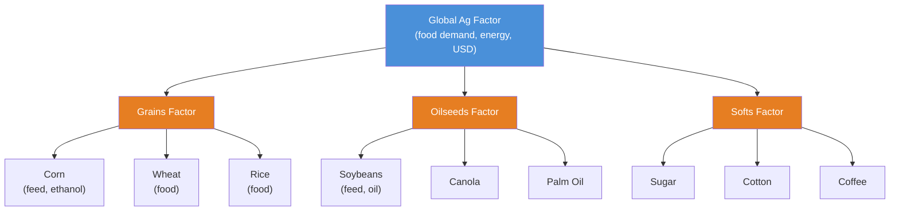
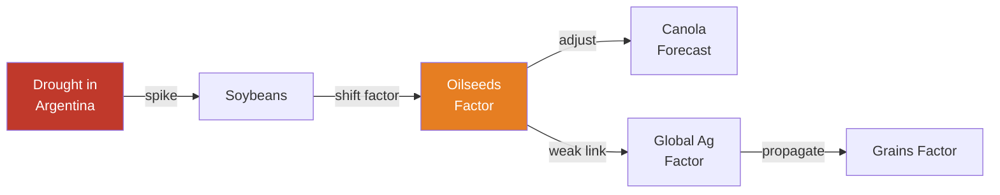
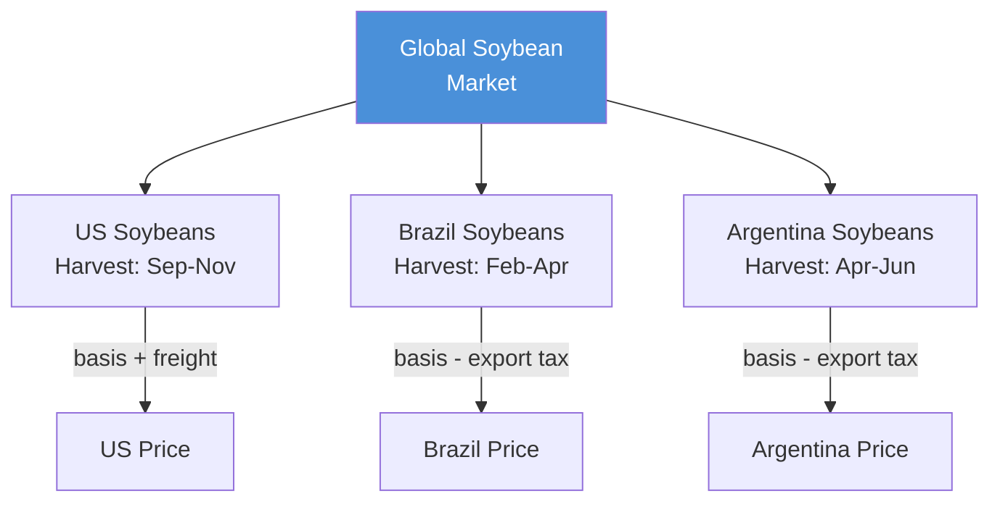
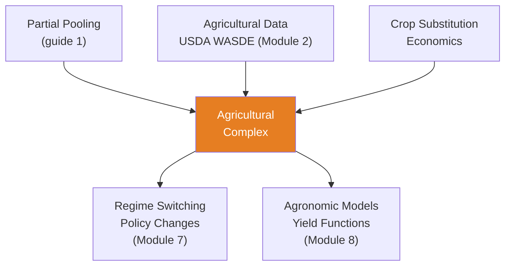

<!-- _class: lead -->

# Hierarchical Models for Agricultural Commodities

**Module 4 — Hierarchical Models**

Crop rotation, feed demand, and land allocation

<!-- Speaker notes: Welcome to Hierarchical Models for Agricultural Commodities. This deck covers the key concepts you'll need. Estimated time: 40 minutes. -->
---

## Key Insight

> **Corn does not exist in isolation.** When corn prices spike, farmers plant more corn (less soybeans). When corn is cheap, livestock producers expand herds (increasing feed demand). A hierarchical model jointly captures these substitution and complementarity relationships.

<!-- Speaker notes: Explain Key Insight. Connect this concept to the practical applications in commodity markets. Check for understanding before moving on. -->
---

## The Agricultural Pyramid



<!-- Speaker notes: Use the diagram to illustrate the relationships visually. Point to each node as you explain the flow. Give learners time to study the diagram. -->
---

## Three-Level Formal Definition

**Level 1:** $\mu_{\text{ag}} \sim \mathcal{N}(m_0, s_0^2)$, $\sigma_{\text{ag}} \sim \text{HalfNormal}(\tau_0)$

**Level 2:** $\mu_{\text{category}} \sim \mathcal{N}(\mu_{\text{ag}}, \sigma_{\text{ag}}^2)$

**Level 3:**
$$y_{c,t} \sim \mathcal{N}(\alpha_c + \beta_c \cdot \mu_{\text{category}} + \gamma_c \cdot X_{c,t},\; \sigma_c^2)$$

| Symbol | Meaning |
|--------|---------|
| $\alpha_c$ | Crop-specific intercept (base price level) |
| $\beta_c$ | Loading on category factor |
| $\gamma_c$ | Fundamentals coefficient (weather, stocks) |
| $X_{c,t}$ | Stocks-to-use ratio, yield forecasts |

<!-- Speaker notes: Walk through the mathematical notation carefully. Explain each symbol and relate it back to the intuitive explanation. Don't rush through formulas. -->
---

## Information Propagation



1. Drought $\to$ Soybeans spike $\to$ Oilseeds factor shifts $\to$ Canola adjusts
2. Weak Chinese demand $\to$ Global Ag drops $\to$ All categories weaken

<!-- Speaker notes: Use the diagram to illustrate the relationships visually. Point to each node as you explain the flow. Give learners time to study the diagram. -->
---

<!-- _class: lead -->

# Why Hierarchical for Agriculture?

<!-- Speaker notes: Transition slide. We're now moving into Why Hierarchical for Agriculture?. Pause briefly to let learners absorb the previous section before continuing. -->
---

## 1. Crop Rotation and Land Competition

Farmers choose what to plant based on relative profitability.

**Corn-Soybean ratio drives US planting:**
- High ratio $\to$ more corn acres $\to$ lower corn prices next year
- Partial pooling pulls extreme forecasts back toward equilibrium

## 2. Regional Production Patterns

- **US:** Corn belt (IA, IL, IN), wheat plains (KS, ND)
- **South America:** Brazil (soybeans), Argentina (corn, wheat)
- **Black Sea:** Ukraine/Russia (wheat, corn)

> Short histories in emerging markets benefit from borrowing strength.

<!-- Speaker notes: Explain 1. Crop Rotation and Land Competition. Connect this concept to the practical applications in commodity markets. Check for understanding before moving on. -->
---

## 3. Stocks-to-Use Relationships

| Ratio | Price Implication |
|-------|------------------|
| < 15% | Tight supply $\to$ High volatility |
| 15-25% | Comfortable $\to$ Moderate volatility |
| > 25% | Oversupply $\to$ Low prices |

## 4. Seasonal Patterns

- **Northern Hemisphere:** Plant Apr-May, grow Jun-Aug, harvest Sep-Nov
- **Southern Hemisphere:** Opposite seasons (Brazil corn harvest Feb-Mar)

> Global supply is staggered. Hierarchical models capture cross-hemisphere effects.

<!-- Speaker notes: Walk through each row of the table. This is reference material learners will come back to, so highlight the most important entries. -->
---

<!-- _class: lead -->

# Code Implementation

<!-- Speaker notes: Transition slide. We're now moving into Code Implementation. Pause briefly to let learners absorb the previous section before continuing. -->
---

## Grain Complex Hierarchy

```python
import pymc as pm
import numpy as np

np.random.seed(42)
n_months, n_crops = 120, 3
crop_names = ['Corn', 'Wheat', 'Soybeans']

with pm.Model() as grain_hierarchy:
    # Hyperpriors (global ag market)
    mu_global = pm.Normal('mu_global', mu=5, sigma=2)
    sigma_global = pm.HalfNormal('sigma_global', sigma=1)

    # Crop-level priors (partial pooling)  # ... continued on next slide
```

<!-- Speaker notes: Walk through the code step by step. Highlight the key lines and explain the purpose of each section. Encourage learners to run this in their own notebooks. -->
---

## Code (Part 2/3)

<!-- Speaker notes: Continue walking through the code. This is a continuation of the previous slide's code block. -->

```python
    crop_intercept = pm.Normal('crop_intercept',
                                mu=0, sigma=3, shape=n_crops)
    crop_loading = pm.Normal('crop_loading',
                              mu=1, sigma=0.3, shape=n_crops)
    crop_sigma = pm.HalfNormal('crop_sigma',
                                sigma=sigma_global, shape=n_crops)

    # Global ag factor (random walk with drift)
    factor_drift = pm.Normal('factor_drift', mu=0, sigma=0.1)
    factor_innov = pm.Normal('factor_innov', 0, 1, shape=n_months-1)
    factor = pm.Deterministic('factor',
        pm.math.concatenate([[mu_global],
            mu_global + pm.math.cumsum(
```

---

## Code (Part 3/3)

<!-- Speaker notes: Continue walking through the code. This is a continuation of the previous slide's code block. -->

```python
                factor_drift + sigma_global * factor_innov)]))
```

---

## Adding Seasonal Effects

```python
    # Seasonal effects (harvest lows)
    seasonal_effect = pm.Normal('seasonal_effect',
                                 mu=0, sigma=0.5,
                                 shape=(n_crops, 12))

    months_idx = np.arange(n_months) % 12

    # Observations
    for c in range(n_crops):
        seasonal = seasonal_effect[c, months_idx]
        pm.Normal(f'price_{crop_names[c]}',
                  mu=(crop_intercept[c]
                      + crop_loading[c] * factor  # ... continued on next slide
```

<!-- Speaker notes: Walk through the code step by step. Highlight the key lines and explain the purpose of each section. Encourage learners to run this in their own notebooks. -->
---

## Code (continued)

<!-- Speaker notes: Continue walking through the code. This is a continuation of the previous slide's code block. -->

```python
                      + seasonal),
                  sigma=crop_sigma[c],
                  observed=prices[:, c])

    trace = pm.sample(1000, tune=2000,
                       target_accept=0.9,
                       return_inferencedata=True)
```

---

## Corn-Soybean Land Competition

```python
with pm.Model() as corn_soy_competition:
    # Profitability signal drives planting
    profit_signal = pm.Normal('profit_signal',
                               mu=0, sigma=1, shape=n_years)
    planted_corn_pct = pm.Deterministic(
        'planted_corn_pct', pm.math.invlogit(profit_signal))

    # Supply pressure (more acres -> lower price)
    supply_pressure_corn = pm.HalfNormal('sp_corn', sigma=2)
    supply_pressure_soy = pm.HalfNormal('sp_soy', sigma=2)

    corn_price = pm.Deterministic('corn_price',
        base_corn - supply_pressure_corn * (planted_corn_pct - 0.5))
    soy_price = pm.Deterministic('soy_price',
        base_soy - supply_pressure_soy * ((1 - planted_corn_pct) - 0.5))
```

> If soy prices spike, model predicts farmers shift to soybeans, corn prices rise.

<!-- Speaker notes: Walk through the code step by step. Highlight the key lines and explain the purpose of each section. Encourage learners to run this in their own notebooks. -->
---

## Regional Hierarchy: US vs. South America



Opposite-hemisphere harvests fill supply gaps: Brazil harvest arrives when US stocks are low.

<!-- Speaker notes: Use the diagram to illustrate the relationships visually. Point to each node as you explain the flow. Give learners time to study the diagram. -->
---

## Stocks-to-Use Nonlinear Model

```python
with pm.Model() as stocks_to_use:
    # Price = a + b / S (Working's curve)
    alpha = pm.Normal('alpha', mu=3, sigma=0.5)
    beta = pm.HalfNormal('beta', sigma=5)

    expected_price = pm.Deterministic('expected_price',
        alpha + beta / stocks_to_use_ratio)

    # Volatility also depends on stocks
    sigma_base = pm.HalfNormal('sigma_base', sigma=0.5)
    vol_coef = pm.HalfNormal('vol_coef', sigma=2)
    sigma_t = pm.Deterministic('sigma_t',
        sigma_base + vol_coef / stocks_to_use_ratio)  # ... continued on next slide
```

<!-- Speaker notes: Walk through the code step by step. Highlight the key lines and explain the purpose of each section. Encourage learners to run this in their own notebooks. -->
---

## Code (continued)

<!-- Speaker notes: Continue walking through the code. This is a continuation of the previous slide's code block. -->

```python

    pm.Normal('price_obs', mu=expected_price,
              sigma=sigma_t, observed=corn_prices)
```

> When stocks-to-use drops below 15%, prices become explosive.

---

## Ratio Constraint for Forecast Consistency

```python
# Corn/Soy ratio should stay in [0.3, 0.5]
ratio = pm.Deterministic('ratio', corn_price / soy_price)

# Soft constraint (penalize extreme ratios)
pm.Potential('ratio_bound',
    pm.math.switch(ratio < 0.25, -10 * (0.25 - ratio)**2, 0) +
    pm.math.switch(ratio > 0.55, -10 * (ratio - 0.55)**2, 0))
```

> Forecasts respect economic equilibrium.

<!-- Speaker notes: Walk through the code step by step. Highlight the key lines and explain the purpose of each section. Encourage learners to run this in their own notebooks. -->
---

<!-- _class: lead -->

# Common Pitfalls

<!-- Speaker notes: Transition slide. We're now moving into Common Pitfalls. Pause briefly to let learners absorb the previous section before continuing. -->
---

## Pitfalls to Avoid

**Ignoring Cross-Crop Constraints:** Independent corn/soy forecasts can produce inconsistent results.

**Assuming Fixed Seasonality:** Harvest timing varies yearly. Use crop progress reports as covariates.

**Pooling Unrelated Crops:** Corn and cotton share little. Over-pooling dilutes signal.

**Forgetting Hemisphere Differences:** US corn harvest (Oct) and Brazil corn harvest (Mar) need separate seasonal patterns.

<!-- Speaker notes: These are common mistakes that even experienced practitioners make. Share a real-world example if possible to make the warning concrete. -->
---

## Connections



<!-- Speaker notes: Use the diagram to illustrate the relationships visually. Point to each node as you explain the flow. Give learners time to study the diagram. -->
---

## Practice Problems

1. Design a hierarchy for wheat (HRW, SRW, Spring Wheat). What determines the structure?

2. Corn/Soy ratio at 0.48 (historical range 0.35-0.50), forecast predicts 0.60. What constraint is violated?

3. Brazil soybean harvest (Feb-Apr) pressures US prices. Implement the cross-hemisphere relationship.

4. Jointly model corn and ethanol prices (corn is ethanol input). Design the production relationship hierarchy.

5. USDA forecasts ending stocks at stocks-to-use = 8% (very tight). What prior for the scarcity premium?

> *"In agricultural markets, every crop is a neighbor. Hierarchical models respect the community."*

<!-- Speaker notes: Give learners 5-10 minutes to attempt these problems. Circulate and offer hints. Review solutions together afterward. -->
---


<!-- _class: lead -->

# References

<!-- Speaker notes: These references provide deeper coverage of the topics discussed. Recommend the first 1-2 as starting points for learners who want to go deeper. -->

- **Wright (2011):** "The Economics of Grain Price Volatility" - Storage and price-stock relationships
- **Roberts & Schlenker (2013):** "Identifying Supply and Demand Elasticities of Ag Commodities"
- **Irwin & Sanders (2012):** "Testing the Masters Hypothesis in Commodity Futures Markets"
- **Baylis, Paulson & Piras (2017):** "Spatial Approaches to Panel Data in Ag Economics"
