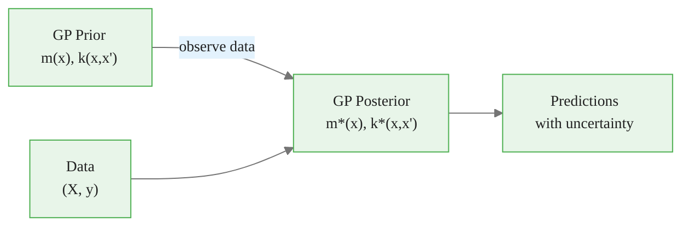
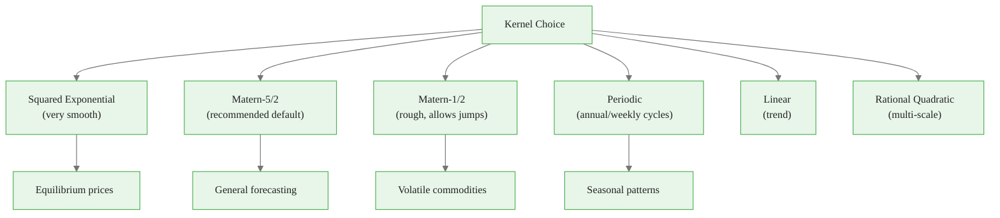
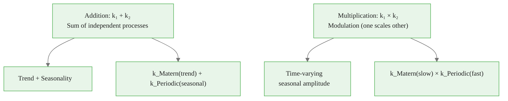
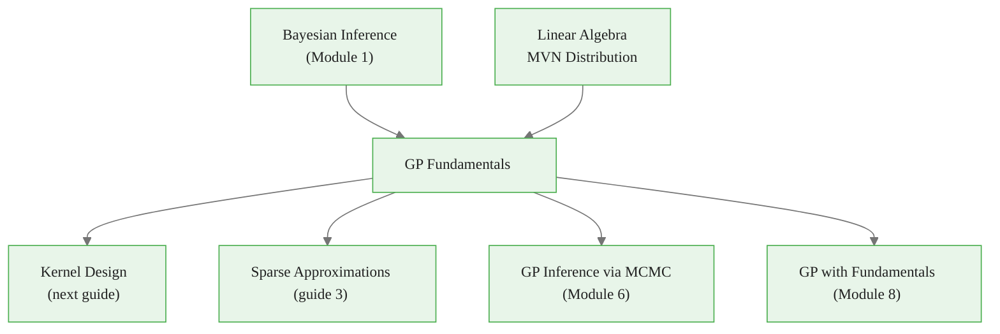

<!-- _class: lead -->

# Gaussian Process Fundamentals

**Module 5 — Gaussian Processes**

A prior over functions, not parameters

<!-- Speaker notes: Welcome to Gaussian Process Fundamentals. This deck covers the key concepts you'll need. Estimated time: 42 minutes. -->
---

## Key Insight

> **A GP places a prior directly on the space of functions.** Just as a Normal prior on a parameter expresses beliefs about where it lies, a GP prior expresses beliefs about what functions are plausible.

<!-- Speaker notes: Explain Key Insight. Connect this concept to the practical applications in commodity markets. Check for understanding before moving on. -->

<div class="callout-info">
This is a foundational concept for the rest of the module.
</div>
---

## Formal Definition

$f(\mathbf{x}) \sim \mathcal{GP}(m(\mathbf{x}), k(\mathbf{x}, \mathbf{x}'))$ means for any finite set $\{x_1, \ldots, x_n\}$:

$$\begin{bmatrix} f(x_1) \\ \vdots \\ f(x_n) \end{bmatrix} \sim \mathcal{N}\!\left( \begin{bmatrix} m(x_1) \\ \vdots \\ m(x_n) \end{bmatrix}, \begin{bmatrix} k(x_1,x_1) & \cdots & k(x_1,x_n) \\ \vdots & \ddots & \vdots \\ k(x_n,x_1) & \cdots & k(x_n,x_n) \end{bmatrix} \right)$$

| Component | Role |
|-----------|------|
| $m(x) = \mathbb{E}[f(x)]$ | Mean function (often set to 0) |
| $k(x,x') = \text{Cov}(f(x), f(x'))$ | Kernel / covariance function |

<!-- Speaker notes: Walk through the mathematical notation carefully. Explain each symbol and relate it back to the intuitive explanation. Don't rush through formulas. -->

<div class="callout-key">
This is the key takeaway from this section.
</div>
---

## GP Prior to Posterior



- **Before data:** Many plausible functions (prior samples)
- **After data:** Function "pinned down" at observations, uncertain elsewhere

<!-- Speaker notes: Use the diagram to illustrate the relationships visually. Point to each node as you explain the flow. Give learners time to study the diagram. -->

<div class="callout-warning">
Common misconception — read carefully.
</div>
---

## GP Regression

**Model:** $y_i = f(x_i) + \epsilon_i$, $\epsilon_i \sim \mathcal{N}(0, \sigma_n^2)$

**Posterior Mean:**
$$\bar{f}_* = K_*^T (K + \sigma_n^2 I)^{-1} \mathbf{y}$$

**Posterior Covariance:**
$$\text{Cov}(f_*) = K_{**} - K_*^T (K + \sigma_n^2 I)^{-1} K_*$$

| Matrix | Definition |
|--------|-----------|
| $K$ | $k(\mathbf{X}, \mathbf{X})$ — training covariance |
| $K_*$ | $k(\mathbf{X}, \mathbf{X}_*)$ — train-test covariance |
| $K_{**}$ | $k(\mathbf{X}_*, \mathbf{X}_*)$ — test covariance |

<!-- Speaker notes: Walk through the mathematical notation carefully. Explain each symbol and relate it back to the intuitive explanation. Don't rush through formulas. -->

<div class="callout-insight">
This insight connects theory to practice.
</div>
---

<!-- _class: lead -->

# The Kernel's Role

<!-- Speaker notes: Transition slide. We're now moving into The Kernel's Role. Pause briefly to let learners absorb the previous section before continuing. -->
---

## What the Kernel Encodes

The kernel $k(x, x')$ specifies:

1. **Variance:** $k(x,x)$ — marginal variance
2. **Correlation structure:** How function values relate
3. **Smoothness:** How quickly correlations decay
4. **Periodicity:** Whether patterns repeat
5. **Stationarity:** Whether properties depend only on $|x - x'|$

<!-- Speaker notes: Explain What the Kernel Encodes. Connect this concept to the practical applications in commodity markets. Check for understanding before moving on. -->
---

## Squared Exponential (RBF) Kernel

$$k(x, x') = \sigma^2 \exp\!\left(-\frac{(x-x')^2}{2\ell^2}\right)$$

- $\sigma^2$: Signal variance (amplitude)
- $\ell$: Length scale (correlation decay rate)
- Infinitely differentiable (very smooth)

> **In commodities:** Slow-moving trends, equilibrium prices.

<!-- Speaker notes: Walk through the mathematical notation carefully. Explain each symbol and relate it back to the intuitive explanation. Don't rush through formulas. -->
---

## Matern Kernel

$$k_\nu(r) = \sigma^2 \frac{2^{1-\nu}}{\Gamma(\nu)} \left(\frac{\sqrt{2\nu}\, r}{\ell}\right)^\nu K_\nu\!\left(\frac{\sqrt{2\nu}\, r}{\ell}\right)$$

| $\nu$ | Smoothness | Use Case |
|--------|-----------|----------|
| $1/2$ | Continuous, not differentiable (rough) | Supply shocks |
| $3/2$ | Once differentiable | General commodity |
| $5/2$ | Twice differentiable | **Recommended default** |
| $\to\infty$ | Infinitely smooth (= RBF) | Equilibrium models |

<!-- Speaker notes: Walk through the mathematical notation carefully. Explain each symbol and relate it back to the intuitive explanation. Don't rush through formulas. -->
---

## Periodic Kernel

$$k(x, x') = \sigma^2 \exp\!\left(-\frac{2\sin^2(\pi|x-x'|/p)}{\ell^2}\right)$$

- $p$: Period (e.g., 365 days for annual)
- $\ell$: Controls smoothness of periodic pattern

> **In commodities:** Natural gas heating/cooling seasons, agricultural harvest cycles.

<!-- Speaker notes: Walk through the mathematical notation carefully. Explain each symbol and relate it back to the intuitive explanation. Don't rush through formulas. -->
---

## Kernel Comparison



<!-- Speaker notes: Use the diagram to illustrate the relationships visually. Point to each node as you explain the flow. Give learners time to study the diagram. -->
---

<!-- _class: lead -->

# Code Implementation

<!-- Speaker notes: Transition slide. We're now moving into Code Implementation. Pause briefly to let learners absorb the previous section before continuing. -->
---

## GP Regression in PyMC

```python
import pymc as pm
import numpy as np

np.random.seed(42)
n = 50
X = np.sort(np.random.uniform(0, 10, n))[:, None]
y = np.sin(X[:, 0]) + np.random.normal(0, 0.2, n)

with pm.Model() as gp_model:
    ell = pm.Gamma('ell', alpha=2, beta=1)
    sigma = pm.HalfNormal('sigma', sigma=2)
    sigma_n = pm.HalfNormal('sigma_n', sigma=0.5)
  # ... continued on next slide
```

<!-- Speaker notes: Walk through the code step by step. Highlight the key lines and explain the purpose of each section. Encourage learners to run this in their own notebooks. -->
---

## Code (continued)

<!-- Speaker notes: Continue walking through the code. This is a continuation of the previous slide's code block. -->

```python
    cov = sigma**2 * pm.gp.cov.ExpQuad(1, ls=ell)
    gp = pm.gp.Marginal(cov_func=cov)

    y_obs = gp.marginal_likelihood('y_obs',
                                    X=X, y=y, sigma=sigma_n)
    trace = pm.sample(1000, tune=1000, random_seed=42)
```

---

## Prediction and Visualization

```python
with gp_model:
    X_new = np.linspace(0, 12, 100)[:, None]
    f_pred = gp.conditional('f_pred', X_new)
    ppc = pm.sample_posterior_predictive(
        trace, var_names=['f_pred'])

f_mean = ppc.posterior_predictive['f_pred'] \
             .mean(dim=['chain', 'draw'])
f_std = ppc.posterior_predictive['f_pred'] \
            .std(dim=['chain', 'draw'])

plt.scatter(X, y, label='Data', zorder=3)
plt.plot(X_new, f_mean, 'b-', label='GP Mean')  # ... continued on next slide
```

<!-- Speaker notes: Walk through the code step by step. Highlight the key lines and explain the purpose of each section. Encourage learners to run this in their own notebooks. -->
---

## Code (continued)

<!-- Speaker notes: Continue walking through the code. This is a continuation of the previous slide's code block. -->

```python
plt.fill_between(X_new.flatten(),
    f_mean - 2*f_std, f_mean + 2*f_std,
    alpha=0.3, label='95% CI')
plt.legend()
```

---

## Designing a Commodity Kernel

For crude oil prices, combine:

```python
# Long-term trend (smooth)
k_trend = pm.gp.cov.ExpQuad(1, ls=365*2)

# Annual seasonality
k_seasonal = pm.gp.cov.Periodic(1, period=365, ls=30)

# Short-term dynamics (rough)
k_short = pm.gp.cov.Matern52(1, ls=20)

# Observation noise
k_noise = pm.gp.cov.WhiteNoise(sigma=0.1)

# Composite kernel
k_total = k_trend + k_seasonal * k_short + k_noise
```

<!-- Speaker notes: Walk through the code step by step. Highlight the key lines and explain the purpose of each section. Encourage learners to run this in their own notebooks. -->
---

## Kernel Composition Rules



<!-- Speaker notes: Use the diagram to illustrate the relationships visually. Point to each node as you explain the flow. Give learners time to study the diagram. -->
---

<!-- _class: lead -->

# Common Pitfalls

<!-- Speaker notes: Transition slide. We're now moving into Common Pitfalls. Pause briefly to let learners absorb the previous section before continuing. -->
---

## Pitfalls to Avoid

**Oversmoothing:** Length scale too large misses important variation. Check posterior $\ell$.

**Wrong Kernel Choice:** Periodic kernel without actual periodicity, or RBF for rough data.

**Computational Limits:** GPs scale as $O(n^3)$. For $n > 1000$, need sparse approximations (next guides).

**Extrapolation Overconfidence:** GP uncertainty may not increase fast enough outside training range.

<!-- Speaker notes: These are common mistakes that even experienced practitioners make. Share a real-world example if possible to make the warning concrete. -->
---

## Connections



<!-- Speaker notes: Use the diagram to illustrate the relationships visually. Point to each node as you explain the flow. Give learners time to study the diagram. -->
---

## Practice Problems

1. For RBF kernel ($\ell=1$), calculate $k(0,0)$, $k(0,1)$, $k(0,3)$. What do these values mean?

2. Design a kernel for natural gas with: (a) annual periodicity, (b) within-year smoothness, (c) year-over-year level changes.

3. Why might Matern-3/2 be preferred over RBF for commodity returns?

> *"GPs answer: given what I know about function smoothness and the data, what functions are plausible?"*

<!-- Speaker notes: Give learners 5-10 minutes to attempt these problems. Circulate and offer hints. Review solutions together afterward. -->
---


<!-- _class: lead -->

# References

<!-- Speaker notes: These references provide deeper coverage of the topics discussed. Recommend the first 1-2 as starting points for learners who want to go deeper. -->

- **Rasmussen & Williams** *Gaussian Processes for Machine Learning* - Free online, definitive
- **MacKay** *Information Theory, Inference, and Learning Algorithms* Ch. 45
- **GPyTorch documentation** - Scalable GP implementations
