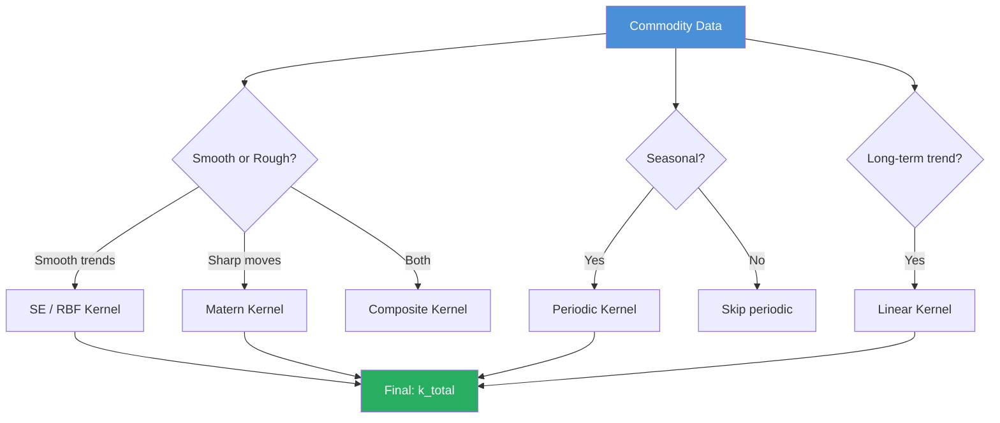
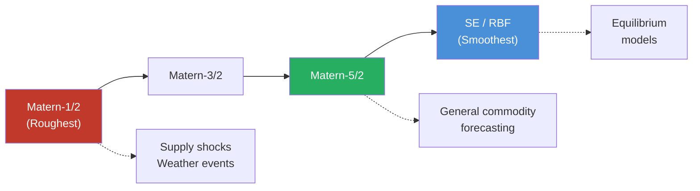
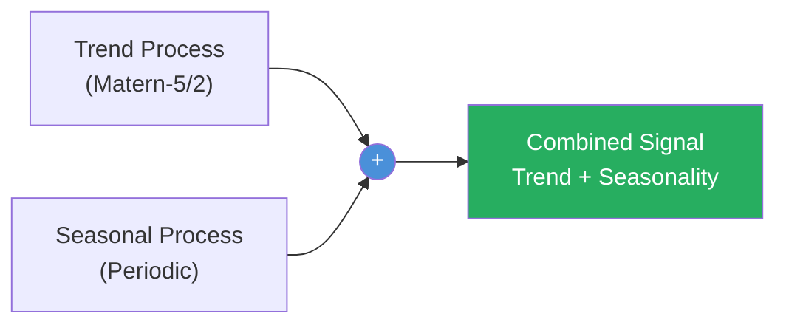
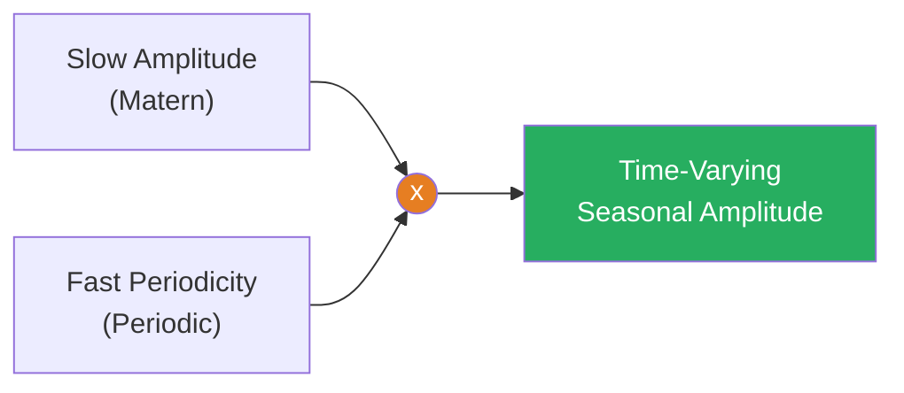
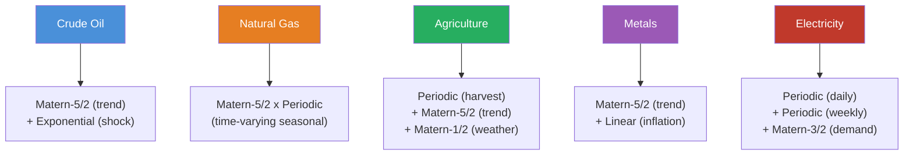
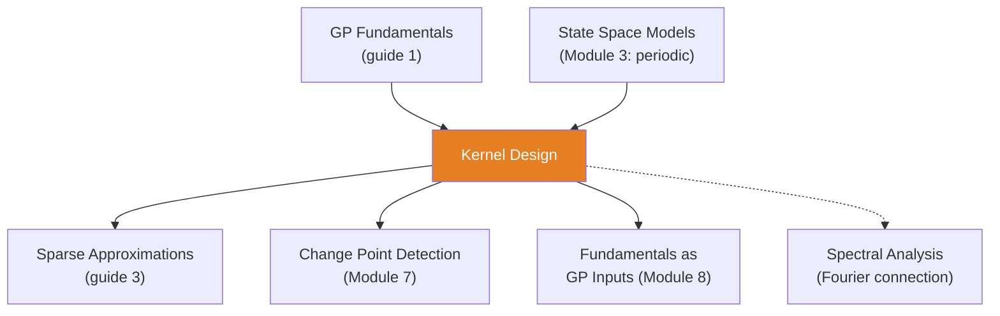

<!-- _class: lead -->

# Kernel Design for Commodity Time Series

**Module 5 — Gaussian Processes**

Choosing the right lens for your data

<!-- Speaker notes: Welcome to Kernel Design for Commodity Time Series. This deck covers the key concepts you'll need. Estimated time: 66 minutes. -->
---

## Key Insight

> **Kernels encode assumptions about function smoothness and structure.** A smooth exponential kernel assumes gradual price changes (fine for stable markets), while a Matern-1/2 kernel allows sudden jumps (better for supply shocks). Choosing the wrong kernel is like wearing the wrong glasses — everything is blurry.

<!-- Speaker notes: Explain Key Insight. Connect this concept to the practical applications in commodity markets. Check for understanding before moving on. -->
---

## Kernel Function Definition

A kernel $k: \mathcal{X} \times \mathcal{X} \to \mathbb{R}$ is a positive definite function:

$$\text{Cov}[f(x_i), f(x_j)] = k(x_i, x_j)$$

For a GP prior $f \sim \mathcal{GP}(m, k)$, any finite collection is MVN:

$$\begin{bmatrix} f(x_1) \\ \vdots \\ f(x_n) \end{bmatrix} \sim \mathcal{N}\!\left( \begin{bmatrix} m(x_1) \\ \vdots \\ m(x_n) \end{bmatrix}, \begin{bmatrix} k(x_1,x_1) & \cdots & k(x_1,x_n) \\ \vdots & \ddots & \vdots \\ k(x_n,x_1) & \cdots & k(x_n,x_n) \end{bmatrix} \right)$$

<!-- Speaker notes: Walk through the mathematical notation carefully. Explain each symbol and relate it back to the intuitive explanation. Don't rush through formulas. -->
---

## Kernel Design Workflow



<!-- Speaker notes: Use the diagram to illustrate the relationships visually. Point to each node as you explain the flow. Give learners time to study the diagram. -->
---

<!-- _class: lead -->

# Core Kernel Building Blocks

<!-- Speaker notes: Transition slide. We're now moving into Core Kernel Building Blocks. Pause briefly to let learners absorb the previous section before continuing. -->
---

## Squared Exponential (SE) / RBF

$$k_{\text{SE}}(x_i, x_j) = \sigma^2 \exp\!\left(-\frac{(x_i - x_j)^2}{2\ell^2}\right)$$

| Parameter | Role |
|-----------|------|
| $\sigma^2$ | Signal variance (amplitude) |
| $\ell$ | Length scale (correlation decay) |

**Properties:** Infinitely differentiable (very smooth)

**Use case:** Slow-moving trends, equilibrium prices

**Problem:** Too smooth for commodities — no sharp moves

<!-- Speaker notes: Walk through the mathematical notation carefully. Explain each symbol and relate it back to the intuitive explanation. Don't rush through formulas. -->
---

## Matern Kernel

$$k_{\text{Matern}}(x_i, x_j) = \sigma^2 \frac{2^{1-\nu}}{\Gamma(\nu)} \left(\sqrt{2\nu} \frac{|x_i - x_j|}{\ell}\right)^\nu K_\nu\!\left(\sqrt{2\nu} \frac{|x_i - x_j|}{\ell}\right)$$

| $\nu$ | Smoothness | Commodity Use Case |
|--------|-----------|-------------------|
| $1/2$ | Rough (allows jumps) | Supply shocks |
| $3/2$ | Once differentiable | General commodity |
| $5/2$ | Twice differentiable | **Recommended default** |
| $\to\infty$ | Infinitely smooth (= SE) | Equilibrium models |

<!-- Speaker notes: Walk through the mathematical notation carefully. Explain each symbol and relate it back to the intuitive explanation. Don't rush through formulas. -->
---

## Matern-5/2 (Recommended Default)

$$k_{\text{M52}}(r) = \sigma^2 \left(1 + \sqrt{5}r + \frac{5r^2}{3}\right) \exp\left(-\sqrt{5}r\right), \quad r = \frac{|x_i - x_j|}{\ell}$$

> **Best general-purpose kernel for commodity forecasting.** Smooth enough for trends, flexible enough for occasional sharp moves.

<!-- Speaker notes: Walk through the mathematical notation carefully. Explain each symbol and relate it back to the intuitive explanation. Don't rush through formulas. -->
---

## Exponential Kernel (Matern-1/2)

$$k_{\text{Exp}}(x_i, x_j) = \sigma^2 \exp\!\left(-\frac{|x_i - x_j|}{\ell}\right)$$

**Properties:**
- Continuous but not differentiable (rough paths)
- Allows sudden jumps (supply disruptions)

**Use case:** Volatile commodities (natural gas in winter, agricultural weather shocks)

<!-- Speaker notes: Walk through the mathematical notation carefully. Explain each symbol and relate it back to the intuitive explanation. Don't rush through formulas. -->
---

## Periodic Kernel

$$k_{\text{Per}}(x_i, x_j) = \sigma^2 \exp\!\left(-\frac{2\sin^2(\pi |x_i - x_j| / p)}{\ell^2}\right)$$

| Parameter | Role |
|-----------|------|
| $p$ | Period (e.g., 12 months, 52 weeks) |
| $\ell$ | Smoothness within period |

**Use cases:**
- Natural gas: heating/cooling seasons
- Agriculture: planting/harvest cycles
- Electricity: daily/weekly demand

<!-- Speaker notes: Walk through the mathematical notation carefully. Explain each symbol and relate it back to the intuitive explanation. Don't rush through formulas. -->
---

## Linear and Rational Quadratic Kernels

<div class="columns">
<div>

### Linear Kernel

$$k_{\text{Lin}}(x_i, x_j) = \sigma^2 (x_i - c)(x_j - c)$$

- Produces linear trends
- Unbounded variance
- **Use:** Long-term inflation/deflation

</div>
<div>

### Rational Quadratic

$$k_{\text{RQ}}(x_i, x_j) = \sigma^2 \left(1 + \frac{(x_i - x_j)^2}{2\alpha \ell^2}\right)^{-\alpha}$$

- $\alpha \to \infty$: becomes SE
- Small $\alpha$: multi-scale mixture
- **Use:** Intraday noise + monthly trends

</div>
</div>

<!-- Speaker notes: Walk through the mathematical notation carefully. Explain each symbol and relate it back to the intuitive explanation. Don't rush through formulas. -->
---

## Kernel Smoothness Spectrum



> Move left for volatile markets, right for stable markets. Matern-5/2 is the sweet spot.

<!-- Speaker notes: Use the diagram to illustrate the relationships visually. Point to each node as you explain the flow. Give learners time to study the diagram. -->
---

<!-- _class: lead -->

# Kernel Composition

<!-- Speaker notes: Transition slide. We're now moving into Kernel Composition. Pause briefly to let learners absorb the previous section before continuing. -->
---

## Addition: $k = k_1 + k_2$

**Interpretation:** Function is sum of two independent processes.

$$k_{\text{total}} = k_{\text{Matern}}(\text{trend}) + k_{\text{Periodic}}(\text{seasonal})$$



> Each process contributes independently to the observed signal.

<!-- Speaker notes: Use the diagram to illustrate the relationships visually. Point to each node as you explain the flow. Give learners time to study the diagram. -->
---

## Multiplication: $k = k_1 \times k_2$

**Interpretation:** Modulation — one process scales the other.

$$k_{\text{varying}} = k_{\text{Matern}}(\text{slow}) \times k_{\text{Periodic}}(\text{fast})$$

This allows winter peaks to change magnitude year-to-year.



> **Why multiplication?** Winter 2014: $6/mmBtu swings; Winter 2020: $3/mmBtu swings.

<!-- Speaker notes: Use the diagram to illustrate the relationships visually. Point to each node as you explain the flow. Give learners time to study the diagram. -->
---

<!-- _class: lead -->

# Commodity-Specific Designs

<!-- Speaker notes: Transition slide. We're now moving into Commodity-Specific Designs. Pause briefly to let learners absorb the previous section before continuing. -->
---

## 1. Crude Oil: Smooth Trend + Shocks

```python
with pm.Model() as crude_model:
    # Long-term trend (smooth Matern-5/2)
    ell_trend = pm.InverseGamma('ell_trend', alpha=5, beta=50)
    sigma_trend = pm.HalfNormal('sigma_trend', sigma=10)
    cov_trend = sigma_trend**2 * pm.gp.cov.Matern52(1, ls=ell_trend)

    # Short-term volatility shocks (rough exponential)
    ell_shock = pm.InverseGamma('ell_shock', alpha=3, beta=5)
    sigma_shock = pm.HalfNormal('sigma_shock', sigma=5)
    cov_shock = sigma_shock**2 * pm.gp.cov.Exponential(1, ls=ell_shock)

    # Combined kernel
    cov_total = cov_trend + cov_shock
```

- **Trend:** OPEC decisions, global demand shifts
- **Shock:** Supply disruptions, geopolitical events

<!-- Speaker notes: Walk through the code step by step. Highlight the key lines and explain the purpose of each section. Encourage learners to run this in their own notebooks. -->
---

## 2. Natural Gas: Time-Varying Seasonality

```python
with pm.Model() as gas_model:
    # Annual seasonality (fixed period)
    sigma_seasonal = pm.HalfNormal('sigma_seasonal', sigma=5)
    ell_seasonal = pm.InverseGamma('ell_seasonal', alpha=2, beta=2)
    cov_seasonal = sigma_seasonal**2 * pm.gp.cov.Periodic(
        1, period=1.0, ls=ell_seasonal)

    # Slow trend (modulates seasonal amplitude)
    sigma_trend = pm.HalfNormal('sigma_trend', sigma=3)
    ell_trend = pm.InverseGamma('ell_trend', alpha=5, beta=10)
    cov_trend = sigma_trend**2 * pm.gp.cov.Matern52(1, ls=ell_trend)

    # Multiply for time-varying seasonality
    cov_total = cov_trend * cov_seasonal + cov_trend
```

> Multiplication scales seasonality amplitude over time.

<!-- Speaker notes: Walk through the code step by step. Highlight the key lines and explain the purpose of each section. Encourage learners to run this in their own notebooks. -->
---

## 3. Agricultural (Corn): Harvest + Trend + Weather

```python
with pm.Model() as corn_model:
    # Annual harvest cycle
    sigma_harvest = pm.HalfNormal('sigma_harvest', sigma=2)
    cov_harvest = sigma_harvest**2 * pm.gp.cov.Periodic(
        1, period=1.0, ls=0.5)

    # Long-term trend (ethanol demand, policy changes)
    sigma_trend = pm.HalfNormal('sigma_trend', sigma=3)
    ell_trend = pm.InverseGamma('ell_trend', alpha=4, beta=8)
    cov_trend = sigma_trend**2 * pm.gp.cov.Matern52(1, ls=ell_trend)

    # Weather shocks (sharp moves, Matern-1/2)
    sigma_weather = pm.HalfNormal('sigma_weather', sigma=2)  # ... continued on next slide
```

<!-- Speaker notes: Walk through the code step by step. Highlight the key lines and explain the purpose of each section. Encourage learners to run this in their own notebooks. -->
---

## Code (continued)

<!-- Speaker notes: Continue walking through the code. This is a continuation of the previous slide's code block. -->

```python
    ell_weather = pm.InverseGamma('ell_weather', alpha=2, beta=2)
    cov_weather = sigma_weather**2 * pm.gp.cov.Matern12(1, ls=ell_weather)

    cov_total = cov_harvest + cov_trend + cov_weather
```

---

## Commodity Kernel Selection Map



<!-- Speaker notes: Use the diagram to illustrate the relationships visually. Point to each node as you explain the flow. Give learners time to study the diagram. -->
---

<!-- _class: lead -->

# Incorporating Covariates

<!-- Speaker notes: Transition slide. We're now moving into Incorporating Covariates. Pause briefly to let learners absorb the previous section before continuing. -->
---

## Input-Dependent Kernels

Model price as function of time **and** fundamentals:

```python
with pm.Model() as covariate_model:
    # Inputs: time and inventory levels
    X = np.column_stack([time, inventory_zscore])  # (n_obs, 2)

    # Different length scales per dimension
    ell_time = pm.InverseGamma('ell_time', alpha=5, beta=20)
    ell_inventory = pm.InverseGamma('ell_inventory', alpha=3, beta=3)

    # Anisotropic kernel
    cov = pm.gp.cov.Matern52(2, ls=[ell_time, ell_inventory])

    gp = pm.gp.Marginal(cov_func=cov)
    sigma_noise = pm.HalfNormal('sigma_noise', sigma=2)
    y_obs = gp.marginal_likelihood('y_obs', X=X, y=prices,
                                    noise=sigma_noise)
```

> Model learns how price responds to inventory shocks **nonlinearly**.

<!-- Speaker notes: Walk through the code step by step. Highlight the key lines and explain the purpose of each section. Encourage learners to run this in their own notebooks. -->
---

## Forecasting with Custom Kernels

```python
def forecast_gp(trace, model, X_obs, X_new, n_samples=500):
    with model:
        f_new = model.gp.conditional('f_new', X_new)
        ppc = pm.sample_posterior_predictive(
            trace, var_names=['f_new'],
            predictions=True, random_seed=42)
    return ppc.predictions['f_new'].values

# Forecast next 12 months
t_future = np.arange(len(corn_prices),
                      len(corn_prices) + 12) / 12
forecasts = forecast_gp(trace, corn_model,
                         t[:, None], t_future[:, None])
```

<!-- Speaker notes: Walk through the code step by step. Highlight the key lines and explain the purpose of each section. Encourage learners to run this in their own notebooks. -->
---

<!-- _class: lead -->

# Kernel Diagnostics

<!-- Speaker notes: Transition slide. We're now moving into Kernel Diagnostics. Pause briefly to let learners absorb the previous section before continuing. -->
---

## Length Scale Interpretation

```python
ell_trend_post = trace.posterior['ell_trend'].values.flatten()
print(f"Trend length scale: "
      f"{ell_trend_post.mean():.1f} +/- {ell_trend_post.std():.1f}")
```

| Commodity | Expected $\ell$ | Interpretation |
|-----------|-----------------|---------------|
| Crude oil trend | ~50 weeks | Changes annually |
| Gas seasonal | ~5 weeks | Rapid cycles |
| Corn trend | ~24 months | Policy/tech cycles |

<!-- Speaker notes: Walk through the code step by step. Highlight the key lines and explain the purpose of each section. Encourage learners to run this in their own notebooks. -->
---

## Posterior Predictive Checks

```python
with model:
    ppc = pm.sample_posterior_predictive(trace, random_seed=42)

fig, ax = plt.subplots(figsize=(10, 5))
ax.plot(y, 'ko', alpha=0.5, label='Observed')
for i in range(50):
    ax.plot(ppc.posterior_predictive['y_obs'][0, i, :],
            'r-', alpha=0.1)
ax.set_title('Posterior Predictive Check')
```

**Check:** Does replicated data match observed variability? Are sudden jumps captured? Is seasonal amplitude correct?

<!-- Speaker notes: Walk through the code step by step. Highlight the key lines and explain the purpose of each section. Encourage learners to run this in their own notebooks. -->
---

## Covariance Matrix Visualization

```python
cov_matrix = model.gp.cov_func(X_obs).eval()
plt.imshow(cov_matrix, cmap='viridis', aspect='auto')
plt.colorbar(label='Covariance')
```

| Pattern | Interpretation |
|---------|---------------|
| Block diagonal | Independent segments (regime change?) |
| Banded | Local correlation (stationary kernel) |
| Striped | Periodic structure |

<!-- Speaker notes: Walk through the code step by step. Highlight the key lines and explain the purpose of each section. Encourage learners to run this in their own notebooks. -->
---

## Model Comparison with LOO-CV

```python
loo_simple = az.loo(trace_simple)
loo_complex = az.loo(trace_complex)
print(az.compare({
    'Simple': loo_simple,
    'Complex': loo_complex
}))
```

> Use LOO-CV to check if adding kernel components improves out-of-sample fit.

<!-- Speaker notes: Walk through the code step by step. Highlight the key lines and explain the purpose of each section. Encourage learners to run this in their own notebooks. -->
---

<!-- _class: lead -->

# Common Pitfalls

<!-- Speaker notes: Transition slide. We're now moving into Common Pitfalls. Pause briefly to let learners absorb the previous section before continuing. -->
---

## Pitfalls to Avoid

**Wrong Smoothness:** SE kernel for volatile commodities smooths over real shocks. Use Matern-3/2 or 1/2.

**Fixed Period for Changing Seasonality:** Learn period as parameter:
```python
period = pm.Gamma('period', alpha=20, beta=20)
cov = sigma**2 * pm.gp.cov.Periodic(1, period=period, ls=ell)
```

**Over-Flexible Kernels:** Too many components overfits. Compare with LOO-CV.

**Ignoring Non-Stationarity:** Structural breaks need change-point detection first or regime indicators.

<!-- Speaker notes: Walk through the code step by step. Highlight the key lines and explain the purpose of each section. Encourage learners to run this in their own notebooks. -->
---

## Connections



<!-- Speaker notes: Use the diagram to illustrate the relationships visually. Point to each node as you explain the flow. Give learners time to study the diagram. -->
---

## Practice Problems

1. Design a kernel for electricity with daily (24h), weekly, and seasonal cycles. Write as sum/product.

2. Posterior mean $\ell = 200$ weeks for WTI crude. What does this imply? Is it realistic?

3. Compare Matern-1/2 vs Matern-5/2 for natural gas. Which captures winter spikes better?

4. Design a kernel for harvest lows: annual cycle + year-varying amplitude.

5. Forecast copper using time + inventory + Chinese PMI. What kernel structure and length scale priors?

> *"A kernel is a prior over functions. Choose wisely, and your GP will see the patterns you need."*

<!-- Speaker notes: Give learners 5-10 minutes to attempt these problems. Circulate and offer hints. Review solutions together afterward. -->
---


<!-- _class: lead -->

# References

<!-- Speaker notes: These references provide deeper coverage of the topics discussed. Recommend the first 1-2 as starting points for learners who want to go deeper. -->

- **Rasmussen & Williams (2006):** *Gaussian Processes for Machine Learning* - Ch. 4
- **Duvenaud (2014):** *Automatic Model Construction with GPs* - Kernel composition grammar
- **Roberts, Osborne et al. (2013):** "GPs for Time-Series Modelling" - Time series kernels
- **Wilson & Adams (2013):** "GP Kernels for Pattern Discovery" - Spectral mixture kernels
