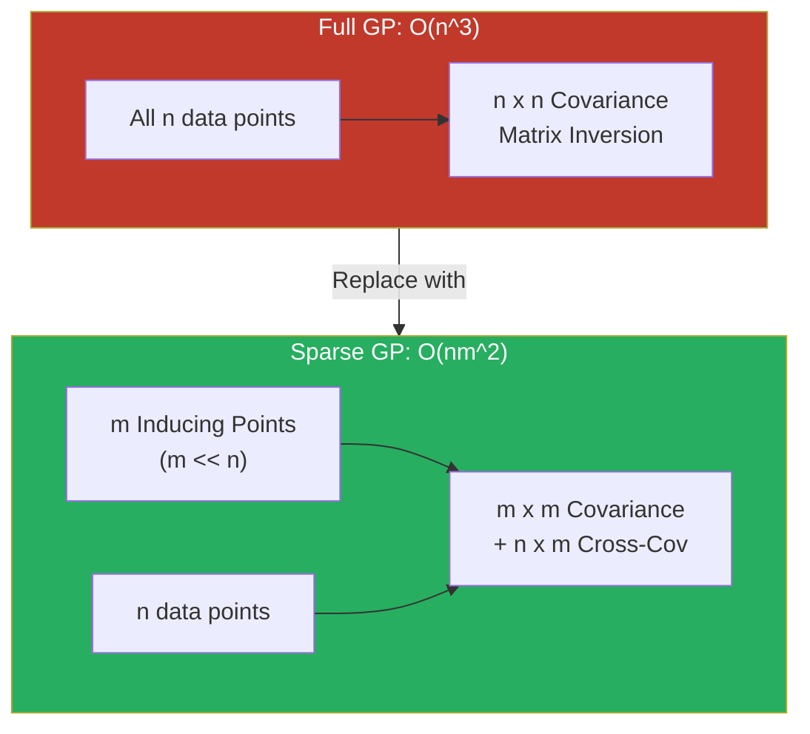
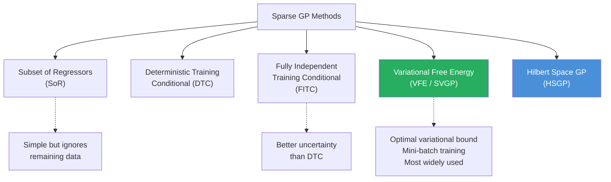
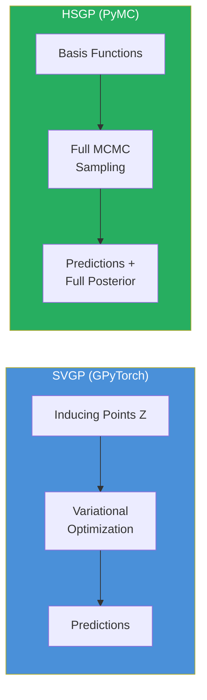
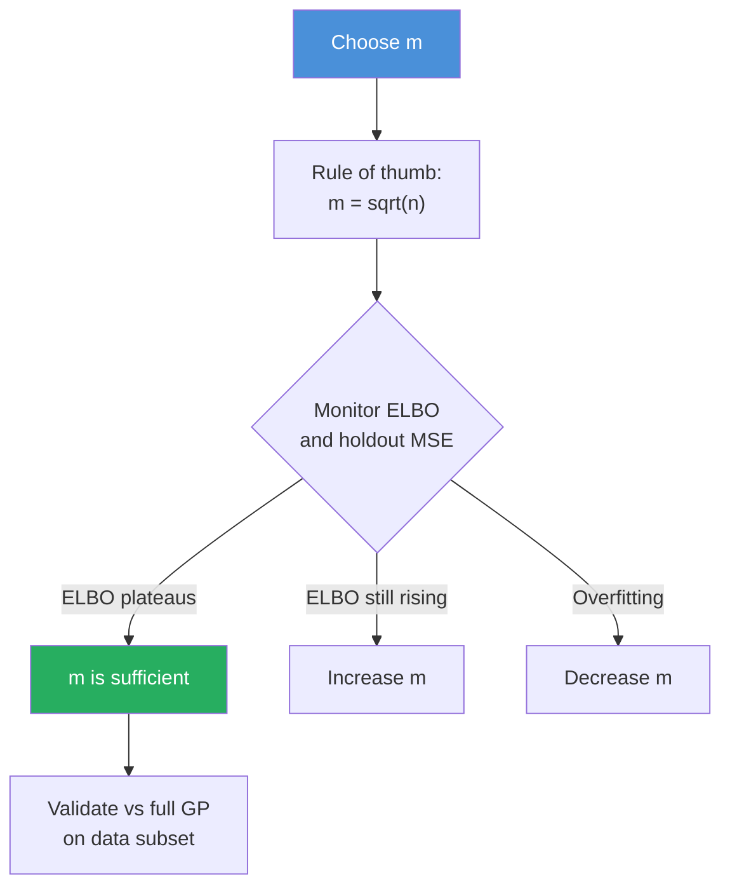
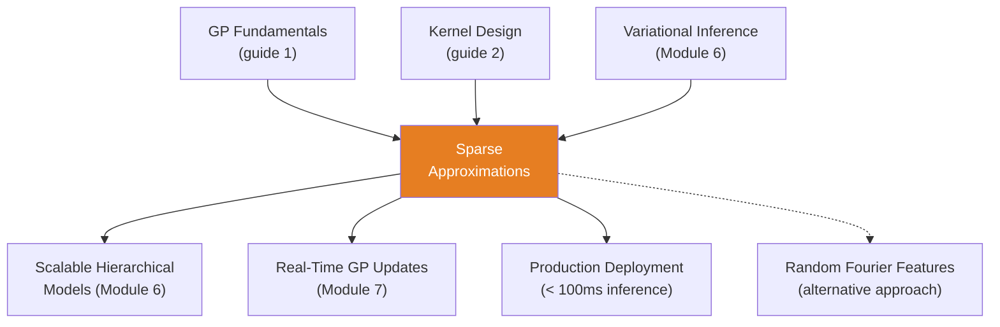

<!-- _class: lead -->

# Sparse Approximations for Gaussian Processes

**Module 5 — Gaussian Processes**

Making GPs practical for large datasets

<!-- Speaker notes: Welcome to Sparse Approximations for Gaussian Processes. This deck covers the key concepts you'll need. Estimated time: 50 minutes. -->
---

## Key Insight

> **Standard GP inference requires inverting an n x n covariance matrix, which becomes intractable for large datasets.** Sparse methods select m representative "inducing points" and approximate the full GP through these points, achieving a controlled trade-off between computational efficiency and model fidelity.

<!-- Speaker notes: Explain Key Insight. Connect this concept to the practical applications in commodity markets. Check for understanding before moving on. -->
---

## The Scalability Problem

**Full GP Regression:**

$$p(\mathbf{y} | \mathbf{X}) = \mathcal{N}(\mathbf{y} | \mathbf{0}, K_{nn} + \sigma^2_n I)$$

| Operation | Full GP | Sparse GP (m inducing) |
|-----------|---------|----------------------|
| Time | $O(n^3)$ | $O(nm^2)$ |
| Storage | $O(n^2)$ | $O(nm)$ |

For 10 years of daily data ($n = 2{,}500$): Full GP inverts a 2500 x 2500 matrix. Sparse GP with $m = 100$: **250x faster**.

<!-- Speaker notes: Walk through the mathematical notation carefully. Explain each symbol and relate it back to the intuitive explanation. Don't rush through formulas. -->
---

## Sparse GP Concept



<!-- Speaker notes: Use the diagram to illustrate the relationships visually. Point to each node as you explain the flow. Give learners time to study the diagram. -->
---

## Formal Definition

Introduce $m$ inducing points $\mathbf{Z}$ and inducing variables $\mathbf{u} = f(\mathbf{Z})$:

$$q(\mathbf{f}) = \int p(\mathbf{f} | \mathbf{u})\, q(\mathbf{u})\, d\mathbf{u}$$

**SVGP variational distribution:**

$$q(\mathbf{u}) = \mathcal{N}(\mathbf{m}, \mathbf{S})$$

**ELBO objective:**

$$\mathcal{L} = \sum_{i=1}^n \mathbb{E}_{q(f_i)} [\log p(y_i | f_i)] - \text{KL}[q(\mathbf{u}) \| p(\mathbf{u})]$$

<!-- Speaker notes: Walk through the mathematical notation carefully. Explain each symbol and relate it back to the intuitive explanation. Don't rush through formulas. -->
---

<!-- _class: lead -->

# Approximation Methods

<!-- Speaker notes: Transition slide. We're now moving into Approximation Methods. Pause briefly to let learners absorb the previous section before continuing. -->
---

## Taxonomy of Sparse Methods



<!-- Speaker notes: Use the diagram to illustrate the relationships visually. Point to each node as you explain the flow. Give learners time to study the diagram. -->
---

## Method Comparison

| Method | Quality | Speed | Mini-Batch | Key Feature |
|--------|---------|-------|-----------|-------------|
| SoR | Low | Fast | No | Uses subset only |
| DTC | Medium | Fast | No | All data, point estimates |
| FITC | Good | Medium | No | Diagonal corrections |
| **VFE/SVGP** | **Best** | **Medium** | **Yes** | **Optimal variational bound** |
| HSGP | Good | Fast | No | Basis function approx |

> **VFE/SVGP** is the modern standard. **HSGP** is excellent for PyMC integration.

<!-- Speaker notes: Walk through each row of the table. This is reference material learners will come back to, so highlight the most important entries. -->
---

## Intuitive Explanation

<div class="columns">
<div>

### Full GP (High Resolution)
- Store every pixel individually
- Perfect quality but huge file
- Impractical for large images

### Sparse GP (Compressed)
- Key "anchor points" (inducing)
- Interpolate between anchors
- Quality controlled by $m$

</div>
<div>

### For Commodity Data
- 10 years daily ($n = 2{,}500$)
- $m = 100$ inducing points (4%)
- **250x faster computation**
- Quality loss: < 5%

**Key question:** Where to place inducing points?

**Answer:** Learn their locations as variational parameters.

</div>
</div>

<!-- Speaker notes: Compare the two sides. Ask learners which approach they would use in their own work and why. -->
---

<!-- _class: lead -->

# Code: GPyTorch Implementation

<!-- Speaker notes: Transition slide. We're now moving into Code: GPyTorch Implementation. Pause briefly to let learners absorb the previous section before continuing. -->
---

## Sparse GP Model Class

```python
import torch
import gpytorch
from gpytorch.models import ApproximateGP
from gpytorch.variational import (
    CholeskyVariationalDistribution, VariationalStrategy)

class SparseGPModel(ApproximateGP):
    def __init__(self, inducing_points):
        variational_distribution = CholeskyVariationalDistribution(
            inducing_points.size(0))
        variational_strategy = VariationalStrategy(
            self, inducing_points, variational_distribution,
            learn_inducing_locations=True)  # ... continued on next slide
```

<!-- Speaker notes: Walk through the code step by step. Highlight the key lines and explain the purpose of each section. Encourage learners to run this in their own notebooks. -->
---

## Code (continued)

<!-- Speaker notes: Continue walking through the code. This is a continuation of the previous slide's code block. -->

```python
        super().__init__(variational_strategy)
        self.mean_module = gpytorch.means.ConstantMean()
        self.covar_module = gpytorch.kernels.ScaleKernel(
            gpytorch.kernels.RBFKernel())

    def forward(self, x):
        mean_x = self.mean_module(x)
        covar_x = self.covar_module(x)
        return gpytorch.distributions.MultivariateNormal(
            mean_x, covar_x)
```

---

## Training Loop

```python
def train_sparse_gp(train_x, train_y, num_inducing=100,
                     num_epochs=50):
    train_x = torch.tensor(train_x, dtype=torch.float32)
    train_y = torch.tensor(train_y, dtype=torch.float32)

    # Initialize inducing points from data
    idx = np.random.choice(len(train_x), num_inducing, False)
    inducing_points = train_x[idx, :]

    model = SparseGPModel(inducing_points)
    likelihood = gpytorch.likelihoods.GaussianLikelihood()
    model.train(); likelihood.train()
  # ... continued on next slide
```

<!-- Speaker notes: Walk through the code step by step. Highlight the key lines and explain the purpose of each section. Encourage learners to run this in their own notebooks. -->
---

## Code (Part 2/3)

<!-- Speaker notes: Continue walking through the code. This is a continuation of the previous slide's code block. -->

```python
    optimizer = torch.optim.Adam([
        {'params': model.parameters()},
        {'params': likelihood.parameters()}], lr=0.01)

    mll = gpytorch.mlls.VariationalELBO(
        likelihood, model, num_data=len(train_y))

    for epoch in range(num_epochs):
        optimizer.zero_grad()
        output = model(train_x)
        loss = -mll(output, train_y)
        loss.backward()
        optimizer.step()
```

---

## Code (Part 3/3)

<!-- Speaker notes: Continue walking through the code. This is a continuation of the previous slide's code block. -->

```python
    return model, likelihood
```

---

## Prediction

```python
def predict_sparse_gp(model, likelihood, test_x):
    model.eval()
    likelihood.eval()
    test_x = torch.tensor(test_x, dtype=torch.float32)

    with torch.no_grad(), gpytorch.settings.fast_pred_var():
        pred_dist = likelihood(model(test_x))
        mean = pred_dist.mean.numpy()
        std = pred_dist.stddev.numpy()
        lower = mean - 2 * std
        upper = mean + 2 * std
    return mean, lower, upper
  # ... continued on next slide
```

<!-- Speaker notes: Walk through the code step by step. Highlight the key lines and explain the purpose of each section. Encourage learners to run this in their own notebooks. -->
---

## Code (continued)

<!-- Speaker notes: Continue walking through the code. This is a continuation of the previous slide's code block. -->

```python
# Example: 5000 daily prices, 100 inducing points
model, likelihood = train_sparse_gp(
    X_train, y_train, num_inducing=100, num_epochs=50)
mean, lower, upper = predict_sparse_gp(
    model, likelihood, X_test)
```

---

## Inducing Point Visualization

```python
# Get learned inducing point locations
inducing = model.variational_strategy \
    .inducing_points.detach().numpy()

fig, ax = plt.subplots(figsize=(12, 6))
ax.scatter(X_train, y_train, s=1, alpha=0.3, c='gray')
ax.plot(X_test, mean, 'b-', linewidth=2)
ax.fill_between(X_test.flatten(), lower, upper, alpha=0.3)
ax.scatter(inducing, np.zeros(len(inducing)),
           c='red', s=100, marker='x', linewidth=3,
           label=f'Inducing points (m={len(inducing)})',
           zorder=5)
ax.legend()
```

> Inducing points automatically concentrate where data is complex.

<!-- Speaker notes: Walk through the code step by step. Highlight the key lines and explain the purpose of each section. Encourage learners to run this in their own notebooks. -->
---

<!-- _class: lead -->

# Code: PyMC HSGP

<!-- Speaker notes: Transition slide. We're now moving into Code: PyMC HSGP. Pause briefly to let learners absorb the previous section before continuing. -->
---

## HSGP Approximation in PyMC

```python
import pymc as pm
import numpy as np

def sparse_gp_pymc(X_train, y_train, num_inducing=50):
    with pm.Model() as model:
        ell = pm.Gamma('ell', alpha=2, beta=1)
        sigma = pm.HalfNormal('sigma', sigma=2)
        sigma_n = pm.HalfNormal('sigma_n', sigma=0.5)

        cov = sigma**2 * pm.gp.cov.ExpQuad(1, ls=ell)

        # HSGP: Hilbert Space GP approximation
        gp = pm.gp.HSGP(  # ... continued on next slide
```

<!-- Speaker notes: Walk through the code step by step. Highlight the key lines and explain the purpose of each section. Encourage learners to run this in their own notebooks. -->
---

## Code (continued)

<!-- Speaker notes: Continue walking through the code. This is a continuation of the previous slide's code block. -->

```python
            m=[num_inducing],  # Number of basis functions
            c=2.0,              # Boundary extension factor
            cov_func=cov)

        f = gp.prior('f', X=X_train)
        y_obs = pm.Normal('y_obs', mu=f, sigma=sigma_n,
                          observed=y_train)
        trace = pm.sample(1000, tune=1000, random_seed=42)
    return model, trace
```

> HSGP uses spectral basis functions instead of inducing points.

---

## HSGP vs SVGP



| Feature | SVGP | HSGP |
|---------|------|------|
| Framework | GPyTorch/PyTorch | PyMC |
| Inference | Variational (fast) | MCMC (full posterior) |
| Uncertainty | Approximate | Exact (given approx) |
| Best for | Large $n$, production | Bayesian workflow |

<!-- Speaker notes: Use the diagram to illustrate the relationships visually. Point to each node as you explain the flow. Give learners time to study the diagram. -->
---

<!-- _class: lead -->

# Computational Scaling

<!-- Speaker notes: Transition slide. We're now moving into Computational Scaling. Pause briefly to let learners absorb the previous section before continuing. -->
---

## Full vs Sparse Scaling

```python
import time

for n in [100, 500, 1000, 2500, 5000]:
    m = min(100, n // 2)
    start = time.time()
    model, likelihood = train_sparse_gp(
        X[:n], y[:n], num_inducing=m, num_epochs=20)
    elapsed = time.time() - start
    print(f"n={n:5d}, m={m:3d} | Time: {elapsed:.2f}s")
```

| $n$ | Full GP $O(n^3)$ | Sparse GP $O(nm^2)$ | Speedup |
|-----|-------------------|---------------------|---------|
| 1,000 | 1s | 0.1s | 10x |
| 5,000 | 125s | 0.5s | 250x |
| 10,000 | 1,000s | 1s | 1,000x |

<!-- Speaker notes: Walk through the code step by step. Highlight the key lines and explain the purpose of each section. Encourage learners to run this in their own notebooks. -->
---

## Choosing $m$ (Number of Inducing Points)



| Dataset Size | Recommended $m$ | Notes |
|-------------|-----------------|-------|
| $n < 1{,}000$ | Use full GP | No need for sparse |
| $1{,}000 - 5{,}000$ | $50 - 100$ | Good starting point |
| $5{,}000 - 50{,}000$ | $100 - 500$ | Monitor quality |
| $> 50{,}000$ | $500 - 1{,}000$ | Mini-batch essential |

<!-- Speaker notes: Use the diagram to illustrate the relationships visually. Point to each node as you explain the flow. Give learners time to study the diagram. -->
---

<!-- _class: lead -->

# Common Pitfalls

<!-- Speaker notes: Transition slide. We're now moving into Common Pitfalls. Pause briefly to let learners absorb the previous section before continuing. -->
---

## Pitfalls to Avoid

**Too Few Inducing Points:** Poor predictions, underestimated uncertainty. Start with $m = \sqrt{n}$, increase if needed.

**Poor Initialization:** Initialize from k-means or uniform coverage, not random. Allow learning locations.

**Not Validating Approximation:** Compare to full GP on subset. Monitor predictive likelihood on holdout.

**Fixed Inducing Locations:** Always set `learn_inducing_locations=True`. Learned locations outperform fixed.

**Still Slow:** Use mini-batch training and GPU acceleration for very large datasets.

<!-- Speaker notes: These are common mistakes that even experienced practitioners make. Share a real-world example if possible to make the warning concrete. -->
---

## Connections



<!-- Speaker notes: Use the diagram to illustrate the relationships visually. Point to each node as you explain the flow. Give learners time to study the diagram. -->
---

## Practice Problems

1. For $n = 10{,}000$ and $m = 100$: What is the speedup factor? How much memory is saved?

2. Design an inducing point initialization for commodity data with weekly seasonality and occasional spikes.

3. Train sparse GP with $m \in \{25, 50, 100, 200\}$. Plot MSE vs training time. Find the best trade-off.

4. Natural gas with $n = 5{,}000$ daily observations. You need < 10ms inference for trading. What minimum $m$?

5. Track ELBO during optimization. What happens when you (a) add more inducing points, (b) improve the kernel?

> *"Sparse approximations make GPs practical for large datasets by learning a small set of inducing points that summarize the essential structure of the data."*

<!-- Speaker notes: Give learners 5-10 minutes to attempt these problems. Circulate and offer hints. Review solutions together afterward. -->
---


<!-- _class: lead -->

# References

<!-- Speaker notes: These references provide deeper coverage of the topics discussed. Recommend the first 1-2 as starting points for learners who want to go deeper. -->

- **Titsias (2009):** "Variational Learning of Inducing Variables in Sparse GPs"
- **Hensman et al. (2013):** "Scalable Variational GP Classification" - Mini-batch extension
- **Snelson & Ghahramani (2006):** "Sparse GPs using Pseudo-inputs" - Early sparse method
- **GPyTorch / GPflow documentation** - Scalable GP libraries
