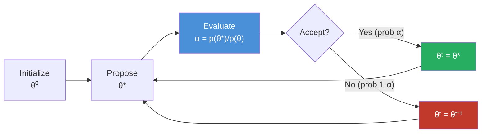
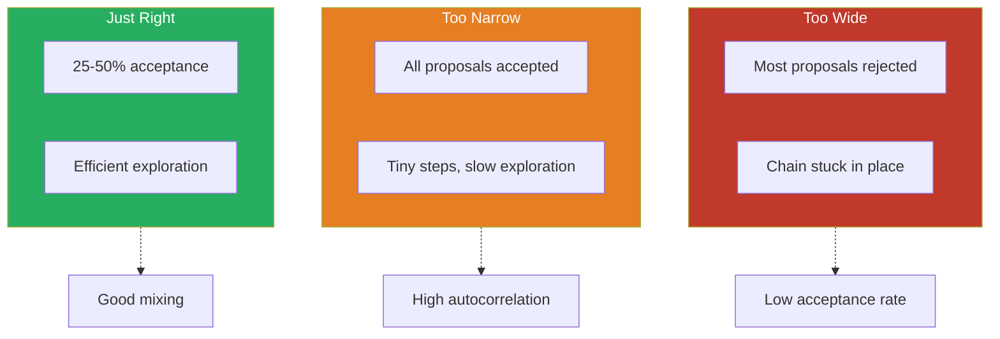
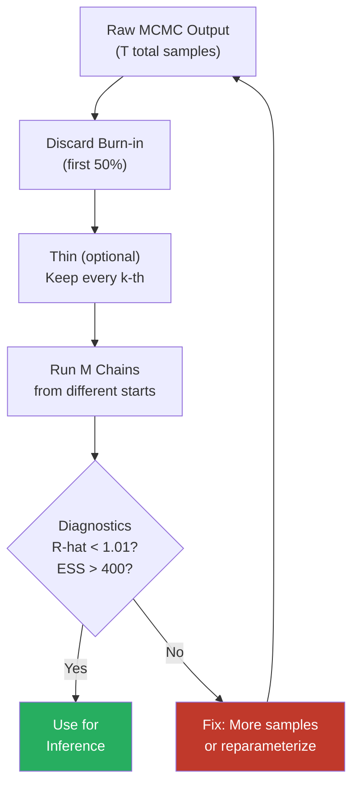
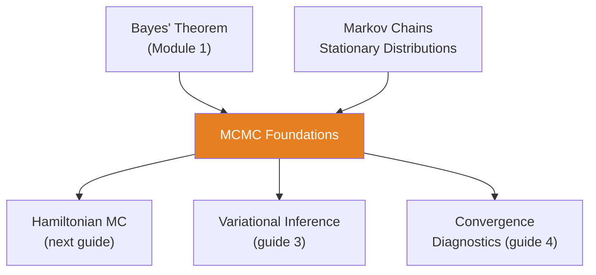

<!-- _class: lead -->

# MCMC Foundations
## From Metropolis to Modern Samplers

**Module 6 — Inference**

Random walk + acceptance rule = posterior samples

<!-- Speaker notes: Welcome to MCMC Foundations. This deck covers the key concepts you'll need. Estimated time: 32 minutes. -->
---

## Key Insight

> **MCMC is random walk + acceptance rule.** We propose moves through parameter space and accept or reject them based on how much they improve the posterior density. The magic: this simple procedure produces samples from arbitrarily complex posteriors.

<!-- Speaker notes: Explain Key Insight. Connect this concept to the practical applications in commodity markets. Check for understanding before moving on. -->
---

## The Core Problem

We want to sample from:

$$p(\theta | y) = \frac{p(y | \theta)\, p(\theta)}{p(y)}$$

But $p(y) = \int p(y | \theta)\, p(\theta)\, d\theta$ is **intractable**.

**Key observation:** We can evaluate $p(\theta | y) \propto p(y | \theta)\, p(\theta)$ up to a constant. MCMC only needs this unnormalized density.

<!-- Speaker notes: Walk through the mathematical notation carefully. Explain each symbol and relate it back to the intuitive explanation. Don't rush through formulas. -->
---

## MCMC Sampling Pipeline



> Repeat thousands of times. The chain spends more time in high-density regions.

<!-- Speaker notes: Use the diagram to illustrate the relationships visually. Point to each node as you explain the flow. Give learners time to study the diagram. -->
---

## The Metropolis-Hastings Algorithm

1. Initialize $\theta^{(0)}$
2. For $t = 1, 2, \ldots, T$:
   - Propose $\theta^* \sim q(\theta^* | \theta^{(t-1)})$
   - Calculate acceptance probability:

$$\alpha = \min\!\left(1, \frac{p(\theta^* | y) \cdot q(\theta^{(t-1)} | \theta^*)}{p(\theta^{(t-1)} | y) \cdot q(\theta^* | \theta^{(t-1)})}\right)$$

   - Accept with probability $\alpha$

**For symmetric proposals** ($q(\theta^* | \theta) = q(\theta | \theta^*)$):

$$\alpha = \min\!\left(1, \frac{p(\theta^* | y)}{p(\theta^{(t-1)} | y)}\right)$$

<!-- Speaker notes: Walk through the mathematical notation carefully. Explain each symbol and relate it back to the intuitive explanation. Don't rush through formulas. -->
---

## Proposal Width Tradeoff



<!-- Speaker notes: Use the diagram to illustrate the relationships visually. Point to each node as you explain the flow. Give learners time to study the diagram. -->
---

<!-- _class: lead -->

# Code Implementation

<!-- Speaker notes: Transition slide. We're now moving into Code Implementation. Pause briefly to let learners absorb the previous section before continuing. -->
---

## Metropolis-Hastings from Scratch

```python
import numpy as np
from scipy import stats

def metropolis_hastings(log_posterior, initial,
                        n_samples, proposal_std):
    n_params = len(initial)
    samples = np.zeros((n_samples, n_params))
    current = initial.copy()
    current_log_prob = log_posterior(current)
    accepted = 0

    for i in range(n_samples):
        proposal = current + np.random.normal(  # ... continued on next slide
```

<!-- Speaker notes: Walk through the code step by step. Highlight the key lines and explain the purpose of each section. Encourage learners to run this in their own notebooks. -->
---

## Code (continued)

<!-- Speaker notes: Continue walking through the code. This is a continuation of the previous slide's code block. -->

```python
            0, proposal_std, n_params)
        proposal_log_prob = log_posterior(proposal)
        log_alpha = proposal_log_prob - current_log_prob

        if np.log(np.random.random()) < log_alpha:
            current = proposal
            current_log_prob = proposal_log_prob
            accepted += 1
        samples[i] = current

    return samples, accepted / n_samples
```

---

## Running the Sampler

```python
def log_posterior(theta):
    """Log density of N([0,0], [[1, 0.5], [0.5, 1]])"""
    mu = np.array([0, 0])
    cov = np.array([[1, 0.5], [0.5, 1]])
    return stats.multivariate_normal.logpdf(theta, mu, cov)

samples, rate = metropolis_hastings(
    log_posterior,
    initial=np.array([5.0, 5.0]),
    n_samples=10000,
    proposal_std=1.0
)

print(f"Acceptance rate: {rate:.2%}")
print(f"Sample mean: {samples[1000:].mean(axis=0)}")
```

<!-- Speaker notes: Walk through the code step by step. Highlight the key lines and explain the purpose of each section. Encourage learners to run this in their own notebooks. -->
---

## Challenges with Basic MCMC

<div class="columns">
<div>

### Random Walk Inefficiency
- Most directions don't improve posterior
- Acceptance drops in high dimensions
- Need $O(d^2)$ samples for $d$ dimensions

### Tuning the Proposal
- Too wide: stuck in place
- Too narrow: slow exploration
- Optimal depends on unknown posterior

</div>
<div>

### Correlated Parameters
- Axis-aligned proposals miss correlations
- Need proposals along correlation direction

### Solution: HMC
- Uses gradient information
- Suppresses random walk
- Handles correlations
- Details in next guide

</div>
</div>

<!-- Speaker notes: Compare the two sides. Ask learners which approach they would use in their own work and why. -->
---

<!-- _class: lead -->

# Practical Guidelines

<!-- Speaker notes: Transition slide. We're now moving into Practical Guidelines. Pause briefly to let learners absorb the previous section before continuing. -->
---

## Burn-in, Thinning, and Multiple Chains



| Practice | Recommendation |
|----------|---------------|
| Burn-in | Discard first 50% |
| Thinning | Usually unnecessary with HMC/NUTS |
| Chains | 4 chains from different starts |

<!-- Speaker notes: Use the diagram to illustrate the relationships visually. Point to each node as you explain the flow. Give learners time to study the diagram. -->
---

## When MCMC Fails

| Symptom | Cause | Fix |
|---------|-------|-----|
| $\hat{R} > 1.01$ | Chains haven't mixed | More warmup, check multimodality |
| Low ESS | High autocorrelation | Reparameterize, longer chains |
| Divergences | HMC geometry issues | Increase `target_accept`, reparameterize |
| Different modes | Multimodal posterior | Use SMC or tempering |

<!-- Speaker notes: Walk through each row of the table. This is reference material learners will come back to, so highlight the most important entries. -->
---

## Connections



<!-- Speaker notes: Use the diagram to illustrate the relationships visually. Point to each node as you explain the flow. Give learners time to study the diagram. -->
---

## Practice Problems

1. Implement MH for a 1D Normal with unknown mean and known variance. Verify samples match analytical posterior.

2. What happens to acceptance rate when proposal_std increases 10x? Decreases 10x?

3. For a 100-dimensional standard Normal, approximately how many MH samples are needed? (Hint: $O(d^2)$ mixing.)

> *"MCMC is the engine that makes Bayesian inference practical. Understanding how it works -- and when it fails -- is essential for any Bayesian modeler."*

<!-- Speaker notes: Give learners 5-10 minutes to attempt these problems. Circulate and offer hints. Review solutions together afterward. -->
---


<!-- _class: lead -->

# References

<!-- Speaker notes: These references provide deeper coverage of the topics discussed. Recommend the first 1-2 as starting points for learners who want to go deeper. -->

- **Gelman et al.** *BDA* Ch. 11 - Comprehensive MCMC treatment
- **Robert & Casella** *Monte Carlo Statistical Methods* - Mathematical foundations
- **Brooks et al.** *Handbook of MCMC* - Advanced topics
