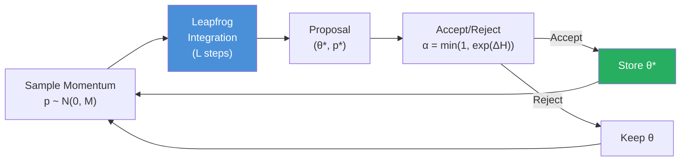
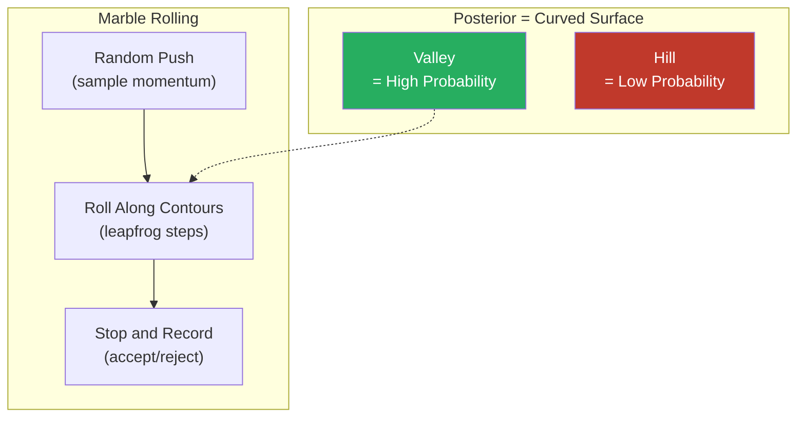
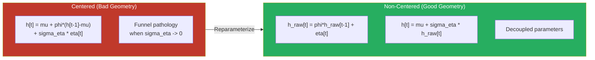
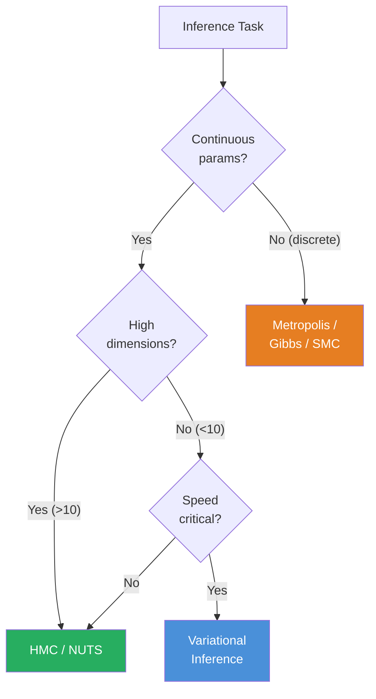
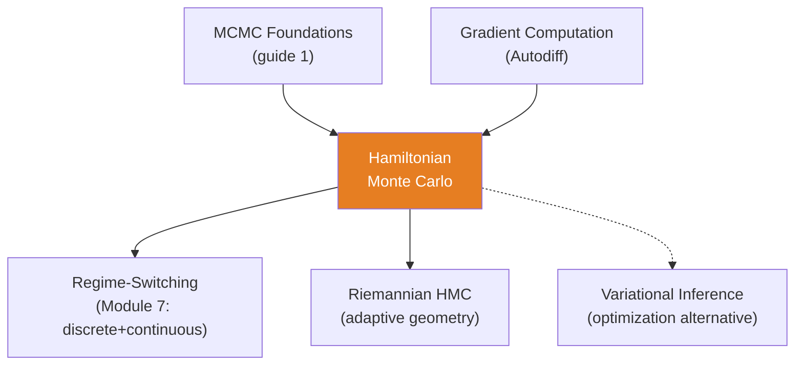

<!-- _class: lead -->

# Hamiltonian Monte Carlo

**Module 6 — Inference**

Gradient-guided sampling for complex posteriors

<!-- Speaker notes: Welcome to Hamiltonian Monte Carlo. This deck covers the key concepts you'll need. Estimated time: 42 minutes. -->
---

## Key Insight

> **Random walk MCMC is drunk; HMC is a guided missile.** Traditional Metropolis walks randomly and wastes time revisiting the same regions. HMC uses gradient information to cruise through parameter space along high-probability contours, achieving better mixing with fewer samples.

<!-- Speaker notes: Explain Key Insight. Connect this concept to the practical applications in commodity markets. Check for understanding before moving on. -->
---

## Hamiltonian Dynamics

**Goal:** Sample from $\pi(\theta) \propto \exp(-U(\theta))$ where $U(\theta) = -\log p(\theta, y)$.

**Augmented system** with momentum $p$:

$$H(\theta, p) = U(\theta) + K(p)$$

| Component | Formula | Analogy |
|-----------|---------|---------|
| $U(\theta)$ | $-\log p(\theta, y)$ | Potential energy (surface height) |
| $K(p)$ | $\frac{1}{2} p^\top M^{-1} p$ | Kinetic energy (marble velocity) |

**Hamilton's equations:**

$$\frac{d\theta}{dt} = M^{-1} p, \qquad \frac{dp}{dt} = -\nabla U(\theta)$$

<!-- Speaker notes: Walk through the mathematical notation carefully. Explain each symbol and relate it back to the intuitive explanation. Don't rush through formulas. -->
---

## HMC Sampling Pipeline



> Key property: Hamiltonian flow preserves total energy, giving high acceptance rates.

<!-- Speaker notes: Use the diagram to illustrate the relationships visually. Point to each node as you explain the flow. Give learners time to study the diagram. -->
---

## Leapfrog Integrator

Discretize Hamilton's equations with step size $\epsilon$ and $L$ steps:

```
for l = 1 to L:
    p  <-  p - (eps/2) * grad_U(theta)    # Half-step momentum
    theta  <-  theta + eps * M^{-1} p      # Full-step position
    p  <-  p - (eps/2) * grad_U(theta)    # Half-step momentum
```

**Accept proposal with:**

$$\alpha = \min\!\left(1, \exp\!\left(H(\theta, p) - H(\theta^*, p^*)\right)\right)$$

If discretization is perfect, $\Delta H = 0$ and acceptance is always 1.

<!-- Speaker notes: Walk through the mathematical notation carefully. Explain each symbol and relate it back to the intuitive explanation. Don't rush through formulas. -->
---

## The Physics Analogy



- Gradient $\nabla U$ is the slope -- guides momentum
- Marble cruises through low-probability regions quickly
- Spends more time in high-probability valleys

<!-- Speaker notes: Use the diagram to illustrate the relationships visually. Point to each node as you explain the flow. Give learners time to study the diagram. -->
---

## Why HMC for Commodity Models?

<div class="columns">
<div>

### High Dimensions
- DLMs: 200+ latent states
- Random walk MCMC gets stuck
- HMC: Gradients guide through 200D space

### Posterior Correlations
- SV models: correlated $(h_t, \phi, \sigma_\eta)$
- HMC follows curved contours

</div>
<div>

### Hierarchical Models
- Energy complex: 300+ parameters
- Complex dependencies
- HMC scales better than Gibbs

### Automatic Tuning
- NUTS adapts step size and trajectory
- PyMC uses NUTS by default
- No manual tuning needed

</div>
</div>

<!-- Speaker notes: Compare the two sides. Ask learners which approach they would use in their own work and why. -->
---

<!-- _class: lead -->

# Code Implementation

<!-- Speaker notes: Transition slide. We're now moving into Code Implementation. Pause briefly to let learners absorb the previous section before continuing. -->
---

## Basic HMC in PyMC

```python
import pymc as pm
import numpy as np
import arviz as az

np.random.seed(42)
n_obs = 150
true_level = np.cumsum(np.random.normal(0.1, 1, n_obs)) + 70
oil_prices = true_level + np.random.normal(0, 2, n_obs)

with pm.Model() as oil_state_space:
    sigma_level = pm.HalfNormal('sigma_level', sigma=2)
    sigma_obs = pm.HalfNormal('sigma_obs', sigma=3)
    level_init = pm.Normal('level_init', mu=70, sigma=10)  # ... continued on next slide
```

<!-- Speaker notes: Walk through the code step by step. Highlight the key lines and explain the purpose of each section. Encourage learners to run this in their own notebooks. -->
---

## Code (continued)

<!-- Speaker notes: Continue walking through the code. This is a continuation of the previous slide's code block. -->

```python

    level_innov = pm.Normal('level_innov', 0, 1, shape=n_obs-1)
    level = pm.Deterministic('level',
        pm.math.concatenate([[level_init],
            level_init + pm.math.cumsum(
                sigma_level * level_innov)]))

    y_obs = pm.Normal('y_obs', mu=level, sigma=sigma_obs,
                       observed=oil_prices)
    trace = pm.sample(1000, tune=1500, cores=4,
                       return_inferencedata=True)
```

---

## NUTS: No-U-Turn Sampler

**Problem:** HMC requires tuning $\epsilon$ (step size) and $L$ (trajectory length).

**NUTS adapts both automatically during warmup.**

**U-Turn Criterion:**

$$(\theta_+ - \theta_-) \cdot p_- < 0 \quad \text{or} \quad (\theta_+ - \theta_-) \cdot p_+ < 0$$

Run leapfrog steps until trajectory starts doubling back.

> **PyMC automatically uses NUTS** when you call `pm.sample()`.

<!-- Speaker notes: Walk through the mathematical notation carefully. Explain each symbol and relate it back to the intuitive explanation. Don't rush through formulas. -->
---

## Tuning Parameters

| Parameter | Effect | Recommendation |
|-----------|--------|---------------|
| `target_accept` | Controls step size | 0.8 default; 0.9-0.95 for complex models |
| `tune` | Warmup samples | >= 1500 for complex models |
| Mass matrix | Adapts to posterior scale | Diagonal (default) or dense |

```python
# For complex posteriors (SV, hierarchical)
trace = pm.sample(
    1000,
    tune=2000,
    target_accept=0.9,
    return_inferencedata=True
)
```

<!-- Speaker notes: Walk through the code step by step. Highlight the key lines and explain the purpose of each section. Encourage learners to run this in their own notebooks. -->
---

<!-- _class: lead -->

# Reparameterization

<!-- Speaker notes: Transition slide. We're now moving into Reparameterization. Pause briefly to let learners absorb the previous section before continuing. -->
---

## Non-Centered Parameterization



<!-- Speaker notes: Use the diagram to illustrate the relationships visually. Point to each node as you explain the flow. Give learners time to study the diagram. -->
---

## Non-Centered SV in PyMC

```python
with pm.Model() as sv_noncentered:
    mu = pm.Normal('mu', 0, 5)
    phi = pm.Beta('phi', alpha=20, beta=1.5) * 2 - 1
    sigma_eta = pm.HalfNormal('sigma_eta', sigma=1)

    # Non-centered: sample raw innovations
    h_raw_innov = pm.Normal('h_raw_innov', 0, 1,
                             shape=n_obs-1)
    h_raw = pm.Deterministic('h_raw',
        pm.math.concatenate([[0],
            pm.math.cumsum(phi * h_raw_innov)]))

    # Transform to actual log-volatility  # ... continued on next slide
```

<!-- Speaker notes: Walk through the code step by step. Highlight the key lines and explain the purpose of each section. Encourage learners to run this in their own notebooks. -->
---

## Code (continued)

<!-- Speaker notes: Continue walking through the code. This is a continuation of the previous slide's code block. -->

```python
    h = pm.Deterministic('h', mu + sigma_eta * h_raw)

    y_obs = pm.Normal('y_obs', mu=0,
        sigma=pm.math.exp(h/2), observed=returns)

    trace = pm.sample(1000, tune=2000,
                       target_accept=0.95)
```

> Fewer divergences, better mixing.

---

<!-- _class: lead -->

# Diagnosing HMC Problems

<!-- Speaker notes: Transition slide. We're now moving into Diagnosing HMC Problems. Pause briefly to let learners absorb the previous section before continuing. -->
---

## Diagnostic Checklist

| Issue | Symptom | Fix |
|-------|---------|-----|
| Divergences | Warning after tuning | Increase `target_accept` to 0.95; reparameterize |
| Low ESS | ESS << n_samples | Longer chains; better mass matrix |
| High $\hat{R}$ | $\hat{R} > 1.01$ | More warmup; check multimodality |
| Low E-BFMI | E-BFMI < 0.3 | Non-centered parameterization |

```python
ess = az.ess(trace)
print(f"ESS: {ess['sigma_level'].values}")
print(f"R-hat: {az.rhat(trace)['sigma_level'].values}")
print(f"E-BFMI: {az.bfmi(trace)}")
divergences = trace.sample_stats['diverging'].sum()
print(f"Divergences: {divergences.values}")
```

<!-- Speaker notes: Walk through the code step by step. Highlight the key lines and explain the purpose of each section. Encourage learners to run this in their own notebooks. -->
---

## HMC for Hierarchical Commodity Models

```python
with pm.Model() as energy_hierarchy:
    mu_global = pm.Normal('mu_global', mu=80, sigma=20)
    sigma_global = pm.HalfNormal('sigma_global', sigma=10)

    grade_intercept = pm.Normal('grade_intercept',
        mu=0, sigma=5, shape=n_grades)
    grade_sigma = pm.HalfNormal('grade_sigma',
        sigma=sigma_global, shape=n_grades)

    factor_innov = pm.Normal('factor_innov', 0, 1,
                              shape=n_obs)
    factor = pm.Deterministic('factor',
        mu_global + pm.math.cumsum(  # ... continued on next slide
```

<!-- Speaker notes: Walk through the code step by step. Highlight the key lines and explain the purpose of each section. Encourage learners to run this in their own notebooks. -->
---

## Code (continued)

<!-- Speaker notes: Continue walking through the code. This is a continuation of the previous slide's code block. -->

```python
            sigma_global * factor_innov))

    for g in range(n_grades):
        pm.Normal(f'price_{g}',
            mu=grade_intercept[g] + factor,
            sigma=grade_sigma[g], observed=prices[:, g])

    trace = pm.sample(1000, tune=2000,
                       target_accept=0.9, cores=4)
```

---

## When to Use HMC vs Others



<!-- Speaker notes: Use the diagram to illustrate the relationships visually. Point to each node as you explain the flow. Give learners time to study the diagram. -->
---

## Connections



<!-- Speaker notes: Use the diagram to illustrate the relationships visually. Point to each node as you explain the flow. Give learners time to study the diagram. -->
---

## Practice Problems

1. Crude oil state space with 200 latent states, $L=50$ leapfrog steps. How many gradient evaluations per iteration? Compare to Metropolis.

2. SV model reports 120 divergences out of 1000. What does this indicate? Propose two fixes.

3. Implement hierarchical model for 3 crude grades. Check ESS, $\hat{R}$, and E-BFMI.

4. Why is non-centered parameterization more efficient? Provide geometric intuition (funnel).

> *"HMC doesn't wander through parameter space -- it surfs the posterior contours with purpose."*

<!-- Speaker notes: Give learners 5-10 minutes to attempt these problems. Circulate and offer hints. Review solutions together afterward. -->
---


<!-- _class: lead -->

# References

<!-- Speaker notes: These references provide deeper coverage of the topics discussed. Recommend the first 1-2 as starting points for learners who want to go deeper. -->

- **Neal (2011):** "MCMC Using Hamiltonian Dynamics" - Definitive HMC reference
- **Hoffman & Gelman (2014):** "The No-U-Turn Sampler" - Original NUTS paper
- **Betancourt (2017):** "A Conceptual Introduction to HMC" - Intuitive geometric insights
- **Betancourt & Girolami (2015):** "HMC for Hierarchical Models"
