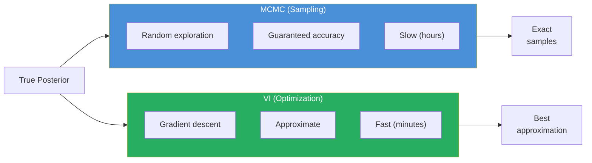
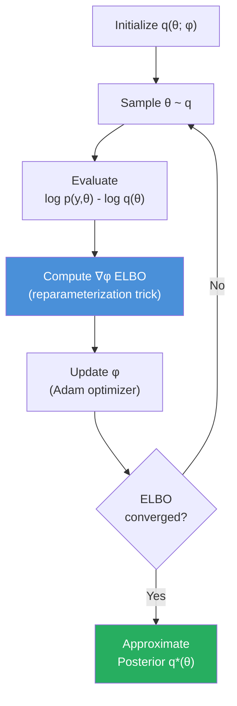
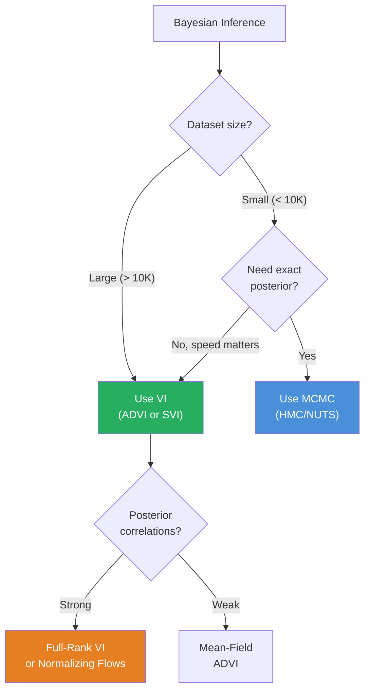
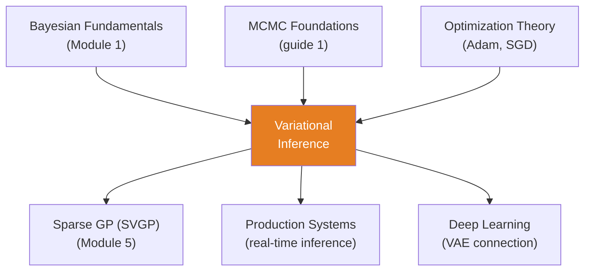

<!-- _class: lead -->

# Variational Inference

**Module 6 — Inference**

Turning Bayesian inference into optimization

<!-- Speaker notes: Welcome to Variational Inference. This deck covers the key concepts you'll need. Estimated time: 40 minutes. -->
---

## Key Insight

> **MCMC explores the posterior through random sampling -- accurate but slow. VI turns inference into optimization:** find the distribution in a tractable family that is closest to the true posterior. Trade exactness for speed -- VI can be 100x faster than MCMC.

<!-- Speaker notes: Explain Key Insight. Connect this concept to the practical applications in commodity markets. Check for understanding before moving on. -->
---

## The Inference Problem

$$p(\boldsymbol{\theta} | \mathbf{y}) = \frac{p(\mathbf{y} | \boldsymbol{\theta})\, p(\boldsymbol{\theta})}{p(\mathbf{y})}$$

**Challenge:** $p(\mathbf{y}) = \int p(\mathbf{y} | \boldsymbol{\theta})\, p(\boldsymbol{\theta})\, d\boldsymbol{\theta}$ is intractable.

**VI approach:** Approximate with tractable family:

$$p(\boldsymbol{\theta} | \mathbf{y}) \approx q(\boldsymbol{\theta}; \boldsymbol{\phi})$$

<!-- Speaker notes: Walk through the mathematical notation carefully. Explain each symbol and relate it back to the intuitive explanation. Don't rush through formulas. -->
---

## MCMC vs VI



| Feature | MCMC | VI |
|---------|------|-----|
| Accuracy | Exact (given convergence) | Approximate |
| Speed | Slow | Fast (100x) |
| Scales to | ~10K params | Millions of params |
| Uncertainty | Full posterior | Often underestimates |

<!-- Speaker notes: Use the diagram to illustrate the relationships visually. Point to each node as you explain the flow. Give learners time to study the diagram. -->
---

## Evidence Lower Bound (ELBO)

Cannot directly minimize $\text{KL}[q \| p]$. Instead, maximize:

$$\mathcal{L}(\boldsymbol{\phi}) = \mathbb{E}_{q(\boldsymbol{\theta})}[\log p(\mathbf{y}, \boldsymbol{\theta})] - \mathbb{E}_{q(\boldsymbol{\theta})}[\log q(\boldsymbol{\theta})]$$

**Equivalently:**

$$\mathcal{L}(\boldsymbol{\phi}) = \log p(\mathbf{y}) - \text{KL}[q(\boldsymbol{\theta}) \| p(\boldsymbol{\theta} | \mathbf{y})]$$

Since $\log p(\mathbf{y})$ is constant:

$$\max_{\boldsymbol{\phi}} \mathcal{L} \iff \min_{\boldsymbol{\phi}} \text{KL}[q \| p]$$

<!-- Speaker notes: Walk through the mathematical notation carefully. Explain each symbol and relate it back to the intuitive explanation. Don't rush through formulas. -->
---

## ELBO Optimization Flow



<!-- Speaker notes: Use the diagram to illustrate the relationships visually. Point to each node as you explain the flow. Give learners time to study the diagram. -->
---

## Mean-Field Variational Family

**Fully factorized approximation:**

$$q(\boldsymbol{\theta}) = \prod_{i=1}^d q_i(\theta_i)$$

**Common choice:** Gaussian mean-field:

$$q(\boldsymbol{\theta}) = \mathcal{N}(\boldsymbol{\mu}, \text{diag}(\boldsymbol{\sigma}^2))$$

Variational parameters: $\boldsymbol{\phi} = \{\boldsymbol{\mu}, \boldsymbol{\sigma}\}$

> Mean-field ignores posterior correlations. Fast but loses information.

<!-- Speaker notes: Walk through the mathematical notation carefully. Explain each symbol and relate it back to the intuitive explanation. Don't rush through formulas. -->
---

<!-- _class: lead -->

# Code Implementation

<!-- Speaker notes: Transition slide. We're now moving into Code Implementation. Pause briefly to let learners absorb the previous section before continuing. -->
---

## ADVI in PyMC

```python
import pymc as pm
import numpy as np
import arviz as az

np.random.seed(42)
n = 200
X = np.random.normal(0, 1, n)
y = 2.5 + 1.3 * X + np.random.normal(0, 0.5, n)

with pm.Model() as model:
    alpha = pm.Normal('alpha', mu=0, sigma=10)
    beta = pm.Normal('beta', mu=0, sigma=10)
    sigma = pm.HalfNormal('sigma', sigma=2)  # ... continued on next slide
```

<!-- Speaker notes: Walk through the code step by step. Highlight the key lines and explain the purpose of each section. Encourage learners to run this in their own notebooks. -->
---

## Code (continued)

<!-- Speaker notes: Continue walking through the code. This is a continuation of the previous slide's code block. -->

```python
    mu = alpha + beta * X
    y_obs = pm.Normal('y_obs', mu=mu, sigma=sigma,
                       observed=y)

    # Variational Inference with ADVI
    approx = pm.fit(
        n=20000, method='advi',
        callbacks=[pm.callbacks.CheckParametersConvergence(
            tolerance=1e-4)])

    trace_vi = approx.sample(2000)
```

---

## Compare VI vs MCMC

```python
# For comparison: MCMC sampling
with model:
    trace_mcmc = pm.sample(2000, tune=1000, random_seed=42)

# Compare posteriors
params = ['alpha', 'beta', 'sigma']
true_vals = [2.5, 1.3, 0.5]

for param, true_val in zip(params, true_vals):
    vi_mean = trace_vi.posterior[param].values.mean()
    mcmc_mean = trace_mcmc.posterior[param].values.mean()
    print(f"{param}: VI={vi_mean:.3f}, "
          f"MCMC={mcmc_mean:.3f}, True={true_val}")
```

> VI gives similar means but often narrower credible intervals.

<!-- Speaker notes: Walk through the code step by step. Highlight the key lines and explain the purpose of each section. Encourage learners to run this in their own notebooks. -->
---

## Stochastic VI (Mini-Batch)

```python
import torch
import torch.nn as nn
from torch.distributions import Normal

class BayesianLinearRegression(nn.Module):
    def __init__(self, input_dim):
        super().__init__()
        self.alpha_mu = nn.Parameter(torch.randn(1))
        self.alpha_logstd = nn.Parameter(torch.randn(1))
        self.beta_mu = nn.Parameter(torch.randn(input_dim))
        self.beta_logstd = nn.Parameter(torch.randn(input_dim))

    def elbo_loss(self, X_batch, y_batch, n_total):  # ... continued on next slide
```

<!-- Speaker notes: Walk through the code step by step. Highlight the key lines and explain the purpose of each section. Encourage learners to run this in their own notebooks. -->
---

## Code (continued)

<!-- Speaker notes: Continue walking through the code. This is a continuation of the previous slide's code block. -->

```python
        batch_size = len(X_batch)
        alpha = Normal(self.alpha_mu,
            self.alpha_logstd.exp()).rsample((5,))
        beta = Normal(self.beta_mu,
            self.beta_logstd.exp()).rsample((5,))
        # ... compute scaled log likelihood and KL
        return -elbo
```

> Mini-batch VI scales to millions of data points.

---

## SVI Training Loop

```python
def train_svi(X, y, batch_size=32, n_epochs=100):
    X_t = torch.tensor(X, dtype=torch.float32).reshape(-1,1)
    y_t = torch.tensor(y, dtype=torch.float32)
    n_total = len(X)

    model = BayesianLinearRegression(input_dim=1)
    optimizer = torch.optim.Adam(model.parameters(), lr=0.01)

    for epoch in range(n_epochs):
        perm = torch.randperm(n_total)
        for i in range(0, n_total, batch_size):
            X_batch = X_t[perm[i:i+batch_size]].squeeze()
            y_batch = y_t[perm[i:i+batch_size]]  # ... continued on next slide
```

<!-- Speaker notes: Walk through the code step by step. Highlight the key lines and explain the purpose of each section. Encourage learners to run this in their own notebooks. -->
---

## Code (continued)

<!-- Speaker notes: Continue walking through the code. This is a continuation of the previous slide's code block. -->

```python
            optimizer.zero_grad()
            loss = model.elbo_loss(X_batch, y_batch, n_total)
            loss.backward()
            optimizer.step()
    return model
```

---

<!-- _class: lead -->

# When to Use VI

<!-- Speaker notes: Transition slide. We're now moving into When to Use VI. Pause briefly to let learners absorb the previous section before continuing. -->
---

## VI Decision Framework



<!-- Speaker notes: Use the diagram to illustrate the relationships visually. Point to each node as you explain the flow. Give learners time to study the diagram. -->
---

## Variational Family Comparison

| Family | Captures Correlations | Speed | Quality |
|--------|----------------------|-------|---------|
| Mean-field Gaussian | No | Fastest | Lowest |
| Full-rank Gaussian | Yes (quadratic) | Fast | Medium |
| Normalizing flows | Yes (nonlinear) | Medium | Highest |

**For commodity models:**
- Exploratory analysis: Mean-field ADVI
- Production: Full-rank or check against MCMC
- Real-time: SVI with mini-batches

<!-- Speaker notes: Walk through each row of the table. This is reference material learners will come back to, so highlight the most important entries. -->
---

<!-- _class: lead -->

# Common Pitfalls

<!-- Speaker notes: Transition slide. We're now moving into Common Pitfalls. Pause briefly to let learners absorb the previous section before continuing. -->
---

## Pitfalls to Avoid

**Mean-Field Too Restrictive:** Cannot capture posterior correlations. Underestimates uncertainty. Use full-rank Gaussian or normalizing flows.

**Local Optima in ELBO:** Multiple random initializations, Adam optimizer, learning rate schedules.

**Ignoring ELBO Convergence:** Monitor convergence, use callbacks to check plateau.

**Overstating Certainty:** VI typically underestimates posterior variance. Always check against MCMC on subset.

<!-- Speaker notes: These are common mistakes that even experienced practitioners make. Share a real-world example if possible to make the warning concrete. -->
---

## Connections



<!-- Speaker notes: Use the diagram to illustrate the relationships visually. Point to each node as you explain the flow. Give learners time to study the diagram. -->
---

## Practice Problems

1. Show that $\mathcal{L} = \log p(\mathbf{y}) - \text{KL}[q \| p]$. Why does maximizing ELBO minimize KL?

2. True posterior has strong $(\alpha, \beta)$ correlation. Mean-field: $q(\alpha)q(\beta)$. What information is lost? How does this affect prediction intervals?

3. Dataset $n = 100{,}000$, $d = 50$. MCMC: 10K iterations, full dataset. VI: 1K iterations, batch = 1K. Calculate speedup.

4. ELBO increases rapidly (1-1K), slowly (1K-5K), oscillates (5K-10K). Has VI converged? What next?

> *"Variational inference trades sampling for optimization: instead of exploring the posterior, find the best simple approximation."*

<!-- Speaker notes: Give learners 5-10 minutes to attempt these problems. Circulate and offer hints. Review solutions together afterward. -->
---


<!-- _class: lead -->

# References

<!-- Speaker notes: These references provide deeper coverage of the topics discussed. Recommend the first 1-2 as starting points for learners who want to go deeper. -->

- **Jordan et al. (1999):** "Variational Methods for Graphical Models" - Classic overview
- **Blei et al. (2017):** "Variational Inference: A Review for Statisticians"
- **Kucukelbir et al. (2017):** "Automatic Differentiation Variational Inference" - ADVI
- **Kingma & Welling (2014):** "Auto-Encoding Variational Bayes" - Reparameterization trick
