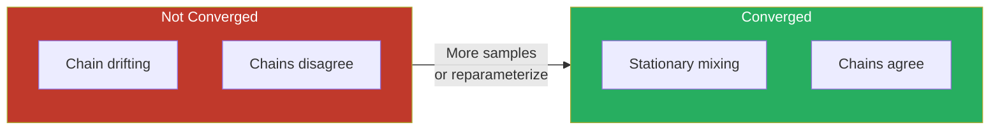
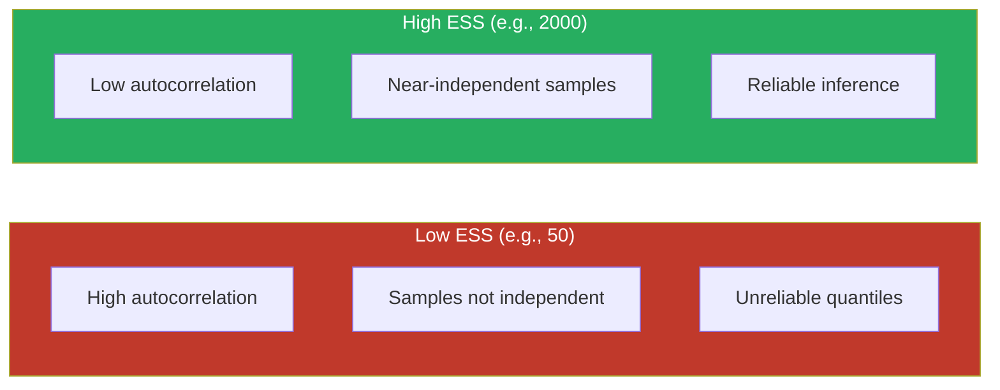
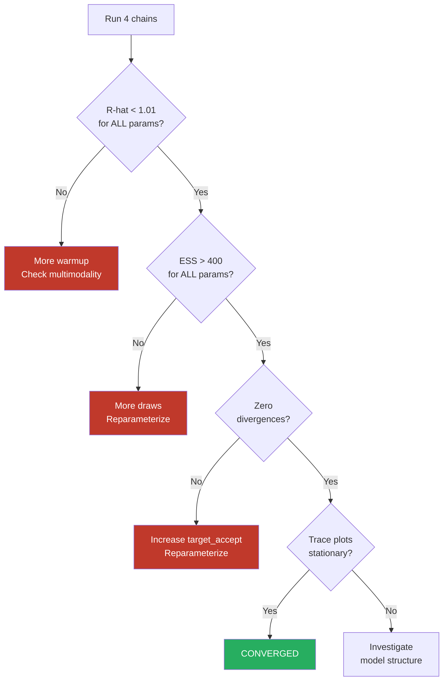
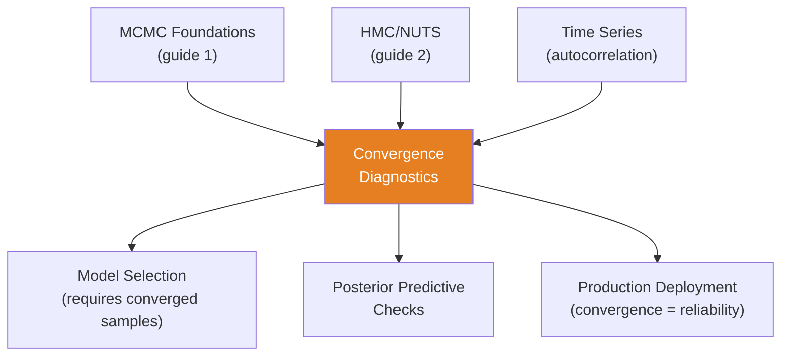

<!-- _class: lead -->

# Convergence Diagnostics for MCMC

**Module 6 — Inference**

How to know when your chain has converged

<!-- Speaker notes: Welcome to Convergence Diagnostics for MCMC. This deck covers the key concepts you'll need. Estimated time: 38 minutes. -->
---

## Key Insight

> **Running MCMC without checking convergence is like leaving bread in the oven without setting a timer.** Diagnostics tell you when the chain has "burned in" and is providing valid posterior samples.

<!-- Speaker notes: Explain Key Insight. Connect this concept to the practical applications in commodity markets. Check for understanding before moving on. -->
---

## The Convergence Question

MCMC generates $\{\theta^{(1)}, \theta^{(2)}, \ldots, \theta^{(T)}\}$

**Goal:** $\theta^{(t)} \sim p(\theta | \mathbf{y})$ for large $t$

**Problem:** How large is "large enough"?



<!-- Speaker notes: Use the diagram to illustrate the relationships visually. Point to each node as you explain the flow. Give learners time to study the diagram. -->
---

## Three Key Diagnostics

| Diagnostic | Formula | Threshold |
|-----------|---------|-----------|
| $\hat{R}$ (Gelman-Rubin) | $\sqrt{\hat{V} / W}$ | $< 1.01$ |
| ESS (Effective Sample Size) | $T / (1 + 2\sum_k \rho_k)$ | $> 400$ |
| MCSE (MC Standard Error) | $\sigma / \sqrt{\text{ESS}}$ | $< 0.01 \times \sigma$ |

Plus: **Divergences** (HMC-specific) should be **zero**.

<!-- Speaker notes: Walk through each row of the table. This is reference material learners will come back to, so highlight the most important entries. -->
---

## R-hat: Between vs Within Chain Variance

$$\hat{R} = \sqrt{\frac{\hat{V}}{W}}$$

- $W$ = within-chain variance (average across chains)
- $\hat{V}$ = total variance estimate (within + between)

| $\hat{R}$ | Interpretation |
|-----------|---------------|
| $\approx 1.0$ | Chains agree -- converged |
| $1.01 - 1.1$ | Marginal -- run longer |
| $> 1.1$ | Not converged -- investigate |

> Run **4 chains** from different starting points to compute $\hat{R}$.

<!-- Speaker notes: Walk through the mathematical notation carefully. Explain each symbol and relate it back to the intuitive explanation. Don't rush through formulas. -->
---

## Effective Sample Size

$$\text{ESS} = \frac{T}{1 + 2\sum_{k=1}^{\infty} \rho_k}$$



| ESS | Assessment |
|-----|-----------|
| $< 100$ | Insufficient |
| $100 - 400$ | Marginal |
| $> 400$ | Sufficient for most purposes |

<!-- Speaker notes: Use the diagram to illustrate the relationships visually. Point to each node as you explain the flow. Give learners time to study the diagram. -->
---

## Trace Plots: Visual Inspection

<div class="columns">
<div>

### Good Mixing
```
θ
  |  ~~~~~~~~~ (hairy caterpillar)
  | ~~~~~~~~~~
  |~~~~~~~~~~~
  └──────────── t
```
- Stationary
- Chains overlap
- No trends or jumps

</div>
<div>

### Poor Mixing
```
θ
  |       ___________
  |      /
  |_____/
  └──────────── t
```
- Drifting
- Chains separate
- Stuck in regions

</div>
</div>

<!-- Speaker notes: Compare the two sides. Ask learners which approach they would use in their own work and why. -->
---

<!-- _class: lead -->

# Code Implementation

<!-- Speaker notes: Transition slide. We're now moving into Code Implementation. Pause briefly to let learners absorb the previous section before continuing. -->
---

## Comprehensive Diagnostic Suite

```python
import pymc as pm
import arviz as az

def run_mcmc_with_diagnostics(model, tune=1000,
                               draws=2000, chains=4):
    with model:
        trace = pm.sample(draws=draws, tune=tune,
            chains=chains, return_inferencedata=True,
            random_seed=[42, 43, 44, 45])

    diagnostics = {}
    rhat = az.rhat(trace)
    diagnostics['rhat_max'] = float(rhat.max().values)  # ... continued on next slide
```

<!-- Speaker notes: Walk through the code step by step. Highlight the key lines and explain the purpose of each section. Encourage learners to run this in their own notebooks. -->
---

## Code (Part 2/3)

<!-- Speaker notes: Continue walking through the code. This is a continuation of the previous slide's code block. -->

```python
    diagnostics['rhat_converged'] = diagnostics['rhat_max'] < 1.01

    ess_bulk = az.ess(trace, method='bulk')
    ess_tail = az.ess(trace, method='tail')
    diagnostics['ess_bulk_min'] = float(ess_bulk.min().values)
    diagnostics['ess_sufficient'] = diagnostics['ess_bulk_min'] > 400

    diagnostics['n_divergences'] = int(
        trace.sample_stats.diverging.sum().values)
    diagnostics['converged'] = (
        diagnostics['rhat_converged'] and
        diagnostics['ess_sufficient'] and
        diagnostics['n_divergences'] == 0)
```

---

## Code (Part 3/3)

<!-- Speaker notes: Continue walking through the code. This is a continuation of the previous slide's code block. -->

```python
    return trace, diagnostics
```

---

## Diagnostic Report

```python
def print_diagnostic_report(diagnostics):
    print("=" * 60)
    print("MCMC CONVERGENCE DIAGNOSTIC REPORT")
    print("=" * 60)

    print(f"\n1. R-HAT: Max = {diagnostics['rhat_max']:.4f}")
    print(f"   {'CONVERGED' if diagnostics['rhat_converged']"
          f" else 'NOT CONVERGED'} (threshold < 1.01)")

    print(f"\n2. ESS: Min bulk = "
          f"{diagnostics['ess_bulk_min']:.0f}")
    print(f"   {'SUFFICIENT' if diagnostics['ess_sufficient']"
          f" else 'INSUFFICIENT'} (threshold > 400)")  # ... continued on next slide
```

<!-- Speaker notes: Walk through the code step by step. Highlight the key lines and explain the purpose of each section. Encourage learners to run this in their own notebooks. -->
---

## Code (continued)

<!-- Speaker notes: Continue walking through the code. This is a continuation of the previous slide's code block. -->

```python

    print(f"\n3. DIVERGENCES: {diagnostics['n_divergences']}")

    if diagnostics['converged']:
        print("\nOVERALL: CONVERGED")
    else:
        print("\nOVERALL: ISSUES DETECTED")
```

---

## Diagnostic Visualization

```python
def plot_convergence_diagnostics(trace, param_names):
    n_params = len(param_names)
    fig, axes = plt.subplots(n_params, 4,
                              figsize=(16, 4*n_params))

    for i, param in enumerate(param_names):
        samples = trace.posterior[param].values

        # Trace plot (all chains)
        for chain in range(samples.shape[0]):
            axes[i, 0].plot(samples[chain, :], alpha=0.5)
        axes[i, 0].set_title(f'{param} - Trace')
  # ... continued on next slide
```

<!-- Speaker notes: Walk through the code step by step. Highlight the key lines and explain the purpose of each section. Encourage learners to run this in their own notebooks. -->
---

## Code (continued)

<!-- Speaker notes: Continue walking through the code. This is a continuation of the previous slide's code block. -->

```python
        # Posterior density (chains overlaid)
        for chain in range(samples.shape[0]):
            axes[i, 1].hist(samples[chain, :], bins=50,
                            alpha=0.3, density=True)
        axes[i, 1].set_title(f'{param} - Posterior')

        # Autocorrelation + Rank plot
        az.plot_autocorr(trace, var_names=[param],
                         ax=axes[i, 2])
        az.plot_rank(trace, var_names=[param],
                     ax=axes[i, 3])
    plt.tight_layout()
```

---

## Automated Issue Detection

```python
def diagnose_issues(trace):
    issues = []
    rhat = az.rhat(trace)
    ess = az.ess(trace, method='bulk')

    for var in rhat.data_vars:
        if float(rhat[var].max()) > 1.01:
            issues.append(f"High R-hat: {var}")

    for var in ess.data_vars:
        if float(ess[var].min()) < 400:
            issues.append(f"Low ESS: {var}")
  # ... continued on next slide
```

<!-- Speaker notes: Walk through the code step by step. Highlight the key lines and explain the purpose of each section. Encourage learners to run this in their own notebooks. -->
---

## Code (continued)

<!-- Speaker notes: Continue walking through the code. This is a continuation of the previous slide's code block. -->

```python
    n_div = int(trace.sample_stats.diverging.sum())
    if n_div > 0:
        issues.append(f"{n_div} divergences detected")

    return issues
```

---

## Diagnostic Decision Tree



<!-- Speaker notes: Use the diagram to illustrate the relationships visually. Point to each node as you explain the flow. Give learners time to study the diagram. -->
---

## Automated Resampling

```python
def sample_until_converged(model, max_attempts=3,
                            initial_draws=1000):
    draws = initial_draws
    for attempt in range(1, max_attempts + 1):
        trace, diag = run_mcmc_with_diagnostics(
            model, tune=draws//2, draws=draws, chains=4)

        if diag['converged']:
            print(f"Converged after {attempt} attempt(s)")
            return trace

        draws = int(draws * 1.5)  # Increase for next try

    print("Failed to converge. Consider reparameterization.")
    return None
```

<!-- Speaker notes: Walk through the code step by step. Highlight the key lines and explain the purpose of each section. Encourage learners to run this in their own notebooks. -->
---

<!-- _class: lead -->

# Common Pitfalls

<!-- Speaker notes: Transition slide. We're now moving into Common Pitfalls. Pause briefly to let learners absorb the previous section before continuing. -->
---

## Pitfalls to Avoid

**Checking Only Overall R-hat:** One parameter at $\hat{R} = 1.15$ while others are fine. Check each parameter individually.

**Accepting Low ESS:** ESS = 50 gives unstable quantiles. Target ESS > 400.

**Visual Inspection Only:** Trace plots "look fine" but miss subtle non-convergence. Always compute numerical diagnostics.

**Discarding Divergences:** "Only 1% divergences" can bias the posterior. Zero divergences should be the goal.

**Single Chain:** Cannot compute $\hat{R}$ or detect multimodality. Always run 4+ chains.

<!-- Speaker notes: These are common mistakes that even experienced practitioners make. Share a real-world example if possible to make the warning concrete. -->
---

## Connections



<!-- Speaker notes: Use the diagram to illustrate the relationships visually. Point to each node as you explain the flow. Give learners time to study the diagram. -->
---

## Practice Problems

1. Four chains: means 2.3, 2.4, 2.3, 8.1. Will $\hat{R}$ be close to 1? Why?

2. 1000 samples, autocorrelations $\rho_1=0.8$, $\rho_2=0.6$, $\rho_3=0.4$. Estimate ESS.

3. Hierarchical model: 50 divergences, all when $\sigma < 0.1$. Diagnosis? Fix?

4. Want MCSE < 0.01, posterior sd = 0.5, current ESS = 200. How many more effective samples needed?

5. GP with 100 inducing points: $\hat{R}$ all < 1.01, hyperparameter ESS = 100-200, zero divergences. Stop, continue, or reparameterize?

> *"Convergence diagnostics ensure your MCMC samples are reliable. No diagnostics = no trust in posterior inference."*

<!-- Speaker notes: Give learners 5-10 minutes to attempt these problems. Circulate and offer hints. Review solutions together afterward. -->
---


<!-- _class: lead -->

# References

<!-- Speaker notes: These references provide deeper coverage of the topics discussed. Recommend the first 1-2 as starting points for learners who want to go deeper. -->

- **Gelman & Rubin (1992):** "Inference from Iterative Simulation" - Original R-hat
- **Vehtari et al. (2021):** "Rank-normalization, folding, and localization" - Improved R-hat
- **Geyer (1992):** "Practical Markov Chain Monte Carlo" - ESS theory
- **Betancourt (2017):** "A Conceptual Introduction to HMC" - Understanding divergences
