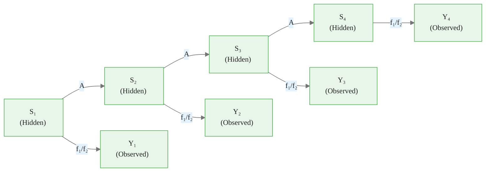
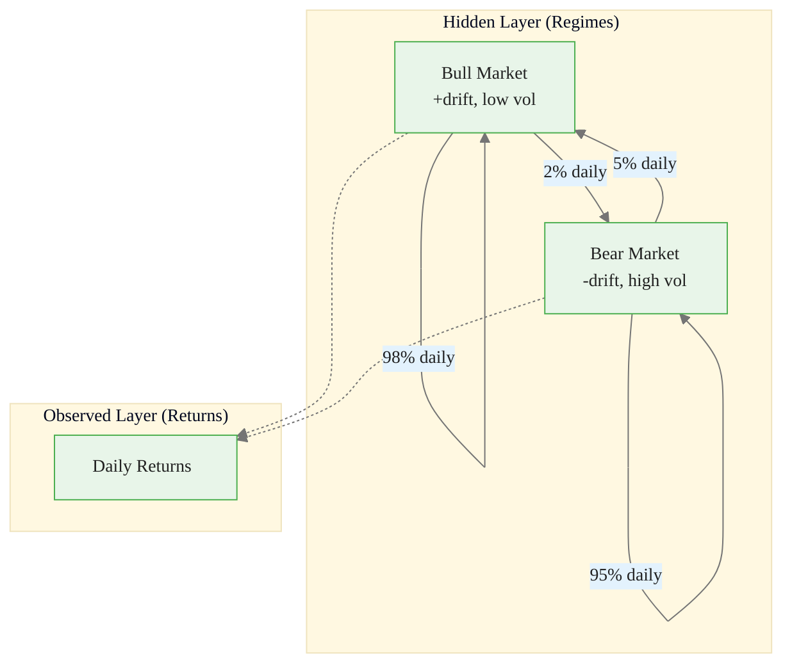
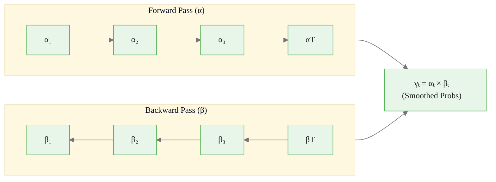
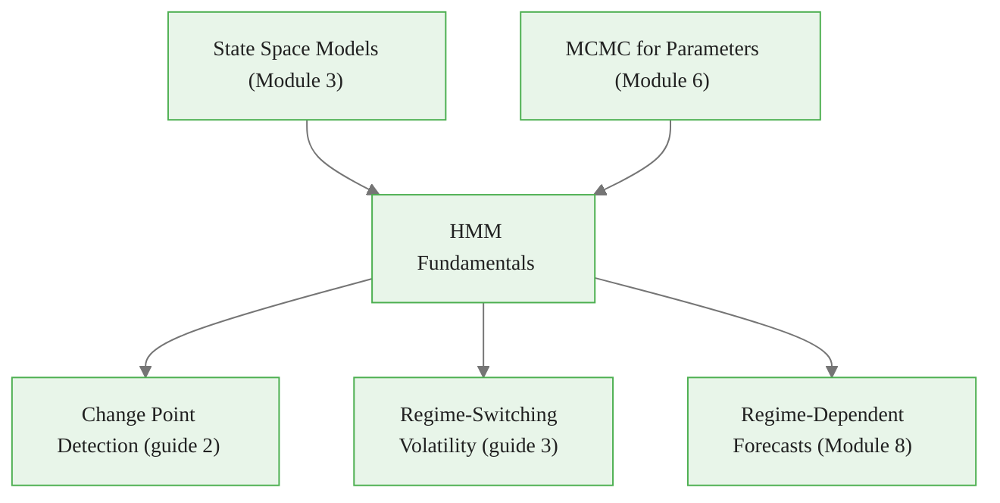

<!-- _class: lead -->

# Hidden Markov Model Fundamentals

**Module 7 — Regime Switching**

Inferring market regimes from observed prices

<!-- Speaker notes: Welcome to Hidden Markov Model Fundamentals. This deck covers the key concepts you'll need. Estimated time: 40 minutes. -->
---

## Key Insight

> **HMMs separate "what regime are we in?" from "what do we observe?"** The regime is latent (unobserved) but influences the distribution of prices. By modeling this two-layer structure, we can infer regimes from prices and make regime-dependent forecasts.

<!-- Speaker notes: Explain Key Insight. Connect this concept to the practical applications in commodity markets. Check for understanding before moving on. -->

<div class="callout-info">
This is a foundational concept for the rest of the module.
</div>
---

## HMM Components

An HMM is defined by:

| Component | Symbol | Example |
|-----------|--------|---------|
| States | $S = \{1, \ldots, K\}$ | Bull, Bear |
| Initial distribution | $\pi_k = P(S_1 = k)$ | Start probabilities |
| Transition matrix | $A_{jk} = P(S_t = k \mid S_{t-1} = j)$ | Regime persistence |
| Emission distribution | $P(Y_t \mid S_t = k) = f_k(y_t)$ | Price distribution per regime |

<!-- Speaker notes: Walk through each row of the table. This is reference material learners will come back to, so highlight the most important entries. -->

<div class="callout-key">
This is the key takeaway from this section.
</div>
---

## HMM Graphical Structure



**Assumptions:**
1. **Markov:** $P(S_t | S_{t-1}, \ldots, S_1) = P(S_t | S_{t-1})$
2. **Conditional independence:** $P(Y_t | S_t, Y_{1:t-1}) = P(Y_t | S_t)$

<!-- Speaker notes: Use the diagram to illustrate the relationships visually. Point to each node as you explain the flow. Give learners time to study the diagram. -->

<div class="callout-warning">
Common misconception — read carefully.
</div>
---

## Two-State Commodity Model

**Transition Matrix:**

$$A = \begin{bmatrix} 0.98 & 0.02 \\ 0.05 & 0.95 \end{bmatrix}$$

Bull markets last ~50 days ($1/0.02$), bear markets ~20 days ($1/0.05$).

**Emission Distributions:**

| Regime | Mean Return | Volatility |
|--------|------------|-----------|
| Bull | $\mu = +0.05\%$ | $\sigma = 1.5\%$ |
| Bear | $\mu = -0.10\%$ | $\sigma = 2.5\%$ |

<!-- Speaker notes: Walk through the mathematical notation carefully. Explain each symbol and relate it back to the intuitive explanation. Don't rush through formulas. -->

<div class="callout-insight">
This insight connects theory to practice.
</div>
---

## Commodity Market Analogy



> From returns alone, we infer the current regime and forecast future regimes.

<!-- Speaker notes: Use the diagram to illustrate the relationships visually. Point to each node as you explain the flow. Give learners time to study the diagram. -->
---

<!-- _class: lead -->

# Inference Problems

<!-- Speaker notes: Transition slide. We're now moving into Inference Problems. Pause briefly to let learners absorb the previous section before continuing. -->
---

## Four Key HMM Tasks

| Task | Formula | Use Case |
|------|---------|----------|
| **Filtering** | $P(S_t \mid Y_{1:t})$ | Real-time regime ID |
| **Smoothing** | $P(S_t \mid Y_{1:T})$ | Retrospective analysis |
| **Decoding** | $\arg\max P(S_{1:T} \mid Y_{1:T})$ | Best regime sequence (Viterbi) |
| **Learning** | Estimate $(\pi, A, f_k)$ | Fit model to data |

<!-- Speaker notes: Walk through each row of the table. This is reference material learners will come back to, so highlight the most important entries. -->
---

## Forward-Backward Algorithm

**Forward pass (filtering):**

$$\alpha_1(k) = \pi_k \cdot f_k(y_1)$$
$$\alpha_t(k) = f_k(y_t) \sum_j \alpha_{t-1}(j) \cdot A_{jk}$$

**Backward pass (smoothing):**

$$\beta_T(k) = 1$$
$$\beta_t(k) = \sum_j A_{kj} \cdot f_j(y_{t+1}) \cdot \beta_{t+1}(j)$$

**Smoothed probability:**

$$P(S_t = k \mid Y_{1:T}) = \frac{\alpha_t(k) \cdot \beta_t(k)}{\sum_j \alpha_t(j) \cdot \beta_t(j)}$$

<!-- Speaker notes: Walk through the mathematical notation carefully. Explain each symbol and relate it back to the intuitive explanation. Don't rush through formulas. -->
---

## Forward-Backward Flow



<!-- Speaker notes: Use the diagram to illustrate the relationships visually. Point to each node as you explain the flow. Give learners time to study the diagram. -->
---

<!-- _class: lead -->

# Code Implementation

<!-- Speaker notes: Transition slide. We're now moving into Code Implementation. Pause briefly to let learners absorb the previous section before continuing. -->
---

## Gaussian HMM Class

```python
import numpy as np
from scipy import stats

class GaussianHMM:
    def __init__(self, means, stds, trans_mat, initial_probs):
        self.K = len(means)
        self.means = np.array(means)
        self.stds = np.array(stds)
        self.A = np.array(trans_mat)
        self.pi = np.array(initial_probs)

    def emission_prob(self, y, state):
        return stats.norm.pdf(y, self.means[state],  # ... continued on next slide
```

<!-- Speaker notes: Walk through the code step by step. Highlight the key lines and explain the purpose of each section. Encourage learners to run this in their own notebooks. -->
---

## Code (continued)

<!-- Speaker notes: Continue walking through the code. This is a continuation of the previous slide's code block. -->

```python
                               self.stds[state])

    def forward(self, y):
        T = len(y)
        alpha = np.zeros((T, self.K))
        for k in range(self.K):
            alpha[0, k] = self.pi[k] * self.emission_prob(y[0], k)
        for t in range(1, T):
            for k in range(self.K):
                alpha[t, k] = self.emission_prob(y[t], k) * \
                    np.sum(alpha[t-1, :] * self.A[:, k])
        return alpha, np.log(np.sum(alpha[-1, :]))
```

---

## Smoothing and Filtering

```python
    def backward(self, y):
        T = len(y)
        beta = np.zeros((T, self.K))
        beta[-1, :] = 1
        for t in range(T-2, -1, -1):
            for k in range(self.K):
                beta[t, k] = np.sum(
                    self.A[k, :] *
                    np.array([self.emission_prob(y[t+1], j)
                              for j in range(self.K)]) *
                    beta[t+1, :])
        return beta
  # ... continued on next slide
```

<!-- Speaker notes: Walk through the code step by step. Highlight the key lines and explain the purpose of each section. Encourage learners to run this in their own notebooks. -->
---

## Code (continued)

<!-- Speaker notes: Continue walking through the code. This is a continuation of the previous slide's code block. -->

```python
    def smooth(self, y):
        alpha, _ = self.forward(y)
        beta = self.backward(y)
        gamma = alpha * beta
        return gamma / gamma.sum(axis=1, keepdims=True)

    def filter(self, y):
        alpha, _ = self.forward(y)
        return alpha / alpha.sum(axis=1, keepdims=True)
```

---

## Using the HMM

```python
hmm = GaussianHMM(
    means=[0.001, -0.002],
    stds=[0.015, 0.025],
    trans_mat=[[0.98, 0.02], [0.05, 0.95]],
    initial_probs=[0.5, 0.5]
)

smoothed = hmm.smooth(returns)
print(f"Final regime: Bull={smoothed[-1, 0]:.2%}, "
      f"Bear={smoothed[-1, 1]:.2%}")
```

<!-- Speaker notes: Walk through the code step by step. Highlight the key lines and explain the purpose of each section. Encourage learners to run this in their own notebooks. -->
---

## Regime Duration and Stationarity

**Expected duration in state $k$:**

$$\mathbb{E}[\text{Duration}] = \frac{1}{1 - p_{kk}}$$

**Stationary distribution (2-state):**

$$\pi^*_{\text{bull}} = \frac{p_{\text{bear,bull}}}{p_{\text{bear,bull}} + p_{\text{bull,bear}}}$$

| $p_{kk}$ | Expected Duration |
|-----------|------------------|
| 0.90 | 10 periods |
| 0.95 | 20 periods |
| 0.98 | 50 periods |
| 0.99 | 100 periods |

<!-- Speaker notes: Walk through the mathematical notation carefully. Explain each symbol and relate it back to the intuitive explanation. Don't rush through formulas. -->
---

<!-- _class: lead -->

# Common Pitfalls

<!-- Speaker notes: Transition slide. We're now moving into Common Pitfalls. Pause briefly to let learners absorb the previous section before continuing. -->
---

## Pitfalls to Avoid

**Label Switching:** Model doesn't know which state is "Bull" vs "Bear". States may swap between runs. Impose ordering constraint ($\mu_1 < \mu_2$).

**Choosing Number of States:** More states = better fit but overfitting risk. Use WAIC/LOO or domain knowledge.

**Ignoring Uncertainty:** Point estimates of regimes ignore classification uncertainty. Report regime **probabilities**, not just most likely regime.

<!-- Speaker notes: These are common mistakes that even experienced practitioners make. Share a real-world example if possible to make the warning concrete. -->
---

## Connections



<!-- Speaker notes: Use the diagram to illustrate the relationships visually. Point to each node as you explain the flow. Give learners time to study the diagram. -->
---

## Practice Problems

1. For $A = [[0.9, 0.1], [0.2, 0.8]]$: expected duration in each state? Stationary distribution?

2. Given returns $y = [0.02, 0.03, -0.01, -0.03, -0.02, 0.01]$, compute filtered regime probability at $t=3$.

3. Why might Viterbi (most likely path) and smoothed probabilities give different regime classifications?

> *"Regimes are the market's hidden heartbeat. HMMs let us hear it through the noise of daily prices."*

<!-- Speaker notes: Give learners 5-10 minutes to attempt these problems. Circulate and offer hints. Review solutions together afterward. -->
---


<!-- _class: lead -->

# References

<!-- Speaker notes: These references provide deeper coverage of the topics discussed. Recommend the first 1-2 as starting points for learners who want to go deeper. -->

- **Rabiner (1989):** "A Tutorial on HMMs" - Classic introduction
- **Hamilton (1989):** "A New Approach to Economic Time Series" - MS models in economics
- **Murphy** *Machine Learning* Ch. 17 - Modern treatment
