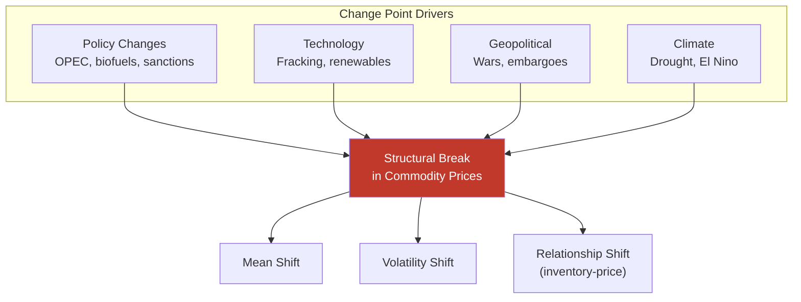
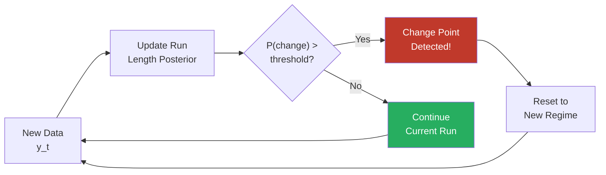
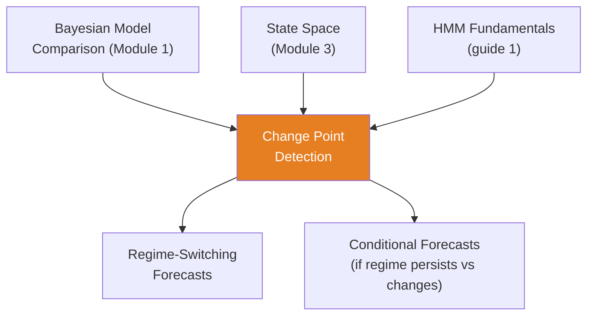

<!-- _class: lead -->

# Bayesian Change Point Detection

**Module 7 — Regime Switching**

Finding structural breaks in commodity markets

<!-- Speaker notes: Welcome to Bayesian Change Point Detection. This deck covers the key concepts you'll need. Estimated time: 38 minutes. -->
---

## Key Insight

> **Structural breaks announce themselves after they happen.** The shale revolution didn't ring a bell in 2010 -- it became obvious years later. Bayesian change point detection quantifies "how sure are we a regime changed?" and "when did it happen?", preventing false alarms while catching real shifts.

<!-- Speaker notes: Explain Key Insight. Connect this concept to the practical applications in commodity markets. Check for understanding before moving on. -->
---

## Formal Definition

**Setup:** Time series $y_1, \ldots, y_T$ with $K$ change points at unknown times $\tau_1, \ldots, \tau_K$.

$$y_t \sim \begin{cases} p(y_t | \theta_0) & t \leq \tau_1 \\ p(y_t | \theta_1) & \tau_1 < t \leq \tau_2 \\ \vdots \\ p(y_t | \theta_K) & t > \tau_K \end{cases}$$

**Priors:** $\tau_k \sim \text{DiscreteUniform}(1, T)$, $\theta_k \sim p(\theta)$

**Goal:** Infer posterior $p(\tau, \theta | y)$

<!-- Speaker notes: Walk through the mathematical notation carefully. Explain each symbol and relate it back to the intuitive explanation. Don't rush through formulas. -->
---

## Why Change Points in Commodities?



<!-- Speaker notes: Use the diagram to illustrate the relationships visually. Point to each node as you explain the flow. Give learners time to study the diagram. -->
---

## Commodity Era Timeline

| Era | Period | Characteristic |
|-----|--------|---------------|
| OPEC embargo | 1970s | High, volatile prices |
| Oil glut | 1980s | Collapse to $10/bbl |
| Stability | 1990s | Moderate $20-30/bbl |
| China surge | 2000s | $50-140/bbl |
| Shale revolution | 2010s | Increased supply, lower prices |
| ESG transition | 2020s | Uncertain future |

> Change point detection finds these chapter breaks automatically.

<!-- Speaker notes: Walk through each row of the table. This is reference material learners will come back to, so highlight the most important entries. -->
---

<!-- _class: lead -->

# Code: Single Change Point

<!-- Speaker notes: Transition slide. We're now moving into Code: Single Change Point. Pause briefly to let learners absorb the previous section before continuing. -->
---

## Mean-Shift Detection

```python
import pymc as pm
import numpy as np

np.random.seed(42)
regime1 = np.random.normal(70, 10, 100)
regime2 = np.random.normal(60, 5, 100)
prices = np.concatenate([regime1, regime2])

with pm.Model() as changepoint_model:
    tau = pm.DiscreteUniform('tau', lower=10, upper=190)

    mu_pre = pm.Normal('mu_pre', mu=70, sigma=10)
    mu_post = pm.Normal('mu_post', mu=60, sigma=10)  # ... continued on next slide
```

<!-- Speaker notes: Walk through the code step by step. Highlight the key lines and explain the purpose of each section. Encourage learners to run this in their own notebooks. -->
---

## Code (continued)

<!-- Speaker notes: Continue walking through the code. This is a continuation of the previous slide's code block. -->

```python
    sigma_pre = pm.HalfNormal('sigma_pre', sigma=10)
    sigma_post = pm.HalfNormal('sigma_post', sigma=10)

    regime = pm.math.switch(
        tau >= np.arange(200), 0, 1)
    mu = pm.math.switch(regime, mu_post, mu_pre)
    sigma = pm.math.switch(regime, sigma_post, sigma_pre)

    y_obs = pm.Normal('y_obs', mu=mu, sigma=sigma,
                       observed=prices)
    trace = pm.sample(2000, tune=2000, target_accept=0.95)
```

---

## Analyzing Change Point Posterior

```python
tau_samples = trace.posterior['tau'].values.flatten()
print(f"Change point: {tau_samples.mean():.0f} (true: 100)")
print(f"95% HDI: {az.hdi(trace, var_names=['tau'])}")

fig, axes = plt.subplots(2, 1, figsize=(12, 8))
axes[0].plot(prices, 'ko', alpha=0.5, markersize=3)
axes[0].axvline(100, color='g', linestyle='--',
                label='True')
axes[0].axvline(tau_samples.mean(), color='r',
                linestyle='--', label='Inferred')
axes[0].legend()

axes[1].hist(tau_samples, bins=50, density=True)  # ... continued on next slide
```

<!-- Speaker notes: Walk through the code step by step. Highlight the key lines and explain the purpose of each section. Encourage learners to run this in their own notebooks. -->
---

## Code (continued)

<!-- Speaker notes: Continue walking through the code. This is a continuation of the previous slide's code block. -->

```python
axes[1].axvline(100, color='g', linestyle='--')
axes[1].set_xlabel('Time')
axes[1].set_ylabel('Posterior Density')
```

> Full posterior over change point location, not just a point estimate.

---

## Multiple Change Points

```python
with pm.Model() as multi_cp:
    max_cp = 3
    tau = pm.DiscreteUniform('tau', lower=20,
                              upper=n_obs-20, shape=max_cp)
    tau_sorted = pm.Deterministic('tau_sorted',
                                   pm.math.sort(tau))

    mu_regimes = pm.Normal('mu_regimes', mu=60,
                            sigma=15, shape=max_cp+1)
    sigma_regimes = pm.HalfNormal('sigma_regimes',
                                    sigma=5, shape=max_cp+1)

    regime_idx = (np.arange(n_obs)[:, None] >  # ... continued on next slide
```

<!-- Speaker notes: Walk through the code step by step. Highlight the key lines and explain the purpose of each section. Encourage learners to run this in their own notebooks. -->
---

## Code (continued)

<!-- Speaker notes: Continue walking through the code. This is a continuation of the previous slide's code block. -->

```python
                  tau_sorted[None, :]).sum(axis=1)
    mu = mu_regimes[regime_idx]
    sigma = sigma_regimes[regime_idx]

    y_obs = pm.Normal('y_obs', mu=mu, sigma=sigma,
                       observed=oil_prices)
    trace_multi = pm.sample(1000, tune=2000,
                             target_accept=0.95)
```

---

<!-- _class: lead -->

# Online Detection

<!-- Speaker notes: Transition slide. We're now moving into Online Detection. Pause briefly to let learners absorb the previous section before continuing. -->
---

## Bayesian Online Change Point Detection



**Run-length posterior:**

$$p(r_t | y_{1:t}) \propto \sum_{r_{t-1}} p(r_t | r_{t-1})\, p(y_t | r_t, y_{1:t-1})\, p(r_{t-1} | y_{1:t-1})$$

<!-- Speaker notes: Use the diagram to illustrate the relationships visually. Point to each node as you explain the flow. Give learners time to study the diagram. -->
---

## Online Detection Code

```python
def online_changepoint_detection(data, hazard_rate=0.01,
                                  mu0=0, kappa0=1,
                                  alpha0=1, beta0=1):
    T = len(data)
    R = np.zeros((T + 1, T + 1))
    R[0, 0] = 1

    mu = np.full(T + 1, mu0)
    kappa = np.full(T + 1, kappa0)
    alpha = np.full(T + 1, alpha0)
    beta = np.full(T + 1, beta0)

    for t in range(T):  # ... continued on next slide
```

<!-- Speaker notes: Walk through the code step by step. Highlight the key lines and explain the purpose of each section. Encourage learners to run this in their own notebooks. -->
---

## Code (continued)

<!-- Speaker notes: Continue walking through the code. This is a continuation of the previous slide's code block. -->

```python
        pred_prob = stats.t.pdf(data[t], 2*alpha[:t+1],
            mu[:t+1], np.sqrt(beta[:t+1] *
            (kappa[:t+1]+1) / (alpha[:t+1]*kappa[:t+1])))

        R[1:t+2, t+1] = R[:t+1, t] * pred_prob * (1-hazard_rate)
        R[0, t+1] = np.sum(R[:t+1, t] * pred_prob * hazard_rate)
        R[:, t+1] /= np.sum(R[:, t+1])
        # Update sufficient statistics...
    return R
```

> Real-time detection without reprocessing all data.

---

## Variance Change Point Detection

```python
with pm.Model() as variance_cp:
    tau = pm.DiscreteUniform('tau', lower=20, upper=n_obs-20)

    sigma_pre = pm.HalfNormal('sigma_pre', sigma=0.05)
    sigma_post = pm.HalfNormal('sigma_post', sigma=0.05)

    sigma = pm.math.switch(
        tau >= np.arange(n_obs), sigma_pre, sigma_post)

    y_obs = pm.Normal('y_obs', mu=0, sigma=sigma,
                       observed=returns)
    trace_var = pm.sample(2000, tune=2000,
                           target_accept=0.95)
```

> When did volatility regime change? Useful for pre/post-crisis risk.

<!-- Speaker notes: Walk through the code step by step. Highlight the key lines and explain the purpose of each section. Encourage learners to run this in their own notebooks. -->
---

## Model Comparison: Is There a Change Point?

```python
# No-change model
with pm.Model() as no_change:
    mu = pm.Normal('mu', 65, 10)
    sigma = pm.HalfNormal('sigma', 8)
    y_obs = pm.Normal('y_obs', mu=mu, sigma=sigma,
                       observed=prices)
    trace_nc = pm.sample(1000, tune=1000)

# Compare via LOO
comparison = az.compare({
    'No Change': trace_nc,
    'Change Point': trace_cp
})
print(comparison)
```

> If change point model has much lower LOO, there is evidence for a regime change.

<!-- Speaker notes: Walk through the code step by step. Highlight the key lines and explain the purpose of each section. Encourage learners to run this in their own notebooks. -->
---

<!-- _class: lead -->

# Common Pitfalls

<!-- Speaker notes: Transition slide. We're now moving into Common Pitfalls. Pause briefly to let learners absorb the previous section before continuing. -->
---

## Pitfalls to Avoid

**Over-Detection (False Positives):** Use informative prior on hazard rate (changes are rare). Require substantial evidence. Compare change vs no-change models.

**Boundary Effects:** Change points near start/end are poorly identified. Restrict $\tau$ away from boundaries.

**Gradual Transitions:** Shale revolution was a 5-year transition. Use smooth transition models:
$$\mu_t = \mu_1 + (\mu_2 - \mu_1) \cdot \sigma(\lambda(t - \tau))$$

**Confusing Shock with Regime Change:** COVID crash was temporary, not permanent. Model with/without change point to distinguish.

<!-- Speaker notes: Walk through the mathematical notation carefully. Explain each symbol and relate it back to the intuitive explanation. Don't rush through formulas. -->
---

## Connections



<!-- Speaker notes: Use the diagram to illustrate the relationships visually. Point to each node as you explain the flow. Give learners time to study the diagram. -->
---

## Practice Problems

1. Suspect natural gas volatility changed around 2006 (Katrina/Rita). Design a Bayesian model to test and quantify uncertainty.

2. Implement online change point detection for corn prices. What hazard rate prior is appropriate?

3. WTI-Brent spread: near zero before 2010, then $10-20/bbl. Detect the change point and quantify the shift.

4. Compare three models for copper: no change, one change, two changes. Use LOO-CV.

5. Design a "gradual transition" model for biofuel mandates (phased 2005-2010). How does it differ from abrupt?

> *"Regimes change silently. Bayesian change point detection listens for the whisper before the shout."*

<!-- Speaker notes: Give learners 5-10 minutes to attempt these problems. Circulate and offer hints. Review solutions together afterward. -->
---


<!-- _class: lead -->

# References

<!-- Speaker notes: These references provide deeper coverage of the topics discussed. Recommend the first 1-2 as starting points for learners who want to go deeper. -->

- **Chib (1998):** "Estimation and Comparison of Multiple Change-Point Models"
- **Adams & MacKay (2007):** "Bayesian Online Changepoint Detection"
- **Carvalho et al. (2010):** "Particle Learning and Smoothing" - Sequential Monte Carlo
- **Pettit (1979):** "A Non-Parametric Approach to the Change-Point Problem"
