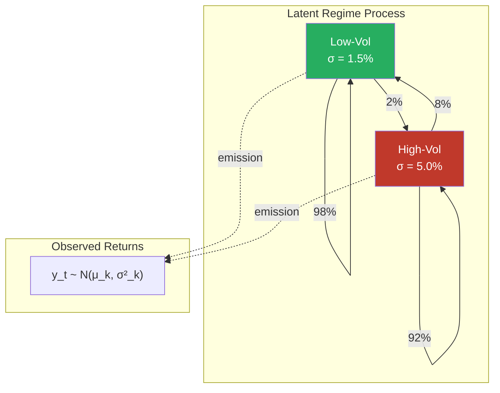
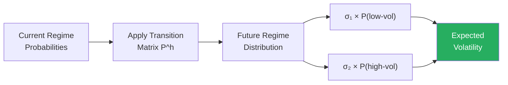
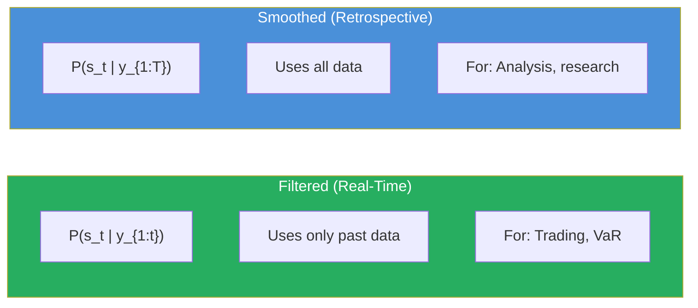
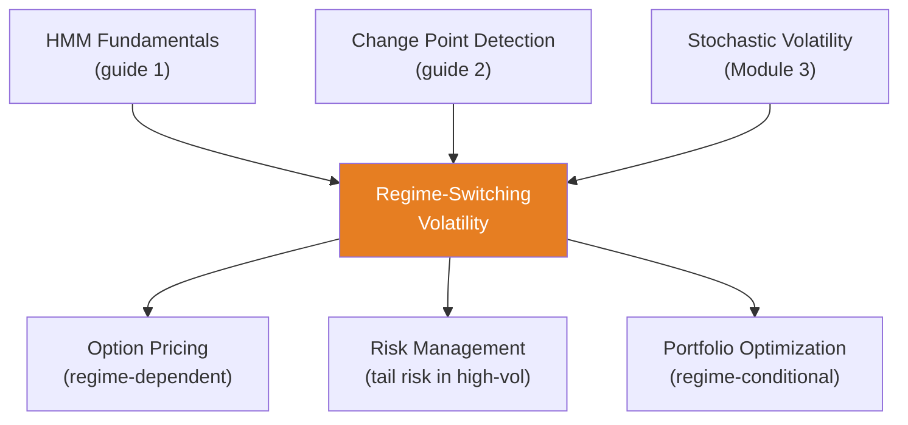

<!-- _class: lead -->

# Regime-Switching Volatility Models

**Module 7 — Regime Switching**

Capturing calm and crisis periods in commodity markets

<!-- Speaker notes: Welcome to Regime-Switching Volatility Models. This deck covers the key concepts you'll need. Estimated time: 36 minutes. -->
---

## Key Insight

> **Asset returns don't have constant volatility.** Oil prices might have $\sigma = 2\%$ daily in stable markets but $\sigma = 8\%$ during supply disruptions. Regime-switching models learn distinct volatility levels, regime persistence, and transition probabilities, enabling better risk management.

<!-- Speaker notes: Explain Key Insight. Connect this concept to the practical applications in commodity markets. Check for understanding before moving on. -->
---

## Two-Regime Volatility Model

**Latent regime:** $s_t \in \{1, 2\}$ with transition matrix $P$

**Regime-dependent returns:**

$$y_t | s_t = k \sim \mathcal{N}(\mu_k, \sigma^2_k)$$

| Parameter | Low-Vol (k=1) | High-Vol (k=2) |
|-----------|---------------|----------------|
| $\mu_k$ | $+0.05\%$ | $-0.10\%$ |
| $\sigma_k$ | $1.5\%$ | $5.0\%$ |
| $P(s_{t+1}=k \mid s_t=k)$ | $0.98$ | $0.92$ |

> Low-vol regime lasts ~50 days; high-vol lasts ~12 days.

<!-- Speaker notes: Walk through the mathematical notation carefully. Explain each symbol and relate it back to the intuitive explanation. Don't rush through formulas. -->
---

## Model Architecture



<!-- Speaker notes: Use the diagram to illustrate the relationships visually. Point to each node as you explain the flow. Give learners time to study the diagram. -->
---

## MS-SV: Regime-Switching Stochastic Volatility

**Log-volatility evolves within regime:**

$$\log \sigma^2_{k,t} = \alpha_k + \phi_k \log \sigma^2_{k,t-1} + \eta_{k,t}, \quad \eta_{k,t} \sim \mathcal{N}(0, \tau^2_k)$$

**Returns:**

$$y_t | s_t = k, \sigma^2_{k,t} \sim \mathcal{N}(\mu_k, \sigma^2_{k,t})$$

> Combines regime switching with time-varying volatility within each regime.

<!-- Speaker notes: Walk through the mathematical notation carefully. Explain each symbol and relate it back to the intuitive explanation. Don't rush through formulas. -->
---

## Why Regime-Switching for Commodities?

<div class="columns">
<div>

### Risk Management
- VaR in crisis mode uses $\sigma = 8\%$
- VaR in calm mode uses $\sigma = 2\%$
- Single-regime model averages and misses both

### Option Pricing
- Volatility regime affects option value
- High-vol regime: options are expensive
- Regime probability affects pricing

</div>
<div>

### Early Warning
- Regime probability shifting toward crisis
- Monitor filtered $P(\text{high-vol} | y_{1:t})$
- Position sizing depends on regime

### Conditional Forecasts
- "If we stay in low-vol: E[return] = +0.05%"
- "If switch to high-vol: E[return] = -0.10%"
- Weight by transition probabilities

</div>
</div>

<!-- Speaker notes: These are common mistakes that even experienced practitioners make. Share a real-world example if possible to make the warning concrete. -->
---

<!-- _class: lead -->

# Code Implementation

<!-- Speaker notes: Transition slide. We're now moving into Code Implementation. Pause briefly to let learners absorb the previous section before continuing. -->
---

## Generate Regime-Switching Data

```python
import numpy as np

def generate_regime_switching_data(n=500, seed=42):
    np.random.seed(seed)
    mu = np.array([0.05, -0.10])
    sigma = np.array([1.5, 5.0])
    P = np.array([[0.98, 0.02], [0.10, 0.90]])

    regimes = np.zeros(n, dtype=int)
    for t in range(1, n):
        regimes[t] = np.random.choice(2, p=P[regimes[t-1]])

    returns = np.zeros(n)  # ... continued on next slide
```

<!-- Speaker notes: Walk through the code step by step. Highlight the key lines and explain the purpose of each section. Encourage learners to run this in their own notebooks. -->
---

## Code (continued)

<!-- Speaker notes: Continue walking through the code. This is a continuation of the previous slide's code block. -->

```python
    for t in range(n):
        returns[t] = np.random.normal(
            mu[regimes[t]], sigma[regimes[t]])

    return returns, regimes

returns, true_regimes = generate_regime_switching_data()
```

---

## Fit with PyMC

```python
import pymc as pm

def fit_ms_volatility(returns, n_regimes=2):
    n = len(returns)
    with pm.Model() as model:
        # Ordered sigma to prevent label switching
        sigma_raw = pm.HalfNormal('sigma_raw', sigma=5,
                                    shape=n_regimes)
        sigma = pm.Deterministic('sigma',
                                  pm.math.sort(sigma_raw))
        mu = pm.Normal('mu', mu=0, sigma=2, shape=n_regimes)

        # Transition matrix (Dirichlet rows)  # ... continued on next slide
```

<!-- Speaker notes: Walk through the code step by step. Highlight the key lines and explain the purpose of each section. Encourage learners to run this in their own notebooks. -->
---

## Code (continued)

<!-- Speaker notes: Continue walking through the code. This is a continuation of the previous slide's code block. -->

```python
        p_transition = pm.Dirichlet('p_transition',
            a=np.ones((n_regimes, n_regimes)),
            shape=(n_regimes, n_regimes))
        p_initial = pm.Dirichlet('p_initial',
                                   a=np.ones(n_regimes))

        # Forward algorithm likelihood (marginalize regimes)
        # ... (custom Potential with forward algorithm)

        trace = pm.sample(2000, tune=2000,
                           target_accept=0.95)
    return model, trace
```

---

## Decode Regimes (Forward-Backward)

```python
def decode_regimes(returns, trace, n_regimes=2):
    mu = trace.posterior['mu'].mean(dim=['chain','draw']).values
    sigma = trace.posterior['sigma'].mean(dim=['chain','draw']).values
    P = trace.posterior['p_transition'].mean(dim=['chain','draw']).values
    pi = trace.posterior['p_initial'].mean(dim=['chain','draw']).values

    n = len(returns)
    # Forward pass
    log_alpha = np.zeros((n, n_regimes))
    log_alpha[0] = np.log(pi) + stats.norm.logpdf(
        returns[0], mu, sigma)
    for t in range(1, n):
        for k in range(n_regimes):  # ... continued on next slide
```

<!-- Speaker notes: Walk through the code step by step. Highlight the key lines and explain the purpose of each section. Encourage learners to run this in their own notebooks. -->
---

## Code (continued)

<!-- Speaker notes: Continue walking through the code. This is a continuation of the previous slide's code block. -->

```python
            log_alpha[t, k] = stats.norm.logpdf(
                returns[t], mu[k], sigma[k]) + \
                np.logaddexp.reduce(
                    log_alpha[t-1] + np.log(P[:, k]))

    # Backward pass + smoothing...
    # Returns regime_probs [T, K]
    return regime_probs
```

---

## Quick Alternative: hmmlearn

```python
from hmmlearn import hmm

def fit_gaussian_hmm(returns, n_components=2):
    X = returns.reshape(-1, 1)
    model = hmm.GaussianHMM(
        n_components=n_components,
        covariance_type='diag',
        n_iter=100, random_state=42)
    model.fit(X)
    hidden_states = model.predict(X)

    for i in range(n_components):
        print(f"Regime {i}: mu={model.means_[i, 0]:.3f}, "  # ... continued on next slide
```

<!-- Speaker notes: Walk through the code step by step. Highlight the key lines and explain the purpose of each section. Encourage learners to run this in their own notebooks. -->
---

## Code (continued)

<!-- Speaker notes: Continue walking through the code. This is a continuation of the previous slide's code block. -->

```python
              f"sigma={np.sqrt(model.covars_[i, 0]):.3f}")
    print(f"Transition Matrix:\n{model.transmat_}")
    return model, hidden_states
```

---

## Volatility Forecasting with Regime Uncertainty



```python
def forecast_volatility(trace, returns, horizon=20):
    regime_probs = decode_regimes(returns, trace)
    current = regime_probs[-1, :]
    sigma = trace.posterior['sigma'].mean(
        dim=['chain','draw']).values
    P = trace.posterior['p_transition'].mean(
        dim=['chain','draw']).values

    vol_forecast = []
    for h in range(1, horizon+1):
        dist_h = current @ np.linalg.matrix_power(P, h)
        vol_forecast.append(np.sum(dist_h * sigma))
    return np.array(vol_forecast)
```

<!-- Speaker notes: Walk through the code step by step. Highlight the key lines and explain the purpose of each section. Encourage learners to run this in their own notebooks. -->
---

<!-- _class: lead -->

# Common Pitfalls

<!-- Speaker notes: Transition slide. We're now moving into Common Pitfalls. Pause briefly to let learners absorb the previous section before continuing. -->
---

## Pitfalls to Avoid

**Label Switching:** MCMC swaps regime labels. Impose ordering: $\sigma_1 < \sigma_2$.

**Too Many Regimes:** Start with K=2. Use BIC/WAIC for comparison. K=5 almost always overfits.

**Ignoring Regime Uncertainty:** Use full regime probability distribution, not just most-likely regime.

**Look-Ahead Bias:** Smoothed probabilities use future data. For trading, use **filtered** probabilities only.

**Short Regime Episodes:** If high-vol lasts only 2-3 days, model struggles. May need higher-frequency data.

<!-- Speaker notes: These are common mistakes that even experienced practitioners make. Share a real-world example if possible to make the warning concrete. -->
---

## Filtered vs Smoothed Probabilities



> Always use filtered for real-time decisions. Smoothed for historical analysis.

<!-- Speaker notes: Use the diagram to illustrate the relationships visually. Point to each node as you explain the flow. Give learners time to study the diagram. -->
---

## Connections



<!-- Speaker notes: Use the diagram to illustrate the relationships visually. Point to each node as you explain the flow. Give learners time to study the diagram. -->
---

## Practice Problems

1. Transition matrix $P = [[0.95, 0.05], [0.20, 0.80]]$. If in regime 1, probability of same regime after 5 days? Long-run fraction?

2. Data: 80% of days $\sim N(0.1\%, 2\%)$, 20% $\sim N(-0.2\%, 6\%)$. Design model and find matching transition matrix.

3. Currently in high-vol ($\sigma_2 = 5\%$), $P(\text{stay}) = 0.9$, $\sigma_1 = 2\%$. Expected volatility tomorrow? In 5 days?

4. Single-regime BIC=2500, two-regime BIC=2350, three-regime BIC=2380. Which model? Why?

5. Trading system: smoothed $P(\text{high-vol}) = 0.7$, filtered $P(\text{high-vol}) = 0.5$. Which for VaR? Why?

> *"Volatility isn't constant -- it switches between regimes. Model both calm and crisis periods to capture true risk."*

<!-- Speaker notes: Give learners 5-10 minutes to attempt these problems. Circulate and offer hints. Review solutions together afterward. -->
---


<!-- _class: lead -->

# References

<!-- Speaker notes: These references provide deeper coverage of the topics discussed. Recommend the first 1-2 as starting points for learners who want to go deeper. -->

- **Hamilton (1989):** "A New Approach to Economic Analysis" - Original MS model
- **Gray (1996):** "Modeling the Conditional Distribution of Interest Rates" - MS-GARCH
- **Kim & Nelson (1999):** *State-Space Models with Regime Switching*
- **Fruhwirth-Schnatter (2006):** *Finite Mixture and Markov Switching Models*
