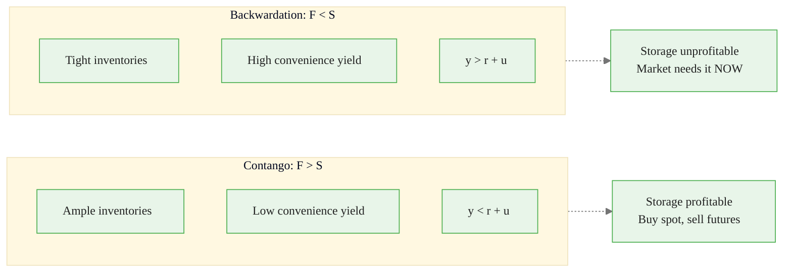
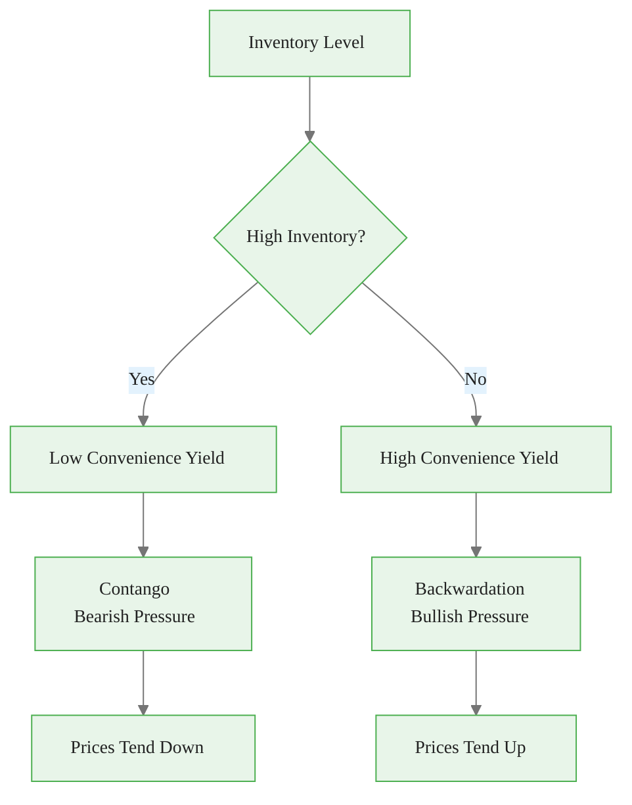
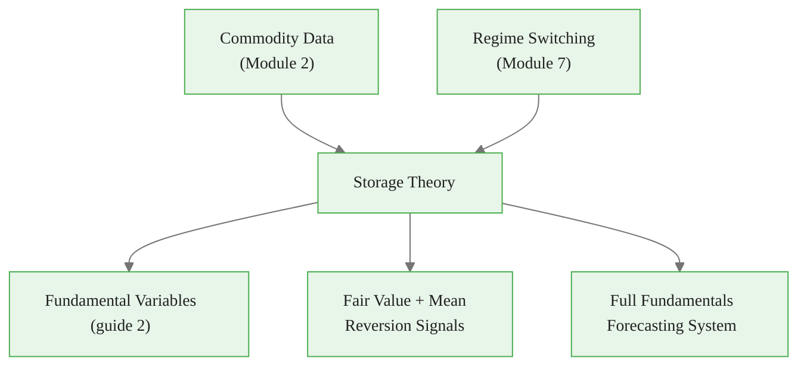

<!-- _class: lead -->

# Storage Theory
## Economic Foundations of Commodity Pricing

**Module 8 — Fundamentals Integration**

Inventories bridge supply and demand across time

<!-- Speaker notes: Welcome to Storage Theory. This deck covers the key concepts you'll need. Estimated time: 30 minutes. -->
---

## Key Insight

> **Inventories are the bridge between supply and demand across time.** When supply exceeds demand, inventories build and futures trade at a premium (contango). When demand exceeds supply, inventories draw and futures trade at a discount (backwardation).

<!-- Speaker notes: Explain Key Insight. Connect this concept to the practical applications in commodity markets. Check for understanding before moving on. -->

<div class="callout-info">
This is a foundational concept for the rest of the module.
</div>
---

## The Cost of Carry Model

$$F_T = S \cdot e^{(r + u - y)T}$$

| Component | Symbol | Role |
|-----------|--------|------|
| Spot price | $S$ | Current price |
| Risk-free rate | $r$ | Opportunity cost of capital |
| Storage cost | $u$ | Physical storage, insurance |
| Convenience yield | $y$ | Benefit of holding physical |
| Time to delivery | $T$ | Futures maturity |

> **Convenience yield** is the key variable for forecasting.

<!-- Speaker notes: Walk through the mathematical notation carefully. Explain each symbol and relate it back to the intuitive explanation. Don't rush through formulas. -->

<div class="callout-key">
This is the key takeaway from this section.
</div>
---

## Contango vs Backwardation



<!-- Speaker notes: Use the diagram to illustrate the relationships visually. Point to each node as you explain the flow. Give learners time to study the diagram. -->

<div class="callout-warning">
Common misconception — read carefully.
</div>
---

## Convenience Yield

**Definition:** Implicit benefit of holding physical commodity vs futures.

$$y = r + u - \frac{1}{T}\ln\!\left(\frac{F_T}{S}\right)$$

**What drives it:**

| Driver | Effect on $y$ |
|--------|--------------|
| Low inventories | Higher $y$ |
| Production uncertainty | Higher $y$ |
| Demand spikes | Higher $y$ |
| Ample supply | Lower $y$ |

**Empirical:** $y_t = \alpha + \beta \cdot I_t + \epsilon_t$ where $\beta < 0$.

<!-- Speaker notes: Walk through the mathematical notation carefully. Explain each symbol and relate it back to the intuitive explanation. Don't rush through formulas. -->

<div class="callout-insight">
This insight connects theory to practice.
</div>
---

## Inventory-Price Relationship



**Empirical model:**

$$\Delta P_t = \alpha + \beta_1 (I_t - I^*) + \beta_2 \Delta I_t + \epsilon_t$$

Expected: $\beta_1 < 0$ (high inventory $\to$ lower prices), $\beta_2 < 0$ (builds $\to$ declines).

<!-- Speaker notes: Use the diagram to illustrate the relationships visually. Point to each node as you explain the flow. Give learners time to study the diagram. -->
---

<!-- _class: lead -->

# Bayesian Implementation

<!-- Speaker notes: Transition slide. We're now moving into Bayesian Implementation. Pause briefly to let learners absorb the previous section before continuing. -->
---

## Storage-Informed Priors

Storage theory provides prior information:

1. **Inventory coefficient is negative:** $\beta_I \sim \mathcal{N}(-0.5, 0.5)$
2. **Convenience yield is mean-reverting:** AR(1) dynamics
3. **Term structure has bounds:** Extreme contango is unsustainable

```python
with pm.Model() as storage_model:
    # Prior informed by storage theory
    beta_inventory = pm.Normal('beta_inventory',
                                mu=-0.5, sigma=0.5)
    beta_production = pm.Normal('beta_production',
                                 mu=0, sigma=0.5)
    alpha = pm.Normal('alpha', mu=80, sigma=10)
    sigma = pm.HalfNormal('sigma', sigma=5)

    mu = alpha + beta_inventory * inventory_zscore \
        + beta_production * production_zscore
    price = pm.Normal('price', mu=mu, sigma=sigma,
                       observed=observed_prices)
```

<!-- Speaker notes: Walk through the code step by step. Highlight the key lines and explain the purpose of each section. Encourage learners to run this in their own notebooks. -->
---

## Convenience Yield Calculation

```python
def calculate_convenience_yield(spot, futures, T,
                                 r=0.05, u=0.02):
    # y = r + u - (1/T) * ln(F/S)
    return r + u - (1/T) * np.log(futures / spot)

def calculate_inventory_zscore(inventory, lookback=260):
    rolling_mean = inventory.rolling(lookback).mean()
    rolling_std = inventory.rolling(lookback).std()
    return (inventory - rolling_mean) / rolling_std

# Example
cy = calculate_convenience_yield(75.0, 76.0, 1/12)
print(f"Convenience yield: {cy:.2%}")  # ... continued on next slide
```

<!-- Speaker notes: Walk through the code step by step. Highlight the key lines and explain the purpose of each section. Encourage learners to run this in their own notebooks. -->
---

## Code (continued)

<!-- Speaker notes: Continue walking through the code. This is a continuation of the previous slide's code block. -->

```python
if cy < 0:
    print("CONTANGO (futures > spot)")
else:
    print("BACKWARDATION (spot > futures)")
```

---

## Practical Applications

<div class="columns">
<div>

### Fair Value Estimation
$$\hat{P} = \alpha + \beta \cdot (I - I^*)$$
Deviation signals mean reversion.

### Term Structure Trading
- **Extreme contango:** Short front, long back
- **Extreme backwardation:** Long front, short back

</div>
<div>

### Inventory Surprise Trading
EIA weekly data: Surprise = Actual - Consensus
$$\text{Return}_{\text{post}} = \gamma \cdot \text{Surprise}$$

### Forecasting Inventory
$$\Delta I_t = \text{Production} - \text{Consumption} + \text{Net Imports}$$

</div>
</div>

<!-- Speaker notes: Walk through the mathematical notation carefully. Explain each symbol and relate it back to the intuitive explanation. Don't rush through formulas. -->
---

<!-- _class: lead -->

# Common Pitfalls

<!-- Speaker notes: Transition slide. We're now moving into Common Pitfalls. Pause briefly to let learners absorb the previous section before continuing. -->
---

## Pitfalls to Avoid

**Ignoring Storage Constraints:** Physical capacity limits contango. Extreme contango collapses when storage fills.

**Wrong Inventory Measure:** Total commercial vs specific location (Cushing). Days of supply vs absolute levels.

**Look-Ahead Bias:** Inventory data has release delays. Don't use Friday's data for Monday's forecast.

**Regime Dependence:** Inventory-price relationship is strong in tight markets, weak in glutted markets.

<!-- Speaker notes: These are common mistakes that even experienced practitioners make. Share a real-world example if possible to make the warning concrete. -->
---

## Connections



<!-- Speaker notes: Use the diagram to illustrate the relationships visually. Point to each node as you explain the flow. Give learners time to study the diagram. -->
---

## Practice Problems

1. Oil at $80/bbl spot, $82/bbl 3-month futures. $r=5\%$, $u=2\%$ annually. What is implied convenience yield?

2. Crude inventories 50M barrels above 5-year average. Coefficient = -$0.10/M barrels. Estimated price impact?

3. Why might the inventory-price relationship be stronger in backwardated markets?

> *"Storage theory isn't just academic -- it's how physical traders actually price commodities."*

<!-- Speaker notes: Give learners 5-10 minutes to attempt these problems. Circulate and offer hints. Review solutions together afterward. -->
---


<!-- _class: lead -->

# References

<!-- Speaker notes: These references provide deeper coverage of the topics discussed. Recommend the first 1-2 as starting points for learners who want to go deeper. -->

- **Working, H. (1949):** "The Theory of Price of Storage" - Original theory
- **Fama & French (1987):** "Commodity Futures Prices" - Empirical evidence
- **Geman, H.** *Commodities and Commodity Derivatives* - Modern treatment
