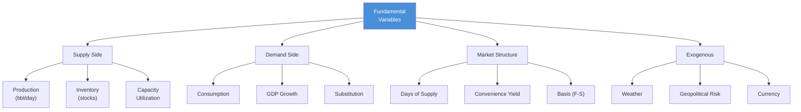
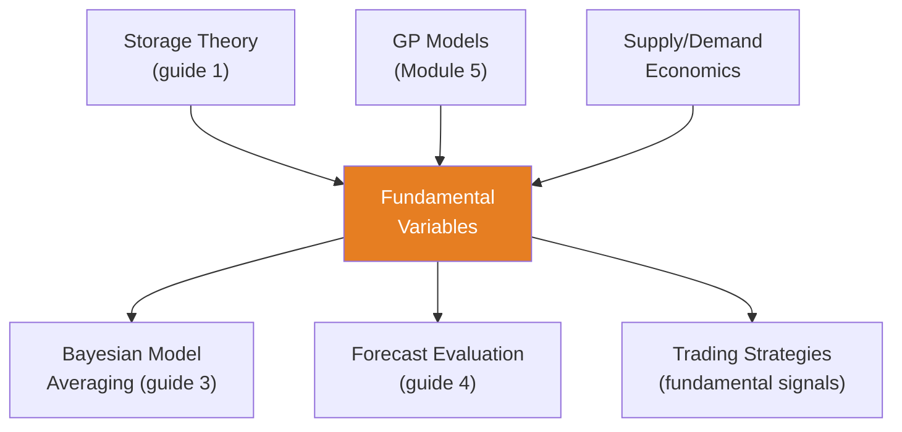

<!-- _class: lead -->

# Fundamental Variables in Commodity Forecasting

**Module 8 — Fundamentals Integration**

From pattern recognition to economic reasoning

<!-- Speaker notes: Welcome to Fundamental Variables in Commodity Forecasting. This deck covers the key concepts you'll need. Estimated time: 32 minutes. -->
---

## Key Insight

> **Pure statistical models learn patterns from price history but ignore why prices move.** Fundamental models incorporate the causal drivers: oil prices rise because inventories are low and demand is high, not just because they were rising yesterday. Bayesian frameworks excel at combining uncertain fundamental data with price history.

<!-- Speaker notes: Explain Key Insight. Connect this concept to the practical applications in commodity markets. Check for understanding before moving on. -->
---

## Fundamental-Augmented Model

**Standard time-series:**
$$p_t = f(p_{t-1}, p_{t-2}, \ldots) + \epsilon_t$$

**Fundamental-augmented:**
$$p_t = f(p_{t-1}, \ldots, \mathbf{X}_t, \mathbf{Z}_t) + \epsilon_t$$

| Symbol | Meaning |
|--------|---------|
| $\mathbf{X}_t$ | Observable fundamentals (inventory, production) |
| $\mathbf{Z}_t$ | Latent fundamentals (supply/demand balance) |

<!-- Speaker notes: Walk through the mathematical notation carefully. Explain each symbol and relate it back to the intuitive explanation. Don't rush through formulas. -->
---

## Categories of Fundamental Variables



<!-- Speaker notes: Use the diagram to illustrate the relationships visually. Point to each node as you explain the flow. Give learners time to study the diagram. -->
---

## Crude Oil Fundamentals

| Indicator | Signal | Interpretation |
|-----------|--------|---------------|
| OECD inventory (vs 5-yr avg) | Above avg | Bearish (surplus) |
| | Below avg | Bullish (deficit) |
| US production | Increasing | Bearish (more supply) |
| | Decreasing | Bullish (less supply) |
| China GDP growth | > 6% | Bullish (strong demand) |
| | < 4% | Bearish (weak demand) |
| Crack spreads | High | Bullish (refining demand) |
| | Low | Bearish (weak demand) |

<!-- Speaker notes: Walk through each row of the table. This is reference material learners will come back to, so highlight the most important entries. -->
---

## Structural Relationships

**Theory of storage:**
$$F_t = S_t\, e^{(r + s - y)(T - t)}$$

**Supply-demand equilibrium:**
$$p_t = p^* + \beta_1 (Q^D_t - Q^S_t) + \beta_2 I_t^{-1}$$

> Low inventory $\to$ high price sensitivity (nonlinear).

<!-- Speaker notes: Walk through the mathematical notation carefully. Explain each symbol and relate it back to the intuitive explanation. Don't rush through formulas. -->
---

<!-- _class: lead -->

# Code Implementation

<!-- Speaker notes: Transition slide. We're now moving into Code Implementation. Pause briefly to let learners absorb the previous section before continuing. -->
---

## FundamentalVariables Class

```python
class FundamentalVariables:
    def __init__(self):
        self.variables = {}

    def add_variable(self, name, data, category,
                      unit, description):
        self.variables[name] = {
            'data': data, 'category': category,
            'unit': unit, 'description': description,
            'mean': data.mean(), 'std': data.std()
        }

    def get_matrix(self, normalize=True):  # ... continued on next slide
```

<!-- Speaker notes: Walk through the code step by step. Highlight the key lines and explain the purpose of each section. Encourage learners to run this in their own notebooks. -->
---

## Code (continued)

<!-- Speaker notes: Continue walking through the code. This is a continuation of the previous slide's code block. -->

```python
        names = list(self.variables.keys())
        X = np.column_stack(
            [self.variables[n]['data'].values for n in names])
        if normalize:
            X = StandardScaler().fit_transform(X)
        return X, names
```

---

## Bayesian Linear Model with Fundamentals

```python
def fit_fundamental_model(prices, fundamentals):
    X, names = fundamentals.get_matrix(normalize=True)
    n, k = X.shape

    with pm.Model() as model:
        alpha = pm.Normal('alpha', mu=0, sigma=10)
        beta = pm.Normal('beta', mu=0, sigma=2, shape=k)
        sigma = pm.HalfNormal('sigma', sigma=5)

        mu = alpha + pm.math.dot(X, beta)
        y_obs = pm.Normal('y_obs', mu=mu, sigma=sigma,
                           observed=prices.values)
  # ... continued on next slide
```

<!-- Speaker notes: Walk through the code step by step. Highlight the key lines and explain the purpose of each section. Encourage learners to run this in their own notebooks. -->
---

## Code (continued)

<!-- Speaker notes: Continue walking through the code. This is a continuation of the previous slide's code block. -->

```python
        trace = pm.sample(2000, tune=1000,
                           return_inferencedata=True)
    return model, trace, names

# Analyze
az.plot_forest(trace, var_names=['beta'], combined=True)
```

---

## Non-Linear Inventory Effects

```python
with pm.Model() as model:
    # Non-linear: price impact stronger at low inventory
    beta_inv = pm.Normal('beta_inv', mu=0, sigma=5)
    gamma = pm.HalfNormal('gamma', sigma=0.01)

    inventory_effect = beta_inv * pm.math.exp(
        -gamma * inventory_raw)

    # Linear effects of other fundamentals
    beta_other = pm.Normal('beta_other', mu=0, sigma=2,
                            shape=n_other)
    other_effect = pm.math.dot(other_X, beta_other)
  # ... continued on next slide
```

<!-- Speaker notes: Walk through the code step by step. Highlight the key lines and explain the purpose of each section. Encourage learners to run this in their own notebooks. -->
---

## Code (continued)

<!-- Speaker notes: Continue walking through the code. This is a continuation of the previous slide's code block. -->

```python
    alpha = pm.Normal('alpha', mu=50, sigma=10)
    mu = alpha + inventory_effect + other_effect

    sigma = pm.HalfNormal('sigma', sigma=5)
    y_obs = pm.Normal('y_obs', mu=mu, sigma=sigma,
                       observed=prices)
```

> Exponential decay: inventory effect is strongest when stocks are very low.

---

## Variable Importance


```python
def compute_variable_importance(trace, X, var_names):
    beta_samples = trace.posterior['beta'].values.reshape(
        -1, X.shape[1])
    contributions = [np.var(beta_samples[:, i:i+1] *
                     X[:, i:i+1].T) for i in range(X.shape[1])]
    importance = np.array(contributions)
    return importance / importance.sum()
```

<!-- Speaker notes: Walk through the code step by step. Highlight the key lines and explain the purpose of each section. Encourage learners to run this in their own notebooks. -->
---

<!-- _class: lead -->

# Common Pitfalls

<!-- Speaker notes: Transition slide. We're now moving into Common Pitfalls. Pause briefly to let learners absorb the previous section before continuing. -->
---

## Pitfalls to Avoid

**Data Quality:** Fundamental data is revised, missing, low-frequency. Use revised data, impute, match frequencies.

**Multicollinearity:** Production and inventory correlated. Use PCA, drop redundant, or horseshoe prior.

**Ignoring Lags:** Use lagged fundamentals (inventory last week $\to$ price this week) to avoid look-ahead bias.

**Linear Assumptions:** Inventory-price relationship is nonlinear. Transform variables (log, inverse) or use GPs.

**Missing Variables:** Omitting key drivers (weather for agriculture). Use domain expertise and iterative addition.

<!-- Speaker notes: These are common mistakes that even experienced practitioners make. Share a real-world example if possible to make the warning concrete. -->
---

## Connections



<!-- Speaker notes: Use the diagram to illustrate the relationships visually. Point to each node as you explain the flow. Give learners time to study the diagram. -->
---

## Practice Problems

1. Oil inventory 450M bbl (5-yr avg: 420), $\beta = -0.05$. Estimated price impact of excess?

2. You have 20 potential variables. Use horseshoe prior; 5 have 95% HDI excluding zero. How many are "important"?

3. Model: $\text{price} = 60 - 100 \cdot e^{-0.002 \cdot \text{inventory}}$. Effect at inventory 200 vs 600?

4. Production = 13, inventory = 450. Forecast: production $\to$ 14, inventory $\to$ 420. Predicted price change?

> *"Fundamentals explain why prices move. Integrating them transforms forecasting from pattern recognition to economic reasoning."*

<!-- Speaker notes: Give learners 5-10 minutes to attempt these problems. Circulate and offer hints. Review solutions together afterward. -->
---


<!-- _class: lead -->

# References

<!-- Speaker notes: These references provide deeper coverage of the topics discussed. Recommend the first 1-2 as starting points for learners who want to go deeper. -->

- **Kilian (2009):** "Not All Oil Price Shocks Are Alike" - Supply vs demand shocks
- **Baumeister & Kilian (2016):** "Forty Years of Oil Price Fluctuations"
- **Giannone et al. (2015):** "Prior Selection for Vector Autoregressions"
- **Carriero et al. (2019):** "Large Bayesian VARs for Commodity Markets"
